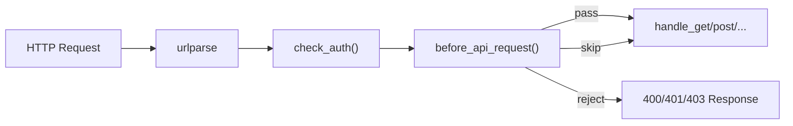

# API Header 校验方案

## 设计思路

当前项目没有中间件链，所有请求在 `server.py` 的 `do_GET` / `_handle_write` 中经过 `check_auth` 后分发到 `api/routes.py`。方案采用**核心层薄钩子 + integration 层实现**的模式：

- **核心层**（`server.py`）：在 `check_auth` 之后、路由分发之前，插入一个 `before_api_request(handler, parsed)` 调用。仅 2-3 行代码。
- **integration 层**：新建 `integration/header_validation/` 模块，承载全部校验逻辑、规则配置和错误响应。




## 核心层改动（最小化）

### server.py

在 `do_GET` 和 `_handle_write` 中各增加一行调用（共 2 处）：

```python
# do_GET 中，check_auth 之后：
if parsed.path.startswith("/api/") and not before_api_request(self, parsed):
    return

# _handle_write 中，check_auth 之后（_is_csp_report_post 判断之后）：
if parsed.path.startswith("/api/") and not _is_csp_report_post and not before_api_request(self, parsed):
    return
```

`before_api_request` 从 integration 导入，如果 integration 模块不可用则默认为 `lambda h, p: True`（透传）。

## integration 层实现

### 新建 `integration/header_validation/` 目录结构

```
integration/header_validation/
    __init__.py          # 导出 before_api_request()
    config.py            # 校验规则配置（从环境变量或文件加载）
    validator.py         # 核心校验引擎
```

### `__init__.py`

导出 `before_api_request(handler, parsed) -> bool`，供核心层调用。

### `config.py` — 规则配置

支持两种配置方式：

1. **环境变量** `HERMES_HEADER_VALIDATION_RULES`：JSON 字符串，适合简单场景
2. **配置文件** `integration/header_validation/rules.yaml`：适合复杂规则

规则结构示例：

```yaml
rules:
  - name: "api-key-required"
    header: "X-API-Key"
    match:
      type: "exists"           # exists | exact | regex | custom
    paths:                     # 可选路径过滤
      include: ["/api/*"]
      exclude: ["/api/health", "/api/auth/status"]
    methods: ["GET", "POST", "PUT", "PATCH", "DELETE"]  # 可选方法过滤

  - name: "content-type-json"
    header: "Content-Type"
    match:
      type: "regex"
      pattern: "application/json"
    methods: ["POST", "PUT", "PATCH"]
```

### `validator.py` — 校验引擎

```python
def before_api_request(handler, parsed) -> bool:
    """对所有 /api/* 请求执行 header 校验。
    返回 True 表示通过，False 表示已拒绝（response 已发送）。"""
    for rule in load_rules():
        if not rule.matches_scope(parsed.path, handler.command):
            continue
        header_value = handler.headers.get(rule.header)
        if not rule.validate(header_value):
            send_error(handler, rule, parsed.path)----
            return False
    return True
```

支持的 match 类型：

- `exists`：header 存在即可
- `exact`：精确匹配指定值
- `regex`：正则表达式匹配
- `custom`：调用 Python 函数（从 `rules.yaml` 指定函数路径）

### 默认排除路径

以下路径默认不参与校验（与 `check_auth` 公开路径保持一致）：

- `/api/health`
- `/api/auth/login`
- `/api/auth/status`
- `/api/csp-report`

## 改动文件清单


| 文件                                           | 改动                                               |
| -------------------------------------------- | ------------------------------------------------ |
| `server.py`                                  | 在 `do_GET` 和 `_handle_write` 各加 1 行钩子调用 + import |
| `integration/header_validation/__init__.py`  | 新建，导出入口                                          |
| `integration/header_validation/config.py`    | 新建，规则加载                                          |
| `integration/header_validation/validator.py` | 新建，校验引擎                                          |
| `integration/README.md`                      | 补充 header_validation 说明                          |


## 不需要改的

- 不改 `api/routes.py`（16000+ 行大文件，零触碰）
- 不改 `api/auth.py`（与现有认证体系解耦）
- 不改 `integration/swagger/openapi.json`（这是校验中间件，不是新 API）

