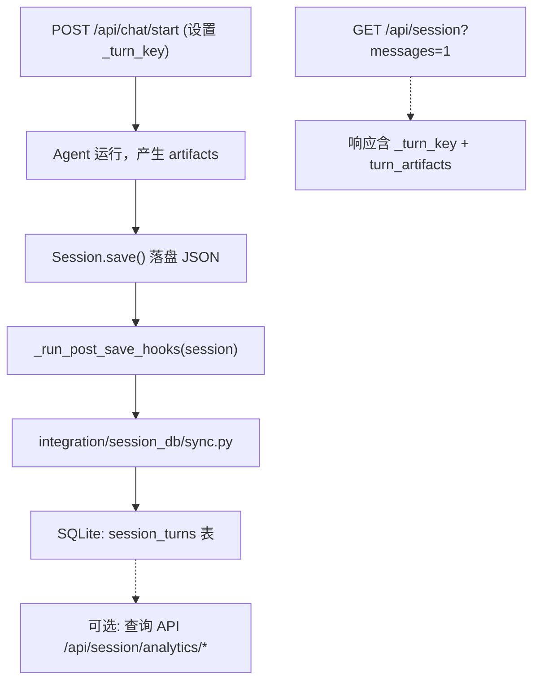

# Session Turn Analytics 数据库存储方案

## 目标

将 `/api/session?messages=1` 响应中的 `_turn_key`（每条用户消息内嵌）和 `turn_artifacts`（session 级 dict）持久化到 SQLite，支持跨 session 的 turn 级别分析查询。

## 架构概览



## 数据来源分析

**`_turn_key`**：位于 `messages[]` 中每个 user 消息内，如 `"_turn_key": "turn:1"`。由 `api/session_manifest.py:_next_turn_key()` 生成，在 `POST /api/chat/start` 时写入用户消息。

**`turn_artifacts`**：session 级 dict，如 `{"turn:1": ["/path/to/file.py"], "turn:2": []}`。来自 `session.turn_artifacts` 属性，通过 `compact()` 返回。

## 方案选择

| 维度 | 选择 |
|------|------|
| 数据库 | SQLite（与项目 agent state.db 一致，零配置） |
| 写入时机 | Session.save() 完成后同步写入 |
| 存储粒度 | 每 (session_id, turn_key) 一行，复合主键 |
| 核心侵入性 | 最小 — 仅在 `api/models.py` 加 ~10 行 hook 机制 |

## 实施步骤

### 步骤 1：新建 `integration/session_db/` 模块

```
integration/session_db/
├── __init__.py      # 模块入口，导出 register() 供 server.py 调用
├── db.py            # SQLite 连接管理 + schema 初始化
├── sync.py          # 从 Session 对象提取 turn 数据并写入 DB
└── handlers.py      # 可选：查询 API（如 /api/session/analytics/turns）
```

### 步骤 2：SQLite Schema

```sql
CREATE TABLE IF NOT EXISTS session_turns (
    session_id TEXT NOT NULL,
    turn_key TEXT NOT NULL,
    profile TEXT NOT NULL DEFAULT '',   -- 所属 profile，支持按 profile 过滤
    artifacts_json TEXT DEFAULT '[]',   -- JSON array of file paths
    created_at REAL NOT NULL,
    updated_at REAL NOT NULL,
    PRIMARY KEY (session_id, turn_key)
);

CREATE INDEX IF NOT EXISTS idx_st_turn_key ON session_turns(turn_key);
CREATE INDEX IF NOT EXISTS idx_st_profile ON session_turns(profile);
```

数据库文件路径：`{STATE_DIR}/session_analytics.db`（与其他 state 文件同级，例如 `~/.hermes/webui/session_analytics.db`）

### 步骤 3：核心同步逻辑 (`sync.py`)

```python
def sync_session_turns(session):
    """从 Session 对象提取 turn_key + turn_artifacts，写入 DB。"""
    session_id = session.session_id
    profile = getattr(session, 'profile', '') or ''
    turn_artifacts = getattr(session, 'turn_artifacts', None) or {}
    
    # 从 messages 中提取所有 turn_key
    turn_keys = set()
    for msg in (session.messages or []):
        if isinstance(msg, dict) and msg.get('role') == 'user':
            tk = msg.get('_turn_key', '')
            if tk:
                turn_keys.add(tk)
    
    # 合并 turn_artifacts 中的 key
    turn_keys.update(turn_artifacts.keys())
    
    now = time.time()
    with get_db() as db:
        for tk in turn_keys:
            artifacts = turn_artifacts.get(tk, [])
            db.execute("""
                INSERT INTO session_turns (session_id, turn_key, profile, artifacts_json, created_at, updated_at)
                VALUES (?, ?, ?, ?, ?, ?)
                ON CONFLICT(session_id, turn_key) DO UPDATE SET
                    profile = excluded.profile,
                    artifacts_json = excluded.artifacts_json,
                    updated_at = excluded.updated_at
            """, (session_id, tk, profile, json.dumps(artifacts, ensure_ascii=False), now, now))
        db.commit()
```

### 步骤 4：最小化 Hook 机制

在 `api/models.py` 中：

```python
# 加在文件顶部附近（import 区域之后）
_post_save_hooks: list = []

def register_post_save_hook(hook):
    """注册 Session.save() 完成后的回调。integration 层专用。"""
    _post_save_hooks.append(hook)
```

在 `Session.save()` 方法末尾（`_write_session_index` 之后）：

```python
        # ── integration post-save hooks ──
        for hook in _post_save_hooks:
            try:
                hook(self)
            except Exception:
                pass  # hook 失败不影响 session 保存
```

### 步骤 5：注册 Hook

在 `server.py` 启动时（`print_version_txt()` 附近）：

```python
try:
    from integration.session_db import register as _register_session_db
    _register_session_db()
except Exception:
    pass
```

`integration/session_db/__init__.py` 中的 `register()`：

```python
def register():
    from api.models import register_post_save_hook
    from integration.session_db.sync import sync_session_turns
    register_post_save_hook(sync_session_turns)
```

### 步骤 6（可选）：查询 API

在 `integration/session_db/handlers.py` 中提供查询端点，如：
- `GET /api/session/analytics/turns?session_id=xxx` — 查询某 session 的所有 turn
- `GET /api/session/analytics/artifacts?profile=xxx` — 按 profile 查询所有成果文件（用 `json_each()` 展开）

```sql
-- 按 profile 查询所有成果文件
SELECT t.session_id, t.turn_key, je.value AS file_path
FROM session_turns t, json_each(t.artifacts_json) je
WHERE t.profile = ?
  AND je.value != '';
```

## 文件变更清单

| 操作 | 文件 | 说明 |
|------|------|------|
| 新建 | `integration/session_db/__init__.py` | 模块入口 + register() |
| 新建 | `integration/session_db/db.py` | SQLite 连接 + schema |
| 新建 | `integration/session_db/sync.py` | 数据同步逻辑 |
| 新建 | `integration/session_db/handlers.py` | 查询 API（可选） |
| 修改 | `api/models.py` | +~10 行：`_post_save_hooks` 列表 + `register_post_save_hook()` + save() 末尾调用 |
| 修改 | `server.py` | +~5 行：启动时调用 `register()` |

## 注意事项

- Hook 失败不影响 session 保存（try/except + pass）
- 使用 `ON CONFLICT ... DO UPDATE` 实现 upsert，避免重复行
- 数据库文件使用 WAL 模式以支持并发读
- 遵循 integration 约束：核心代码改动最小化，新逻辑全部在 `integration/session_db/` 中