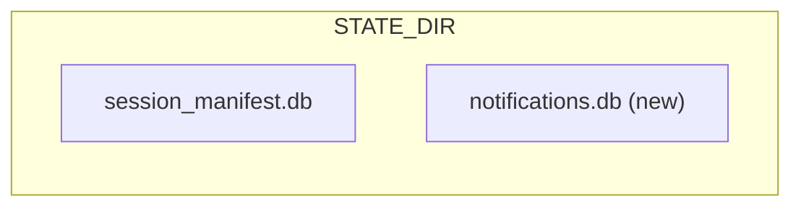
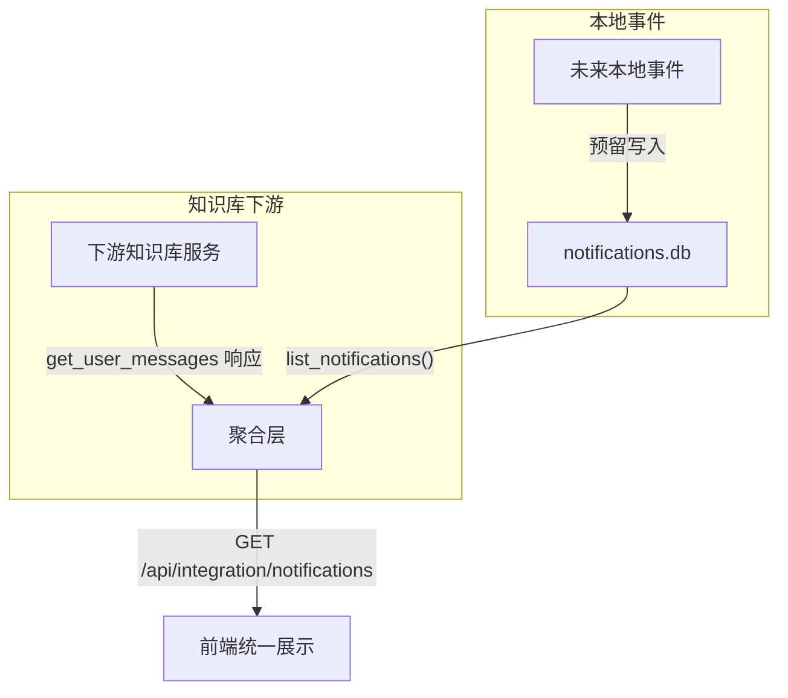

# 消息通知表方案

## 1. 数据库设计

### 数据库位置

新建独立数据库 `notifications.db`，与 `session_manifest.db` 同级，位于 `{STATE_DIR}/notifications.db`。隔离性好，不影响现有模块。



### 表结构

#### `notifications` — 通知主表

| 字段 | 类型 | 说明 |
|------|------|------|
| `id` | TEXT PRIMARY KEY | 通知 ID（字符串，如 `notif-abc123`，由调用方生成） |
| `category` | TEXT NOT NULL | 通知分类：`skill_install` / `kb_apply` / 可扩展 |
| `title` | TEXT NOT NULL | 通知标题（如"技能 xxx 安装成功"） |
| `body` | TEXT NOT NULL DEFAULT '' | 通知正文/详情 |
| `source` | TEXT NOT NULL DEFAULT '' | 来源标识（如 skill name、kb name） |
| `ref_id` | TEXT NOT NULL DEFAULT '' | 关联资源 ID（skill id、kb uuid 等，便于跳转） |
| `status` | TEXT NOT NULL DEFAULT 'unread' | 状态：`unread` / `read` |
| `priority` | TEXT NOT NULL DEFAULT 'normal' | 优先级：`low` / `normal` / `high` / `urgent` |
| `actionable` | INTEGER NOT NULL DEFAULT 0 | 是否可交互操作（0/1，预留字段，当前本地通知均为 0） |
| `action_status` | TEXT DEFAULT NULL | 操作结果（预留字段，当前本地通知不使用） |
| `metadata` | TEXT NOT NULL DEFAULT '{}' | 扩展 JSON（前端可消费的任意结构化数据） |
| `created_at` | REAL NOT NULL | 创建时间戳 |
| `updated_at` | REAL NOT NULL | 更新时间戳 |

索引：
- `idx_notifications_category` ON notifications(category)
- `idx_notifications_status` ON notifications(status)
- `idx_notifications_created_at` ON notifications(created_at DESC)

## 2. 模块结构

遵循 integration 层隔离原则，新增模块位于 `integration/notifications/`：

```
integration/notifications/
├── __init__.py
├── store.py          # DB 连接、schema、CRUD
├── handlers.py       # HTTP handlers (try_handle_get/try_handle_post)
├── constants.py      # 分类、状态枚举
└── README.md         # 模块说明

integration/tests/notifications/
├── __init__.py
└── test_store.py     # store 单元测试
```

### `store.py` 核心 API

沿用 `session_manifest_store.py` 的连接模式（`closing()` + WAL + busy_timeout + `_ensure_schema`）。

```python
# 连接管理
def _connect(db_path=None) -> sqlite3.Connection
def _ensure_schema(conn: sqlite3.Connection) -> None

# 写入
def create_notification(*, id: str, category, title, body='', source='',
                        ref_id='', priority='normal', actionable=False,
                        metadata=None) -> str

# 查询
def list_notifications(category=None, status=None, actionable=None,
                       limit=50, offset=0) -> dict
def get_notification(notification_id: str) -> dict | None
def summary(recent_limit: int = 5) -> dict

# 状态变更
def mark_read(notification_id: str) -> bool
def mark_read_batch(ids: list[str]) -> int
def delete_batch(ids: list[str]) -> int
```

### `constants.py` 枚举

```python
class NotificationCategory:
    SKILL_INSTALL = "skill_install"
    KB_APPLY = "kb_apply"

class NotificationStatus:
    UNREAD = "unread"
    READ = "read"

class NotificationPriority:
    LOW = "low"
    NORMAL = "normal"
    HIGH = "high"
    URGENT = "urgent"
```

## 3. REST API

Handler 注册方式：在 `integration/notifications/handlers.py` 中实现 `try_handle_get` / `try_handle_post`，然后在 `api/routes.py` 的 integration dispatch 处注册（最小化接缝改动）。

**ID 命名约定**：
- 本地通知 ID：调用方生成的字符串（如 `skill_install:pkg-name:1700000000`）
- 知识库下游通知 ID：`kb:{下游 id}`（如 `kb:msg-123`），handler 通过 `kb:` 前缀区分来源，决定操作路由

### 3.1 `GET /api/integration/notifications` — 通知列表（支持下拉分页）

查询参数：
- `category`（可选）— 分类过滤
- `status`（可选，默认不限制）— 状态过滤
- `limit`（可选，默认 20）— 每页条数
- `cursor`（可选）— 游标，值为上一页最后一条的 `created_at` 时间戳（首次请求不传）

**分页方式：Cursor-based（游标分页）**

采用 `created_at` 时间戳作为游标，适合前端下拉/无限滚动场景：
- 首次请求：不传 `cursor`，返回最新的 `limit` 条
- 下拉加载：传上一页返回的 `next_cursor`，返回该时间点之前的 `limit` 条
- 优势：新通知到达时不会跳行、不会重复，性能稳定（不随数据量增大退化）

**逻辑流程**：

1. 解析查询参数，确定 `category_filter`、`status_filter`、`limit`、`cursor`
2. 查询本地 `notifications.db`，调用 `store.list_notifications(category, status, cursor, limit+1)`
   - 多取 1 条用于判断是否还有下一页
3. 判断是否需要拉取知识库下游消息：
   - `knowledge_base_enabled()` 为 true **且**
   - `category_filter` 为 `kb_apply` **或** 未指定 category（即需要展示全部）
4. 若需要，调用下游 `client.post_json("get_user_messages", body)`，将响应中的消息列表按字段映射表归一化为 notification 结构
5. 合并本地 + 知识库结果，按 `created_at DESC` 排序
6. 按 `cursor` 过滤（只保留 `created_at < cursor` 的记录），截取前 `limit` 条
7. 若截取的条数 = `limit`，从最后一条取 `created_at` 作为 `next_cursor`；否则 `next_cursor = null`
8. 返回 `{ items: [...], next_cursor: float|null }`

**关键设计点**：
- 按需拉取：`category=skill_install` 时不打下游，只有涉及 `kb_apply` 或全部查询时才调下游
- 知识库消息不写入本地，纯内存聚合
- 游标分页保证跨来源的时间排序一致，下拉加载无跳行

**响应结构**：

```json
{
  "items": [
    {
      "id": "skill_install:pkg-name:1700000000",
      "category": "skill_install",
      "title": "技能 xxx 安装成功",
      "body": "已安装到 ~/.hermes/skills/...",
      "source": "xxx",
      "ref_id": "pkg-name",
      "status": "unread",
      "priority": "normal",
      "actionable": 0,
      "action_status": null,
      "metadata": {},
      "created_at": 1700000000.0,
      "updated_at": 1700000000.0
    }
  ],
  "next_cursor": 1699999000.0
}
```

- `next_cursor` 非 null 表示还有更多数据，前端下拉到列表底部时带上此值再次请求
- `next_cursor` 为 null 表示已加载全部

**前端下拉交互流程**：

```
首次加载:  GET /api/integration/notifications?limit=20
下拉加载:  GET /api/integration/notifications?limit=20&cursor=1699999000.0
继续下拉:  GET /api/integration/notifications?limit=20&cursor=1699998000.0
到底了:    next_cursor = null，停止加载
```

### 3.2 `GET /api/integration/notifications/summary` — 通知摘要

查询参数：`recent_limit`（可选，默认 5）

**用途**：前端通知铃铛 + 下拉预览框一次请求渲染完成，无需再调列表接口。

**逻辑流程**：

1. 查本地 `store.summary(recent_limit)`，获取：
   - 本地通知总数、未读数
   - 按分类分组的总数和未读数
   - 最近 `recent_limit` 条未读通知的精简预览
2. 若 `knowledge_base_enabled()`，调用下游 `get_user_messages` 获取知识库侧的未读数和最近未读预览
3. 合并两侧的计数和预览列表
4. 返回合并后的摘要

**响应结构**：

```json
{
  "total": 12,
  "unread": 5,
  "by_category": {
    "skill_install": { "total": 3, "unread": 2 },
    "kb_apply": { "total": 9, "unread": 3 }
  },
  "recent_unread": [
    {
      "id": "skill_install:pkg-name:1700000000",
      "category": "skill_install",
      "title": "技能 xxx 安装成功",
      "source": "xxx",
      "created_at": 1700000000.0
    }
  ]
}
```

- `total` / `unread`：本地 + 知识库合计的总数和未读数
- `by_category`：按分类分组的计数
- `recent_unread`：最近 N 条未读通知的精简预览（不含 body/metadata 等大字段），按 `created_at DESC` 排序

### 3.3 `GET /api/integration/notifications/{id}` — 通知详情

路径参数：`id`（通知 ID）

**逻辑流程**：

1. 若 `id` 以 `kb:` 开头 → 404（知识库通知不存储在本地，无详情接口；前端应通过知识库侧接口获取详情）
2. 否则查本地 `store.get_notification(id)`
3. 不存在 → 404；存在 → 返回完整通知字段

**响应结构**：单条通知的完整字段（同列表中的 item 结构）

### 3.4 `POST /api/integration/notifications/read` — 标记已读

请求体：`{ "id": "..." }` 或 `{ "ids": ["...", "..."] }`

**逻辑流程**：

1. 解析请求体，归一化为 `ids` 列表（单个 `id` 也转为列表）
2. 按 `kb:` 前缀分组：
   - **本地通知**（无 `kb:` 前缀）：调用 `store.mark_read_batch(local_ids)`，更新 `status='read'`、`updated_at=now`
   - **知识库通知**（`kb:` 前缀）：剥离前缀得到下游 ID，调用下游已读标记接口（若下游无此接口则跳过，前端直接调下游 `get_user_messages` 的已读逻辑）
3. 返回 `{ ok: true, updated: N }`（`updated` 为本地实际更新条数）

**边界情况**：
- ID 不存在 → 静默跳过，不报错
- 空列表 → 返回 `{ ok: true, updated: 0 }`
- 混合 ID（本地 + 知识库）→ 分别处理，合计返回

### 3.5 `POST /api/integration/notifications/delete` — 删除通知

请求体：`{ "id": "..." }` 或 `{ "ids": ["...", "..."] }`

**逻辑流程**：

1. 解析请求体，归一化为 `ids` 列表
2. 按 `kb:` 前缀分组：
   - **本地通知**：调用 `store.delete_batch(local_ids)`，物理删除记录
   - **知识库通知**：剥离前缀，调用下游删除消息接口（若下游无此接口则返回错误提示）
3. 返回 `{ ok: true, deleted: N }`

**设计说明**：用物理删除代替归档（archive），语义更清晰——用户主动删除就从列表移除，不需要额外的 `archived` 状态。

## 4. 接入点（通知触发场景）



### 4.1 本地事件触发

本地表作为通用通知基础设施预留。当前版本暂无本地写入场景，后续新增事件（如技能发布审批等）时直接调用 `store.create_notification()` 写入即可。

### 4.2 知识库通知 — 聚合而非写入

**设计决策**：知识库通知不写入本地 `notifications.db`，避免数据冗余和状态同步问题。下游 `get_user_messages` 已有完整持久化，本地不镜像。

**聚合层设计**：在 `GET /api/integration/notifications` 接口内部做逻辑聚合，合并两个来源：

| 来源 | 获取方式 | category 前缀 |
|------|---------|--------------|
| 本地 `notifications.db` | `store.list_notifications()` | 无（原始 category） |
| 下游知识库消息 | 调用 `client.post_json("get_user_messages", body)` | `kb_apply`（归一化） |

聚合逻辑放在 `integration/notifications/handlers.py` 的列表查询中：

```python
def _get_notifications(handler, parsed) -> bool:
    # 1. 查本地
    local_items = store.list_notifications(...)

    # 2. 如果知识库启用，拉取下游消息（带 category=kb_apply 过滤时才拉）
    kb_items = []
    if knowledge_base_enabled() and _wants_kb(category_filter):
        kb_items = _fetch_kb_messages_as_notifications()

    # 3. 合并 + 按时间排序 + 分页
    merged = _merge_and_paginate(local_items, kb_items, limit, offset)
    return _respond(handler, merged)
```

**聚合层关键点**：

- **按需拉取**：只有当查询参数包含 `category=kb_apply` 或不指定 category 时，才调用下游 `get_user_messages`，避免每次查询都打下游
- **字段归一化**：下游消息映射为统一的 notification 结构（title/body/source/ref_id/status/created_at 等），但**不写入本地表**
- **排序分页**：本地和下游结果合并后按 `created_at DESC` 排序，再做分页
- **状态一致性**：知识库通知的已读/未读状态完全由下游管理，本地不维护；前端对 `kb:` 前缀通知的已读操作通过 `/api/integration/notifications/read` 转发到下游（见 3.4 节）

**下游消息 → notification 结构映射**：

| notification 字段 | 下游消息字段（推测，实现时按实际响应调整） |
|--------------------|------------------------------------------|
| `id` | `kb:{下游 id}`（聚合层生成，不写本地表） |
| `category` | 固定 `"kb_apply"` |
| `title` | 下游 title / message |
| `body` | 下游 content / body |
| `source` | 下游 kbName |
| `ref_id` | 下游 message id |
| `status` | 下游 isRead → `"read"` / `"unread"` |
| `actionable` | 下游是否含可操作标识 → 0/1 |
| `action_status` | 下游 status |
| `metadata` | 下游原始 JSON |
| `created_at` | 下游 createdAt 时间戳 |

> **注意**：聚合方式会增加列表查询的延迟（需同步调下游）。如果下游响应慢，可后续改为异步/SSE 推送，但首版用同步聚合保持简单。

## 5. Swagger 同步

更新 [integration/swagger/openapi.json](integration/swagger/openapi.json)，新增 notifications 相关的 5 个端点定义。

## 6. 文档更新

- [integration/README.md](integration/README.md)：新增 notifications 路由表和说明
- [integration/CHANGELOG.md](integration/CHANGELOG.md)：记录本次变更

## 7. 实施顺序

1. 新建 `integration/notifications/` 模块（constants → store → handlers）
2. 注册路由到 `api/routes.py`（接缝文件最小改动）
3. 新增测试 `integration/tests/notifications/test_store.py`
4. 在 `notifications/handlers.py` 列表查询和 summary 中实现知识库消息聚合（按需调下游 `get_user_messages`）
5. 更新 `integration/swagger/openapi.json`
6. 更新 `integration/README.md` 和 `integration/CHANGELOG.md`