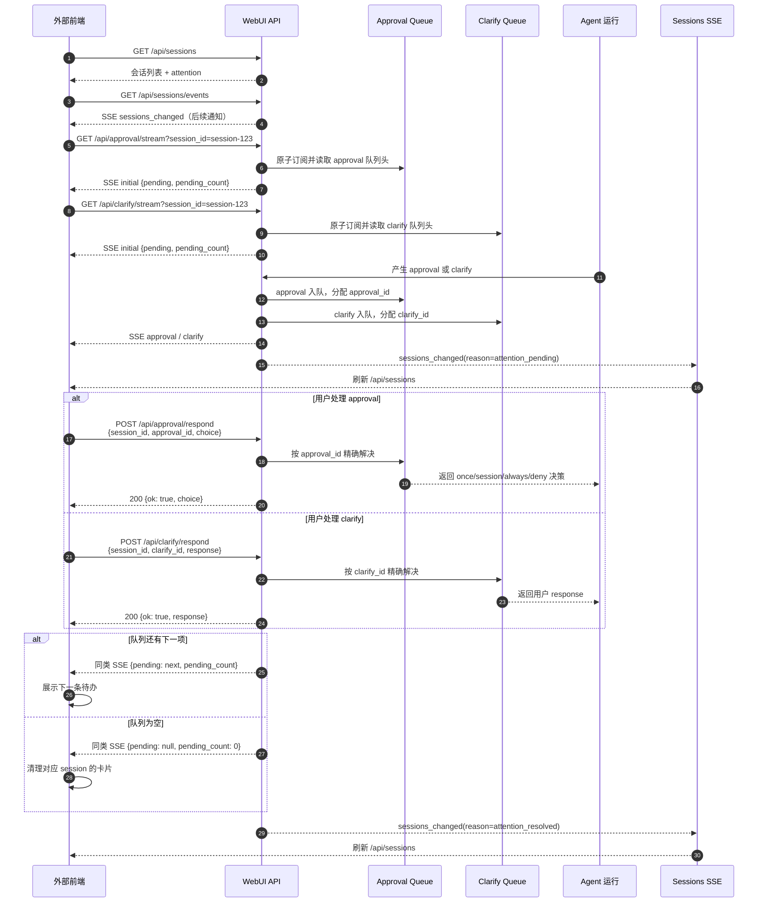
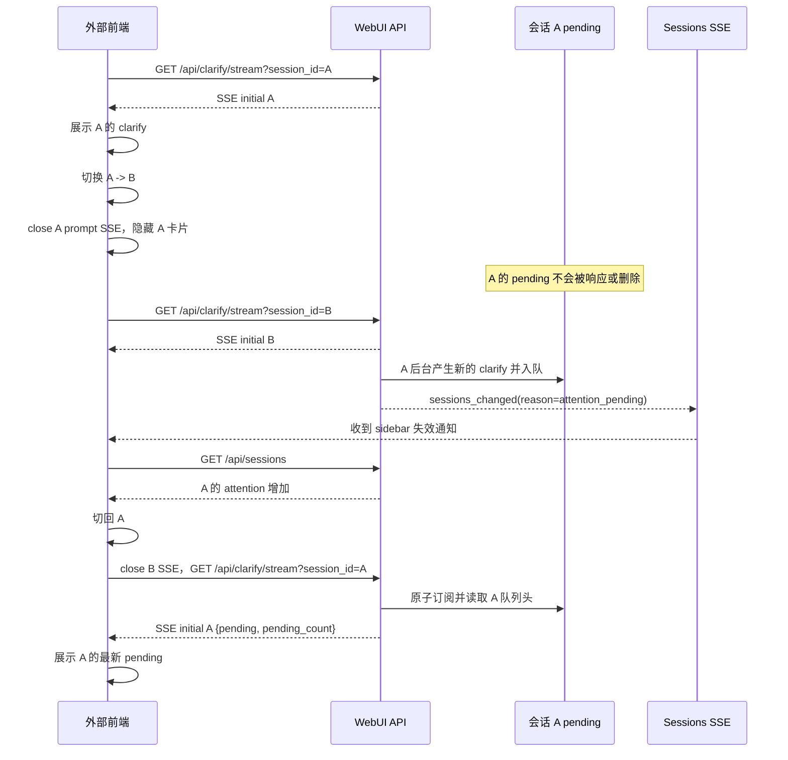

# Approval / Clarify 外部前端接入指南

## 1. 文档范围

本文面向不复用当前 WebUI 页面代码的外部前端，说明如何接入会话中的 approval 和 clarify 待办事件。

本文覆盖：

- 会话级 approval / clarify SSE 的建立和消费；
- initial、approval、clarify、sessions_changed 等事件；
- approval 和 clarify 的响应接口；
- SSE 断线后的 GET fallback；
- 切换会话时如何关闭和重建订阅；
- 队列中多个待办的串行处理方式。

本文不要求外部前端复用 static/messages.js 或 static/sessions.js，但必须遵守相同的 session ownership 和事件 ID 规则。

## 2. 接入原则

### 2.1 按 session_id 管理状态

每个 approval 或 clarify 都属于一个 session_id。外部前端必须以 session_id 作为缓存、SSE 连接和响应请求的归属键：

- 当前页面展示哪个会话，由前端自己的 active session 决定；
- 事件是否属于当前页面，由事件中的 session_id 决定；
- 响应时使用 pending 自带的 session_id，不要用一个全局当前值覆盖它；
- 切换会话只改变浏览器观察对象，不会自动回答、拒绝或取消旧会话的 pending。

### 2.2 专用 prompt SSE 是待办的主要观察通道

approval 和 clarify 可能同时出现在聊天流中，但聊天流不是待办恢复的唯一来源。外部前端应为当前需要展示的 session 建立专用 SSE：

- GET /api/approval/stream?session_id={session_id}
- GET /api/clarify/stream?session_id={session_id}

专用 SSE 建立后会发送一次 initial，用于拿到服务端当前真实的队列头。SSE 断线后可用对应的 pending GET 进行 fallback。

### 2.3 不把关闭 SSE 当成取消

关闭 prompt SSE 只代表外部前端停止观察该会话，不会：

- 解决 approval 或 clarify；
- 唤醒等待中的 Agent；
- 取消 Agent 运行；
- 删除服务端 pending。

### 2.4 默认超时

当前默认超时时间由 Agent 等待逻辑决定：

| 运行路径 | 待办类型 | 默认超时 | 配置项 | 超时后的含义 |
| --- | --- | --- | --- | --- |
| WebUI 本地 Agent / CLI | approval | 300 秒（5 分钟） | Agent 配置 approvals.timeout | approval 等待结束，未处理的审批视为过期，Agent 不再等待该审批 |
| WebUI 本地 Agent / CLI | clarify | 120 秒（2 分钟） | WebUI/Agent 配置 clarify.timeout | clarify pending 被清理，Agent 收到超时 fallback 并继续执行默认路径 |
| Hermes Gateway | clarify | 3600 秒（1 小时） | Agent 配置 agent.clarify_timeout | Gateway 等待结束，Agent 收到超时结果并继续执行默认路径 |

补充说明：

- 超时计时从 Agent 创建并提交待办时开始，不是从外部前端建立 SSE 连接时开始；
- 关闭 SSE、切换会话或重新建立 SSE 都不会重置超时倒计时；
- WebUI 本地 clarify 事件通常包含 timeout_seconds、requested_at 和 expires_at，前端应优先使用服务端字段显示倒计时；
- approval 当前主要由 Agent 的 approvals.timeout 控制，外部前端不要自行把 SSE 连接存活时间当成 approval 有效期；
- 超时后前端应通过 pending: null 事件、重新 GET 或重新订阅后的 initial 清理卡片，不要继续提交旧的 approval_id 或 clarify_id；
- 如果外部前端连接的是 Gateway clarify 通道，应以 Gateway 返回的实际超时状态为准，不要把 WebUI 本地路径的 120 秒硬编码到所有运行模式。

## 3. 接口总览

| 接口 | 方法 | 用途 | 外部前端使用时机 |
| --- | --- | --- | --- |
| /api/sessions | GET | 获取会话列表和 sidebar attention | 首次加载、刷新会话列表 |
| /api/sessions/events | GET / SSE | 接收会话列表摘要变化通知 | 页面存活期间保持全局订阅 |
| /api/approval/stream?session_id=... | GET / SSE | 观察指定会话的 approval | 当前会话需要展示 approval 时建立 |
| /api/approval/pending?session_id=... | GET | 查询 approval 队列头 | approval SSE 断线时 fallback |
| /api/approval/respond | POST | 提交 approval 决策 | 用户点击 approval 操作后调用 |
| /api/clarify/stream?session_id=... | GET / SSE | 观察指定会话的 clarify | 当前会话需要展示 clarify 时建立 |
| /api/clarify/pending?session_id=... | GET | 查询 clarify 队列头 | clarify SSE 断线时 fallback |
| /api/clarify/respond | POST | 提交 clarify 回答 | 用户选择选项或提交文本后调用 |
| /api/chat/stream?stream_id=... | GET / SSE | 接收聊天输出和运行生命周期 | 需要展示 Agent 输出时建立；不能替代 prompt SSE |

## 4. 完整接口交互图

下面的流程以 session-123 为当前会话，展示建立订阅、收到 pending、提交响应、处理队列下一项以及侧边栏更新的完整过程。



### 4.1 会话切换交互图

切换会话时，外部前端只需要停止旧会话的 prompt SSE，隐藏旧会话卡片，然后为新会话建立订阅。旧会话 pending 保留在服务端。



## 5. SSE 连接和通用报文格式

SSE 响应的主要响应头为：

```http
HTTP/1.1 200 OK
Content-Type: text/event-stream; charset=utf-8
Cache-Control: no-cache
X-Accel-Buffering: no
```

一个业务事件由 event 和 data 组成，事件之间使用空行分隔：

```text
event: <event_name>
data: <JSON string>

```

外部前端应按事件名称消费，而不是只解析所有消息的 data 后猜测类型。

## 6. Approval 接口和事件

### 6.1 Approval SSE

建立连接：

```http
GET /api/approval/stream?session_id=session-123
Accept: text/event-stream
```

每次成功建立连接都会先收到一次 initial。有 pending 时：

```text
event: initial
data: {"pending":{"session_id":"session-123","approval_id":"approval-111","description":"是否执行该命令？","command":"npm test"},"pending_count":1}

```

后续 approval 到达或队列头变化时：

```text
event: approval
data: {"pending":{"session_id":"session-123","approval_id":"approval-111","description":"是否执行该命令？","command":"npm test"},"pending_count":1}

```

队列清空时：

```text
event: approval
data: {"pending":null,"pending_count":0}

```

无 pending 的初始连接也会收到：

```text
event: initial
data: {"pending":null,"pending_count":0}

```

### 6.2 查询 Approval pending

```http
GET /api/approval/pending?session_id=session-123
```

响应：

```json
{
  "pending": {
    "session_id": "session-123",
    "approval_id": "approval-111",
    "description": "是否执行该命令？"
  },
  "pending_count": 1
}
```

pending 是队列头，也是当前应该展示和响应的 approval。pending_count 包含队列头本身。多个 approval 必须串行处理：成功响应当前 ID 后，再等待下一条 SSE 或重新 GET。

### 6.3 响应 Approval

请求：

```http
POST /api/approval/respond
Content-Type: application/json

{
  "session_id": "session-123",
  "approval_id": "approval-111",
  "choice": "once"
}
```

choice 的允许值：

| 值 | 含义 |
| --- | --- |
| once | 只允许当前调用 |
| session | 当前会话后续允许 |
| always | 当前会话允许，并写入永久 allowlist |
| deny | 拒绝当前调用 |

成功响应：

```json
{
  "ok": true,
  "choice": "once"
}
```

外部前端应使用 pending 返回的 session_id 和 approval_id，不能只用当前 active 会话 ID。响应失败时不要永久删除本地 pending，应等待 SSE 或重新 GET 进行校准。

## 7. Clarify 接口和事件

### 7.1 Clarify SSE

建立连接：

```http
GET /api/clarify/stream?session_id=session-123
Accept: text/event-stream
```

每次成功建立连接都会先收到一次 initial。有 pending 时：

```text
event: initial
data: {"pending":{"session_id":"session-123","clarify_id":"clarify-456","question":"请选择部署环境","choices_offered":["测试环境","生产环境"]},"pending_count":1}

```

Agent 新增或队列头变化时：

```text
event: clarify
data: {"pending":{"session_id":"session-123","clarify_id":"clarify-456","question":"请选择部署环境","choices_offered":["测试环境","生产环境"]},"pending_count":1}

```

队列清空时：

```text
event: clarify
data: {"pending":null,"pending_count":0}

```

无 pending 的初始连接也会收到：

```text
event: initial
data: {"pending":null,"pending_count":0}

```

### 7.2 查询 Clarify pending

```http
GET /api/clarify/pending?session_id=session-123
```

响应：

```json
{
  "pending": {
    "session_id": "session-123",
    "clarify_id": "clarify-456",
    "question": "请选择部署环境",
    "choices_offered": ["测试环境", "生产环境"]
  }
}
```

这个 GET 接口只返回队列头，不返回 pending_count。要知道队列是否还有后续项，应使用 clarify SSE 的 pending_count，或在当前响应成功后再次 GET。

### 7.3 响应 Clarify

Clarify 可以是选择题，也可以是开放式问题。无论哪种形式，提交字段都是 response：

选择题：

```http
POST /api/clarify/respond
Content-Type: application/json

{
  "session_id": "session-123",
  "clarify_id": "clarify-456",
  "response": "测试环境"
}
```

开放式问题：

```json
{
  "session_id": "session-123",
  "clarify_id": "clarify-789",
  "response": "希望先部署到测试环境验证"
}
```

成功响应：

```json
{
  "ok": true,
  "response": "测试环境"
}
```

clarify_id 应始终传递。省略时服务端会走兼容逻辑，可能按该 session 最早的 pending 解决，不适合外部前端的精确响应。

## 8. 会话列表变更事件

建立全局订阅：

```http
GET /api/sessions/events
Accept: text/event-stream
```

该接口只通知会话列表或 attention 摘要可能发生变化，不发送完整 approval/clarify 内容，也不会发送 initial 会话列表快照。

事件示例：

```text
event: sessions_changed
data: {"type":"sessions_changed","version":42,"reason":"attention_pending","session_id":"session-123"}

```

收到后重新请求：

```http
GET /api/sessions
```

reason 常见值包括 attention_pending、attention_resolved 和 attention_cleared。如果事件携带 session_id，可以只刷新该会话的局部 UI；如果没有，则按全量会话列表刷新处理。

## 9. Keepalive、断线和 fallback

所有长连接 SSE 在没有业务事件时可能发送注释形式的 keepalive：

```text
: keepalive

```

keepalive 不会触发业务事件处理。

如果 approval 或 clarify SSE 断开，外部前端可以临时使用：

```http
GET /api/approval/pending?session_id=session-123
GET /api/clarify/pending?session_id=session-123
```

fallback polling 规则：

1. 只查询当前订阅的 session_id；
2. pending 不为空时按 session_id 写入缓存并展示；
3. pending 为空时只清理该 session_id 的卡片；
4. POST 响应成功后再查询下一项，不要并发提交多个 pending；
5. SSE 恢复后关闭 fallback timer，避免两套观察源重复写状态。

## 10. 会话切换实现建议

外部前端可以按以下顺序实现 switchSession(nextSessionId)：

```javascript
function switchSession(nextSessionId) {
  stopApprovalSse();
  stopClarifySse();
  stopApprovalFallback();
  stopClarifyFallback();

  hidePromptCards();
  activeSessionId = nextSessionId;

  startApprovalSse(nextSessionId);
  startClarifySse(nextSessionId);
}
```

切换时不要调用任何 respond 或 cancel 接口。回到旧会话后，重新建立 SSE 会收到该会话最新的 initial，用它校准本地缓存。

## 11. 外部前端处理伪代码

下面示例只展示核心状态处理，实际项目还需要加入认证、重连退避、请求超时和 UI 错误提示。

```javascript
function startClarifySse(sessionId) {
  const url = "/api/clarify/stream?session_id="
    + encodeURIComponent(sessionId);
  const source = new EventSource(url);

  source.addEventListener("initial", (event) => {
    const data = JSON.parse(event.data);
    applyClarifySnapshot(sessionId, data.pending, data.pending_count);
  });

  source.addEventListener("clarify", (event) => {
    const data = JSON.parse(event.data);
    applyClarifySnapshot(sessionId, data.pending, data.pending_count);
  });

  source.onerror = () => {
    source.close();
    startClarifyFallback(sessionId);
  };

  return source;
}

async function answerClarify(pending, answer) {
  const result = await post("/api/clarify/respond", {
    session_id: pending.session_id,
    clarify_id: pending.clarify_id,
    response: answer
  });

  if (!result.ok) {
    await refreshClarifyPending(pending.session_id);
    return false;
  }
  return true;
}
```

Approval 的伪代码相同，但响应体中的字段是 approval_id 和固定枚举 choice：

```javascript
await post("/api/approval/respond", {
  session_id: pending.session_id,
  approval_id: pending.approval_id,
  choice: "once"
});
```

## 12. 错误和并发处理

| 场景 | 处理建议 |
| --- | --- |
| pending 为 null | 清理该 session 的卡片，不代表其他会话为空 |
| SSE 连接断开 | 关闭旧 EventSource，启动对应 GET fallback，并尝试退避重连 |
| 重复提交 approval | 以服务端响应为准，重新读取 pending；不要重复执行本地状态变更 |
| clarify 返回 409 且 stale 为 true | 旧问题已处理或过期，重新 GET/SSE 同步，不要继续提交旧 clarify_id |
| 会话切换 | 只关闭旧 session 的观察连接，不响应、不取消、不删除 pending |
| 多个 pending | 只处理队列头；当前响应成功后再处理下一条 |
| 当前页面不是事件所属 session | 写入对应 session 状态，但不渲染到当前页面 |
| /api/sessions/events 收到通知 | 重新 GET /api/sessions，不要把该通知当作 prompt 内容 |

## 13. 最小接入清单

外部前端至少需要实现：

- 保存每个 session 的 approval 和 clarify pending；
- 为当前会话分别建立 approval、clarify SSE；
- 处理每条 SSE 的 initial 和业务事件；
- 使用 session_id + approval_id/clarify_id 提交响应；
- 多个 pending 串行处理；
- SSE 断线后的 GET fallback；
- 会话切换时关闭旧连接，切回时重新订阅；
- 全局订阅 /api/sessions/events 并刷新 /api/sessions；
- 对 409 stale、重复响应和网络错误做重新同步。

## 14. 与内部实现说明的关系

本文是外部前端接入视角的接口说明。关于 callback 注册、内存队列、Agent 等待 entry、前端 ownership guard 和当前实现限制，请参阅：

[Approval / Clarify 会话交互逻辑](../architecture/approval-clarify-session-interaction.md)
