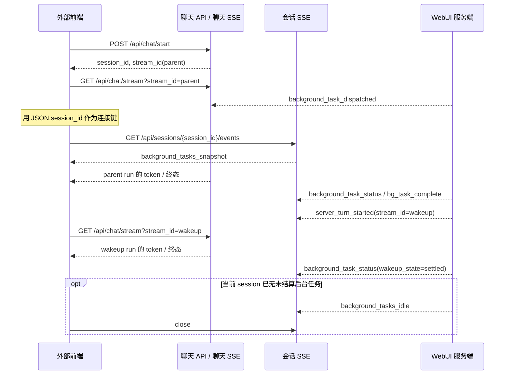

# 异步委派：外部前端接入指南

> 实现状态：`background_tasks_snapshot`、每轮 `async_delegations` 状态、会话级取消与 `background_task_unresolved` 已实施。批次内 child task 的实时逐项执行进度仍不作为此协议的事件面；服务端只在批次完成后提供 `child_task_summary`。

- **适用范围：** 调用 WebUI 聊天 API，并希望实时获知 `delegate_task(mode="background")` 生命周期的任意前端。
- **协议版本：** `schema_version: 1`
- **相关服务端契约：** [异步子任务的会话事件接口交互](async-delegation-session-events.md)

本文只说明外部前端如何调用和消费接口，不依赖当前 WebUI 的页面、状态管理或组件实现。

一次 `delegate_task(mode="background")` 是一个 delegation 批次。一次父聊天 turn 如果多次
调用该工具，就会产生多个 delegation 批次，并在父 chat stream 中收到多个
`background_task_dispatched`。
批次可以包含多个并行 child task，但全部 child 完成后只产生一次 completion 和一次 wakeup stream。
`delegation_id` 标识批次，不单独标识某个 child task。

## 1. 需要建立的两类 SSE

后台委派涉及两条职责不同的 SSE。不要把它们合并，也不要把后台任务的状态误当成 assistant 文本。

| SSE | 地址 | 何时建立 | 接收内容 | 何时关闭 |
| --- | --- | --- | --- | --- |
| 聊天流 | `GET /api/chat/stream?stream_id={stream_id}` | 每次已知一个 Agent run 的 `stream_id` 时 | token、工具事件、run 终态，以及派发通知 | 对应 run 的 `done` / `stream_end` / 错误终态后 |
| 会话事件流 | `GET /api/sessions/{session_id}/events` | 收到 chat SSE 的 `background_task_dispatched` 后，或刷新恢复本地待跟踪 session 后，按 session 建立或复用 | 状态快照、后台任务状态、服务端启动 wakeup run、可关闭通知；不发送派发通知 | 收到空快照或 `background_tasks_idle` 后，或应用主动销毁时 |

会话事件流不发送 wakeup 的 assistant token。若前端需要实时显示 wakeup 回复，可消费
`server_turn_started`，再用其中的 `stream_id` 建立聊天流；不消费该事件也不影响后台任务的
订阅和收口，最终内容可通过 `GET /api/session` 恢复。

## 2. 完整交互时序



“未结算”同时考虑 delegation 批次执行和父会话 wakeup：`status=completed` 但 `wakeup_state=queued` 或 `running` 时，仍必须保持会话事件流。

## 2.1 取消与关闭连接不同

关闭 `GET /api/sessions/{session_id}/events` 只取消订阅，不取消后台任务。要取消该 session 当前的
全部后台 delegation，调用显式取消接口；它不取消主会话，也不阻止之后新 user turn 派发任务：

```http
POST /api/sessions/background_tasks/cancel
Content-Type: application/json

{
  "session_id": "session_123"
}
```

`session_id` 决定取消范围。服务端在 session 锁内固定当时未结算的 delegation，并在 Session sidecar 持久化 `state`、`delegation_ids` 与 `requested_at` 后才请求 Agent 中断。重复调用在 `cancelling` 期间返回同一范围；收口后再次调用才重新快照。

`202` 且 `state: "cancelling"` 表示已受理固定范围，不表示 child 已中断。没有未结算任务时返回 `200`、`state: "idle"` 和空 `delegation_ids`。无效 `session_id` 返回 `400`，不可见或不存在的 session 返回 `404`，无法持久化屏障返回 `500` 且不会触发中断。

成功响应统一为以下结构。`202` 的范围是本次取消操作的唯一范围，后续新派发的
delegation 不会出现在其中：

```json
{
  "session_id": "session_123",
  "state": "cancelling",
  "delegation_ids": ["deleg_123", "deleg_456"],
  "requested_at": 1786004500,
  "settled_at": null
}
```

若请求时没有未结算任务，服务端返回 `200 OK`：

```json
{
  "session_id": "session_123",
  "state": "idle",
  "delegation_ids": [],
  "requested_at": null,
  "settled_at": null
}
```

| 字段 | 类型 | 含义 |
| --- | --- | --- |
| `session_id` | string | 已接受取消请求的会话。 |
| `state` | string | `cancelling` 表示已受理；`idle` 表示本次没有可取消任务。`POST` 不返回 `settled`。 |
| `delegation_ids` | string[] | `cancelling` 时固定的取消范围；`idle` 时为空数组。 |
| `requested_at` | number / null | 服务端持久化取消范围的 Unix 时间戳；`idle` 时为 `null`。 |
| `settled_at` | null | `POST` 返回时尚未确认范围收口，固定为 `null`。 |

`400`、`404`、`500` 为错误响应，不返回上述取消范围。客户端收到 `202` 后必须改用下方
`GET` 查询；不能依据 HTTP 返回、SSE 断开或单个 delegation 的终态判断取消完成。

取消 `POST` 不是轮询接口。确认它是否完成时，轮询只读查询接口：

```http
GET /api/sessions/background_tasks/cancel?session_id=session_123
```

```json
{
  "session_id": "session_123",
  "state": "settled",
  "delegation_ids": ["deleg_123", "deleg_456"],
  "requested_at": 1786004500,
  "settled_at": 1786004502
}
```

`state=settled` 表示该响应中固定的全部 `delegation_ids` 已收口，是取消完成的唯一判断。`state=cancelling` 时继续以退避间隔轮询；`state=idle` 表示没有可查询的取消记录。该 `GET` 不触发取消，成功响应均为 `200`；无效 `session_id` 返回 `400`，不可见或不存在的 session 返回 `404`。

取消期间，服务端对每个受影响批次发送 `background_task_status`，其中
`cancel_state=requested` 或 `cancelled`。Agent 确认中断时，最终
`status=cancelled`、`wakeup_state=settled`。若 child 已在取消竞争中完成，则保留真实的
`completed` 或 `failed` 状态，但仍不会产生 `server_turn_started`。

对应 origin user message 的持久化状态为：

```json
{
  "_turn_key": "turn:8",
  "async_delegations": {
    "state": "cancelling",
    "items": {
      "deleg_123": {
        "status": "running",
        "wakeup_state": "idle",
        "cancel_state": "requested"
      }
    }
  }
}
```

该轮全部批次取消后，`async_delegations.state` 更新为 `cancelled`。只要存在未被取消的终态
批次，最终状态就是 `settled`，具体结果以 `items` 中每个 `delegation_id` 为准。不会发送
`background_tasks_cancelled` 或其他取消专用 SSE 事件；SSE 仅用于实时展示既有生命周期。

## 3. 首次聊天与派发通知

先按现有聊天接口启动普通用户 turn：

```http
POST /api/chat/start
Content-Type: application/json

{
  "session_id": "session_123",
  "message": "请在后台完成调研",
  "model": "provider/model",
  "model_provider": "provider",
  "workspace": "/workspace/project",
  "profile": "default"
}
```

成功响应中取得 `stream_id` 后，建立该 run 的聊天 SSE：

```text
GET /api/chat/stream?stream_id=stream_parent_1
Accept: text/event-stream
```

后端成功持久化后台委派归属后，会在这条**仍连接的聊天 SSE**上发送 `background_task_dispatched`。前端不需要、也不应通过 `tool_complete` 推断后台任务是否已派发。

```text
event: background_task_dispatched
id: <聊天流 run-journal 游标>
data: {
  "schema_version": 1,
  "event_id": "deleg_123:dispatched:12",
  "event_type": "background_task_dispatched",
  "session_id": "session_123",
  "emitted_at": 1786004400,
  "background_activity_version": 12,
  "payload": {
    "delegation_id": "deleg_123",
    "child_task_count": 2,
    "goals": ["调研模型 A", "调研模型 B"],
    "origin_turn_key": "turn:8",
    "status": "running",
    "wakeup_state": "idle",
    "dispatched_at": 1786004400
  }
}
```

收到后，使用顶层 `session_id` 建立或复用固定地址：

```text
GET /api/sessions/session_123/events
Accept: text/event-stream
```

无需服务端下发 session SSE URL。不要为每个 delegation 或 child task 建连接；一个 session 的全部后台委派共用一条会话事件流。多个批次的事件会在这条连接中按服务端发射顺序串行到达，客户端按 `delegation_id` 分别维护状态。

> 注意：此事件在聊天流的 SSE `id:` 是 run-journal 游标，不等于 JSON 的 `event_id`。业务幂等、任务状态去重必须使用 JSON `event_id`，不能用该 SSE `id:` 代替。

## 4. 会话事件流的首帧与通用信封

会话 SSE 连接建立、认证与 session 可见性校验成功后，服务端必须把 `background_tasks_snapshot` 作为第一条后台业务事件发送，**无论该 session 是否有未结算后台任务**。它是连接期间可能漏掉增量事件、页面刷新和重新订阅时的权威状态基线。

`background_task_dispatched` 不会在 `GET /api/sessions/{session_id}/events` 中重复发送。它只在发起 delegation 的 chat SSE 中出现，用来建立或复用这条会话连接；已建立会话连接的任务集合只能以 snapshot 和后续增量事件为准。

```text
event: background_tasks_snapshot
id: background:snapshot:12
data: {
  "schema_version": 1,
  "event_id": "background:snapshot:12",
  "event_type": "background_tasks_snapshot",
  "session_id": "session_123",
  "emitted_at": 1786004405,
  "background_activity_version": 12,
  "payload": {
    "active_task_count": 1,
    "active_delegation_count": 1,
    "active_child_task_count": 2,
    "tasks": [{
      "delegation_id": "deleg_123",
      "child_task_count": 2,
      "goals": ["调研模型 A", "调研模型 B"],
      "origin_turn_key": "turn:8",
      "status": "running",
      "wakeup_state": "idle",
      "dispatched_at": 1786004400,
      "completed_at": null
    }]
  }
}
```

后台任务事件统一使用以下顶层字段：

| 字段 | 类型 | 处理要求 |
| --- | --- | --- |
| `schema_version` | integer | 当前固定为 `1`；不支持的版本应拒绝解析并回退到会话查询。 |
| `event_id` | string | 业务事件的唯一标识；全局按最近窗口去重。 |
| `event_type` | string | 与 SSE `event:` 相同。 |
| `session_id` | string | 事件所属 session；必须与订阅 URL 中的 ID 一致。 |
| `emitted_at` | number | 服务端 Unix 时间戳，仅用于展示和诊断。 |
| `background_activity_version` | integer | 该 session 的单调递增状态版本。 |
| `payload` | object | 事件专属字段。 |

对同一个 session，前端应忽略 `background_activity_version` 小于本地已处理版本的增量事件。事件 ID 相同的事件也必须幂等处理。

空快照同样有效：`tasks: []`、`active_delegation_count: 0`、`active_child_task_count: 0`。它表示服务端在这次建连时确认该 session 没有待结算的后台工作；前端应立即关闭刚建立的会话 SSE，并删除本地的待跟踪 `session_id`，无需等待刷新前可能已经错过的 `background_tasks_idle`。

会话 SSE 还保留既有 run-journal 的 `session_snapshot` 等恢复帧。外部前端若只接入后台任务，可忽略这些非后台事件；实时 assistant 文本始终以聊天流为准。

## 5. 事件处理表

最小外部前端只需消费三类事件：派发通知用来建连，快照用来恢复和判断空状态，idle
用来关闭连接。其余事件均可忽略，不会影响取消轮询、会话 SSE 的关闭或最终从会话历史恢复
回答。

| 事件 | 接入级别 | `payload` 关键字段 | 前端处理 |
| --- | --- | --- | --- |
| `background_task_dispatched`（仅 chat SSE） | 必需 | delegation 公共字段，首次通常为 `running` / `idle` | 按 `session_id` 建立或复用会话 SSE，并持久化待跟踪 session ID；不解析 `tool_complete`，不以该 payload 作为任务基线。 |
| `background_tasks_snapshot` | 必需 | `active_delegation_count`、`active_child_task_count`、`tasks[]` | 用 `tasks` 完整替换该 session 的未结算集合；两个计数均为 `0` 时关闭连接。 |
| `background_tasks_idle` | 必需 | `active_delegation_count: 0`、`active_child_task_count: 0`、`settled_at` | 确认 version 不旧且计数均为 0 后，关闭会话 SSE 并清除活动追踪。 |
| `background_task_status` | 可选 | delegation 公共字段 | 需要逐批次实时状态、排队或取消状态时更新对应 `delegation_id`；否则可忽略，不能据单个 `completed` 关闭 SSE。 |
| `bg_task_complete` | 可选 | delegation 公共字段 | 用于通知或进度展示；与 `background_task_status` 存在信息重叠，不需要单独消费。 |
| `server_turn_started` | 可选 | delegation 公共字段、`stream_id`、`source` | 需要 wakeup 回复的实时 token 时，按 `stream_id` 建立聊天 SSE；否则等待并通过 `GET /api/session` 读取最终内容。不得再次调用 `POST /api/chat/start`。 |
| `background_task_unresolved` | 可选 | `delegation_id`、`reason`、`retryable` | 需要明确展示归属失败原因时，将对应批次标记失败；否则可等待最终 `background_tasks_idle`。不得猜测 origin user turn 或创建 wakeup。 |

会话 SSE 中 `background_task_status`、`bg_task_complete` 与 `server_turn_started` 的 `payload` 均包含：

| 字段 | 值域 | 含义 |
| --- | --- | --- |
| `delegation_id` | string | 后台委派批次标识。 |
| `child_task_count` | integer | 此 delegation 批次启动的 child task 数量。 |
| `goals` | string[] | child task 的目标列表；可能为空。 |
| `origin_turn_key` | string | 派发该 delegation 的父 user turn。 |
| `status` | `running` / `completed` / `failed` / `cancelled` | delegation 批次执行状态。 |
| `wakeup_state` | `idle` / `queued` / `running` / `settled` / `failed` | 父会话处理该结果的状态。 |
| `child_task_summary` | object，可选 | completion 后的 child 结果计数，不包含结果正文。 |
| `cancel_state` | `requested` / `cancelled`，可选 | 当前 delegation 的取消阶段；缺失表示未取消。 |

`background_tasks_snapshot.payload.active_task_count` 为兼容字段，统计 delegation 批次数；外部前端应使用 `active_delegation_count` 和 `active_child_task_count`。
`server_turn_started.payload` 额外包含 `stream_id` 和固定来源值 `source: "async_delegation_wakeup"`。

### 5.1 `server_turn_started` 事件内容

服务端已创建用于处理一个 delegation 批次完成结果的 wakeup Agent run 时发送。一个批次无论包含多少 child task，都只对应一个 `stream_id`。前端只用 `stream_id` 建立聊天 SSE，不要再次调用 `POST /api/chat/start`。

```text
event: server_turn_started
id: deleg_123:run-started:15
data: {
  "schema_version": 1,
  "event_id": "deleg_123:run-started:15",
  "event_type": "server_turn_started",
  "session_id": "session_123",
  "emitted_at": 1786004412,
  "background_activity_version": 15,
  "payload": {
    "delegation_id": "deleg_123",
    "child_task_count": 2,
    "goals": ["调研模型 A", "调研模型 B"],
    "origin_turn_key": "turn:8",
    "status": "completed",
    "wakeup_state": "running",
    "stream_id": "stream_wakeup_123",
    "source": "async_delegation_wakeup"
  }
}
```

| `payload` 字段 | 类型 | 说明 |
| --- | --- | --- |
| `delegation_id` | string | 触发此 wakeup 的 delegation 批次。 |
| `child_task_count` | integer | 批次中的 child task 数量。 |
| `goals` | string[] | 批次中各 child task 的目标。 |
| `origin_turn_key` | string | 最初派发 delegation 的父 user turn。 |
| `status` | string | delegation 批次的最终执行状态；成功通常为 `completed`。 |
| `wakeup_state` | string | 此时通常为 `running`；后续由 `background_task_status` 更新为 `settled` 或 `failed`。 |
| `stream_id` | string | 已创建的 wakeup Agent run；使用它请求 `GET /api/chat/stream?stream_id={stream_id}`。 |
| `source` | string | 固定为 `async_delegation_wakeup`，用于区分普通用户发起的聊天 run。 |

同一 `stream_id` 的重复通知只建立一条聊天 SSE。若聊天流已结束或无法附着，读取 `GET /api/session?session_id={session_id}` 恢复持久化结果，不重新触发 wakeup。

### 5.2 `background_tasks_idle` 事件内容

服务端确认该 session 不再有未结算后台任务时发送。它是连接未中断时关闭该 session 会话 SSE 的聚合终态信号；刷新或重连后的首帧关闭判断由空 `background_tasks_snapshot` 承担。

```text
event: background_tasks_idle
id: background:idle:16
data: {
  "schema_version": 1,
  "event_id": "background:idle:16",
  "event_type": "background_tasks_idle",
  "session_id": "session_123",
  "emitted_at": 1786004420,
  "background_activity_version": 16,
  "payload": {
    "active_task_count": 0,
    "active_delegation_count": 0,
    "active_child_task_count": 0,
    "settled_at": 1786004420
  }
}
```

| `payload` 字段 | 类型 | 说明 |
| --- | --- | --- |
| `active_task_count` | integer | 兼容字段，固定为 `0`。非零值不能被当作 idle。 |
| `active_delegation_count` | integer | 固定为 `0`。 |
| `active_child_task_count` | integer | 固定为 `0`。 |
| `settled_at` | number | 服务端完成聚合判断时的 Unix 时间戳。 |

客户端只在该事件尚未按 `event_id` 处理、`session_id` 与连接一致、`background_activity_version` 不早于本地版本，且 `active_delegation_count`、`active_child_task_count` 都为 `0` 时，才关闭 `GET /api/sessions/{session_id}/events` 并清除该 session 的待跟踪任务。此事件不代表或替代任一聊天流的终态。

## 6. 推荐的前端状态与伪代码

以 `session_id` 管理会话事件流，以 `stream_id` 管理聊天流。页面是否可见不应影响后台任务订阅的生命周期。

```ts
const sessionStreams = new Map<string, EventSource>();
const chatStreams = new Map<string, EventSource>();
const activityVersion = new Map<string, number>();
const seenEventIds = new Set<string>();
const pendingSessionIds = loadPendingSessionIds();

function onChatEvent(event: { event_type?: string; session_id?: string; event_id?: string }) {
  if (event.event_type === "background_task_dispatched" && event.session_id) {
    pendingSessionIds.add(event.session_id);
    persistPendingSessionIds(pendingSessionIds);
    ensureSessionEvents(event.session_id);
  }
}

for (const sessionId of pendingSessionIds) {
  ensureSessionEvents(sessionId);
}

function onSessionEvent(event: Envelope) {
  if (seenEventIds.has(event.event_id)) return;
  const known = activityVersion.get(event.session_id) ?? -1;
  if (event.background_activity_version < known) return;
  seenEventIds.add(event.event_id);
  activityVersion.set(event.session_id, event.background_activity_version);

  switch (event.event_type) {
    case "background_tasks_snapshot":
      replacePendingTasks(event.session_id, event.payload.tasks);
      if (
        event.payload.active_delegation_count === 0 &&
        event.payload.active_child_task_count === 0
      ) {
        closeSessionEvents(event.session_id);
        pendingSessionIds.delete(event.session_id);
        persistPendingSessionIds(pendingSessionIds);
      }
      break;
    case "server_turn_started":
      ensureChatStream(event.payload.stream_id);
      break;
    case "background_tasks_idle":
      if (
        event.payload.active_delegation_count === 0 &&
        event.payload.active_child_task_count === 0
      ) {
        closeSessionEvents(event.session_id);
        clearPendingTasks(event.session_id);
        pendingSessionIds.delete(event.session_id);
        persistPendingSessionIds(pendingSessionIds);
      }
      break;
    case "background_task_unresolved":
      markTaskFailed(event.session_id, event.payload.delegation_id, event.payload.reason);
      break;
    default:
      applyTaskUpdate(event.session_id, event.payload);
  }
}
```

实现 `seenEventIds` 时应设置容量或时间窗口，避免长时间运行的客户端无限占用内存。`background_activity_version` 是 session 级版本，不可跨 session 比较。

`pendingSessionIds` 必须持久化到前端存储。收到 `background_task_dispatched` 时先写入，再建立 SSE；浏览器刷新后从该列表重新订阅，而不是等待新的派发事件。只有收到空 snapshot 或合格的 idle 后才删除该 ID。

## 7. 多会话、切换和应用重启

多个会话可同时存在未结算 delegation。每个 `session_id` 独立维护一条会话 SSE；session A 的事件不可更新 session B 的委派状态。

同一个 session 也可能有多个 delegation 批次。每个批次拥有自己的 `delegation_id`，但一个批次内部的多个 child task 共享该 ID，并在全部完成后只产生一个 wakeup stream。多个批次的 wakeup 在同一 session 内按顺序启动：后完成或后进入处理队列的批次可能先收到 `wakeup_state=queued`，必须等待当前 Agent turn 结束。

仅因为用户切换到了另一个会话，不应关闭旧 session 的会话 SSE。旧会话仍可能收到 completion，并启动新的 wakeup chat stream。应在 `background_tasks_idle` 后关闭，或在整个应用销毁时关闭。

前端必须持久化“已收到派发通知、尚未收到空 snapshot 或 idle”的 session ID 列表。收到 `background_task_dispatched` 后先写入该列表，再建立会话 SSE；收到空 snapshot 或合格的 idle 后才移除。应用刷新后重新订阅列表中的所有 ID，并以首个 `background_tasks_snapshot` 覆盖本地状态。

该协议仍不提供“列出所有存在后台任务的 session”的专用发现接口。因此，冷启动客户端无法仅靠 session SSE 枚举从未保存过的活跃 session；需要跨设备或清空本地存储恢复时，应另行设计服务端发现接口。

## 8. 断线、重连与失败处理

聊天 SSE 在父 turn 尚未结束时断线，重新附着该聊天流后可能再次收到 `background_task_dispatched`。该事件是建立会话 SSE 的触发器，因此 `ensureSessionEvents` 必须是幂等的。

会话 SSE 断开不会取消后台 delegation，也不会阻止服务端启动 wakeup。重连成功后，以 `background_tasks_snapshot` 作为当前后台状态基线；不要假设每个中间增量事件都会被精确重放。显式取消只通过 `POST /api/sessions/background_tasks/cancel` 发起。

浏览器 `EventSource` 会自动重连。其他客户端应采用带退避的重连策略，并将最近的 SSE `id:` 作为 `Last-Event-ID` 发送。无论是否支持该 header，都要保留 JSON `event_id` 去重与 snapshot 覆盖逻辑。

收到 `server_turn_started` 时，若对应聊天流已结束或无法附着，不需要重启 wakeup。调用 `GET /api/session?session_id={session_id}` 读取持久化会话即可恢复最终内容。

历史响应的每条真实 user message 都可带 `async_delegations`。它是该轮 delegation 的持久化结论；按 `_turn_key == origin_turn_key` 关联实时事件。对于本契约上线后创建的消息，字段缺失表示未成功派发；旧会话、导入会话或写入版本未知时字段缺失必须视为未知。完整字段见[服务端接口契约](async-delegation-session-events.md#21-历史会话查询与每轮任务状态)。

## 9. 关闭规则

只有下列任一情况可以主动关闭一条 session SSE：

1. 收到尚未处理的 `background_tasks_snapshot`，其 `session_id` 与订阅一致，且 `payload.active_delegation_count === 0`、`payload.active_child_task_count === 0`；
2. 收到尚未处理的 `background_tasks_idle`，其 `session_id` 与订阅一致，`background_activity_version >=` 该 session 已知版本，且 `payload.active_delegation_count === 0`、`payload.active_child_task_count === 0`；
3. 用户登出、应用销毁或明确放弃该 session 的后台通知；
4. 服务端已终止连接，客户端决定不再重连。

下列事件都不是关闭条件：单个 child task 完成、delegation `status=completed`、`bg_task_complete`、`server_turn_started`，以及任意单个 wakeup chat stream 的 `done`。

收到过期 idle，例如本地已处理 version `17` 后才收到 version `16` 的 `background_tasks_idle`，必须忽略，不能关闭当前连接。以后新的父 chat stream 再收到 `background_task_dispatched` 时，调用 `ensureSessionEvents(session_id)` 重新建立该 session 的事件流。

## 10. 接入验收清单

- 仅在 chat SSE 消费专用 `background_task_dispatched`，而非解析 `tool_complete` 后建立会话事件流；会话 SSE 的第一条后台业务事件必须是 `background_tasks_snapshot`，且不会重复派发通知。
- 每个 session 至多维护一条会话 SSE；切换页面不会导致仍活跃任务的订阅被误关。
- 每次 session SSE 建连都会收到 `background_tasks_snapshot`；非空快照覆盖本地未结算任务集合，空快照会关闭连接并清除待跟踪 ID。
- 所有事件按 JSON `event_id` 去重，并按 session 内 `background_activity_version` 防止旧状态回滚。
- 一个 batch dispatch 的 `child_task_count` 与 `goals` 能在 SSE 中被正确恢复。
- 一个 batch completion 只产生一个 `server_turn_started`，不按 child task 数量创建多个 stream。
- 同一父 chat stream 的多个 `background_task_dispatched` 都能被正确记录；它们共用一条 session SSE，并按 `delegation_id` 分别处理。
- 同一 session 的多个 wakeup 不并行运行；排队批次在前一个 wakeup 结束后才建立自己的 chat stream。
- `server_turn_started` 只使用 `stream_id` 订阅聊天流，不额外发起聊天请求。
- 刷新后从持久化待跟踪 ID 列表重新订阅；仅在空 `background_tasks_snapshot` 或 `background_tasks_idle(active_delegation_count=0, active_child_task_count=0)` 后关闭会话 SSE。
- 取消仅传入 `session_id`；`POST` 返回 `202` 后轮询取消 `GET`，直到固定范围的 `state=settled`。不重试 `POST` 来查询，也不以单个批次终态、`background_tasks_idle` 或 SSE 断开判定该次取消完成。
- 收到 `background_task_unresolved` 时标记对应批次失败且不启动 wakeup；仍以最终 `background_tasks_idle` 释放会话 SSE。
- 断线重连后，以 snapshot 和 `GET /api/session` 恢复，而非假定实时事件完整无缺。
