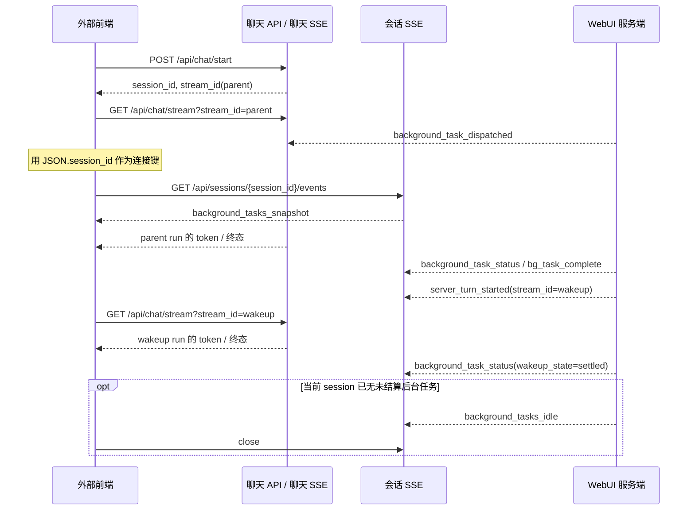

# 异步子任务：外部前端接入指南

- **适用范围：** 调用 WebUI 聊天 API，并希望实时获知 `delegate_task(mode="background")` 生命周期的任意前端。
- **协议版本：** `schema_version: 1`
- **相关服务端契约：** [异步子任务的会话事件接口交互](async-delegation-session-events.md)

本文只说明外部前端如何调用和消费接口，不依赖当前 WebUI 的页面、状态管理或组件实现。

## 1. 需要建立的两类 SSE

后台委派涉及两条职责不同的 SSE。不要把它们合并，也不要把后台任务的状态误当成 assistant 文本。

| SSE | 地址 | 何时建立 | 接收内容 | 何时关闭 |
| --- | --- | --- | --- | --- |
| 聊天流 | `GET /api/chat/stream?stream_id={stream_id}` | 每次已知一个 Agent run 的 `stream_id` 时 | token、工具事件、run 终态，以及派发通知 | 对应 run 的 `done` / `stream_end` / 错误终态后 |
| 会话事件流 | `GET /api/sessions/{session_id}/events` | 收到 `background_task_dispatched` 后，按 session 建立或复用 | 后台任务状态、服务端启动 wakeup run、可关闭通知 | 收到 `background_tasks_idle` 后，或应用主动销毁时 |

会话事件流不发送 wakeup 的 assistant token。收到 `server_turn_started` 后，前端要用事件中的 `stream_id` 再建立一条聊天流，才会收到该 wakeup 的实时回复。

## 2. 完整交互时序



“未结算”同时考虑子任务执行和父会话 wakeup：`status=completed` 但 `wakeup_state=queued` 或 `running` 时，仍必须保持会话事件流。

## 3. 首次聊天与派发通知

先按现有聊天接口启动普通用户 turn：

```http
POST /api/chat/start
Content-Type: application/json

{
  "session_id": "session_123",
  "message": "请在后台完成调研",
  "model": "provider/model",
  "model_provider": "provider",
  "workspace": "/workspace/project",
  "profile": "default"
}
```

成功响应中取得 `stream_id` 后，建立该 run 的聊天 SSE：

```text
GET /api/chat/stream?stream_id=stream_parent_1
Accept: text/event-stream
```

后端成功持久化后台委派归属后，会在这条**仍连接的聊天 SSE**上发送 `background_task_dispatched`。前端不需要、也不应通过 `tool_complete` 推断后台任务是否已派发。

```text
event: background_task_dispatched
id: <聊天流 run-journal 游标>
data: {
  "schema_version": 1,
  "event_id": "deleg_123:dispatched:12",
  "event_type": "background_task_dispatched",
  "session_id": "session_123",
  "emitted_at": 1786004400,
  "background_activity_version": 12,
  "payload": {
    "delegation_id": "deleg_123",
    "origin_turn_key": "turn:8",
    "status": "running",
    "wakeup_state": "idle",
    "dispatched_at": 1786004400
  }
}
```

收到后，使用顶层 `session_id` 建立或复用固定地址：

```text
GET /api/sessions/session_123/events
Accept: text/event-stream
```

无需服务端下发 session SSE URL。不要为每个 `delegation_id` 建连接；一个 session 的全部后台任务共用一条会话事件流。

> 注意：此事件在聊天流的 SSE `id:` 是 run-journal 游标，不等于 JSON 的 `event_id`。业务幂等、任务状态去重必须使用 JSON `event_id`，不能用该 SSE `id:` 代替。

## 4. 会话事件流的首帧与通用信封

会话 SSE 连接建立后，如果服务端发现该 session 有未结算后台任务，第一条后台业务事件为 `background_tasks_snapshot`。它是连接期间可能漏掉增量事件时的权威状态基线。

```text
event: background_tasks_snapshot
id: background:snapshot:12
data: {
  "schema_version": 1,
  "event_id": "background:snapshot:12",
  "event_type": "background_tasks_snapshot",
  "session_id": "session_123",
  "emitted_at": 1786004405,
  "background_activity_version": 12,
  "payload": {
    "active_task_count": 1,
    "tasks": [{
      "delegation_id": "deleg_123",
      "origin_turn_key": "turn:8",
      "status": "running",
      "wakeup_state": "idle",
      "dispatched_at": 1786004400,
      "completed_at": null
    }]
  }
}
```

后台任务事件统一使用以下顶层字段：

| 字段 | 类型 | 处理要求 |
| --- | --- | --- |
| `schema_version` | integer | 当前固定为 `1`；不支持的版本应拒绝解析并回退到会话查询。 |
| `event_id` | string | 业务事件的唯一标识；全局按最近窗口去重。 |
| `event_type` | string | 与 SSE `event:` 相同。 |
| `session_id` | string | 事件所属 session；必须与订阅 URL 中的 ID 一致。 |
| `emitted_at` | number | 服务端 Unix 时间戳，仅用于展示和诊断。 |
| `background_activity_version` | integer | 该 session 的单调递增状态版本。 |
| `payload` | object | 事件专属字段。 |

对同一个 session，前端应忽略 `background_activity_version` 小于本地已处理版本的增量事件。事件 ID 相同的事件也必须幂等处理。

会话 SSE 还保留既有 run-journal 的 `session_snapshot` 等恢复帧。外部前端若只接入后台任务，可忽略这些非后台事件；实时 assistant 文本始终以聊天流为准。

## 5. 事件处理表

| 事件 | `payload` 关键字段 | 前端必须做什么 | 不应做什么 |
| --- | --- | --- | --- |
| `background_task_dispatched` | 单任务公共字段，首次通常为 `running` / `idle` | 按 `session_id` 建立或复用会话 SSE；记录任务 | 不解析 `tool_complete`；不为任务单独建 SSE |
| `background_tasks_snapshot` | `active_task_count`、`tasks[]` | 用 `tasks` 完整替换该 session 的未结算任务集合 | 不把它当作普通增量逐条叠加 |
| `background_task_status` | 单任务公共字段 | 更新指定 `delegation_id` 的执行和 wakeup 状态 | 任务 `completed` 时立即关闭 session SSE |
| `bg_task_complete` | 单任务公共字段 | 可更新通知/进度；按 `event_id` 去重 | 认为 wakeup 已结束 |
| `server_turn_started` | 单任务公共字段、`stream_id`、`source` | 按 `stream_id` 建立或复用聊天 SSE | 再次调用 `POST /api/chat/start` |
| `background_tasks_idle` | `active_task_count: 0`、`settled_at` | 关闭该 session 的会话 SSE，并清除活动任务追踪 | 因单个任务结束而自行猜测 idle |

除 `background_tasks_snapshot` 与 `background_tasks_idle` 外，单任务事件的 `payload` 均包含：

| 字段 | 值域 | 含义 |
| --- | --- | --- |
| `delegation_id` | string | 后台子任务标识。 |
| `origin_turn_key` | string | 派发它的父 user turn。 |
| `status` | `running` / `completed` / `failed` / `cancelled` | 子任务执行状态。 |
| `wakeup_state` | `idle` / `queued` / `running` / `settled` / `failed` | 父会话处理该结果的状态。 |

`server_turn_started.payload` 额外包含 `stream_id` 和固定来源值 `source: "async_delegation_wakeup"`。

### 5.1 `server_turn_started` 事件内容

服务端已创建用于处理后台完成结果的 wakeup Agent run 时发送。前端只用 `stream_id` 建立聊天 SSE，不要再次调用 `POST /api/chat/start`。

```text
event: server_turn_started
id: deleg_123:run-started:15
data: {
  "schema_version": 1,
  "event_id": "deleg_123:run-started:15",
  "event_type": "server_turn_started",
  "session_id": "session_123",
  "emitted_at": 1786004412,
  "background_activity_version": 15,
  "payload": {
    "delegation_id": "deleg_123",
    "origin_turn_key": "turn:8",
    "status": "completed",
    "wakeup_state": "running",
    "stream_id": "stream_wakeup_123",
    "source": "async_delegation_wakeup"
  }
}
```

| `payload` 字段 | 类型 | 说明 |
| --- | --- | --- |
| `delegation_id` | string | 触发此 wakeup 的后台子任务。 |
| `origin_turn_key` | string | 最初派发子任务的父 user turn。 |
| `status` | string | 该子任务的最终执行状态；成功通常为 `completed`。 |
| `wakeup_state` | string | 此时通常为 `running`；后续由 `background_task_status` 更新为 `settled` 或 `failed`。 |
| `stream_id` | string | 已创建的 wakeup Agent run；使用它请求 `GET /api/chat/stream?stream_id={stream_id}`。 |
| `source` | string | 固定为 `async_delegation_wakeup`，用于区分普通用户发起的聊天 run。 |

同一 `stream_id` 的重复通知只建立一条聊天 SSE。若聊天流已结束或无法附着，读取 `GET /api/session?session_id={session_id}` 恢复持久化结果，不重新触发 wakeup。

### 5.2 `background_tasks_idle` 事件内容

服务端确认该 session 不再有未结算后台任务时发送。这是关闭该 session 会话 SSE 的唯一正向信号。

```text
event: background_tasks_idle
id: background:idle:16
data: {
  "schema_version": 1,
  "event_id": "background:idle:16",
  "event_type": "background_tasks_idle",
  "session_id": "session_123",
  "emitted_at": 1786004420,
  "background_activity_version": 16,
  "payload": {
    "active_task_count": 0,
    "settled_at": 1786004420
  }
}
```

| `payload` 字段 | 类型 | 说明 |
| --- | --- | --- |
| `active_task_count` | integer | 固定为 `0`。非零值不能被当作 idle。 |
| `settled_at` | number | 服务端完成聚合判断时的 Unix 时间戳。 |

客户端确认该事件的 `background_activity_version` 不早于本地版本后，关闭 `GET /api/sessions/{session_id}/events`，清除该 session 的待跟踪任务即可。此事件不代表或替代任一聊天流的终态。

## 6. 推荐的前端状态与伪代码

以 `session_id` 管理会话事件流，以 `stream_id` 管理聊天流。页面是否可见不应影响后台任务订阅的生命周期。

```ts
const sessionStreams = new Map<string, EventSource>();
const chatStreams = new Map<string, EventSource>();
const activityVersion = new Map<string, number>();
const seenEventIds = new Set<string>();

function onChatEvent(event: { event_type?: string; session_id?: string; event_id?: string }) {
  if (event.event_type === "background_task_dispatched" && event.session_id) {
    ensureSessionEvents(event.session_id);
  }
}

function onSessionEvent(event: Envelope) {
  if (seenEventIds.has(event.event_id)) return;
  const known = activityVersion.get(event.session_id) ?? -1;
  if (event.background_activity_version < known) return;
  seenEventIds.add(event.event_id);
  activityVersion.set(event.session_id, event.background_activity_version);

  switch (event.event_type) {
    case "background_tasks_snapshot":
      replacePendingTasks(event.session_id, event.payload.tasks);
      break;
    case "server_turn_started":
      ensureChatStream(event.payload.stream_id);
      break;
    case "background_tasks_idle":
      closeSessionEvents(event.session_id);
      clearPendingTasks(event.session_id);
      break;
    default:
      applyTaskUpdate(event.session_id, event.payload);
  }
}
```

实现 `seenEventIds` 时应设置容量或时间窗口，避免长时间运行的客户端无限占用内存。`background_activity_version` 是 session 级版本，不可跨 session 比较。

## 7. 多会话、切换和应用重启

多个会话可同时存在未结算后台任务。每个 `session_id` 独立维护一条会话 SSE；session A 的事件不可更新 session B 的任务状态。

仅因为用户切换到了另一个会话，不应关闭旧 session 的会话 SSE。旧会话仍可能收到 completion，并启动新的 wakeup chat stream。应在 `background_tasks_idle` 后关闭，或在整个应用销毁时关闭。

如果产品必须在页面切换时释放连接，需持久化“已收到派发通知、尚未收到 idle”的 session ID 列表。恢复后重新订阅这些 ID，并以 `background_tasks_snapshot` 覆盖本地状态。

当前协议不提供“列出所有存在后台任务的 session”的专用发现接口。因此，冷启动客户端无法仅靠 session SSE 枚举未知的活跃任务；应保存自己的待跟踪 session ID，或将此能力作为服务端补充接口单独设计。

## 8. 断线、重连与失败处理

聊天 SSE 在父 turn 尚未结束时断线，重新附着该聊天流后可能再次收到 `background_task_dispatched`。该事件是建立会话 SSE 的触发器，因此 `ensureSessionEvents` 必须是幂等的。

会话 SSE 断开不会取消后台子任务，也不会阻止服务端启动 wakeup。重连成功后，以 `background_tasks_snapshot` 作为当前后台状态基线；不要假设每个中间增量事件都会被精确重放。

浏览器 `EventSource` 会自动重连。其他客户端应采用带退避的重连策略，并将最近的 SSE `id:` 作为 `Last-Event-ID` 发送。无论是否支持该 header，都要保留 JSON `event_id` 去重与 snapshot 覆盖逻辑。

收到 `server_turn_started` 时，若对应聊天流已结束或无法附着，不需要重启 wakeup。调用 `GET /api/session?session_id={session_id}` 读取持久化会话即可恢复最终内容。

## 9. 关闭规则

只有下列任一情况可以主动关闭一条 session SSE：

1. 收到 `background_tasks_idle`，且 `payload.active_task_count === 0`；
2. 用户登出、应用销毁或明确放弃该 session 的后台通知；
3. 服务端已终止连接，客户端决定不再重连。

下列事件都不是关闭条件：`status=completed`、`bg_task_complete`、`server_turn_started`，以及任意单个 wakeup chat stream 的 `done`。

## 10. 接入验收清单

- 收到专用 `background_task_dispatched`，而非解析 `tool_complete` 后，建立会话事件流。
- 每个 session 至多维护一条会话 SSE；切换页面不会导致仍活跃任务的订阅被误关。
- 首个 `background_tasks_snapshot` 会覆盖本地未结算任务集合。
- 所有事件按 JSON `event_id` 去重，并按 session 内 `background_activity_version` 防止旧状态回滚。
- `server_turn_started` 只使用 `stream_id` 订阅聊天流，不额外发起聊天请求。
- 仅在 `background_tasks_idle(active_task_count=0)` 后关闭会话 SSE。
- 断线重连后，以 snapshot 和 `GET /api/session` 恢复，而非假定实时事件完整无缺。
