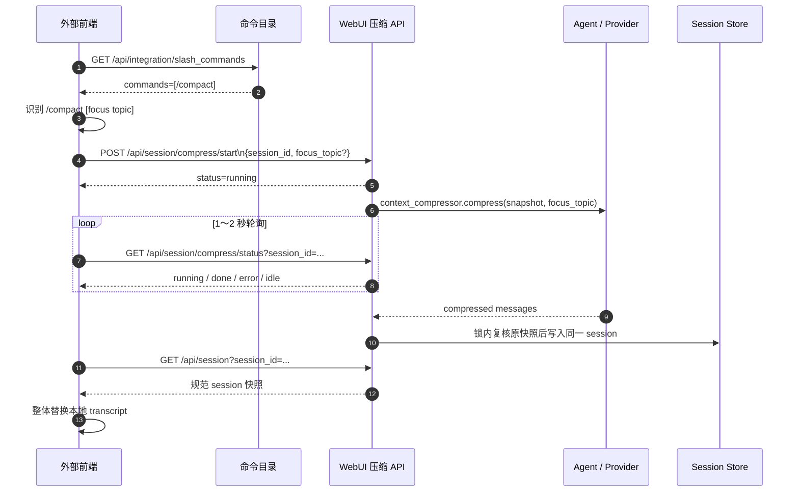

# 外部前端斜杠命令 API（V1 方案）

> **状态：部分已有、部分提案。**
>
> V1 只新增命令目录 `GET /api/integration/slash_commands`。`/compact` 的启动、状态查询
> 和会话刷新复用现有 WebUI 接口。命令目录尚未实现；本文不表示该路径已经可调用。

## 1. 结论

V1 不新增一套 invocation API，也不建立新的压缩 job 或持久化状态。接口组成如下：

| 状态 | 方法 | 路径 | 用途 |
| --- | --- | --- | --- |
| **新增** | GET | `/api/integration/slash_commands` | 查询允许外部前端展示的斜杠命令 |
| 已有 | POST | `/api/session/compress/start` | 异步启动当前会话的压缩 |
| 已有 | GET | `/api/session/compress/status?session_id={session_id}` | 按会话查询压缩状态 |
| 已有 | GET | `/api/session?session_id={session_id}&messages=1&resolve_model=0` | 完成后读取规范会话快照 |

第一版只有 `/compact`，因此不需要：

- `/commands/compact/invocations` 创建接口；
- `/invocations/{invocation_id}` 查询接口；
- invocation ID、幂等存储、额外后台 worker 或新的 transcript schema。

外部前端只负责识别命令和展示状态；实际压缩仍由当前 WebUI 的手动压缩能力完成。

## 2. 范围和信任边界

V1 只支持：

```text
/compact [focus topic]
```

其中可选的 `focus topic` 映射为 `focus_topic`，提示压缩器优先保留哪些事实、结论和待办。
它不是过滤条件、会话标题或永久设置；后端去除首尾空白并最多保留 500 个字符。

V1 不支持 `/clear`、Agent `/compress` 的 `here N`/`--preview` 参数、技能、插件命令或任意
未知 `/xxx`，也不会：

- 将 `/compact` 作为 user 消息写入 transcript；
- 调用 `POST /api/chat/start`；
- 将输入转发到 Agent CLI dispatcher 或 `POST /api/commands/exec`；
- 提供取消、SSE 或 WebSocket 压缩进度。

该最小方案只适用于同一信任域内的外部前端：与 WebUI 同源，或经受控 BFF/反向代理访问。
它不把现有压缩 status 直接升级为不受信第三方、多租户公共 API。原因见第 8 节。

启用 WebUI 密码认证时，同源浏览器写请求需要有效 `hermes_session` cookie 和：

```http
X-Hermes-CSRF-Token: <same-origin bootstrap 提供的 token>
```

不得为了该接口向任意跨域网页开放 cookie。跨域浏览器若要直连，需要另行设计短期令牌、
Origin allowlist、CORS credentials、CSRF 预检和撤销机制，不属于 V1。

## 3. 新增命令目录

### `GET /api/integration/slash_commands`

该接口是 V1 唯一需要新增的接口，供外部前端做自动补全、帮助展示和输入识别。它返回
“允许外部前端执行的命令白名单”，不是所有 Agent、WebUI 和插件命令的全集。

请求无 query 和 body 参数。响应：

```json
{
  "schema_version": 1,
  "commands": [
    {
      "name": "compact",
      "slash_name": "/compact",
      "description": "压缩当前会话上下文，减少后续模型调用携带的历史内容。",
      "async": true,
      "arguments": {
        "focus_topic": {
          "type": "string",
          "required": false,
          "max_length": 500,
          "description": "压缩时优先保留的主题、结论或待办。"
        }
      }
    }
  ]
}
```

目录表示服务端支持这个命令，不表示某个具体 session 此刻一定能执行。会话正在流式输出、
消息不足或 Provider 不可用时，启动接口仍会拒绝压缩。

现有 `GET /api/commands` 不能替代该目录：它返回 Agent/插件命令元数据；其中 `/compact`
只是 Agent `/compress` 的 alias，并继承 `here N`、`--preview` 等 Agent 参数说明。这与 V1
外部前端的 `/compact [focus topic]` 契约不同，而且命令出现在 Agent 目录中不等于允许外部
前端执行。

## 4. 外部前端输入解析

前端只在无附件的单行输入中识别斜杠命令。解析规则：

1. 去除整行首尾空白；
2. 第一个以空白分隔的 token 必须精确等于 `/compact`；
3. 剩余整段文本去除首尾空白后作为 `focus_topic`；
4. 不定义引号、shell 转义、`--flag` 或子命令语法；
5. 未命中目录中的 `slash_name` 时，不调用压缩接口。

例如：

| 用户输入 | 请求字段 |
| --- | --- |
| `/compact` | 不发送 `focus_topic` |
| `/compact 保留排障结论和下一步` | `focus_topic: "保留排障结论和下一步"` |

前端可以显示一张本地“正在压缩”操作卡片，但不能把原始命令追加为 user 消息。

## 5. 启动压缩

### `POST /api/session/compress/start`（已有）

```http
POST /api/session/compress/start
Content-Type: application/json
X-Hermes-CSRF-Token: <启用认证的同源浏览器需要>

{
  "session_id": "session_abc",
  "focus_topic": "保留当前排障结论和下一步"
}
```

| 字段 | 类型 | 必填 | 规则 |
| --- | --- | --- | --- |
| `session_id` | string | 是 | 目标 WebUI 会话 ID |
| `focus_topic` | string | 否 | trim 后为空视为未提供；后端最多使用 500 个字符 |

当前接口成功受理时返回 HTTP `200`，body 的 `status` 通常是 `running`：

```json
{
  "ok": true,
  "status": "running",
  "session_id": "session_abc",
  "focus_topic": "保留当前排障结论和下一步",
  "started_at": 1789093230.1,
  "updated_at": 1789093230.1
}
```

前端不能把“start 请求返回成功”理解为“压缩已经完成”，必须根据 `status` 继续查询。
同一 `session_id` 已有 `running` job 时，重复 start 会返回该 job，不会再启动一个 worker；
但参数不同的重复请求也只会观察原 job，新的 `focus_topic` 不会替换正在执行的参数。

启动前后端会检查会话存在且没有 `active_stream_id`。实际 worker 还会验证至少 4 条可处理
消息、Agent runtime 和 Provider 配置。

## 6. 查询状态和刷新会话

### `GET /api/session/compress/status`（已有）

```http
GET /api/session/compress/status?session_id=session_abc
```

返回状态：

| `status` | 含义 | 前端动作 |
| --- | --- | --- |
| `running` | 压缩仍在执行 | 继续轮询 |
| `done` | 压缩已成功写入原 session | 停止轮询并重新读取 session |
| `error` | 压缩失败且没有写入结果 | 停止轮询，展示 `error` |
| `idle` | 当前进程中没有该 session 的压缩 job | 停止轮询，按“状态未知/任务不存在”处理 |

建议外部前端以 1 秒起步，逐渐增加到最多 2 秒；不要并发发起多个 status 请求。

`done` 当前会包含压缩结果、摘要和 session 快照，但 V1 外部前端不依赖 status 中的完整
session 结构。成功后统一请求：

```http
GET /api/session?session_id=session_abc&messages=1&resolve_model=0
```

并用返回的 `session` 整体替换本地消息和工具调用状态。这样 transcript 只有一个规范读取
接口，压缩 status 的内部响应未来调整时不需要同步修改外部前端的消息映射。

## 7. 完整交互流程



切换会话或关闭页面只停止观察，不取消压缩。重新进入同一会话时可先查询 status；发现
`running` 就恢复轮询，发现 `done` 就刷新 session。

## 8. 现有压缩接口的限制

复用现有接口可以减少 V1 的实现量，但外部前端必须接受以下契约：

- job 以 `session_id` 为键，没有独立 `invocation_id`；同一会话同时只能观察一个压缩；
- job 状态保存在 WebUI 进程内，终态保留 10 分钟；服务重启后 status 会返回 `idle`；
- 没有 `Idempotency-Key`。原 job 已完成后再次 start 会重新压缩；
- start 响应在网络中丢失时，前端应先查询 status，不能直接用新的请求重复 start；
- status 是现有 WebUI 内部接口，没有面向不受信多租户调用者的独立 invocation 归属；
- status 可能携带完整 session，调用方不能把 `session_id` 当成访问授权；
- 错误结构沿用现有 WebUI 格式，没有为外部公共 API 固定机器错误码。

因此 V1 的安全前提是：外部前端与 WebUI 属于同一可信应用边界，并沿用已有认证和 Profile
选择。`idle` 不能解释为“压缩一定没发生”；若此前请求结果不确定，前端应刷新 session 并
提示用户确认，不能自动再压缩一次。

## 9. 错误与边界处理

| HTTP / 状态 | 常见原因 | 外部前端处理 |
| --- | --- | --- |
| start HTTP `400` | 缺少 `session_id` | 修正请求，不自动重试 |
| `404` | session 不存在 | 清理当前会话引用并刷新列表 |
| start HTTP `409` | 会话仍在流式生成，或启动前发现 Agent runtime 已变化 | 等会话空闲或运行时稳定后重试 |
| status `error` + `error_status: 400` | 消息少于 4 条或 Provider 未配置 | 停止轮询并展示错误 |
| status `error` + `error_status: 409` | Agent runtime 变化，或压缩期间会话被修改 | 刷新会话后由用户决定重试 |
| status `error` + `error_status: 500` | worker、Provider 或未分类服务端失败 | 停止轮询并展示错误 |
| status `idle` | 无 job、终态过期或服务重启 | 重新读取 session，不自动 start |

压缩完成写回前，后端会在 session 锁内重新比较消息和流状态。若压缩期间新增了消息、附件
或流状态变化，worker 返回错误且不覆盖新会话内容。成功时保持原 `session_id`，将压缩后的
消息写入 `messages` 和 `context_messages`，清空 tool calls 与 pending/stream 状态并保存。

## 10. 服务端新增实现范围

V1 只在 `integration/slash_commands/` 新增命令目录实现；`api/routes.py` 保持 import + 调用
的薄分发。目录使用显式外部白名单，不直接转发 `hermes_cli.commands.COMMAND_REGISTRY`，
也不从 `static/commands.js` 解析 JavaScript。

建议目录注册形态：

```python
ExternalSlashCommand(
    name="compact",
    slash_name="/compact",
    description="压缩当前会话上下文，减少后续模型调用携带的历史内容。",
    async_command=True,
    arguments={"focus_topic": {"type": "string", "required": False, "max_length": 500}},
)
```

实施时必须同步：

- 在 `integration/swagger/openapi.json` 登记 `GET /api/integration/slash_commands`；
- 更新 `integration/README.md` 路由表；
- 使用 `j()` 返回带 `Content-Length` 的 JSON；
- 增加目录只返回 `/compact`、字段 schema 和认证行为测试；
- 对现有 start/status 流程补充外部前端契约测试，证明 `running → done/error`、重复 running
  start、服务重启/idle 和成功后 session 刷新行为。

当前 WebUI 内置 `/compact` 的实现与状态层说明见
[斜杠命令与技能交互](slash-commands-and-skills.md)。

## 11. 何时升级为专用 invocation API

满足任一条件时，不应继续直接暴露现有 status，而应新增独立的 start/query facade 和持久化
invocation：

- 接入不受信第三方或跨租户前端；
- 需要严格的 `Idempotency-Key`；
- 需要服务重启后恢复或明确标记未完成调用；
- 需要审计每一次命令、区分同 session 的多次执行；
- 需要稳定机器错误码、独立访问控制或更长状态保留；
- 新增第二种具有不同状态语义的异步斜杠命令。

即使升级，命令目录仍与执行白名单保持同一注册表；不能因为某个命令出现在 Agent 或插件
目录中就自动赋予外部执行权限。
