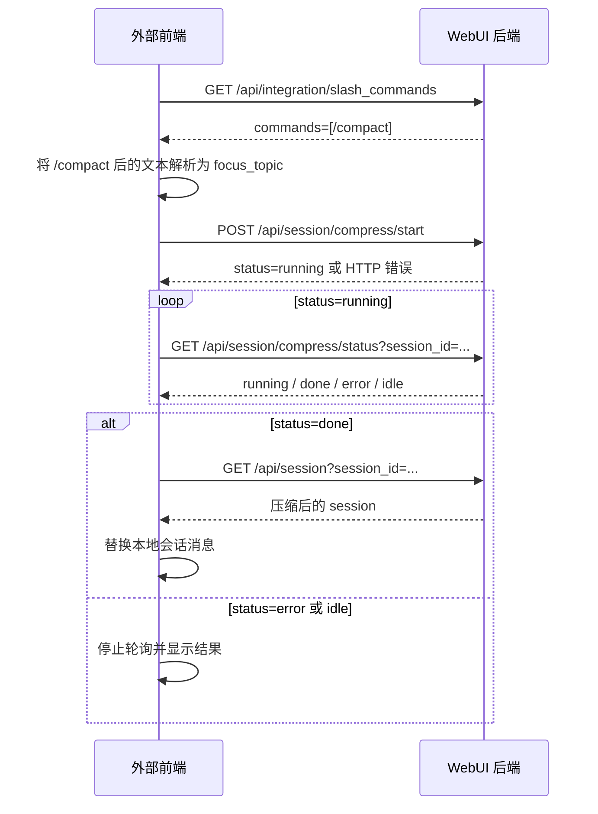

# 外部前端斜杠命令 API（V1）

V1 只支持 `/compact [focus topic]`。`/compact` 后面的文本作为 `focus_topic`；没有文本时
不传该字段。

## 1. 接口总览

| 方法 | 路径 | 用途 |
| --- | --- | --- |
| GET | `/api/integration/slash_commands` | 查询外部前端可用的斜杠命令 |
| POST | `/api/session/compress/start` | 启动会话压缩 |
| GET | `/api/session/compress/status` | 查询压缩状态 |
| GET | `/api/session` | 压缩完成后重新读取会话 |

调用顺序：

```text
查询命令 → 识别 /compact → 启动压缩 → 轮询状态 → 重新读取会话
```

## 2. 前后端交互



前端负责识别 `/compact`、组装 `focus_topic`、轮询状态和刷新本地会话；后端负责返回命令
目录、启动压缩、提供状态并保存压缩后的会话。`/compact` 原文不通过聊天接口发送。

## 3. 查询命令

### 请求

```http
GET /api/integration/slash_commands
```

无请求参数。

### 响应字段

| 字段 | 类型 | 说明 |
| --- | --- | --- |
| `commands` | array | 外部前端可用的命令列表 |
| `commands[].name` | string | 命令名称，不包含 `/` |
| `commands[].description` | string | 命令说明 |
| `commands[].args_hint` | string | 命令参数提示；方括号表示可选参数 |

### 响应示例

```json
{
  "commands": [
    {
      "name": "compact",
      "description": "压缩当前会话上下文，减少后续模型调用携带的历史内容。",
      "args_hint": "[focus topic]"
    }
  ]
}
```

### 调用示例

```bash
curl -sS 'http://127.0.0.1:8787/api/integration/slash_commands'
```

## 4. 启动压缩

### 请求

```http
POST /api/session/compress/start
Content-Type: application/json

{
  "session_id": "session_abc",
  "focus_topic": "保留当前排障结论和下一步"
}
```

### 请求字段

| 字段 | 类型 | 必填 | 说明 |
| --- | --- | --- | --- |
| `session_id` | string | 是 | 目标会话 ID |
| `focus_topic` | string | 否 | 压缩时优先保留的内容；最多使用 500 个字符 |

执行 `/compact` 时可以省略 `focus_topic`：

```json
{"session_id":"session_abc"}
```

### 成功响应字段

| 字段 | 类型 | 说明 |
| --- | --- | --- |
| `ok` | boolean | 请求是否成功受理 |
| `status` | string | 通常为 `running` |
| `session_id` | string | 目标会话 ID |
| `focus_topic` | string/null | 本次压缩关注主题 |
| `started_at` | number | 启动时间戳 |
| `updated_at` | number | 状态更新时间戳 |

### 成功响应示例

```json
{
  "ok": true,
  "status": "running",
  "session_id": "session_abc",
  "focus_topic": "保留当前排障结论和下一步",
  "started_at": 1789093230.1,
  "updated_at": 1789093230.1
}
```

### 错误响应

| HTTP 状态码 | 说明 |
| --- | --- |
| `400` | 缺少或传入空的 `session_id` |
| `404` | 会话不存在 |
| `409` | 会话正在生成，或 Agent runtime 已变化 |

### 调用示例

```bash
curl -sS -X POST 'http://127.0.0.1:8787/api/session/compress/start' \
  -H 'Content-Type: application/json' \
  -d '{"session_id":"session_abc","focus_topic":"保留当前排障结论和下一步"}'
```

## 5. 查询压缩状态

### 请求

```http
GET /api/session/compress/status?session_id=session_abc
```

### Query 字段

| 字段 | 类型 | 必填 | 说明 |
| --- | --- | --- | --- |
| `session_id` | string | 是 | 启动压缩时使用的会话 ID |

### 状态值

| `status` | 说明 | 前端处理 |
| --- | --- | --- |
| `running` | 正在压缩 | 继续轮询 |
| `done` | 压缩完成 | 停止轮询并调用 `GET /api/session` |
| `error` | 压缩失败 | 停止轮询并展示 `error` |
| `idle` | 当前没有该会话的压缩任务 | 停止轮询 |

建议轮询间隔从 1 秒开始，最大增加到 2 秒。

### `running` 响应示例

```json
{
  "ok": true,
  "status": "running",
  "session_id": "session_abc",
  "focus_topic": "保留当前排障结论和下一步",
  "started_at": 1789093230.1,
  "updated_at": 1789093231.1
}
```

### `done` 响应字段

| 字段 | 类型 | 说明 |
| --- | --- | --- |
| `ok` | boolean | 固定为 `true` |
| `status` | string | 固定为 `done` |
| `session_id` | string | 已完成压缩的会话 ID |
| `focus_topic` | string/null | 本次压缩关注主题 |
| `session` | object | 压缩后的会话快照 |
| `summary` | object/null | 压缩结果摘要 |
| `started_at` | number | 启动时间戳 |
| `updated_at` | number | 完成时间戳 |

### `done` 响应示例

```json
{
  "ok": true,
  "status": "done",
  "session_id": "session_abc",
  "focus_topic": "保留当前排障结论和下一步",
  "session": {
    "session_id": "session_abc",
    "messages": [
      {
        "role": "assistant",
        "content": "压缩后的上下文摘要"
      }
    ],
    "tool_calls": []
  },
  "summary": {
    "headline": "Compressed: 28 → 6 messages"
  },
  "started_at": 1789093230.1,
  "updated_at": 1789093245.2
}
```

### `error` 响应示例

```json
{
  "ok": false,
  "status": "error",
  "session_id": "session_abc",
  "error": "Compression failed",
  "error_status": 500
}
```

### `idle` 响应示例

```json
{
  "ok": true,
  "status": "idle",
  "session_id": "session_abc"
}
```

### 调用示例

```bash
curl -sS 'http://127.0.0.1:8787/api/session/compress/status?session_id=session_abc'
```

## 6. 重新读取会话

收到 `status: "done"` 后调用：

```http
GET /api/session?session_id=session_abc&messages=1&resolve_model=0
```

### Query 字段

| 字段 | 类型 | 必填 | 说明 |
| --- | --- | --- | --- |
| `session_id` | string | 是 | 已完成压缩的会话 ID |
| `messages` | integer | 否 | 传 `1` 返回消息列表 |
| `resolve_model` | integer | 否 | 传 `0` 跳过模型解析 |

### 响应字段

| 字段 | 类型 | 说明 |
| --- | --- | --- |
| `session` | object | 当前会话快照 |
| `session.session_id` | string | 会话 ID，压缩前后保持不变 |
| `session.messages` | array | 压缩后的消息列表 |
| `session.tool_calls` | array | 当前工具调用列表 |

### 响应示例

```json
{
  "session": {
    "session_id": "session_abc",
    "messages": [
      {
        "role": "assistant",
        "content": "压缩后的上下文摘要"
      }
    ],
    "tool_calls": []
  }
}
```

### 调用示例

```bash
curl -sS 'http://127.0.0.1:8787/api/session?session_id=session_abc&messages=1&resolve_model=0'
```
