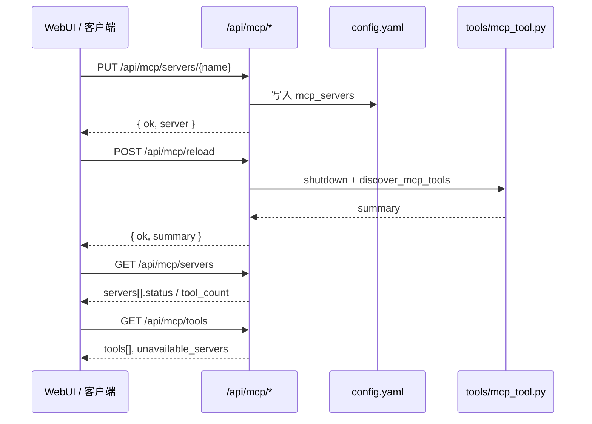

# MCP 管理接口说明

本文档描述 Hermes WebUI 暴露的 **MCP 服务器与工具管理 HTTP API**。这些接口用于设置面板中的 MCP 配置 CRUD、运行时可见性与工具清单浏览。

- **实现入口**：`api/routes.py`（`_handle_mcp_*`、`_server_summary`、`_mcp_transport_from_cfg`）
- **OpenAPI 规范**：[`integration/swagger/openapi.json`](../integration/swagger/openapi.json)（tag: `MCP`）
- **本地 Swagger UI**：启动 WebUI 后访问 `/docs`
- **持久化配置**：当前活跃 Profile 的 `config.yaml` → `mcp_servers` 键
- **运行时连接**：由 Hermes Agent 的 `tools/mcp_tool.py` 负责；列表/工具接口不会主动探测，`POST .../test` 会对单台服务器做临时连通性探测

---

## 1. 接口总览

| 方法 | 路径 | 说明 |
| --- | --- | --- |
| `GET` | `/api/mcp/servers` | 列出已配置的 MCP 服务器及运行时状态摘要 |
| `GET` | `/api/mcp/tools` | 列出已知 MCP 工具清单（只读 inventory） |
| `PUT` | `/api/mcp/servers/{name}` | 创建或更新 MCP 服务器配置 |
| `DELETE` | `/api/mcp/servers/{name}` | 删除 MCP 服务器配置 |
| `PATCH` | `/api/mcp/servers/{name}` | 切换 MCP 服务器启用/禁用 |
| `POST` | `/api/mcp/reload` | 重新加载所有 MCP 连接（等价 `/reload-mcp`） |
| `POST` | `/api/mcp/servers/{name}/test` | 校验配置格式与 MCP 运行时可用性 |

### 认证与 CSRF

- 与 WebUI 其他 `/api/*` 路由一致：若部署启用了密码认证，需携带有效 session cookie。
- 浏览器发起的 `POST` / `PUT` / `PATCH` / `DELETE` 还需 `X-Hermes-CSRF-Token`（或 legacy `X-CSRF-Token`）。
- 无 `Origin` / `Referer` 的非浏览器调用（curl、脚本、MCP 客户端）通常不受 CSRF token 约束。

### 路径参数 `{name}`

- URL 编码的服务器名称（如 `my-server`）。
- 空名称返回 `400`。

---

## 2. 传输类型与配置映射

WebUI 支持三种传输类型；保存时写入 `config.yaml` 的 `mcp_servers.<name>`：

| UI / API `transport` | 写入 config.yaml | Agent 连接方式 |
| --- | --- | --- |
| `stdio` | `command` + `args` + 可选 `env` | 本地子进程 stdio |
| `http` | `url` + 可选 `headers`（**不写** `transport`） | Streamable HTTP |
| `sse` | `url` + 可选 `headers` + `transport: sse` | MCP SSE 协议 |

### stdio 示例

```yaml
mcp_servers:
  filesystem:
    command: npx
    args:
      - "@modelcontextprotocol/server-filesystem"
      - /workspace
    env:
      NODE_ENV: production
    timeout: 120
```

### HTTP (Streamable) 示例

```yaml
mcp_servers:
  remote_api:
    url: https://mcp.example.com/mcp
    headers:
      Authorization: Bearer sk-...
    timeout: 180
```

### SSE 示例

```yaml
mcp_servers:
  legacy_sse:
    url: http://localhost:8000/sse
    transport: sse
    headers:
      Authorization: Bearer sk-...
    timeout: 180
```

### 通用可选字段（config.yaml，API 暂未暴露）

Hermes Agent 还支持但 WebUI PUT 体**当前未写入**的字段包括：`connect_timeout`、`enabled`、`supports_parallel_tool_calls`、`ssl_verify`、`client_cert` 等。可通过手动编辑 `config.yaml` 添加；列表 API 会读取并反映 `enabled` / `connect_timeout` 等已有值。

---

## 3. `GET /api/mcp/servers`

返回已配置 MCP 服务器列表及只读运行时可见性。

### 响应 `200`

```json
{
  "servers": [ /* McpServerSummary[] */ ],
  "toggle_supported": true,
  "reload_required": true
}
```

| 顶层字段 | 类型 | 说明 |
| --- | --- | --- |
| `servers` | `array` | 服务器摘要列表 |
| `toggle_supported` | `boolean` | **能力开关**：当前部署是否支持通过 API 切换启用/禁用（见下文 §3.1） |
| `reload_required` | `boolean` | **工作流提示**：配置变更后是否需额外调用 reload 才能让 MCP 连接生效（见下文 §3.2） |

### 3.1 `toggle_supported` — 是否支持启用/禁用切换

该字段告诉客户端（通常是 WebUI 设置面板）：**能不能**对列表中的服务器做交互式启用/禁用，而不是只读展示 `enabled` 状态。

| 值 | 客户端应如何表现 | 对应 API |
| --- | --- | --- |
| `true` | 每行显示可点击的 Enabled/Disabled 切换控件 | `PATCH /api/mcp/servers/{name}`，`body: { "enabled": true \| false }` |
| `false` | 仅只读展示 `enabled` 文案，不提供切换按钮 | 无 PATCH；用户需手动改 `config.yaml` |

**当前实现**：后端恒返回 `true`（自 PR #2776 起 PATCH 已落地）。WebUI 在 `static/panels.js` 的 `loadMcpServers()` 中读取该字段：为 `true` 时渲染 `.mcp-toggle-btn` 并绑定 `toggleMcpServer()`；为 `false` 时退化为 `<span>` 只读标签。

**历史背景**：早期 MCP 可见性面板（#696）为只读 MVP，曾固定返回 `false`；后续 CRUD + PATCH 上线后改为 `true`。字段保留是为了让旧客户端或外部集成在能力未就绪时能优雅降级，而不是假设 PATCH 一定可用。

**与 `servers[].enabled` 的区别**：

- `servers[].enabled` — **某个具体服务器**当前是否启用（数据）。
- `toggle_supported` — **整个列表接口**是否允许客户端发起启用/禁用操作（能力）。

### 3.2 `reload_required` — 配置变更后是否需 reload

该字段告诉客户端：**写入 config 不等于 MCP 连接已更新**。在修改服务器定义或期望连接状态变化后，还需调用 reload 接口，Hermes Agent 才会关闭旧连接、按新配置重新发现工具。

| 值 | 含义 | 客户端建议 |
| --- | --- | --- |
| `true` | 配置已落盘，但 MCP 运行时连接不会自动重建 | 在 `PUT` / `DELETE` / 需要立即生效的 `PATCH` 之后，调用 `POST /api/mcp/reload` |
| `false` | （预留）表示变更可热生效，无需额外 reload | 保存后可直接刷新 `GET /api/mcp/servers` 确认状态 |

**当前实现**：后端恒返回 `true`。WebUI 在 `static/index.html` 通过固定文案 `mcp_manage_hint` 提示用户「Add/Edit/Delete 后点击 Reload MCP」；**尚未**在 JS 中读取 `reload_required` 动态控制提示，但 API 消费者应依赖该字段而非硬编码。

**为什么需要 reload？** 两层配置不同步：

1. **`PUT` / `PATCH` / `DELETE`** → 写入 `config.yaml` 并调用 `reload_config()`，仅刷新 WebUI/Agent 的**内存配置**。
2. **`POST /api/mcp/reload`** → 调用 Agent 的 `/reload-mcp` 逻辑：关闭 `tools/mcp_tool.py` 中已有 MCP 连接、重新 `discover_mcp_tools()`，stdio 子进程与 HTTP/SSE 会话才会按新配置重建。

因此典型流程是：

```
PUT 保存 → POST /api/mcp/reload → GET /api/mcp/servers（看 status / tool_count）
```

仅 `GET /api/mcp/servers` 或 `GET /api/mcp/tools` **不会**触发连接探测或 reload。

**哪些操作后建议 reload？**

| 操作 | 写入 config | 建议 reload |
| --- | --- | --- |
| `PUT` 新增/修改服务器（command、url、headers 等） | 是 | **是** |
| `DELETE` 删除服务器 | 是 | **是** |
| `PATCH` 切换 `enabled` | 是 | **是**（禁用后应断开连接；启用后应重新发现） |
| `GET` 列表 / 工具清单 | 否 | 否 |
| `POST .../test` | 否 | 否（仅校验配置，不建连） |

**与 `servers[].status` 的关系**：`reload_required` 是接口级**工作流约定**；`status: configured` 表示某台服务器已启用但运行时尚未连接——常见原因就是尚未 reload 或尚未开启新会话。

### `McpServerSummary`

| 字段 | 类型 | 说明 |
| --- | --- | --- |
| `name` | `string` | 服务器名称 |
| `transport` | `string` | `stdio` \| `http` \| `sse` \| `invalid` |
| `url` | `string` | HTTP/SSE 时存在 |
| `headers` | `object` | HTTP/SSE 请求头（按配置原样返回） |
| `command` | `string` | stdio 时存在 |
| `args` | `string[]` | stdio 参数 |
| `env` | `object` | stdio 环境变量（**已脱敏**） |
| `timeout` | `integer` | 工具调用超时（秒），默认 `120` |
| `connect_timeout` | `integer` | 连接超时（秒），默认 `60` |
| `enabled` | `boolean` | 是否启用 |
| `active` | `boolean` | 运行时是否已连接 |
| `status` | `string` | `active` \| `configured` \| `disabled` \| `invalid_config` |
| `tool_count` | `integer \| null` | 已知工具数；无运行时数据时为 `null` |

#### `status` 语义

| 值 | 含义 |
| --- | --- |
| `active` | 已启用且运行时报告已连接 |
| `configured` | 已启用但未连接（需 reload 或等待会话发现） |
| `disabled` | `enabled: false` |
| `invalid_config` | 缺少 `url` 与 `command`，或配置项类型错误 |

#### 脱敏规则

`headers` / `env` 中含密钥类字段（如 `Authorization`、`API_KEY`）时，值替换为 `••••••`。编辑保存时若原样提交 `••••••` 占位符，后端会保留磁盘上的真实值（见 §5）。

---

## 4. `GET /api/mcp/tools`

返回当前 WebUI 进程**已知**的 MCP 工具 inventory；**不会**启动 MCP 服务器或发起连接探测。

### 响应 `200`

```json
{
  "tools": [ /* McpToolSummary[] */ ],
  "total": 12,
  "source": "mcp_runtime_status",
  "inventory_scope": "already_known_runtime_only",
  "unavailable_servers": ["remote_api"]
}
```

| 字段 | 类型 | 说明 |
| --- | --- | --- |
| `tools` | `array` | 工具列表，按 `(server, name)` 排序 |
| `total` | `integer` | 工具总数 |
| `source` | `string` | `mcp_runtime_status` \| `tool_registry` \| `none` |
| `inventory_scope` | `string` | 固定为 `already_known_runtime_only` |
| `unavailable_servers` | `string[]` | 已启用但 `active=false` 的服务器名 |

### `McpToolSummary`

| 字段 | 类型 | 说明 |
| --- | --- | --- |
| `name` | `string` | 工具名 |
| `server` | `string` | 所属 MCP 服务器 |
| `description` | `string` | 描述（截断 + 脱敏） |
| `active` | `boolean` | 所属服务器是否已连接 |
| `enabled` | `boolean` | 所属服务器是否启用 |
| `status` | `string` | 所属服务器状态 |
| `schema_summary` | `array` | 参数摘要（name / type / required / description），不含敏感 default |

### `source` 回退顺序

1. **`mcp_runtime_status`**：从 `tools.mcp_tool.get_mcp_status()` 读取已注册运行时详情。
2. **`tool_registry`**：回退到 Hermes tool registry 中 `mcp-*` toolset 的已注册 schema。
3. **`none`**：两者均无数据。

---

## 5. `PUT /api/mcp/servers/{name}`

创建或**整段替换**指定名称的 MCP 服务器配置，并写入 `config.yaml`。

### 请求体 `McpServerUpdateRequest`

| 字段 | 类型 | 必填 | 说明 |
| --- | --- | --- | --- |
| `command` | `string` | stdio 时必填 | 可执行命令 |
| `args` | `string[]` | 否 | 命令参数 |
| `env` | `object` | 否 | 环境变量 |
| `url` | `string` | HTTP/SSE 时必填 | 远程 MCP 端点 |
| `headers` | `object` | 否 | HTTP/SSE 请求头 |
| `transport` | `string` | SSE 时必填 | 仅允许 `"sse"`；HTTP Streamable **不要传** |
| `timeout` | `integer` | 否 | 超时秒数 |

**约束**：`url` 与 `command` **二选一**。两者皆无 → `400`。

### 响应 `200`

```json
{
  "ok": true,
  "server": { /* McpServerSummary */ }
}
```

### 错误

| 状态码 | 条件 |
| --- | --- |
| `400` | 名称为空；缺少 `url` 与 `command` |

### 行为说明

- **整段替换**：PUT 会用请求体构建的新配置覆盖该 name 下原有条目；从 SSE 切回 HTTP 时不传 `transport`，磁盘上的 `transport: sse` 会被清除。
- **脱敏回写**：`headers` / `env` 中值为 `••••••` 的键会保留 config 中的原值。
- **副作用**：调用 `reload_config()`；要使 MCP 连接生效仍需 `POST /api/mcp/reload` 或开启新会话。

### 请求示例

**stdio**

```http
PUT /api/mcp/servers/filesystem
Content-Type: application/json

{
  "command": "npx",
  "args": ["@modelcontextprotocol/server-filesystem", "/workspace"],
  "timeout": 120
}
```

**HTTP (Streamable)**

```http
PUT /api/mcp/servers/remote_api
Content-Type: application/json

{
  "url": "https://mcp.example.com/mcp",
  "headers": { "Authorization": "Bearer sk-..." },
  "timeout": 180
}
```

**SSE**

```http
PUT /api/mcp/servers/legacy_sse
Content-Type: application/json

{
  "url": "http://localhost:8000/sse",
  "transport": "sse",
  "headers": { "Authorization": "Bearer sk-..." }
}
```

---

## 6. `DELETE /api/mcp/servers/{name}`

从 `config.yaml` 删除指定 MCP 服务器。

### 响应 `200`

```json
{
  "ok": true,
  "deleted": "remote_api"
}
```

### 错误

| 状态码 | 条件 |
| --- | --- |
| `400` | 名称为空 |
| `404` | 服务器不存在 |

---

## 7. `PATCH /api/mcp/servers/{name}`

切换单个 MCP 服务器的 `enabled` 字段。

### 请求体

```json
{ "enabled": false }
```

### 响应 `200`

```json
{
  "ok": true,
  "name": "remote_api",
  "enabled": false
}
```

### 错误

| 状态码 | 条件 |
| --- | --- |
| `400` | 缺少 `enabled`；配置无效 |
| `404` | 服务器不存在 |

`enabled` 支持 YAML 中的多种 false-y 值（`0`、`"false"` 等），列表 API 会规范化为 boolean。

---

## 8. `POST /api/mcp/reload`

关闭现有 MCP 连接并按当前配置重新发现工具。等价于 Agent 内 `/reload-mcp` 命令。

### 响应 `200`

```json
{
  "ok": true,
  "summary": "..."
}
```

### 错误

| 状态码 | 条件 |
| --- | --- |
| `400` / `500` | reload 命令执行失败（响应体含错误信息） |

**推荐工作流**：`PUT` 保存配置 → `POST /api/mcp/reload` → `GET /api/mcp/servers` / `GET /api/mcp/tools` 确认状态。

---

## 9. `POST /api/mcp/servers/{name}/test`

对指定 MCP 服务器发起**临时连通性探测**：连接（stdio / HTTP Streamable / SSE）→ 发现工具 → 断开。**不会**修改长期 MCP registry；已通过 `POST /api/mcp/reload` 建立的连接不受影响。

实现复用 Hermes Agent `tools/mcp_tool.py` 的 `_connect_server` 路径（与 `probe_mcp_server_tools` 相同），支持 SSE。

### 响应 `200`（连接成功）

```json
{
  "ok": true,
  "name": "cmapi013828",
  "transport": "sse",
  "mcp_tool_available": true,
  "tool_count": 12,
  "note": "Connected successfully and discovered 12 tool(s)."
}
```

| 字段 | 说明 |
| --- | --- |
| `tool_count` | 本次探测发现的工具数量（连接成功但服务器无工具时为 `0`） |
| `note` | 成功摘要 |

### 响应 `200`（连接失败）

```json
{
  "ok": false,
  "name": "cmapi013828",
  "transport": "sse",
  "mcp_tool_available": true,
  "tool_count": 0,
  "error": "connection refused"
}
```

### 响应 `200`（配置无效 / 运行时不可用）

配置格式错误：

```json
{
  "ok": false,
  "error": "url is invalid"
}
```

MCP 运行时模块无法 import：

```json
{
  "ok": false,
  "name": "remote_api",
  "transport": "http",
  "mcp_tool_available": false,
  "tool_count": 0,
  "error": "MCP runtime unavailable"
}
```

### 错误

| 状态码 | 条件 |
| --- | --- |
| `400` | 名称为空 |
| `404` | 服务器不存在 |

### 与 Reload 的区别

| 操作 | 作用 |
| --- | --- |
| `POST .../test` | 一次性探测，不断开/不影响已有 registry |
| `POST /api/mcp/reload` | 关闭所有连接并按 config 重新注册工具到 Agent |

---

## 10. 典型调用流程



---

## 11. 与 `mcp_server.py` 的区别

仓库根目录的 [`mcp_server.py`](../mcp_server.py) 是**反向**集成：把 Hermes WebUI 的会话/项目管理能力以 **stdio MCP 工具** 暴露给外部 MCP 客户端（Cursor、Claude Desktop 等）。它**不是**上述 HTTP REST API 的一部分。

| 方向 | 组件 | 协议 |
| --- | --- | --- |
| WebUI → 外部 MCP | `tools/mcp_tool.py` + `mcp_servers` 配置 | stdio / HTTP / SSE |
| 外部 Agent → WebUI | `mcp_server.py` | stdio MCP |

---

## 12. 相关文件索引

| 文件 | 职责 |
| --- | --- |
| `api/routes.py` | MCP HTTP 处理器与摘要/脱敏逻辑 |
| `api/commands.py` | `/reload-mcp` 与 `POST /api/mcp/reload` 共用实现 |
| `api/streaming.py` | 会话开始时 `discover_mcp_tools()` |
| `static/panels.js` | 设置面板 MCP CRUD UI |
| `static/index.html` | MCP 服务器表单（三种 transport） |
| `integration/swagger/openapi.json` | OpenAPI schema 与 `/docs` |
| `tests/test_issue538_mcp_management.py` | MCP 管理 API 回归测试 |
