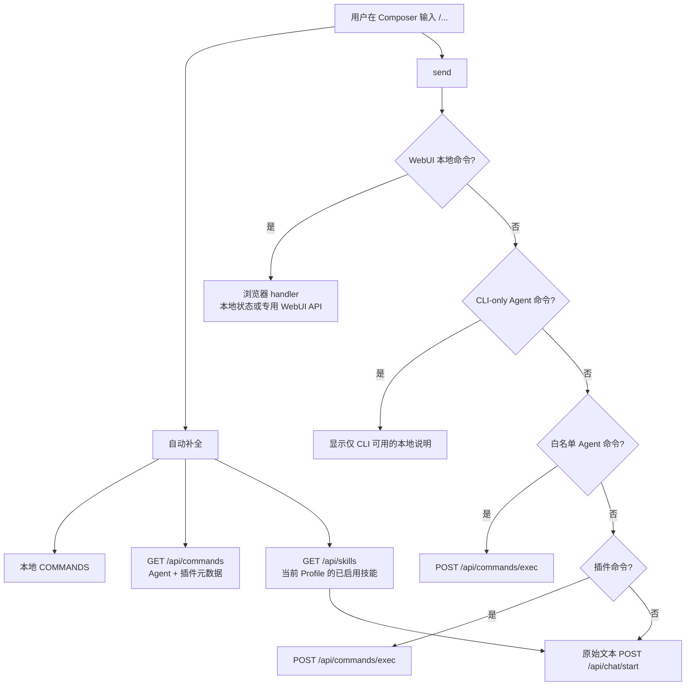
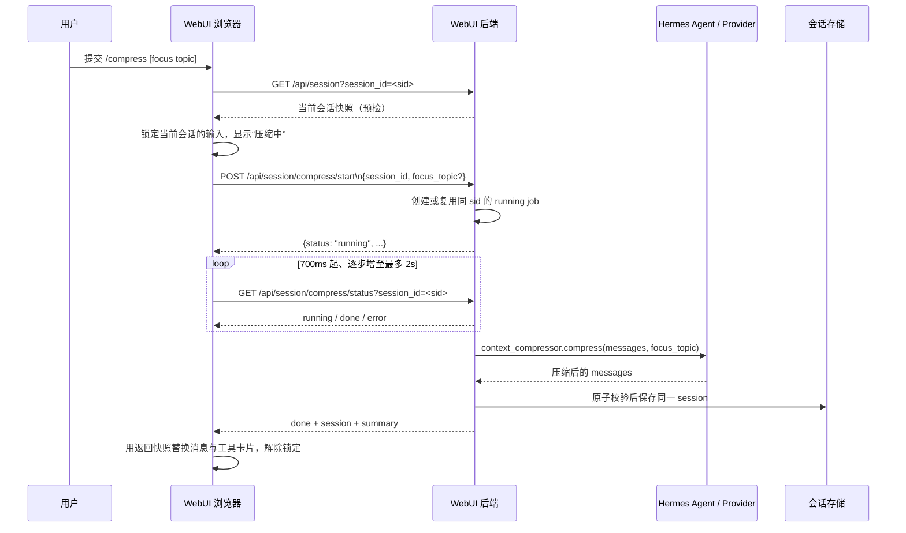

# WebUI 斜杠命令与技能：前后端交互

本文说明 Hermes WebUI 中以 `/` 开头的输入如何被发现、补全、分流和执行，以及
技能如何参与该流程。它描述当前实现，不把 WebUI 的本地命令、Hermes Agent CLI
命令和技能快捷入口视为同一种后端执行能力。

## 范围与术语

- **WebUI 本地命令**：定义在 `static/commands.js` 的 `COMMANDS`。浏览器直接调用
  对应 JavaScript handler，例如 `/clear`、`/compress`、`/interrupt`。
- **Agent 命令元数据**：`hermes_cli.commands.COMMAND_REGISTRY` 中的命令，经
  `GET /api/commands` 返回给浏览器，用于补全、CLI-only 提示和少数运行时命令分流。
- **插件命令**：Agent 插件注册的命令；`GET /api/commands` 将其标记为
  `category: "Plugin"`。
- **技能快捷入口**：由已启用 Skill 的名称动态转换出的 `/slug` 项，仅是 WebUI
  自动补全中的候选项；它不等同于独立的命令执行 API。

同名时，本地命令优先。技能名转换为 slug 的规则是：转小写，空白和下划线改为
连字符，移除非 `[a-z0-9-]` 字符，并合并重复连字符；若与本地命令重名，则不会
生成技能快捷入口。

## 总览



`/steer`、`/interrupt` 和 `/queue` 是运行中输入的例外：在会话忙碌时，前端会在普通 busy-input 策略之前拦截它们，以便立即执行对应控制逻辑。

## 1. 命令发现与自动补全

浏览器在 Composer 输入以 `/` 开头的单行文本时，合并三组候选项：

1. `static/commands.js` 的本地 `COMMANDS`；
2. `GET /api/commands` 缓存的 Agent 和插件命令；其中 `cli_only: true` 的项不进入
   WebUI 自动补全；
3. `GET /api/skills` 返回的、`disabled: false` 的技能生成的快捷入口。

模型、人格和 `/use` 参数还会按需从以下接口读取参数候选：

| 输入 | 参数来源 |
| --- | --- |
| `/model <...>` | `GET /api/models` |
| `/personality <...>` | `GET /api/personalities` |
| `/use <...>` | `GET /api/skills` |

自动补全只帮助输入，不能证明某个候选在 WebUI 中可以直接执行。尤其是 Agent
命令元数据与后端执行白名单是两层独立的控制面。

## 2. `GET /api/commands`：Agent/插件命令目录

### 请求

```http
GET /api/commands
```

无需请求参数。它遵循普通 WebUI GET 接口的认证策略；命令目录本身不按 `profile`
查询参数分组。

### 响应

```json
{
  "commands": [
    {
      "name": "reload-mcp",
      "description": "Reload MCP servers from config",
      "category": "Tools & Skills",
      "aliases": ["reload_mcp"],
      "args_hint": "",
      "subcommands": [],
      "cli_only": false,
      "gateway_only": false
    }
  ]
}
```

字段含义：

| 字段 | 含义 |
| --- | --- |
| `name` | 不含 `/` 的规范命令名 |
| `description` | Agent 或插件提供的说明 |
| `category` | Agent 命令分类；插件固定为 `Plugin` |
| `aliases` | 可识别的别名 |
| `args_hint`、`subcommands` | 补全和帮助展示用的参数信息 |
| `cli_only` | 浏览器不得当作可执行 WebUI 命令处理 |
| `gateway_only` | 目录接口不会返回 `true` 的项目 |

后端从 `hermes_cli.commands.COMMAND_REGISTRY` 构建响应，并再合并
`hermes_cli.plugins.get_plugin_commands()`。它会过滤所有 `gateway_only` 命令，
也会无条件隐藏 `/sethome`、`/restart`、`/update` 和 `/commands`。若 Agent 模块不可
导入，接口仍返回成功 JSON，但 `commands` 为 `[]`，使 WebUI 本地命令仍可使用。

此接口**不**返回 WebUI 本地 `COMMANDS`，也不返回由 `GET /api/skills` 生成的技能
快捷入口。因此客户端需要合并来源，不能把此响应当成“所有可输入 `/` 项”的全集。

## 3. 发送时的命令分流

当 Composer 提交以 `/` 开头的内容且没有附件时，WebUI 按下列顺序处理：

1. **本地命令**：若命中 `COMMANDS`，浏览器直接调用 handler。handler 可只改变
   页面状态，也可访问专用 API；例如 `/compress` 走
   `POST /api/session/compress/start`，而 `/clear` 不发后端请求。
2. **WebUI 特例**：`/pet`、`/sessions`、`/resume` 有各自的 WebUI 分支。
3. **CLI-only Agent 命令**：浏览器从命令目录找到 `cli_only: true` 后，不会提交给
   Agent；它将该输入和“仅 Hermes CLI 可用”的说明显示在当前会话中。
4. **可直接执行的 Agent 命令**：当前浏览器显式分流 `/reload-mcp`、
   `/reload_mcp`、`/codex-runtime` 和 `/codex_runtime` 到命令执行接口。
5. **插件命令**：命令目录中 `category: "Plugin"` 的项通过命令执行接口提交。
6. **其余输入**：保持原文，走普通聊天 `POST /api/chat/start`。这不是命令执行接口，
   浏览器不会把未知斜杠输入改写为其他命令。

后端的 `POST /api/commands/exec` 还有自己的窄白名单：

```text
reload-mcp, reload-skills, codex-runtime, credits
```

其中别名 `reload_mcp`、`reload_skills` 和 `codex_runtime` 会先规范化。该后端白名单
不应被误解为当前浏览器都会自动分流的项目：浏览器的直接分流集合以本节第 4 点为
准。新增命令时，必须分别决定它是否应出现在目录、自动补全、浏览器直连执行和
后端执行白名单中。

### `POST /api/commands/exec`

```http
POST /api/commands/exec
Content-Type: application/json

{"command":"/reload-mcp"}
```

成功时返回：

```json
{"output":"Reloaded MCP servers from configuration."}
```

处理顺序是先尝试 Agent 白名单；未命中时再尝试插件命令。无法识别的插件命令返回
`404`，空 `command` 返回 `400`。接口不接受“执行任意 Agent CLI 斜杠命令”的请求。

## 4. `/compress` 与 `/compact`：手动上下文压缩

`/compress` 是 WebUI 本地命令，不经过 `GET /api/commands` 或
`POST /api/commands/exec`。`/compact` 是完全相同的别名：两者都调用
`_runManualCompression()`，可选的命令参数会作为压缩关注主题传入。例如：

```text
/compress
/compress 保留当前排障结论和下一步
/compact 保留当前排障结论和下一步
```

### 交互时序



这里的“原子校验”指模型压缩调用完成后，后端在会话锁内再次比较流状态和消息列表。
若压缩期间已有新消息、附件或流状态变化，就拒绝写回，避免较旧的压缩结果覆盖较新的
会话内容。

### 浏览器侧步骤

1. `cmdCompress()` 或 `cmdCompact()` 取出参数并调用 `_runManualCompression()`。
2. 浏览器先 `GET /api/session?session_id=<sid>`，确认当前正在看的会话仍存在，并用
   返回快照刷新本地 `S.session`、`S.messages` 与 `S.toolCalls`。
3. 它设置 busy 状态、当前会话压缩锁和“压缩中”提示，再向
   `POST /api/session/compress/start` 发送：

   ```json
   {"session_id":"<sid>","focus_topic":"保留当前排障结论和下一步"}
   ```

   未提供参数时请求体只含 `session_id`。浏览器**不会**直接调用
   `POST /api/session/compress`；该同步处理器由后端 worker 使用。
4. 若启动响应不是已完成结果，浏览器请求
   `GET /api/session/compress/status?session_id=<sid>`。首次等待 700ms，之后每次增加
   300ms，最长间隔 2 秒；直到 `done` 或 `error`。重新打开同一会话时，WebUI 也会查询
   status，并在发现 `running` job 时恢复“压缩中”界面和轮询。
5. 成功后，浏览器用响应中的 `session` 覆盖当前内存会话、消息和工具调用，清理正在
   显示的工具卡片，更新会话列表及 URL 对应的活动会话；它不创建新的 `session_id`。

### 后端 job、状态和持久化

`POST /api/session/compress/start` 先验证会话存在且没有 `active_stream_id`。随后它在
进程内以 `session_id` 为键登记一个 `running` job，并启动 daemon worker。相同会话已有
运行中的 job 时，重复启动请求只返回该 job，不会再发起一次模型压缩。已结束的旧 job
则会在下一次启动时被移除并重新执行；结束状态最多保留 10 分钟，以便多个浏览器标签
页都能读到同一终态结果。

worker 在对应 Profile 的环境中调用同步压缩处理器。处理器会：

1. 清洗会话消息，且要求至少有 4 条可处理消息；
2. 按该会话的模型/Provider 解析运行时配置，并要求存在可用 Provider 凭据；
3. 创建 `platform="webui"` 的 Agent，调用
   `agent.context_compressor.compress(original_messages, current_tokens, focus_topic)`；
4. 在会话锁内确认压缩前后没有并发写入；
5. 保存压缩结果并返回摘要。

成功写回的状态层是**原会话**，不是前端临时视图：

| 字段 | 成功后的值 |
| --- | --- |
| `s.messages`、`s.context_messages` | 压缩后的消息列表 |
| `s.tool_calls` | `[]` |
| `active_stream_id`、待发送消息/附件/时间戳 | 清空 |
| compression anchor/summary | 根据压缩后可见消息及摘要重建 |
| `session_id` | 保持不变 |

最后调用 `s.save()` 持久化。因此 `/compress` 的作用是用摘要型上下文替换同一会话的历史，
以降低后续对话携带的上下文；它不同于 WebUI `/clear` 只清空当前页面内存，也不同于
Agent CLI `/clear` 新建一个 Agent 会话。

### API 状态与失败语义

`GET /api/session/compress/status` 返回 `running`、`done`、`error` 或 `idle`。`done` 会
携带 worker 的结果，包括更新后的 `session`、`summary` 与 `focus_topic`；`error` 会携带
可读错误和 `error_status`。找不到尚存 job 时返回 `idle`，浏览器将其视为“压缩 job 已
不可用”的失败，而不是把它当作成功。

常见拒绝情形包括：会话不存在（404）、正在流式生成（409）、少于 4 条消息（400）、
未配置 Provider（400），以及压缩期间会话被其他写入修改（409）。Agent 运行时在开始前
或运行中发现已变更时，会以 409、`type: "agent_runtime_stale"` 和
`retryable: true` 返回；前端不会将这些失败写入会话历史。

## 5. 技能发现、快捷入口和 `/use`

### `GET /api/skills`

```http
GET /api/skills
GET /api/skills?category=<category>
GET /api/skills?profile=<profile-name>
```

默认按当前请求的活跃 Profile 解析 `{HERMES_HOME}/skills/`；带 `profile` 时改为该
Profile 的 `skills/` 和 `config.yaml`。后端同时扫描 Agent 声明的外部技能目录，按
技能名去重，过滤不适用于当前平台的技能，并将 Profile 配置里的禁用状态返回。

响应形状：

```json
{
  "skills": [
    {
      "name": "research-report",
      "description": "Prepare a research report.",
      "category": "research",
      "disabled": false,
      "hub_installed": true
    }
  ]
}
```

浏览器只为 `disabled: false` 的技能创建快捷入口。例如 `research_report` 会显示为
`/research-report`。选中这种候选只会把文本填入 Composer；WebUI 不会为它调用专用
的“运行技能”接口。提交后，原始斜杠文本仍按普通聊天路径发送，技能是否被 Agent
读取由 Agent 的常规技能机制决定。

`/skills [query]` 是 WebUI 本地命令：它调用 `GET /api/skills`，按名称、描述和分类
过滤，然后在聊天窗口中展示结果。

`/use <skill-name>` 也是 WebUI 本地命令，但语义不同：它先调用 `GET /api/skills`
验证精确名称，随后保存一个仅供**下一次正常发送**消费的临时 directive。下一次
`POST /api/chat/start` 前，浏览器把如下文字前置到发送消息：

```text
[USER OVERRIDE] You MUST consult skill '<skill-name>' via skill_view before responding to the next message.
```

该 directive 被消费后立即清除；技能不存在或读取失败时不会注入。它不是永久启用，也
不会修改技能文件或 Profile 配置。

## 6. 维护约束

- 把“列举命令”和“执行命令”视为不同能力。`GET /api/commands` 的字段不能替代
  `POST /api/commands/exec` 的授权边界。
- 把“显示技能快捷入口”和“强制使用技能”视为不同能力。前者来自自动补全，后者使用
  `/use` 的一次性 directive。
- 新增 Agent 命令时，应同步检查 `COMMAND_REGISTRY` 元数据、`api/commands.py`
  的过滤/执行策略、`static/messages.js` 的浏览器分流，以及相应的自动化测试。
- 新增或修改 WebUI 本地命令时，应更新 `static/commands.js` 的 `COMMANDS`；它不会
  自动出现在 `GET /api/commands`。
- 修改手动压缩时，应同时覆盖启动、轮询恢复、重复启动、流式会话拒绝和压缩期间并发
  写入这几种状态；压缩结果只能写回压缩开始时所验证的同一份会话历史。

## 代码入口

| 责任 | 入口 |
| --- | --- |
| 本地命令和自动补全来源合并 | `static/commands.js` |
| Composer 发送分流 | `static/messages.js` |
| Agent/插件命令目录和执行白名单 | `api/commands.py` |
| HTTP 路由 | `api/routes.py` |
| `/compress`/`/compact` 浏览器流程 | `static/commands.js` 的 `_runManualCompression()` |
| 手动压缩 worker、job 状态和写回 | `api/routes.py` 的 `_handle_session_compress_start()`、`_run_manual_compression_job()`、`_handle_session_compress()` |
| Agent 规范命令表 | Hermes Agent 仓库的 `hermes_cli/commands.py` |
