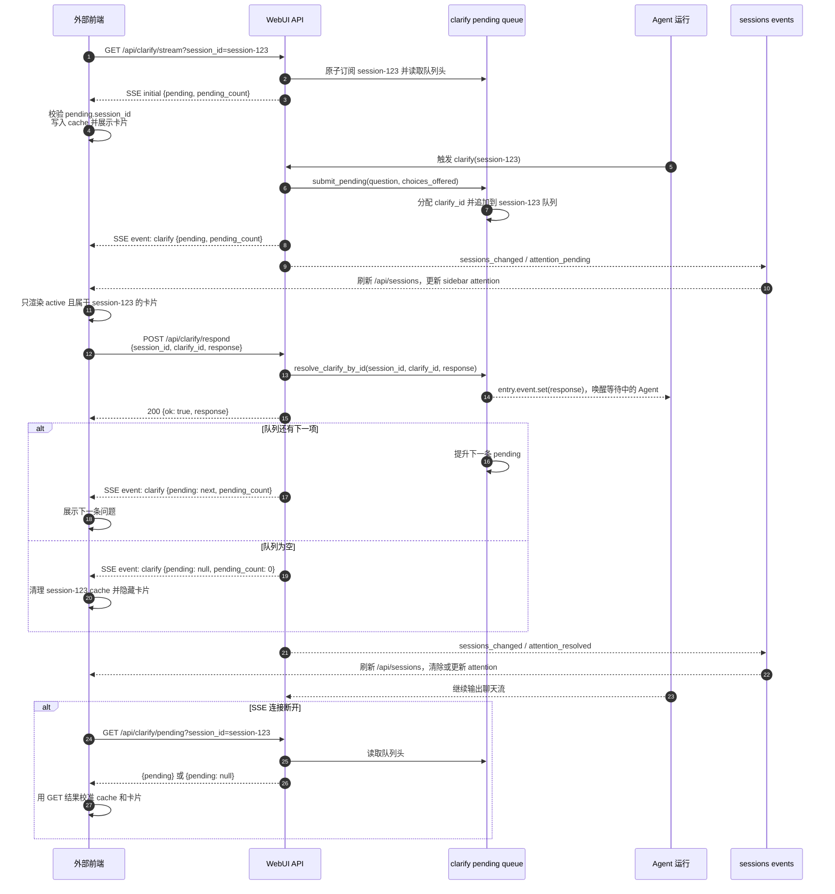
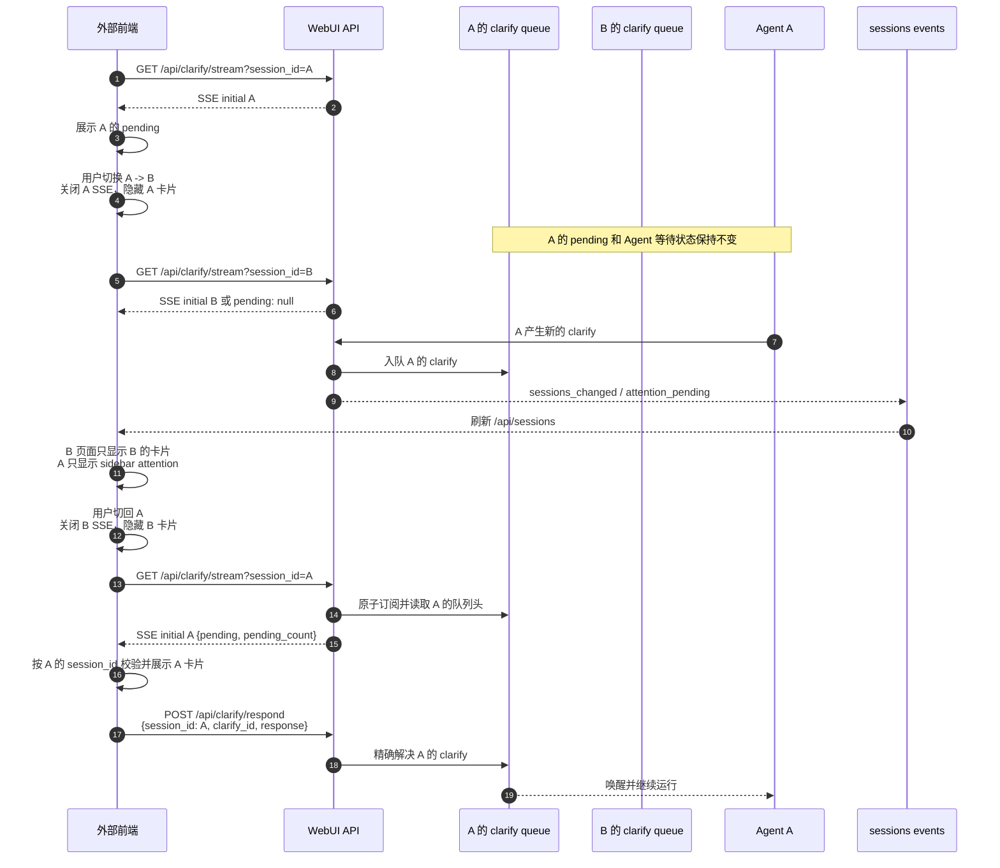

# 会话过程中 approval 与 clarify 事件交互逻辑

## 1. 文档定位

本文描述当前 WebUI 对会话中 approval 和 clarify 事件的实际处理方式，重点覆盖：

- Agent 如何产生待处理事件并桥接到 WebUI；
- WebUI 如何通过 SSE 和 fallback polling 观察事件；
- 用户如何提交 approval 或 clarify 响应；
- 切换会话时当前会话和目标会话分别发生什么；
- 待处理事件如何在后台会话、侧边栏和重新进入会话时保持可见；
- 当前实现的状态边界、生命周期清理和已知不对称点。

本文是当前代码行为说明，不是新的协议设计。未来 Runner / Adapter 协议以相关 RFC 为准。

相关设计文档：

- [运行适配器契约](../rfcs/hermes-run-adapter-contract.md)
- [WebUI 运行状态一致性契约](../rfcs/webui-run-state-consistency-contract.md)
- [稳定 Assistant Turn 锚点](../rfcs/stable-assistant-turn-anchors.md)
- [Live 到 Final Assistant 回复](../rfcs/live-to-final-assistant-replies.md)

## 2. 术语和状态边界

### 2.1 approval 和 approve

代码和接口使用 approval 作为事件名。用户在卡片上选择 once、session、always 或 deny，提交的是 approval response。approve 是业务含义，approval 是事件和接口术语。

### 2.2 clarify

clarify 表示 Agent 暂停当前执行，向用户询问一个问题或提供若干选项。用户提交 response 后，Agent 继续等待中的执行。

### 2.3 active

active 不是 approval 或 clarify 接口返回的字段。它是 WebUI 前端根据当前页面选择的 S.session.session_id 或 sid 推导出来的“当前正在展示的会话”。

因此，“只有当前会话是 active 时才显示卡片”实际表示：事件可以属于任意 session_id，但卡片只挂载到当前页面对应的会话；非当前会话的事件保存在按会话划分的缓存和后端 pending 队列中。

### 2.4 active_stream_id

active_stream_id 是会话数据中的运行流标识，用于恢复或重连聊天流。它和前端的 active 会话概念不同：

- active：当前用户正在查看哪个会话；
- active_stream_id：该会话当前或最近一次需要恢复的运行流。

切换会话主要改变前端 active；不会因为离开页面就自动解决 pending，也不会默认取消 Agent 运行。

## 3. 整体链路

一次待办事件通常经历下面的链路：

1. Agent 在某个 session_id 下触发 approval 或 clarify。
2. WebUI 后端回调把事件写入对应 session_id 的内存 pending 队列。
3. 后端通过专用事件 SSE 通知当前已订阅该 session_id 的浏览器；如果浏览器暂时未订阅，pending 仍保留。
4. 前端收到事件后先按 session_id 写入缓存，再判断该 session_id 是否是当前 active 会话。
5. 只有 active 会话渲染卡片；非 active 会话通过后端 pending、前端缓存和侧边栏 attention 保留可发现性。
6. 用户提交响应时，前端带上 session_id 和稳定的 approval_id 或 clarify_id。
7. 后端按 ID 精确解决对应队列项，并通知等待中的 Agent 继续执行。
8. 解决后的队列头和前端卡片分别清理；如果队列仍有下一项，下一项成为可见 pending。

## 3.1 Clarify 使用 SSE 的完整接口交互图

下面的图以 session-123 为例，展示外部前端如何订阅 clarify SSE、处理 initial 快照、接收后续 pending、提交用户回答，以及继续处理队列中的下一项。



图中的几个关键点：

- 建立 SSE 后，服务端先发送 initial，避免前端在订阅前已经存在 pending 时漏卡片；
- 每次响应只解决一个 clarify_id；如果队列还有问题，服务端通过下一条 clarify SSE 推送新的队列头；
- sessions_changed 只用于刷新会话列表和 attention，不包含完整问题内容；
- /api/clarify/pending 是 SSE 断线时的查询和校准接口，不是主要实时通道；
- 前端必须用事件中的 session_id 和 clarify_id 作为响应依据，不能用切换后的当前会话 ID 替代旧事件归属。

## 3.2 会话切换时的 SSE 交互图

下面的图描述用户从会话 A 切换到会话 B，再切回 A 时，浏览器连接和后端 pending 的变化。关闭 A 的 SSE 只停止浏览器观察，不会回答、取消或删除 A 的 pending。



## 3.3 SSE 事件报文示例

SSE 是按空行分隔的文本事件流。每个应用事件通常由 event 和 data 两行组成，data 的内容是 JSON；事件结束后有一个空行。前端使用 EventSource 订阅后，根据 event 名称注册处理函数。

### 3.3.1 Clarify 初始快照

请求：

```http
GET /api/clarify/stream?session_id=session-123 HTTP/1.1
Accept: text/event-stream
```

服务端建立连接后，先发送 initial。这个快照用于处理“前端刚建立连接前，后端已经存在 pending”的情况：

```text
event: initial
data: {"pending":{"session_id":"session-123","clarify_id":"clarify-456","question":"请选择部署环境","choices_offered":["测试环境","生产环境"]},"pending_count":1}

```

`initial` 的发送时机和次数如下：

- 每次成功建立一条新的 `/api/clarify/stream` SSE 连接，服务端都会立即发送一次 `initial`；
- 即使当前没有待处理问题，也会发送 `pending: null` 和 `pending_count: 0`；
- 同一条 SSE 连接不会周期性重复发送 `initial`，后续状态变化使用 `clarify` 事件；
- SSE 断线并重新建立连接后，会再次发送新的 `initial`，用于重新校准前端 cache 和卡片；
- SSE 连接失败后使用 `/api/clarify/pending` fallback polling 时，返回的是普通 JSON，不会产生 `initial` 事件；
- `/api/approval/stream` 的 `initial` 行为相同，但 `/api/sessions/events` 是例外，它只发送后续 `sessions_changed` 通知，不发送会话列表 initial 快照。

前端处理逻辑等价于：

```javascript
source.addEventListener("initial", (event) => {
  const data = JSON.parse(event.data);
  if (data.pending) {
    showClarifyForSession("session-123", data.pending);
  } else {
    clearClarifyForSession("session-123");
  }
});
```

### 3.3.2 Agent 新增 clarify

Agent 产生新的 clarify 后，服务端先把它放入 session-123 的队列，再通过同一个 SSE 连接发送队列头：

```text
event: clarify
data: {"pending":{"session_id":"session-123","clarify_id":"clarify-456","question":"请选择部署环境","choices_offered":["测试环境","生产环境"],"requested_at":1764043200,"timeout_seconds":120},"pending_count":1}

```

如果前端当前 active 的不是 session-123，仍然应该先按 session_id 保存或同步状态，但不能把卡片渲染到当前会话。

### 3.3.3 响应后推送下一条或清空

用户调用 POST /api/clarify/respond 成功后，后端会更新队列并继续发送 clarify 事件。

队列还有下一条时：

```text
event: clarify
data: {"pending":{"session_id":"session-123","clarify_id":"clarify-789","question":"请选择发布策略","choices_offered":["立即发布","定时发布"]},"pending_count":1}

```

队列已经为空时：

```text
event: clarify
data: {"pending":null,"pending_count":0}

```

前端收到 pending 为 null 后，只清理 session-123 自己的 cache 和卡片，不得清理其他会话的 prompt。

### 3.3.4 Keepalive

服务端没有业务事件时，会发送 SSE 注释行保持连接，浏览器不会触发业务事件监听：

```text
: keepalive

```

这类消息不需要解析，也不需要调用任何响应接口。

### 3.3.5 Approval 的对应事件

approval SSE 的结构与 clarify 类似，但事件名是 approval，pending 中携带 approval_id，响应时需要另外提交固定的 choice：

```text
event: initial
data: {"pending":{"session_id":"session-123","approval_id":"approval-111","description":"是否执行该命令？","command":"npm test"},"pending_count":1}

event: approval
data: {"pending":{"session_id":"session-123","approval_id":"approval-111","description":"是否执行该命令？","command":"npm test"},"pending_count":1}

```

对应的响应请求示例：

```http
POST /api/approval/respond HTTP/1.1
Content-Type: application/json

{"session_id":"session-123","approval_id":"approval-111","choice":"once"}
```

### 3.3.6 会话列表变更事件

/api/sessions/events 是全局会话列表失效通知 SSE。它不发送完整 clarify 或 approval 内容，只发送会话摘要可能已变化的通知：

```text
event: sessions_changed
data: {"type":"sessions_changed","version":42,"reason":"attention_pending","session_id":"session-123"}

```

前端收到后重新请求：

```http
GET /api/sessions HTTP/1.1
```

然后根据返回的 attention 更新 sidebar。这个接口当前不会像 approval/clarify 专用 SSE 一样主动发送 initial 会话列表快照；首次列表加载和 SSE 重连后的刷新由前端自己的会话列表加载逻辑负责。

### 3.3.7 事件处理对照表

| SSE event | 来源接口 | data 主要内容 | 前端动作 |
| --- | --- | --- | --- |
| initial | /api/clarify/stream、/api/approval/stream | 当前队列头和 pending_count | 用服务端快照校准 cache 和卡片 |
| clarify | /api/clarify/stream | clarify pending 或 pending: null | 展示下一条问题，或清理对应会话卡片 |
| approval | /api/approval/stream | approval pending 或 pending: null | 展示审批卡片，或清理对应会话卡片 |
| sessions_changed | /api/sessions/events | version、reason、可选 session_id | 重新 GET /api/sessions，更新 sidebar |
| 注释行 | 所有长连接 SSE | keepalive | 忽略，仅保持连接 |

## 4. 状态由谁拥有

| 状态 | 所有者 | 作用 | 会话切换时的处理 |
| --- | --- | --- | --- |
| Agent 等待中的 approval | Agent 运行上下文 + WebUI 后端 approval queue | 阻塞当前工具或运行，等待用户选择 | 保留，不因切换自动响应 |
| Agent 等待中的 clarify | Agent 运行上下文 + WebUI 后端 clarify queue | 阻塞当前执行，等待用户回答 | 保留，不因切换自动响应 |
| 后端 pending 队列 | WebUI 进程内，按 session_id 分桶 | 给 pending、SSE、响应接口提供一致视图 | 保留到解决、超时、取消或进程重启 |
| 专用 prompt SSE | 浏览器连接 | 观察一个 session_id 的 pending 变化 | 离开会话时关闭；回来时重新订阅并拿 initial snapshot |
| 前端 prompt cache | messages.js，按 session_id 保存 | 在页面切换和短暂断线时重新显示卡片 | 保留对应会话的缓存；只清理事件所属会话 |
| 当前卡片 DOM | 当前 active 会话 | 实际展示 approval 或 clarify | 切走隐藏；不能把旧会话卡片留在新会话下 |
| 聊天 live SSE | 浏览器连接 + stream token | 展示运行输出、完成、取消和错误 | 切换时关闭当前浏览器连接，后台运行不因此自动停止 |
| 侧边栏 attention | /api/sessions 派生字段 | 提醒某个会话存在 approval 或 clarify | 后端事件使 sessions_changed，侧边栏刷新 |

关键不变量是：事件的归属始终由 session_id 决定，卡片的显示归属始终由当前 active session 决定，提交响应时不能使用当前页面的 session_id 替代事件自身的 session_id。

## 5. 接口清单

### 5.1 运行聊天流

GET /api/chat/stream?stream_id=...

用于接收普通聊天输出以及运行生命周期事件。approval 和 clarify 在当前实现中也会通过运行流转发给当前连接，但待办卡片还有独立的 session 级 SSE，因此不能只依赖聊天流恢复 pending。

常见事件包括：

- approval：approval 待处理通知；
- clarify：clarify 待处理通知；
- done、cancel、error：运行结束或异常，触发对应 prompt 清理。

### 5.2 Approval 观察接口

GET /api/approval/stream?session_id=...

返回 text/event-stream：

- initial：建立订阅时原子返回当前 pending 和 pending_count；
- approval：后续 pending 变化；
- keepalive：保持连接。

GET /api/approval/pending?session_id=...

返回当前队列头和队列数量：

- pending：当前可响应的 approval，或 null；
- pending_count：该 session_id 下剩余 approval 数量。

### 5.3 Clarify 观察接口

GET /api/clarify/stream?session_id=...

返回 text/event-stream。initial 和后续 clarify 事件都携带 pending；当前实现同时带 pending_count，便于前端判断队列是否还有后续项。

GET /api/clarify/pending?session_id=...

返回当前 clarify 队列头；没有 pending 时返回 pending: null。

### 5.4 Approval 响应接口

POST /api/approval/respond

请求体至少包含：

- session_id：事件所属会话；
- choice：once、session、always 或 deny；
- approval_id：稳定事件 ID，推荐始终传递；
- choices：可选的客户端能力或展示信息。

后端优先按 approval_id 精确定位。choice 语义为：

- once：只允许当前调用；
- session：当前会话后续允许；
- always：当前会话允许并写入永久 allowlist；
- deny：拒绝当前调用。

正常响应包含 ok 和 choice。Gateway relay 场景还可能包含 relayed: true。若远端运行不可用、重复响应或 approval 已被其他路径解决，接口可能返回 409 等错误。

### 5.5 Clarify 响应接口

POST /api/clarify/respond

请求体包含：

- session_id：事件所属会话；
- response：用户答案或所选选项；
- clarify_id：稳定事件 ID，推荐始终传递。

后端按 clarify_id 精确解决对应 pending。找不到或已过期时返回 HTTP 409，并带 stale: true；成功时返回 ok: true 和 response。

### 5.6 会话列表和全局会话事件

GET /api/sessions

会话列表项包含派生的 attention：

- approval：该会话有待审批项，severity 为 critical；
- clarify：该会话有待澄清项，severity 为 question；
- 没有 pending 时不返回对应 attention。

GET /api/sessions/events

这是全局的会话列表变更通知 SSE，作用是告诉浏览器“会话列表或某个会话的摘要信息可能变了”，而不是传递某个待办事件的完整内容。

前端通过长连接订阅这个接口。后端在会话发生创建、删除、重命名、状态变化，或某个会话的 approval/clarify pending 数量变化时发布 sessions_changed。sessions.js 收到通知后会重新请求 /api/sessions，刷新侧边栏中的会话名称、运行状态和 attention 摘要；如果变更涉及当前 active 会话，还会触发当前会话相关的刷新逻辑。

这个接口的职责边界是：

- 只做会话列表和 sidebar attention 的失效通知，不返回完整 approval/clarify prompt；
- 不替代 /api/approval/stream 和 /api/clarify/stream，待办卡片仍需通过对应的 session 级 SSE 或 pending GET 获取；
- 不响应 approval 或 clarify，也不会改变 Agent 的等待状态；
- 它是全局订阅，不带某一个 session_id 的完整队列状态，因此前端收到通知后还需要通过 /api/sessions 重新拉取派生摘要。

## 6. 后端如何产生 approval 事件

### 6.1 回调注册

运行开始时，api/streaming.py 为当前 session_id 注册：

- approval gateway notify callback；
- clarify gateway notify callback。

approval callback 收到 approval_data 后会：

1. 尝试把 pending mirror 提交给 Gateway 状态层；
2. 计算或补充 pending_count；
3. 向当前聊天流写入 approval 事件。

clarify callback 直接向当前聊天流写入 clarify 事件。

运行结束时，两个 callback 都会注销；取消路径也会清理对应的 clarify pending。

### 6.2 approval pending 入队

api/route_approvals.py 的 submit_pending 将 approval 放入按 session_id 分组的队列：

1. 规范化和本地化 payload；
2. 补充稳定 approval_id；
3. 追加到该 session_id 的队列；
4. 队列头作为当前可见 pending；
5. 发送 approval SSE 通知；
6. 发布 attention_pending，使侧边栏能显示提醒。

多个 approval 同时存在时，前端当前只展示队列头。解决队列头后，后端会把下一项提升为 pending，并再次通知。

### 6.3 approval 等待和超时

approval 的默认等待时间是 300 秒，即 5 分钟。该值由 Agent 配置项 approvals.timeout 控制；未配置时使用 300 秒默认值。

这个超时是 Agent 等待用户决策的有效期，不是浏览器 SSE 连接超时。计时从 Agent 创建 approval 并进入等待开始；关闭 SSE、切换会话或重新建立 SSE 都不会重置计时。超时后 Agent 不再等待该 approval，前端应通过 pending: null、后续 SSE 或重新 GET 清理过期卡片。

## 7. 后端如何产生 clarify 事件

### 7.1 clarify pending 入队

api/clarify.py 的 submit_pending 将 clarify 放入按 session_id 分组的队列：

1. 补充请求时间和超时元数据；
2. 对仍未解决且语义相同的 prompt 做去重；
3. 分配稳定 clarify_id；
4. 追加到 session_id 队列；
5. 更新 legacy head map；
6. 通知 clarify SSE；
7. 发布 attention_pending。

当前队列头是浏览器可以响应的 clarify。后续项不会覆盖前一项。

### 7.2 Agent 等待和超时

clarify callback 创建等待 entry 后调用 submit_pending，然后等待 entry.event：

- 用户响应：resolve_clarify_by_id 写入结果并唤醒 Agent；
- 请求取消：清理 pending 并返回取消或默认路径；
- 超时：清理 pending 并返回默认 fallback 文本；
- 运行结束：注销回调并进行兜底清理。

因此，浏览器关闭卡片或切换会话并不等于 Agent 收到答案。只有响应接口、取消、超时或运行生命周期清理才会改变后端 pending 的拥有状态。

WebUI 本地 Agent / CLI 路径的 clarify 默认等待时间是 120 秒，即 2 分钟。WebUI bridge 和 Agent CLI 都从 clarify.timeout 读取，未配置或配置无效时回退到 120 秒。pending 通常会携带 timeout_seconds、requested_at 和 expires_at，前端应使用这些服务端字段计算展示倒计时，不要根据 SSE 建连时间自行推导有效期。

Hermes Gateway 路径使用另一套 clarify 等待逻辑：Agent 配置 agent.clarify_timeout 默认是 3600 秒，即 1 小时。该值由 Hermes Agent 的 tools/clarify_gateway.py 读取，并在 Gateway 运行中传给 wait_for_response。外部前端不能把本地 Agent 的 120 秒假设套用到 Gateway。

两条路径超时后都会结束 Agent 等待并走超时 fallback；WebUI 本地 pending 会由 bridge 清理并发送 pending: null。前端仍应以实际 SSE/接口状态为准。切换会话、关闭 SSE 和重新订阅都不会延长对应路径的等待时间。

## 8. 前端收到事件后的处理

### 8.1 来自聊天流的事件

static/messages.js 的聊天 SSE handler 收到 approval 或 clarify 后：

1. 从 payload 提取 session_id；
2. approval 事件先按 anchor 应用到运行状态，再进入 approval prompt 展示逻辑；
3. clarify 事件进入 clarify prompt 展示逻辑；
4. 通过 session_id 写入对应会话的 prompt cache；
5. 只有 prompt 所属 session_id 等于当前 S.session.session_id 时才渲染卡片；
6. 当前 active 会话才触发声音和浏览器通知。

如果事件属于后台会话，事件不会被错误地渲染到当前会话。

### 8.2 专用 prompt SSE

前端分别通过 startApprovalPolling(sid) 和 startClarifyPolling(sid) 建立 session 级 SSE。这里的 polling 是历史命名，首选传输实际是 SSE，连接异常时才 fallback 到定时 GET：

- approval fallback：约每 1500ms 请求 /api/approval/pending；
- clarify fallback：约每 3000ms 请求 /api/clarify/pending。

连接建立后的 initial snapshot 很重要：它可以恢复浏览器缓存中没有的 pending，也可以在切换回来时重新确认后端真实状态。

收到空 pending 时，只清理该事件所属 session 的缓存和卡片，不清理其他会话的 pending。

## 9. 用户响应 approval 的前端流程

当前流程如下：

1. 用户点击 approval 卡片上的按钮。
2. 前端从 approval 所属 session 和当前 approval_id 读取提交参数。
3. 禁用按钮，清空该 session 的本地 pending cache，并隐藏卡片。
4. POST /api/approval/respond，提交 session_id、choice、approval_id。
5. 后端按 ID 解决 pending，并唤醒 Agent。
6. 后端通过 approval SSE 推送队列变化；如果还有下一项，前端重新展示下一项。

当前实现是乐观隐藏：请求发出后卡片立即消失。网络失败时 catch 只记录状态，不会自动把原卡片恢复。因此审批响应失败时，需要依赖后续 SSE、fallback GET 或重新进入会话重新取回 pending；这也是当前可改进点。

## 10. 用户响应 clarify 的前端流程

1. 用户输入答案或选择选项。
2. 前端读取 clarify 所属 session_id 和 clarify_id。
3. 禁用输入和提交控件，保留 draft。
4. POST /api/clarify/respond。
5. 成功后仅当当前卡片仍对应同一个 clarify_id 时清除 cache 并隐藏卡片。
6. 如果响应对应当前 active 会话，前端会把一条临时 user message 加入当前消息列表，用于即时反馈。
7. 后端唤醒等待中的 Agent，后续输出继续通过聊天流到达。
8. 409 stale 时，前端恢复 draft，并提示该问题已过期或已被处理。

clarify 比 approval 更严格地检查 clarify_id，避免用户提交旧卡片时误伤已经替换的新问题。

## 11. 从会话 A 切换到会话 B

下面描述当前 loadSession(sid) 的实际顺序。假设切换前 A 是 active，B 是目标会话。

### 11.1 离开 A

切换动作首先做前端展示和连接层清理：

1. stopApprovalPolling：关闭 A 的 approval 专用 SSE/fallback polling。
2. 隐藏 approval 卡片。
3. stopClarifyPolling：关闭 A 的 clarify 专用 SSE/fallback polling。
4. 隐藏 clarify 卡片。
5. 保存 A 的 composer draft。
6. 如 A 有运行中的聊天流，保存 live DOM snapshot，并关闭 A 的浏览器聊天 SSE。
7. 将 A 标记为需要 reattach/replay 的进行中状态。
8. 切换 S.session，使 B 成为新的 active。

以上动作不会：

- POST approval/respond；
- POST clarify/respond；
- 调用 Agent cancel；
- 删除后端 pending；
- 把 A 的 pending 转移到 B。

所以 A 中正在等待 approval 或 clarify 的 Agent 仍然等待，直到 A 的用户稍后响应、运行超时、运行被取消或后端生命周期清理。

### 11.2 加载 B

加载 B 时，前端根据 B 是否有 active_stream_id 和运行状态决定是否恢复聊天流：

- 如果 B 正在运行或需要恢复：重新连接聊天流，并启动 approval 和 clarify 的 session 级观察；
- 如果 B 是空闲会话：当前代码路径明确启动 approval 观察，并在加载结束时统一重新渲染两类 cache；clarify 的专用观察启动依赖其他初始化或重新连接路径，和运行中分支并不完全对称。

这个不对称是当前实现细节，不代表后端不支持空闲会话的 clarify pending。后端 pending 和前端按会话缓存仍然存在，重新进入 B 时 initial snapshot 或 fallback GET 可以重新同步。

### 11.3 防止串卡

在 B 成为 active 后，A 的事件即使晚到，也会经过 session_id ownership guard：

- A 的事件写入 A cache；
- 不会渲染到 B 的卡片区域；
- 不会清理 B 的 approval 或 clarify；
- 只有切回 A 后，A 的 cache 或后端 initial snapshot 才会重新显示。

## 12. A 在后台产生事件时的处理

### 12.1 A 产生 approval 或 clarify

如果用户当前正在看 B，而 Agent A 随后产生 approval 或 clarify：

1. WebUI 后端按 A 的 session_id 入队；
2. A 的浏览器专用 prompt SSE 已在切换时关闭，因此当前页面通常不会实时收到 A 的专用 SSE；
3. 如果 A 的聊天流仍有其他观测路径，聊天流事件也只写入 A 的 cache，不挂到 B；
4. 后端发布 sessions_changed；
5. sessions.js 刷新 /api/sessions；
6. A 的 sidebar item 出现 attention；
7. 用户点击 A 后，重新建立 A 的 prompt SSE，initial snapshot 取回 pending；
8. A 的卡片在 ownership 校验通过后显示。

### 12.2 为什么后台事件不会丢

可靠来源不是浏览器某一次 SSE 消息，而是后端 session 级 pending queue。浏览器 SSE、fallback GET、前端 cache 和侧边栏 attention 都是观察层。只要后端进程和 pending 生命周期还在，切换页面不会解决或删除事件。

## 13. 从 B 切回 A

切回 A 时的恢复顺序是：

1. 停止 B 的 approval/clarify 观察并隐藏 B 卡片。
2. 请求 A 的 session 数据。
3. 如果 A 有进行中的 stream，重新 attach/replay 聊天流；运行恢复逻辑使用 stream token 和 journal/snapshot，避免只依赖浏览器旧 DOM。
4. 为 A 重新启动适用的 approval/clarify 观察。
5. 调用统一的 active prompt render：
   - A cache 有 pending：立即显示；
   - A cache 没有 pending：等待专用 SSE initial 或 fallback GET；
   - 后端已解决：收到 pending: null 后保持隐藏。
6. A 的聊天输出、approval、clarify 都通过 session ownership 检查后才写入当前页面。

因此，切回会话不是简单恢复旧 DOM，而是“缓存快速显示 + 后端 initial snapshot 校准 + live stream replay/reattach”三层合并。

## 14. 生命周期结束和异常场景

| 场景 | 后端 pending | Agent 等待 | 前端卡片 | 侧边栏 attention |
| --- | --- | --- | --- | --- |
| 用户成功响应 | 精确移除该 ID，必要时提升下一项 | 被唤醒继续运行 | 清理当前 ID，下一项可显示 | 刷新为剩余数量或清除 |
| 重复响应 | 不应再次解决；可能返回 stale/409 | 不重复唤醒 | 保留当前真实状态或等待同步 | 以服务端状态为准 |
| 用户切换会话 | 保留 | 继续等待 | 当前页面隐藏，cache 按会话保留 | 后台 attention 保留 |
| Agent cancel | 清理对应 pending | 取消等待 | terminal/cancel 路径清理所属卡片 | 清除或刷新 attention |
| clarify 超时 | 清理 pending | 返回默认 fallback | 空事件/后续同步清理卡片 | 清除或刷新 attention |
| 运行完成 | callback 注销并清理相关状态 | 不再等待 | done 路径清理 prompt | 刷新列表 |
| 网络断开 | 后端保持 pending | 继续等待 | SSE 重连或 fallback GET 恢复 | sessions SSE 恢复后刷新 |
| WebUI 进程重启 | 当前内存队列会丢失，除非由外部 Gateway/未来 Adapter 持久化 | 取决于运行托管方 | 浏览器 cache 不是权威来源 | 重新从服务端计算 |
| 响应提交后网络失败 | 服务端可能已成功，也可能未成功 | 取决于服务端 | approval 当前不会自动恢复卡片 | 后续同步最终收敛 |

## 15. 当前实现中的关键限制和风险

### 15.1 pending 主要是进程内状态

approval 和 clarify queue 当前由 WebUI 进程内结构维护。WebUI 重启后的可靠恢复依赖 Gateway mirror、运行适配器或未来持久化机制，不能把浏览器 cache 当作恢复方案。

### 15.2 approval 是乐观隐藏

approval 响应发出后立即隐藏卡片，网络错误不会直接恢复。后续 SSE、fallback 或重新进入会话可以校准，但失败反馈和即时恢复体验不完整。

### 15.3 三类观察源需要最终一致

同一 pending 可能同时从聊天流、专用 prompt SSE 和 fallback GET 进入前端。依靠 session_id、approval_id/clarify_id 和 ownership guard 去重和防串卡；不能只用“当前页面”判断事件归属。

### 15.4 空闲会话的 clarify 观察启动不对称

当前 loadSession 的运行中/恢复分支明确启动 approval 和 clarify 观察，空闲分支明确启动 approval 观察，但没有同样直接调用 startClarifyPolling。统一 prompt render 和后续初始化仍能依靠 cache、initial snapshot 或 fallback 重新同步，但这条路径值得后续补齐并增加回归测试。

### 15.5 事件 ID 是响应正确性的核心

只传 session_id 只能定位队列，不足以防止旧卡片、重复点击和队列头变化造成误响应。approval_id 和 clarify_id 应由前端从事件原样带回，后端按 ID 精确解决。

## 16. 代码入口和测试

后端：

- [api/streaming.py](../../api/streaming.py)：运行流、approval/clarify callback、生命周期清理。
- [api/route_approvals.py](../../api/route_approvals.py)：approval pending queue 和解决逻辑。
- [api/clarify.py](../../api/clarify.py)：clarify pending queue、ID 解决、SSE subscriber。
- [api/routes.py](../../api/routes.py)：pending、stream、respond、sessions 和 attention 接口。
- [api/session_events.py](../../api/session_events.py)：全局 sessions_changed 广播。

前端：

- [static/messages.js](../../static/messages.js)：聊天流事件、prompt cache、卡片 ownership、响应和专用 SSE。
- [static/sessions.js](../../static/sessions.js)：loadSession、会话切换、live stream 关闭/恢复、侧边栏 sessions SSE。

测试：

- [tests/test_approval_sse.py](../../tests/test_approval_sse.py)：approval SSE 和 initial snapshot。
- [tests/test_clarify_sse.py](../../tests/test_clarify_sse.py)：clarify SSE 和 initial snapshot。
- [tests/test_issue3668_prompt_card_reshow_on_switch.py](../../tests/test_issue3668_prompt_card_reshow_on_switch.py)：会话切换后 prompt cache 和卡片重新显示。
- [tests/test_1694_prompt_ownership.py](../../tests/test_1694_prompt_ownership.py)：事件归属、空状态清理和防串卡。

## 17. 一句话结论

切换会话只切换浏览器的观察和展示对象，不会自动回答、拒绝或取消原会话中的 approval/clarify；真正的权威状态仍在对应 session_id 的后端 pending queue，回到原会话时通过按会话 cache、专用 SSE initial snapshot 和 fallback GET 重新收敛，侧边栏 attention 负责提醒用户后台会话仍有待处理事件。
