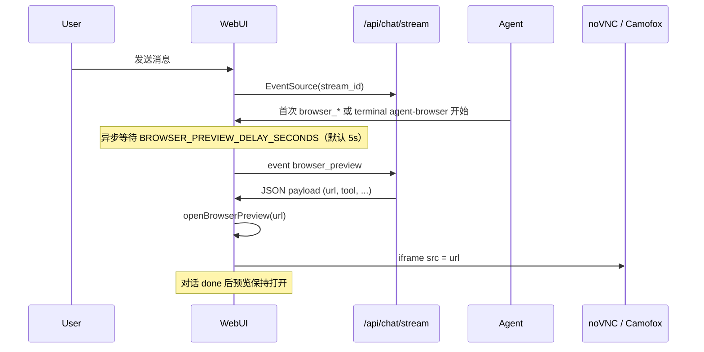

# Browser Preview SSE（`browser_preview`）

WebUI 在聊天流中推送 **`browser_preview`** SSE 事件，让前端在右侧工作区面板嵌入远程浏览器 / noVNC 预览，而不是打开新标签页。

---

## 传输通道

| 项目 | 说明 |
|------|------|
| 协议 | Server-Sent Events（SSE） |
| 连接 | `GET /api/chat/stream?stream_id={stream_id}` |
| 事件名 | `browser_preview` |
| 数据格式 | `event.data` 为 **JSON 字符串**，前端 `JSON.parse(e.data)` 即 payload |

示例（DevTools → Network → EventStream）：

```
event: browser_preview
data: {"session_id":"abc","stream_id":"xyz","url":"http://192.168.1.139:6080/vnc.html?path=websockify?token=user1","source":"camofox","tool":"browser_navigate"}
```

---

## 触发条件

1. 环境变量 **`BROWSER_PREVIEW_URL`** 已设置为合法的 `http://` 或 `https://` URL（可含 path、query）。
2. 当前 chat stream 中，**首次**出现下列任一浏览器相关工具开始执行：
   - 以 `browser_` 开头的工具调用（如 `browser_navigate`、`browser_click`）
   - `terminal` 工具且 `args.command` 在命令行开头或 `;` / `|` / `&&` / `||` 之后调用 `agent-browser` CLI（含 `npx agent-browser`、`npx -y agent-browser`、绝对路径形式）
3. 每个 stream **最多发送一次**（`BrowserPreviewEmitter` 去重）：`browser_*` 与 `terminal`+`agent-browser` **共用同一闸门**，先触发者生效，后续不再重复打开预览。

**不会**在 `/api/chat/start` 时发送；只在工具真正开始执行时发送。

仅取 WebSocket URL 的 `python3 -c "..."` 等不含 `agent-browser` 的 terminal 命令**不会**触发。

### 后端发射点

| 路径 | 文件 | 时机 |
|------|------|------|
| Legacy streaming | `api/streaming.py` | `on_tool` / `on_tool_start` 回调 |
| Gateway streaming | `api/gateway_chat.py` | `hermes.tool.progress` 翻译为 `tool` 事件时 |

相关实现：`api/browser_preview.py`。

---

## Payload 字段

| 字段 | 类型 | 说明 |
|------|------|------|
| `session_id` | string | 当前会话 ID |
| `stream_id` | string | 当前 chat stream ID |
| `url` | string | 嵌入 iframe 的完整预览地址（来自 `BROWSER_PREVIEW_URL`） |
| `source` | string | 固定为 `"camofox"` |
| `tool` | string | 触发本次事件的工具名，如 `browser_navigate`；terminal 路径为 `agent-browser <subcommand>`（如 `agent-browser connect`） |

若 `BROWSER_PREVIEW_URL` 未设置或无效，**不发送**该事件。

---

## 环境变量

### `BROWSER_PREVIEW_URL`（WebUI 预览，必填才发 SSE）

右侧面板 iframe 加载的地址。支持完整 URL（含 path、query）。

```bash
BROWSER_PREVIEW_URL=http://192.168.1.139:6080/vnc.html?path=websockify?token=user1
```

### `BROWSER_PREVIEW_DELAY_SECONDS`（SSE 延迟，可选）

首次 `browser_*` 工具开始后，**异步等待**指定秒数再推送 `browser_preview` SSE（不阻塞同 stream 的 `tool` 等其它事件）。默认 `5`；设为 `0` 表示立即发送。

```bash
BROWSER_PREVIEW_DELAY_SECONDS=5
```

### `CAMOFOX_URL`（Agent 浏览器控制，可选）

供 **Hermes Agent / Camofox** 连接远程浏览器使用，与 WebUI SSE **独立**。Agent 控制地址可以与 noVNC 页面地址不同：

```bash
# Agent 侧 Camofox 控制端口
CAMOFOX_URL=http://192.168.1.139:9377

# WebUI 右侧嵌入的 noVNC 页面
BROWSER_PREVIEW_URL=http://192.168.1.139:6080/vnc.html?path=websockify?token=user1
```

### CSP（iframe 嵌入）

WebUI 会自动把 `BROWSER_PREVIEW_URL` 的 origin 加入 CSP `frame-src`。

额外 origin 可通过：

```bash
HERMES_WEBUI_CSP_FRAME_EXTRA=https://other-host:6080
```

### 如何设置

在仓库根目录 `.env` 中写入（`start.sh` / `bootstrap.py` 会自动加载）：

```bash
cd /path/to/hermes-webui
cat >> .env <<'EOF'
BROWSER_PREVIEW_URL=http://192.168.1.139:6080/vnc.html?path=websockify?token=user1
EOF
```

修改后 **重启 WebUI**。

Docker 可在 `docker-compose.yml` 的 `environment:` 或同目录 `.env` 中配置同名变量。

---

## 前端行为

监听位置：`static/messages.js`（`attachLiveStream` 内）。

处理逻辑概要：

1. 校验 `session_id`、`stream_id` 与当前流一致。
2. 每个 stream 只处理一次（`_browserPreviewOpenedForStream`）。
3. 校验 `url` 为 `http://` 或 `https://`。
4. 调用 `openBrowserPreview(url, { tool })`（`static/workspace.js`）。

### UI 效果（`openBrowserPreview`）

- 打开右侧工作区面板，进入 **browser** 预览模式。
- 隐藏 Workspace 标题栏操作区、Files/Tasks 等标签页、文件树（保留关闭按钮）。
- 在 `#previewBrowserIframe` 中加载 `url`。
- 标题栏显示：`Browser (browser_navigate) — 192.168.1.139:6080`，或 terminal 路径下 `Browser (agent-browser connect) — …`。
- 提供 **Open in browser**，可在新标签打开同一 URL。
- 对话结束、文件树刷新（`loadDir`）时 **不会自动关闭**；需用户点击 **×** 关闭。

Run journal 回放：`browser_preview` 已纳入 cursor 事件列表，重连时可重放。

---

## 时序



---

## 集成 / 自定义客户端

若自行消费 SSE，可按同样契约处理：

```javascript
source.addEventListener('browser_preview', (e) => {
  const payload = JSON.parse(e.data || '{}');
  const { session_id, stream_id, url, tool } = payload;
  // 嵌入 iframe 或跳转 url
});
```

注意：

- 仅信任服务端下发的 `url`（来自 `BROWSER_PREVIEW_URL` 配置）。
- 每个 `stream_id` 建议只自动打开一次预览。
- 跨域 iframe 需页面 CSP 允许对应 `frame-src` origin。

---

## 相关文件

| 文件 | 作用 |
|------|------|
| `api/browser_preview.py` | URL 解析、payload 构造、一次性发射器 |
| `api/streaming.py` | Legacy 流式路径挂钩 |
| `api/gateway_chat.py` | Gateway 流式路径挂钩 |
| `api/helpers.py` | CSP `frame-src` 自动放行预览 origin |
| `static/messages.js` | SSE 监听与分发 |
| `static/workspace.js` | `openBrowserPreview` / 面板 UI |
| `static/index.html` | `#previewBrowserIframe` |
| `tests/test_browser_preview_sse.py` | 回归测试 |

更完整的聊天 / Gateway 配置见 [advanced-chat-setup.md](./advanced-chat-setup.md#browser-tool-preview-camofox--remote-vnc)。
