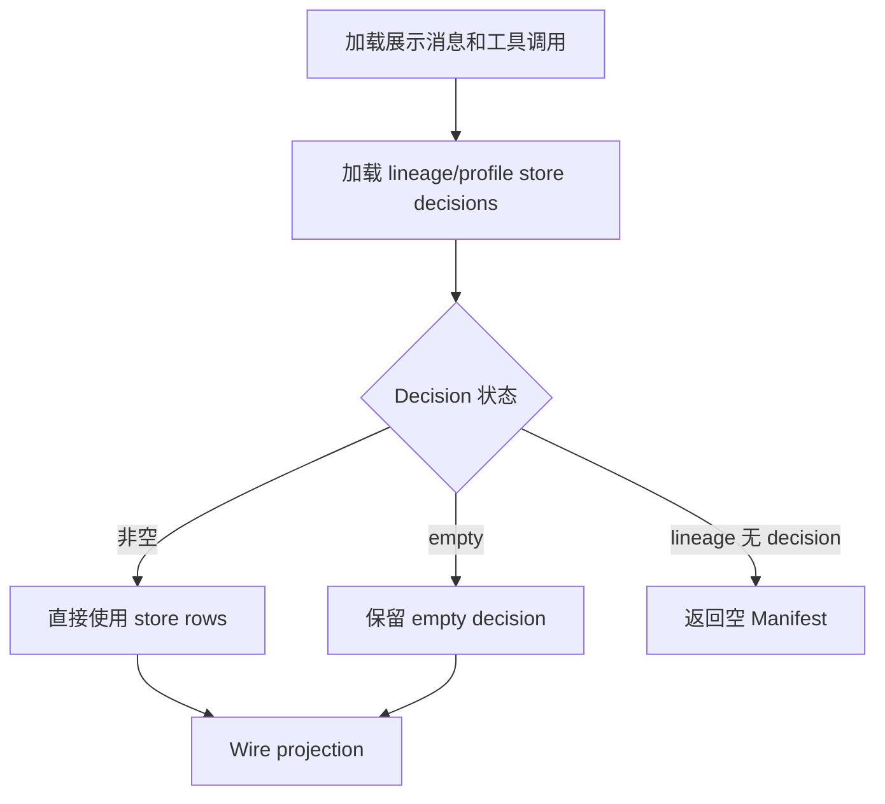

# Session Manifest Artifacts 实现

本文是 Artifacts 证据提取、路径安全、turn 归属、持久化、重生成替换与显式历史维护的唯一实现说明。所有 Artifact 入库资格和写入入口均以本文为准；对外资源语义、HTTP/SSE 字段和 wire 示例以 [Session Manifest HTTP/SSE 契约](../api/session-manifest-api.md) 为准。

实现入口：`integration/session_manifest/manifest.py`、`integration/session_manifest/final_paths.py`、`integration/session_manifest/store.py`、`integration/session_manifest/repair.py`、`api/session_ops.py`、`api/streaming.py`、`api/gateway_chat.py`，以及 Fork 的 `integration/session_manifest/external_references/`。

## 1. 状态层与不变量

Artifacts 的唯一权威持久化状态层是 `{HERMES_WEBUI_STATE_DIR}/session_manifest.db` 中的
`session_manifest_records`。Todos/references 从 transcript 派生。重生成不新增快照或 revision 表；若本次
开发过程曾创建实验性的 `session_manifest_revisions`，schema 初始化会删除该遗留表。

身份键：

```text
lineage_key + profile + workspace_root + turn_key + record_kind + path
```

核心不变量：

1. 工具事件和最终 assistant 提取必须限定在当前 turn slice。
2. 中间 assistant prose 不提取路径。
3. 不从 terminal stdout、目录列表、heredoc/Python 源码或任意 workspace 文件清单推断 Artifact；仅最终 assistant 明确点名的裸文件名可触发受控递归补全：workspace 根目录优先，否则选择修改时间最新的文件，最新时间并列时全部保留。
4. 非空 DB decision 是该 turn 的权威记录；普通结算时，同轮最终 assistant 明确列出且存在的文件会加入该 decision，重复路径按 `mutation > terminal > media > assistant_prose` 保留最高优先级来源。
5. Empty decision 可由同执行、明确归属原 turn 的迟到证据升级；历史数据只通过显式维护修复。
6. `GET /api/session/manifest` 是只读操作，不更新 artifact store、session recency 或 session-list 事件。
7. 同一稳定 `tool_call_id` 的重放不得跨 turn 重复归属。
8. 工具来源只接受成功 completed 事件；文件读取不产生 Artifact，也不否决最终回复中的有效路径。
9. `workspace_root=""` 是历史默认根别名：读取时映射到启动时的 `HERMES_WEBUI_DEFAULT_WORKSPACE`，不回填数据库；decision 与 artifact identity 必须按逻辑 root 隔离。


## 2. Decision-first 构建流程




`build_session_manifest()` 仍会派生 todos/references 和 turn 结构，但 artifacts 的最终权威来源遵循上图。

### 2.1 Decision 类型

- **非空 decision**：该 turn 至少有一条 `path != ""` 的 artifact row。
- **Empty decision**：该 turn 只有一条 `path = ""`、`preview = "file"`、`source_tool = "assistant_prose"` 的 marker；marker 不进入 wire。
- **无 decision**：当前 lineage/profile/逻辑 workspace root 没有任何 store row；GET 返回空 Manifest，不读取 transcript、tool calls 或 legacy sidecar 重建，也不写入 DB。


### 2.2 历史维护的触发时机

当前实现**不会自动执行 repair 或 backfill**：打开会话、`GET /api/session/manifest`、SSE、正常/Gateway
完成、error/cancel 结算均不会调用历史维护入口。仓库当前也没有将它们接入任何生产读取流程；只有维护
脚本或人工维护显式调用时才会执行。

一次显式 repair 只处理当前 session 的 lineage、profile 和逻辑 workspace root 范围内，且数据库
decision 恰好为 empty marker 的 turn。它重新从已完成 transcript、已结算工具调用和最后 assistant
消息提取该 turn 的 Artifact；提取结果仍须通过当前所有路径、安全和存在性 gate。

提取到至少一条有效 row 时，`replace_manifest_turn_records()` 按
`(lineage_key, profile, workspace_root, turn_key)` 在同一事务删除 marker 并写入真实 rows。已有非空
decision、其它 root 或未提取到有效成果的 empty turn 均不改动；因此同一次成功 repair 再执行会返回
`0`，是幂等操作。

`backfill_missing_manifest_records()` 也是显式维护操作，但范围不同：它只在当前逻辑 root 的整个 lineage
尚无任何 decision 时补历史记录。它先导入非空 Legacy `session.turn_artifacts`；Legacy 没有可写 rows 时，
再由 `backfill_session_artifacts()` 用当前共享提取规则逐 turn 重建，并为成功确认无成果的 turn 写 empty。
它不能替代 repair，也不会覆盖已有的 empty 或非空 decision。

`backfill_workspace_artifacts_from_sessions()` 是上述 transcript-derived backfill 的批量维护包装，只处理符合
条件的持久化 session。当前明确禁用服务启动时的自动调用；不得把保留在代码中的 helper 误解成自动入库流程。

`repair_contaminated_manifest_session()` 是另一条显式、单会话的完整历史重建入口：默认 dry-run，展示
`kept`、`added`、`removed`；只有显式 `--apply` 才会先备份数据库，再原子替换该会话范围内的 Artifact
rows。它不是 GET repair，也不由正常结算自动触发。

### 2.3 Store schema、范围与事务

每行保存 `session_id`、`lineage_key`、`profile`、`workspace_root`、`turn_key`、`record_kind`、`path`、
`preview`、`source_tool` 与创建/更新时间。SQLite 的唯一键是
`(lineage_key, profile, turn_key, record_kind, path, workspace_root)`。

`session_id` 用于当前会话清理；lineage/profile/root/turn 才是 Artifact decision 的隔离范围。不能只按
`path` 或 `turn_key` 查询、覆盖或修复记录。

`upsert_manifest_records()` 逐 path 写入或更新，不删除同 turn 的其它记录。`replace_manifest_turn_records()`
在一个事务中删除同一逻辑 root 的旧 decision，再插入 replacement rows；它用于 empty repair 和明确替换。

删除 session、裁剪 turn、rebind 和 repair 默认只改 SQLite 行。唯一例外是删除请求显式传入
`delete_artifacts=true` 后的会话删除：服务端仅按该会话 `preview=file` 的持久化 Artifact row，删除其
受信任 workspace root 下的普通文件；绝不删除绝对外部引用、skill、目录或 symlink。数据库启用 WAL 与 busy
timeout；写失败必须保留失败事实，不能改写为 empty decision。

## 3. Turn 与工具事件

### 3.1 破坏式重生成

`/api/session/retry` 与 `/api/session/truncate` 的 `regenerate: true` 分支按被选 assistant 所属的真实
user turn 定位边界，并在新执行启动前立即删除该 user turn 及其后全部 transcript、model context、
缓存 tool calls、Legacy `turn_artifacts`、异步委派 sidecar 和 `session_manifest_records`。若 API 指定较早
turn，较晚 turns 也永久删除，不保存或恢复后缀。

Session JSON 仅保存一次性 `pending_regenerate={turn_key,prompt_hash}`。下一次提交文本的 hash 匹配时，
消费 marker 并复用原 `turn_key`；不匹配时丢弃 marker，按普通新 turn 分配 key。该 marker 不是旧 Manifest
快照，也不保存成果、执行 ID 或被删历史。

重生成期间 GET 与 SSE 直接反映裁剪后的当前状态；旧成果不会继续显示。新执行在 normal、error 或 cancel
终态走普通结算：有有效证据则 upsert，无成果则写 empty decision。新执行失败、取消、刷新或服务重启均不
恢复旧 Manifest 或被删后续 turns。裁剪保存成功后删除 `Session.save()` 为本次 shrink 生成的 `.json.bak`，
避免启动恢复撤销这次主动历史重写。操作不删除磁盘成果文件；文件可仍存在于 workspace，但没有新的有效
入库证据就不会自动回到该会话 Manifest。

`_message_turns()` 以每条非 compression-marker 的 `role=user` 消息开启一轮：

```text
turn_key = user._turn_key 或 turn:<user_msg_idx>
```

每轮记录 `start_msg_idx` / `end_msg_idx`。`_tool_calls_for_turn()` 使用消息范围限制 `session.tool_calls`，避免 earlier turn 的写入路径污染当前轮。

`_collect_tool_events()` 将以下来源规范化为 `ToolEvent`。Mutation/read/terminal/skill/todo 等工具证据只有完成结果存在、`_tool_event_succeeded()` 确认 completed 且未报告失败后才解析其 args/result/diff；`skill_view` 还要求结果明确 `success: true`。调用 start、孤立 result、in-progress、取消、失败或非零 `exit_code` 均不产生 Manifest 证据。持久化 `session.tool_calls` 仅接受明确 `done: true` 且未标记失败的已结算 row，不能由前端展示层的 `done` 补值反推成功。

来源：

- assistant `tool_use` / `tool_calls` 与 `role=tool` 结果配对；
- `_partial_tool_calls`；
- `session.tool_calls`，通过 `assistant_msg_idx` 归属 turn。

以 `[CONTEXT COMPACTION — REFERENCE ONLY]` 开头的 assistant 消息不提供 artifact prose/media 证据。

### 3.2 Turn 绑定、结算与 orphan

当前 worker 结算前校验最新真实 user 的 `_turn_key` 与 `stream_turn_key`。带
`_hermes_message_class: internal_scaffold` 或 `context_anchor` 的 Agent 内部 user/assistant 行不是真实
turn 边界，必须跳过；最终未标记 assistant 仍归属前一个真实 user。

缺 key、key 冲突或 user 内容边界冲突时，不写 store record，也不创建 empty decision。normal、Gateway、
error 与 cancel 路径共用同一个结算入口；任何非 `persisted` 结果都会在 turn journal 记录
expected/actual key、stage 与 terminal reason。

异步委派或迟到工具结果必须携带其 origin turn 的明确 provenance，并写回 origin `turn_key`，不能归到结果
到达时的最新 turn。重生成后，旧执行 ID 或旧重生成版本绑定的异步结果一律拒绝，不能覆盖同 key 的新 decision。

历史 store record 若找不到同 key 的 user anchor，仍保留在顶层 `artifacts`，并把 key 暴露在
`diagnostics.orphan_turn_keys`；它不会进入正常 `turns[]`，因此不会产生错误的 per-turn chip。

`scripts/rebind_manifest_turn.py` 默认只报告命中的 lineage/profile/path 证据。确认映射后再增加
`--apply`；工具在单个 SQLite 事务中 upsert 新 key 并删除旧 key，重复路径由 store 唯一键合并。

## 4. Artifact 入库规则

### 4.1 入库判定总表

“能否成为 Artifact”与“同路径最终显示哪个 `source_tool`”是两件事。下表每一种正常证据来源都是独立的
资格入口；其中**当前 turn 最后一条真实、非空、非控制类 assistant message 中出现的有效文件路径，单独
就足以成为 Artifact**。它不要求同轮存在 mutation/terminal，也不受任何 read evidence 否决。来源优先级
只在多个有效来源命中同一 canonical path 时选择标签，不会撤销任何来源的入库资格。

| 证据来源 | 接受时机与路径来源 | 是否要求出现在末条 assistant | read evidence 的影响 | 统一路径/安全 gate | 持久化 `source_tool` | 可否独立形成非空 decision |
| --- | --- | --- | --- | --- | --- | --- |
| Workspace mutation | 当前 turn 的工具成功 completed；从结构化 path 参数或 diff 取路径。 | 否 | 无 | 文件须在结算时存在、可预览、非目录/`uploads/`/cruft；相对路径不得逃逸 workspace，外部绝对路径须通过策略。 | 实际 mutation 工具名 | 可以 |
| Terminal | 当前 turn 的 `terminal` 零退出；只取受控、静态可解析的输出操作数，不读 stdout。 | 否 | 无 | 同上；每次执行最多接受 32 个输出候选。 | `terminal` | 可以 |
| Media | 当前 turn 任一真实 assistant 的显式本地 `MEDIA:<path>`；远程 URL 不接受。 | 否 | 无 | workspace 内转相对路径；外部保留绝对路径并通过 media 登记/预览策略；目标须存在且可预览。 | `media` | 可以 |
| Final assistant | 只扫描当前 turn 最后一条真实、非空、非控制类 assistant message；取显式本地路径、Markdown 本地链接目标和可解析裸文件名。 | 是，这一行本身就是末条回复规则 | **无；read 不产生 Artifact，也不抑制本行** | 目标须当前存在、可预览、非目录/`uploads/`/cruft；相对路径限当前 workspace，外部绝对路径须通过策略。 | `assistant_prose` | **可以** |
| Skill mutation | 当前 turn 的 `skill_manage` mutation 或通用 mutation 成功写入真实 `SKILL.md`。 | 否 | 无 | 必须解析到当前 profile 下存在的 canonical skill；wire 使用 skill 名而非磁盘绝对路径。 | `skill_manage` 或实际 mutation 工具名 | 可以 |
| Legacy 显式 backfill | 仅当前逻辑 root 的整个 lineage 无任何 decision 时，人工调用 backfill 读取 `session.turn_artifacts`。 | 不适用 | 无 | Store 规范化 scope/source/preview；不扫描 workspace。历史 path 可先入库，GET/preview 再按当前 gate 输出正常或 `expired`。 | 保留旧值；缺失时为 `assistant_prose` | 可以，但只属于显式历史维护 |
| Transcript 显式 backfill | 上述范围无 decision 且没有 Legacy rows 时，或维护者直接调用 transcript backfill；逐 turn 复用当前共享提取器。 | Final assistant 来源仍只认各 turn 末条；其它来源按各自规则 | 无 | 与正常提取相同；只写当前仍存在、可预览的候选，并可为无候选 turn 写 empty。 | 按正常来源规则 | 可以，但只属于显式历史维护 |

除 Legacy 显式 backfill 外，所有候选都必须同时满足：证据属于准确 `turn_key`、来源达到自身成功/内容门槛、
canonical path 通过存在性与预览安全 gate、结算写入成功。正常完成、Gateway、error、cancel 共用同一套资格
语义；error/cancel 不会降低证据门槛，但成功确认没有候选时仍可写 empty decision。

用户消息、较早的普通 assistant prose、工具 start、失败/取消工具、读取工具、搜索命中、目录列表、terminal
stdout、普通 URL、Python/heredoc 源码与全 workspace 扫描都不能仅凭路径产生 Artifact。显式 repair、完整
污染重建和 rebind 只是维护既有资格判断或归属的写入操作，不是新的证据来源。

`write_file(path="reports/result.docx")` 是有效的相对工具参数。Agent 将它按当前
`session.workspace` 解析；Manifest 以实际解析后的路径决定相对或绝对入库表示。

### 4.2 会成为 Artifact 的文件示例

以下示例均假定对应来源已达到自身资格门槛、目标文件仍存在且可预览；外部绝对路径还须通过受保护路径策略。
`<workspace>` 是当前 session 的 workspace，`<sid>` 是当前 session id。


| 证据                   | 文件与结果                                                                                                         | 是否登记及持久化示例                                                          |
| -------------------- | ------------------------------------------------------------------------------------------------------------- | ------------------------------------------------------------------- |
| 成功 mutation          | `write_file(path="reports/报价单.docx")` 写入 `<workspace>/reports/报价单.docx`。                                      | 是；`path="reports/报价单.docx"`，`source_tool="write_file"`。             |
| 成功 terminal          | 零退出命令 `python chart.py --output /tmp/sales-chart.png`。                                                        | 是；`path="/tmp/sales-chart.png"`，`source_tool="terminal"`。           |
| 当前 turn 末条 assistant | 回复“已生成 `reports/总结.pdf`”，且该文件存在于 `<workspace>`。                                                               | 是；`path="reports/总结.pdf"`，`source_tool="assistant_prose"`。          |
| 当前 turn 末条 assistant | 回复“文件在 `/tmp/export/result.xlsx`”，且该外部文件通过策略。                                                                 | 是；`path="/tmp/export/result.xlsx"`，`source_tool="assistant_prose"`。 |
| 显式 `MEDIA:`          | assistant 消息为 `MEDIA:/tmp/preview.png`。                                                                       | 是；`path="/tmp/preview.png"`，`source_tool="media"`。                  |
| 会话附件或 memory         | 末条 assistant 或 `MEDIA:` 明确给出 `${STATE_DIR}/attachments/<sid>/input.pdf` 或 `${HERMES_HOME}/memories/brief.md`。 | 可以；作为对应 `assistant_prose` 或 `media` Artifact，并以绝对路径登记。              |


相对路径始终相对当前 session workspace；所以 `reports/总结.pdf` 不会到其它 session、下载目录或上轮
workspace 中寻找。外部路径不会移动、复制或改写，持久化 row 只记录其绝对路径和当前 turn 的证据来源。

以下情形不会仅因文件存在而成为 Artifact：用户上传了 `attachments/<sid>/input.pdf`、memory 中已有
`brief.md`、终端 stdout 列出了 `/tmp/result.pdf`、读取/搜索工具看到了该文件、较早 assistant 提到路径，
或末条 assistant 给出不存在/受保护/`uploads/` 下的路径。它们必须另有上表所列的有效产出或当前末条
assistant 证据；附件上传本身不会创建 Artifact row。

### 4.3 Mutation 工具

`ARTIFACT_MUTATION_TOOLS`：

```text
write_file
create_file
edit_file
patch
apply_patch
mcp_filesystem_write_file
mcp_filesystem_edit_file
```

结构化参数包括：

```text
path, file_path, target, destination, filename,
paths[], edits[].path
```

Diff 补充：

- Unified diff：`+++ b/path` / `--- a/path`
- ApplyPatch：`*** Add File:` / `*** Update File:`

Mutation 工具可以先形成内部记录；最终 wire 再判断是否可预览或是否有足够 provenance 输出 expired。

### 4.4 Skill artifacts

- `skill_manage` 仅接受 `action ∈ {create, edit, patch, write_file}`。
- 结果若有明确成功 path，优先使用结果 path。
- 通用 mutation 工具写入 profile skills 根下的 `.../SKILL.md` 也识别为 skill artifact。
- Wire path 是 canonical skill 名，不是磁盘绝对路径。
- Integration/SkillHub 不可用、skill 不存在或仍为 `in_progress` 时不输出正常预览行；有充分历史 provenance 时可输出 `expired`。


### 4.5 MEDIA:

`_MEDIA_TOKEN_RE` 只读取非 `internal_scaffold` / `context_anchor` assistant 消息中的显式 `MEDIA:`。
远程 URL 跳过。workspace 内 media 规范化为相对路径；workspace 外本地 media 保留绝对路径。

User 消息中的 MEDIA:、工具结果 JSON 的相似字段和普通 URL 都不作为 media artifact。

`media` 与外部直接引用的候选提取保持独立。已登记的绝对 media 行可复用既有只读 preview URL，
但不能因此成为 mutation/terminal 或 assistant prose 的外部直接引用证据。

### 4.6 最后一条 assistant

每个 turn 只扫描最后一条非空、非内部控制的真实 assistant 内容。`final_paths.py` 负责词法候选：

- 显式路径、引号/反引号包围的路径允许空格、无扩展名和单字符扩展名；普通无扩展名词不扫描。
- Markdown 链接只取本地目标，不扫描标签；远程链接与其标签均排除。
- 正文、表格和代码中的有效路径使用相同文件安全校验。

绝对路径可以在 session workspace 内或外：前者按 workspace 相对路径表示，后者保留绝对路径。含目录的相对路径仅在当前 workspace 解析。裸文件名先匹配根目录；根目录无文件时才受控递归查找，选择修改时间最新的全部并列普通文件，保留各自相对路径。无命中、遍历失败或超限时失败关闭，不借用其它轮证据补全。纯问答轮最终回复中的有效路径同样可成为 Artifact。

不依赖“已保存”“文件路径”等交付关键词。候选必须：

- 相对路径解析后位于 session workspace；绝对路径则通过外部直接引用策略；
- 当前真实存在且可预览；
- 不是 `uploads/` 输入文件；
- 不命中 `.git`、`node_modules`、缓存、构建目录等 cruft；
- 最终回复不设候选数量上限（terminal 的 32 个输出上限保持不变）；
- 裸文件名的递归查找不超过 4,096 个 workspace 条目，超过即整次 fallback 失败关闭；
- canonical path 去重。

正则必须同时通过四层边界：

1. **词法边界：** 前后只能是字符串边界、空白、引号、反引号、Markdown 分隔符或标点。`report.pdf附件`、
  `report.pdf.bak` 和 `abc/report.pdfx` 均不得截断匹配。
2. **路径边界：** 相对和裸文件名只在当前 `session.workspace` 解析，且结果仍在该目录。绝对路径可在外部，
  但必须通过外部直接引用策略。
3. **文件边界：** 候选必须是存在的普通文件，非目录、非 cruft、非 `uploads/`，并通过对应 preview gate。
4. **归属边界：** 候选只归当前 `turn_key`；读取证据不抑制最终回复路径。

因此最终回复表格中的 `报告.html` 可成为成果；不存在的 `摘要.md` 不会被推断补全。中间 assistant
即使写出绝对路径或“文件位置”也不产生 prose artifact。

### 4.7 Read evidence

`ARTIFACT_EXCLUSION_READ_TOOLS` 包含文件读取工具。读取工具本身不构成成果证据：

- 不进入顶层/per-turn references；
- 不进入 SSE 或 artifact store；
- 不从 stdout/result 猜路径；
- 不抑制同 turn、同 path 的 `assistant_prose` 候选；
- 不抑制 mutation、terminal、`MEDIA:` 或 skill mutation；
- 不跨 turn，稳定 tool-call replay 仍服从 turn owner。

因此 read→edit、edit→read、read→edit→read 均保留单一 mutation artifact；只有读取、但最终回复明确给出有效文件路径时，登记为 assistant_prose。

### 4.8 同路径去重与来源优先级

同一 turn 的 file Artifact 以规范化后的 canonical path 去重，wire/store 只保留一行；不会因为同一路径
被多次提及而产生多个 chip。


| 优先级 | 来源                        | 最终 `source_tool` 规则     |
| --- | ------------------------- | ----------------------- |
| 4   | `ARTIFACT_MUTATION_TOOLS`、`skill_manage` | 覆盖低优先级来源。 |
| 3   | `terminal` | 高于 media 和正文。 |
| 2   | `media` | 保留独立媒体来源。 |
| 1   | `assistant_prose` | 最终回复有效路径足以登记；优先级只影响来源标签。 |


相同优先级不会因为后一次命中改写主来源。该规则只决定显示/持久化的 `source_tool`，不会把 read
evidence、搜索结果或 stdout 提升为 Artifact 证据。

### 4.9 Terminal

`terminal` 不是通用 mutation 工具。调用/start 事件只提供结构化 `args.command`；必须与同一 `tool_call_id` / `tool_use_id` 的完成结果配对，且 `_execution_event_succeeded()` 确认成功后，`_terminal_output_paths()` 才解析：

```text
-o PATH
--output PATH
--output=PATH
cp SOURCE DEST
cp -- SOURCE DEST
python .../md2word.py INPUT OUTPUT [options]
```

`cp` 只接受单 source、单 destination，且只登记 destination；recursive、选项、多 source、变量和 glob 均拒绝。静态绝对 destination 可以是 workspace 外的直接引用，但仍须通过第 5 节的外部路径策略和安全打开。最后一种位置参数规则只适用于脚本 basename 精确为 `md2word.py` 的 Python 调用；不会推广为未知 CLI 的通用“最后一个参数即输出”规则。

支持受控 `cd DIR && ...` 的命令本地目录。拒绝：

- 变量、命令替换、通配符；
- 多行 heredoc 和嵌入源码；
- 动态/歧义 shell 路径；
- 不存在、目录、cruft 或不可预览文件。

不会扫描 stdout、`ls` 列表、`cat` 输入、Python `open()` 源码或 workspace 快照。

## 5. 路径规范化与安全


### 5.1 默认 workspace 与 Artifact 根

`session.workspace` 是未指定目标时的默认写入目录；普通 file artifact 的资格根则由唯一入口 `artifact_workspace_root_for_session(session)` 决定：当 session workspace 位于运行时 `DEFAULT_WORKSPACE` 下时使用该默认根，否则使用 session 自身根。该值必须贯穿 tool-complete SSE、turn reconcile、持久化、GET projection 与 preview，避免“流中可见、刷新后消失”。

用户显式指定的绝对路径不因此被拒绝写入。位于 Artifact 根内的文件仍是普通 workspace artifact；位于根外、且来源属于允许的成功 mutation/terminal 或最终 assistant prose 时，是外部直接引用。两者都沿用同一 store identity，`workspace_root` 仍是会话 Artifact 根而不是外部文件目录，公开 wire 不新增字段。

所有候选先经 `_resolve_manifest_path(workspace, raw)`：

1. 清理引号和无效形态；
2. 排除 `ARTIFACT_IGNORE_RE`；
3. 相对路径使用 `(workspace / path).resolve()`；
4. workspace 内候选输出 POSIX 相对路径；workspace 外绝对候选保留规范化后的绝对路径。

外部直接引用的登记和预览都调用 `external_references.policy`。路径先作词法绝对化，但不解析
symlink；随后从 `/` 开始逐组件 `O_NOFOLLOW` 打开并验证普通文件。每次 preview 都从这次已打开的 fd
返回字节，不能在验证后按 pathname 重新打开。

策略拒绝 `.git`、`.hg`、`.svn`、依赖/缓存/构建目录、`uploads/`，以及 `.env`、`auth.json`、
`config.*`、`state.db`、token/key 等敏感 basename。它也拒绝系统根、`~/.ssh`、`~/.gnupg`。

受保护状态目录按当前 `HERMES_HOME`、`~/.hermes`、`HERMES_WEBUI_STATE_DIR` 与默认 Hermes Home 展开。
其中的 `sessions`、`cron`、`logs`、`checkpoints`、`backups` 及其 `webui_state` 对应目录都不能预览。

聊天附件根（`HERMES_WEBUI_ATTACHMENT_DIR/<session_id>/`，默认 `STATE_DIR/attachments/<session_id>/`）与
`HERMES_HOME/memories/` 不在状态目录硬拒绝列表中。它们仍只能由精确持久化 Artifact row 授权，
不会被枚举，上传也不会自动成为 Artifact。

项目自身恰好名为 `sessions` 的目录不会仅因 basename 被拒绝。任意绝对路径请求都必须先命中精确 row，
再通过上述策略和 fd 校验；不能凭知道路径直接读取文件。

`_artifact_path_is_real()` / wire preview helpers 负责：

- 文件存在且不是目录；
- 非 cruft；
- skill `SKILL.md` 存在；
- integration/preview backend 可用。

外部引用是活链接：内容修改或同名替换后继续读取当前安全版本；仅文件不存在、不再是普通文件、成为 symlink 或命中拒绝策略时，在 GET 投影为 `status: "expired"`，预览接口不返回字节。系统不复制、移动、哈希或为此新增 SQLite 字段。

### 5.2 路径、数据库行与 preview URL 示例

以下示例中的 `<sid>`、`<turn>` 和根目录仅说明表示方式。`workspace_root` 始终是会话的 Artifact 根，
不是外部文件的父目录。


| 文件来源                 | 持久化 `workspace_root` / `path`                              | wire `path` 与授权                                                      |
| -------------------- | ---------------------------------------------------------- | -------------------------------------------------------------------- |
| managed workspace 文件 | `/workspaces` / `sessions/<sid>/exports/report.docx`       | `sessions/<sid>/exports/report.docx`；按 integration workspace 相对路径预览。 |
| 外部工具输出               | `/workspaces` / `/tmp/report.docx`                         | `/tmp/report.docx`；必须有精确已登记 row。                                     |
| 会话附件                 | `/workspaces` / `${STATE_DIR}/attachments/<sid>/input.pdf` | 绝对路径；上传本身不建 row，已登记 row 才可读。                                         |
| Agent memory         | `/workspaces` / `${HERMES_HOME}/memories/summary.md`       | 绝对路径；必须有精确已登记 row。                                                   |
| 外部 `MEDIA:`          | `/workspaces` / `/tmp/chart.pdf`                           | 绝对路径；保留 `source_tool=media`，但已登记 row 可预览。                            |


相对 Artifact 的 URL 仍是 `GET /api/integration/workspace/file?path=<integration-root-relative-path>`。
绝对行也复用该 URL，但 `path` 保持绝对；不会附加 session、profile 或 workspace-root 参数。

#### 5.2.1 完整数据库行示例

假设 managed session 的 `session.workspace` 为 `/workspaces/sessions/<sid>`，而默认 Artifact 根为
`/workspaces`。以下是同一 turn 的两个 `session_manifest_records` 示例；`id` 和时间戳仅为说明。

```text
id:             42
session_id:     "<sid>"
lineage_key:    "<lineage>"
profile:        "default"
workspace_root: "/workspaces"
turn_key:       "turn:12"
record_kind:    "artifact"
path:           "/tmp/monthly-report.docx"
preview:        "file"
source_tool:    "write_file"
created_at:     1787460612.123
updated_at:     1787460612.123
```

上例的 `path` 是外部源文件本身；`workspace_root` 不是 `/tmp`，而是该 session 原本的 Artifact 根。
预览 URL 是 `GET /api/integration/workspace/file?path=/tmp/monthly-report.docx`。

```text
id:             43
session_id:     "<sid>"
lineage_key:    "<lineage>"
profile:        "default"
workspace_root: "/workspaces"
turn_key:       "turn:12"
record_kind:    "artifact"
path:           "sessions/<sid>/exports/summary.docx"
preview:        "file"
source_tool:    "write_file"
created_at:     1787460613.456
updated_at:     1787460613.456
```

第二行的实际文件是 `/workspaces/sessions/<sid>/exports/summary.docx`；它继续使用相对路径分支。
两行表结构和唯一键相同，区别仅在 `path` 是相对路径还是原始绝对路径。

### 5.3 Preview 授权矩阵


| wire path / 来源      | 预览前必须满足                                                                          | 读取方式          | 失败结果                            |
| ------------------- | -------------------------------------------------------------------------------- | ------------- | ------------------------------- |
| workspace 相对 path   | 可投影到 integration root、目标是普通非 cruft 文件                                            | 既有相对路径分支      | 不输出或 404。                       |
| 外部直接引用              | 精确持久化 Artifact row、允许来源、路径策略与无跟随 fd 成功                                           | 绝对路径分支        | Manifest 为 `expired`；HTTP 404。  |
| 绝对 `media` Artifact | 精确持久化 `record_kind=artifact`、`preview=file`、`source_tool=media` 行，路径策略与无跟随 fd 成功 | 同一绝对路径分支      | Manifest 为 `expired`；HTTP 404。  |
| skill               | canonical skill 存在且 SkillHub preview 可用                                          | skill preview | 有 provenance 时 `expired`，否则不输出。 |


`is_external_artifact_reference()` 只定义外部直接引用的来源资格，故意不把 `media` 归入其中。
`is_registered_external_preview_reference()` 只用于绝对路径 preview 查询，额外允许精确已登记的 `media` 行。

前者仅接受绝对 `path` 加以下 `source_tool`：文件 mutation 工具、`terminal` 或
`assistant_prose`。后者还要求 `record_kind="artifact"` 与 `preview="file"`；只有在这两个条件
满足时，`source_tool="media"` 才能使用绝对路径 preview 分支。

因此 `MEDIA:` 不会因为预览支持而获得外部 Artifact 的候选提取资格。反过来，任意请求提交一个附件、memory
或 media 绝对路径，也不会绕过精确 row 查询、路径策略和无跟随 fd 检查。

文件字节由既有 `_serve_file_bytes()` 流式返回，支持 Range；绝对 Artifact 使用 `no-store`。HTML 预览遵循
既有 sandbox/CSP，SVG 等危险格式沿用现有下载/响应策略。本模块不另设内容副本、哈希或独立大小阈值。

绝对路径不会出现在 `/api/integration/workspace/files` 的枚举结果中，也不能传给 workspace 的保存、删除、
重命名、上传或 Git mutation 接口。前端将绝对 Artifact 视为只读，只复用同一 GET URL 做预览或下载。

### 5.4 绝对路径的入库与预览流程

```text
成功工具输出或末条 assistant 路径
  -> 规范化并判定 workspace 内/外
  -> workspace 外：路径策略 + 无跟随 fd + 普通文件确认
  -> transcript durable 后写入当前 turn 的 Artifact decision
  -> GET Manifest 从持久化 row 投影绝对 path
  -> GET /api/integration/workspace/file?path=<absolute-path>
  -> 精确 row 查询 + 再次安全打开同一 fd + 返回字节
```

外部候选在 store 写入成功前不获得绝对路径 preview 能力。GET 只验证当前记录和当前文件，不 backfill、
目录扫描、模糊匹配或修复记录；校验失败时不回显源路径细节。

源文件删除、改名、替换为 symlink、变为非常规文件或后来命中拒绝策略时，Manifest 保留原 path 并标记
`expired`。内容修改或同名普通文件替换则继续预览当前版本；系统不会创建快照或比对摘要。

搜索命中、目录列表、只读工具、workspace 全量扫描、相似字段和跨字段补全均不产生 Artifact。成功 read
工具既不提供成果资格，也不否决其它来源：同一 turn 的末条 assistant 只要明确给出通过全部 gate 的有效
路径，该路径仍以 `assistant_prose` 入库；若同路径另有 mutation/terminal/media 证据，只按第 4.8 节选择
更高优先级的 `source_tool`。

### 5.5 源文件与 record 的生命周期

Manifest 默认只拥有 SQLite row，不拥有源文件。裁剪 turn、`rebind`、empty repair 或
`replace_manifest_turn_records()` 都只插入、更新或删除 record；会话删除也默认如此。仅当
`delete_artifacts=true` 时，会话删除会在移除 record 前，按持久化 `preview=file` row 安全删除其
workspace 内的普通成果文件；workspace 外部引用、附件、memory、skill、目录和 symlink 一律保留。

外部 row 是活引用：删除、改名、权限变化、成为 symlink/非常规文件或后来命中安全策略时，GET 保留
历史 path 并投影 `expired`，preview 不返回字节。内容修改或同名普通文件替换不触发过期，preview 读取
当前安全版本。

历史 `backfill` 不根据任意外部路径重建 Artifact。它只使用已有 Legacy 证据且受 decision-first 范围
限制，不能将扫描、目录枚举或猜测出的外部文件写入 store。

## 6. 持久化


### 6.1 正常 turn 结算

正常流式完成顺序：

```text
final assistant 已进入 s.messages
→ 当前 user._turn_key 与 stream/SSE key 一致
→ s.save() 持久化 transcript
→ _persist_turn_artifact_paths(stream_turn_key) 合并 stream-owned 工具证据与同轮最终 assistant 的真实文件
→ upsert_manifest_records()
→ completed journal event
```

先保存 transcript，确保 artifact/empty decision 不会先于其证据 durable。无成果时写 empty decision；提取或 store 写入失败会作为可观测的持久化失败处理，不能被伪装为 empty decision 或已完成 turn。

`STREAM_LIVE_MANIFEST[stream_id].artifacts` 是面向 SSE 的会话级累计快照，不能用于判定当前 turn
归属。结算只能读取 `turns[]` 中 `turn_key` 精确匹配的 Artifact；找不到匹配 turn 时，live 证据是未知，
不能把顶层历史行默认绑定到待结算 key。normal、error 与 cancel 都会再合并已持久化 transcript 的同轮
证据，以恢复“工具已成功并写入 transcript，但 live delta 在中断前未发布”的成果。

首次结算会将合并后的 stream 和 transcript 证据统一通过存在性与预览 gate 后再写入 store。因此同一轮内已经删除、改名或变得不可预览的候选不会形成 artifact record；若无其它候选，该 turn 写 empty decision，避免后续显式 empty repair 从已失效证据回填。该 gate 不解析或推断重命名目标，例如 `mv old.jpg new.png` 不会自动把 `new.png` 登记为成果。

Store row 最小字段：

```text
session_id, lineage_key, profile, workspace_root, turn_key, record_kind,
path, preview, source_tool, created_at, updated_at
```

Profile 只来自 `session.profile`，缺失写空字符串；不从 active profile、parent、workspace 或 path 推断。

Legacy `session.turn_artifacts` 不再是新会话写入目标，只在显式 backfill 操作且当前逻辑 root 的 lineage
完全无 decision 时作为输入。Manifest GET 不读取它，也绝不将其回填至 store。Legacy 空 source
规范化为 `assistant_prose`，不伪装成写入工具。

### 6.2 结算生命周期矩阵


| 写入入口 / 生命周期 | Artifact 写入规则 | 更新方式 | 失败或空结果语义 |
| --- | --- | --- | --- |
| 成功 `tool_complete` | 只形成当前 origin turn 的内存候选和乐观 delta；尚不是 DB decision。 | 不写 DB | 未完成、失败、取消或非零 exit code 不产生证据。 |
| normal / Gateway 终态结算 | transcript durable 后，共用 settlement 合并当前 turn 的 stream 与 transcript 证据，并重新执行存在性/安全 gate。 | 对同 turn `upsert`；同路径按来源优先级归并 | 成功确认无候选时写 empty；turn owner/key 不可信、提取失败或写库失败时不写 empty。 |
| error / cancel 终态结算 | 与正常完成使用完全相同的归属、资格、过滤和持久化规则，只保留终态前已经成功的证据。 | 对同 turn `upsert` | 成功确认无有效证据时可以写 empty；只有提取/持久化失败不能伪装成 empty，journal 同时记录 terminal reason。 |
| 同执行迟到成功证据 | 必须仍能明确绑定 origin turn；可补充已结算 decision。 | `upsert`，非空证据会移除同 turn 的 empty marker | 无可靠 origin 或执行已失效时拒绝。 |
| 异步委派结果 | 按显式 provenance 写回 origin turn，不按到达时的最新 turn。重生成准备时删除目标及后续 turn 的委派 sidecar。 | 与普通同执行结算一致 | origin record 已删除或不可信时拒绝。此简化方案不另建持久化 revision fence。 |
| 重生成准备 | 立即删除目标 user turn 及后续 transcript/context/tool calls、委派 sidecar 和 Artifact rows；磁盘成果文件保留。 | Session JSON 裁剪 + 删除 `session_manifest_records` + 清除 shrink `.json.bak` | 不保存旧快照；失败、取消、刷新或重启均不回滚。 |
| 重生成终态 | 匹配一次性 prompt marker 时复用原 turn key，并按普通终态规则重新提取。 | 普通 `upsert`；无成果写 empty | 不恢复较晚 turns；写入失败也不恢复旧 Manifest。 |
| `done` 后刷新 / 重启恢复 | GET 只从当前 lineage/profile/root 的 DB decision 投影。 | 只读 | 不从 transcript 自动 repair；外部文件失效时显示 `expired`。 |
| `repair_empty_manifest_turns()` | 只重新检查当前会话范围内的 empty turns。 | 有有效结果才原子 `replace` marker | 非空 decision、其它 root、仍为空的 turn 不改动；仅显式调用。 |
| `repair_contaminated_manifest_session()` | 从完整 transcript 重建指定单会话，可增加、保留或移除 rows。 | 默认 dry-run；`--apply` 先备份再原子替换 | 拒绝共享 lineage、未知 turn、并发变化；GET 不触发。 |
| `backfill_missing_manifest_records()` | 仅 lineage/root 完全没有任何 decision 时：优先导入 Legacy rows；没有 Legacy rows 再按 transcript 共享规则逐 turn 重建。 | 一次性写入 SQLite | 已有任一 empty/非空 decision 即整项跳过；GET 不触发。 |
| `backfill_session_artifacts()` / workspace 批量包装 | 显式从 transcript 逐 turn 派生；批量包装只选择符合条件的持久化 session。 | 非空候选和成功确认的 empty decision 均可写入 | 只要当前 scope 已有任一 decision 就跳过；服务启动自动调用已禁用。 |
| `rebind_manifest_turn_records()` | 仅按人工明确给出的 old key → new key 修正归属。 | 单事务 upsert 新 key 并删除旧 key | 不猜测相邻 turn、内容相似度或时间关系；不移动源文件。 |


外部绝对路径不会进入 upsert 前的预览能力。只有 store 写入成功后的 GET 才能将它作为可点击的 file
Artifact 返回；这避免 SSE 临时候选成为任意文件读取许可。

### 6.3 Empty、repair、backfill 与 rebind

empty decision 表示“该 root 下的该 turn 已结算且没有可持久化 Artifact”，不是错误的替代状态。
正常结算的提取/写入失败必须显式暴露；只有成功确认无候选时才可写 empty marker。

`repair_empty_manifest_turns()` 只读取 empty turns 的完整证据，并以原子 replace 将 marker 换成真实 rows。
`backfill_missing_manifest_records()`、`backfill_session_artifacts()` 及 workspace 批量包装只在当前逻辑
root 的 lineage 没有任何 decision 时运行，避免混入半迁移历史。

`rebind_manifest_turn_records()` 只接受明确 old key → new key 映射。它不根据相邻编号、文本相似度或时间戳
猜测归属，也不会移动 workspace 或外部源文件。

`repair_contaminated_manifest_session()` 用于已经发生跨 turn 污染的单会话重建。它要求完整 transcript、
稳定 `_turn_key`、会话自有 lineage、精确 profile 与逻辑 workspace root；默认 dry-run，并拒绝未知 turn、
共享 lineage 或并发变化。`--apply` 会先用 SQLite backup API 创建一致性备份，再在一个事务中只替换该
会话范围的 Artifact rows，最后按完整 row identity 复核；它不会删除或改写成果文件。

```bash
python3 scripts/repair_contaminated_manifest_session.py --session-id <session_id>
python3 scripts/repair_contaminated_manifest_session.py --session-id <session_id> --apply
```

应用前必须先部署包含归属修复的服务版本并确认目标会话没有活跃 stream，否则旧进程仍可能再次写入污染
记录。预演输出应人工核对每轮 `kept`、`added`、`removed` 后再应用。

### 6.4 Legacy `session.turn_artifacts`

`session.turn_artifacts` 是旧版 session JSON 中按 `turn_key` 保存 Artifact 的字段。每个 turn 的值是
路径字符串或包含 `path`、`source_tool`、`preview` 的历史 entry；它存在是为了迁移旧会话，不是当前
Manifest store 的第二份权威数据。

只有显式调用 `backfill_missing_manifest_records()`，并且该 session 的 lineage 在当前逻辑 workspace root
下没有任何 SQLite Artifact decision 时，系统才读取这个字段并写入新的 store rows。字符串 entry 和缺失的
`source_tool` 会规范化为 `assistant_prose`；历史 `source_tool` 与合法 `preview` 尽量保留。Legacy row 的
写入不证明文件当前仍有效；GET/preview 会执行现行路径和安全 gate，不可用但有 provenance 的 row 可显示为
`expired`。

只要 SQLite 已有任一 empty 或非空 decision，Legacy 数据即被忽略，避免旧字段向已结算的历史混入成果。
正常 turn 结算只写 SQLite；`GET /api/session/manifest` 只投影 SQLite，既不读取也不回填该字段。

示例：旧 session JSON 可能仍含如下字段：

```json
{
  "turn_artifacts": {
    "turn:12": [
      "exports/brief.md",
      {"path": "exports/chart.png", "source_tool": "terminal", "preview": "file"}
    ]
  }
}
```

若当前 lineage/root 没有任何 SQLite decision，显式 backfill 会写入 `turn:12` 的两条 Artifact row：
`exports/brief.md` 的 `source_tool` 为 `assistant_prose`，`exports/chart.png` 保持 `terminal`。之后 GET
只读取这两条 SQLite row，不再读取上述 JSON 字段。

反例：若同一 lineage/root 已有任一 decision，例如 `turn:8` 的 empty marker，显式 backfill 直接跳过，
不会把 `turn:12` 的旧字段补进数据库。这样已有数据库决策始终是该范围内的唯一权威来源。

若 lineage/root 无 decision 且 `session.turn_artifacts` 没有非空 rows，`backfill_missing_manifest_records()`
才回退到 `backfill_session_artifacts()`，按本文正常证据规则从 transcript 逐 turn 派生；这一回退仍是显式
维护，不会由 GET、SSE 或服务启动自动执行。

## 7. 对外投影边界

本模块只决定候选能否投影，不定义对外 JSON。`preview=file` 接受可预览的 workspace file、已登记且当前安全的外部直接引用，或允许的 media；`preview=skill` 仅接受可预览 canonical skill。外部绝对路径只会在持久化 row 存在后进入 wire，随后通过既有 `GET /api/integration/workspace/file?path=...` 预览；该 URL 的绝对路径分支只查精确登记记录并用同一 fd 读取。绝对 `media` Artifact 同样可走该只读 preview 分支，但只扩展预览授权，不改变 `MEDIA:` 的独立证据、生成与去重规则。历史证据存在但目标已不可预览时可投影为 expired；结算前已失效或没有 provenance 的候选一律不输出。字段、去重优先级和 SSE 帧均以 [Session Manifest HTTP/SSE 契约](../api/session-manifest-api.md) 为准。

`extract_manifest_delta_from_tool_event()` 只接受成功 `tool_complete`；`extract_manifest_delta_from_turn_reconcile()`
在 assistant durable 后、`done` 前产生当前 turn 的补充候选。常态下两者更新 Inspector 乐观态，聊天区
chips 始终在 `done` 后以 GET 为准。

重生成没有额外的可见性投影。准备响应返回裁剪后的 `session.messages`，客户端立即据此重绘；后续
`manifest_delta` 与普通执行相同。客户端仍按完整快照语义替换顶层集合，并按 `turn_key` 替换对应 turn。

## 8. 实现模块与关键函数


### 8.1 关键函数


| 函数                                         | 职责                                              |
| ------------------------------------------ | ----------------------------------------------- |
| `build_session_manifest`                   | GET manifest 总入口                                |
| `_message_turns` / `_turn_message_slice`   | Turn 分组与切片                                      |
| `_collect_tool_events`                     | Transcript/tool_calls → ToolEvent               |
| `_collect_media_artifact_events`           | `MEDIA:` → events                               |
| `_collect_final_assistant_artifact_events` | 当前轮末条 prose → events                            |
| `final_paths.candidates`                   | 末条回复中的显式路径、Markdown 本地目标与裸文件名词法候选              |
| `_tool_event_succeeded`                    | 统一工具成功门槛                                        |
| `ARTIFACT_EXCLUSION_READ_TOOLS`            | 文件读取瞬态排除分类                                      |
| `_terminal_output_paths`                   | 受控 terminal 输出操作数                               |
| `_extract_turn_artifact_entries`           | 单 turn 共享提取                                     |
| `_resolve_manifest_path`                   | 路径规范化                                           |
| `_artifact_path_is_real`                   | Reconcile/持久化存在性闸门                              |
| `external_references.policy`               | 外部路径策略与无跟随 fd 打开                                |
| `external_references.references`           | 外部行判定与已登记 record 查询                             |
| `external_references.preview`              | 复用既有 workspace preview URL 的授权读取                |
| `upsert_manifest_records`                  | 普通 store upsert                                 |
| `replace_manifest_turn_records`            | 原子替换单 turn decision                             |
| `repair_empty_manifest_turns`              | 显式维护时的 empty-only repair                        |
| `repair_contaminated_manifest_session`     | 完整 transcript 驱动的单会话污染重建与备份                   |
| `backfill_missing_manifest_records`        | 显式维护时、当前逻辑 root 的 lineage 无 decision 的 backfill |
| `backfill_session_artifacts` / `backfill_workspace_artifacts_from_sessions` | 显式单会话 / 批量 transcript-derived backfill |
| `_row_to_wire` / `_rows_to_wire`           | Wire 与 expired projection                       |
| `_persist_turn_artifact_paths`             | Turn 完成持久化                                      |
| `prepare_destructive_regenerate`           | 删除目标及后续会话状态与 Artifact rows，写一次性 marker             |
| `consume_pending_regenerate_turn_key`      | 匹配 prompt 后一次性复用原 turn key                         |


### 8.2 模块归属与接缝

`integration/session_manifest/manifest.py` 负责证据归并、路径 gate、wire 投影与 expired 判断；
`final_paths.py` 只负责末条 assistant 的词法候选，不自行授权文件；`store.py` 负责 SQLite decision；
`repair.py` 只承载显式历史维护操作；`api/session_ops.py` 负责破坏式重生成裁剪与一次性 marker。这些模块
共同构成唯一 Manifest 实现，原 `api/session_manifest*.py` 已删除，不保留 shim 或第二套模块状态。

`integration/session_manifest/external_references/` 集中外部直接引用的路径策略、安全 fd 打开、来源判定、
精确 row 查询和预览读取。`integration/workspace/handlers.py` 仅在既有 file URL 收到绝对 `path` 时作
薄调用；相对路径仍走原有 `resolve_integration_rel()` 分支。

`api/streaming.py` 和 `api/gateway_chat.py` 只在共享 turn settlement 接缝调用
`_persist_turn_artifact_paths()`。外部策略、SQLite 或 fd 逻辑不得复制到这些上游文件；公开 URL、
请求参数、响应 schema 未变化，因此 integration OpenAPI 无需新增端点。

## 9. 测试

```bash
./scripts/test.sh \
  tests/test_session_manifest.py \
  tests/test_session_manifest_store.py \
  tests/test_session_manifest_contract.py \
  tests/test_session_manifest_replay.py \
  tests/test_session_manifest_artifact_persistence.py \
  tests/test_artifact_turn_isolation.py \
  tests/test_contaminated_manifest_repair.py \
  tests/test_session_ops.py \
  integration/tests/session_manifest/test_external_references.py \
  integration/tests/session_manifest/test_final_delivery.py \
  integration/tests/session_manifest/test_regenerate.py \
  integration/tests/workspace/test_handlers.py -q
```

重点覆盖：

- 工具参数/diff 与 stable tool-call turn 归属；
- 同路径的 mutation、terminal、`MEDIA:`、assistant prose 去重与来源优先级；
- Final assistant Unicode、显式/相对/绝对路径、带空格/无扩展名/单字符扩展名和裸文件名；
- Markdown 本地链接只取 target；远程链接及其文件名 label（包括后接中文正文）不产生本地候选；
- 裸 basename 根目录优先，否则选择最新 mtime，最新时间并列全部保留；遍历超限失败关闭；
- Final assistant 候选无数量上限，terminal 仍限制每次执行 32 个输出候选；
- 中间 assistant prose 不提取；成功 read evidence 不抑制同轮 final prose；
- Terminal `-o` 与 stdout/heredoc 排除；
- Workspace、`uploads/`、cruft、缺失文件过滤；
- workspace、外部直接引用、绝对 media、附件与 memory 的 preview URL、精确 row 授权、受保护路径/symlink 拒绝与 expired 投影；
- 正常/Gateway/error/cancel 的结算、成功空结果、SSE 临时候选与 GET 持久化授权边界；
- 重生成开始即删除目标及后续 transcript/context/tool calls、委派 sidecar 与 Artifact rows，同时保留磁盘文件；
- 一次性 marker 只在 prompt 匹配时复用原 turn key；较早 turn 的后续 turns 不恢复；
- 异步结果只归 origin turn，已删除 origin record 的 completion 不重新绑定；
- 未登记绝对路径、重复路径、同路径多来源、profile/lineage/root 隔离和 replay；
- 绝对路径不可枚举、不可编辑/保存/删除/重命名，以及不泄露拒绝路径的 HTTP 响应；
- Skill canonicalization；
- Manifest GET 不触发 history backfill 或 empty-decision 修复；显式维护的 empty decision 原子修复、profile/lineage 隔离和幂等；
- Expired provenance；
- Transcript save 早于 manifest decision。


| 验收维度 | 必须证明的行为                                                                              |
| ---- | ------------------------------------------------------------------------------------ |
| 来源   | mutation、受控 terminal、末条 assistant 和 `MEDIA:` 的资格正确；read/search/stdout 不升级为 Artifact。 |
| 位置   | session workspace、默认根、外部普通目录、附件/memory 与受保护路径均按各自规则处理。                               |
| 活引用  | 删除、改名、symlink、策略拒绝变为 `expired`；内容修改和同名普通文件替换读取当前版本。                                  |
| 生命周期 | normal、Gateway、error、cancel、SSE 刷新、重启/replay、replace/rebind 与 store 失败不破坏 decision。  |
| 隔离   | profile、lineage、workspace root、turn 和同路径多来源不串读或串写。                                   |
| 路由   | 既有 workspace preview 不回归；已登记绝对路径可读，未登记/过期/受保护路径均拒绝且不泄露路径。                            |
