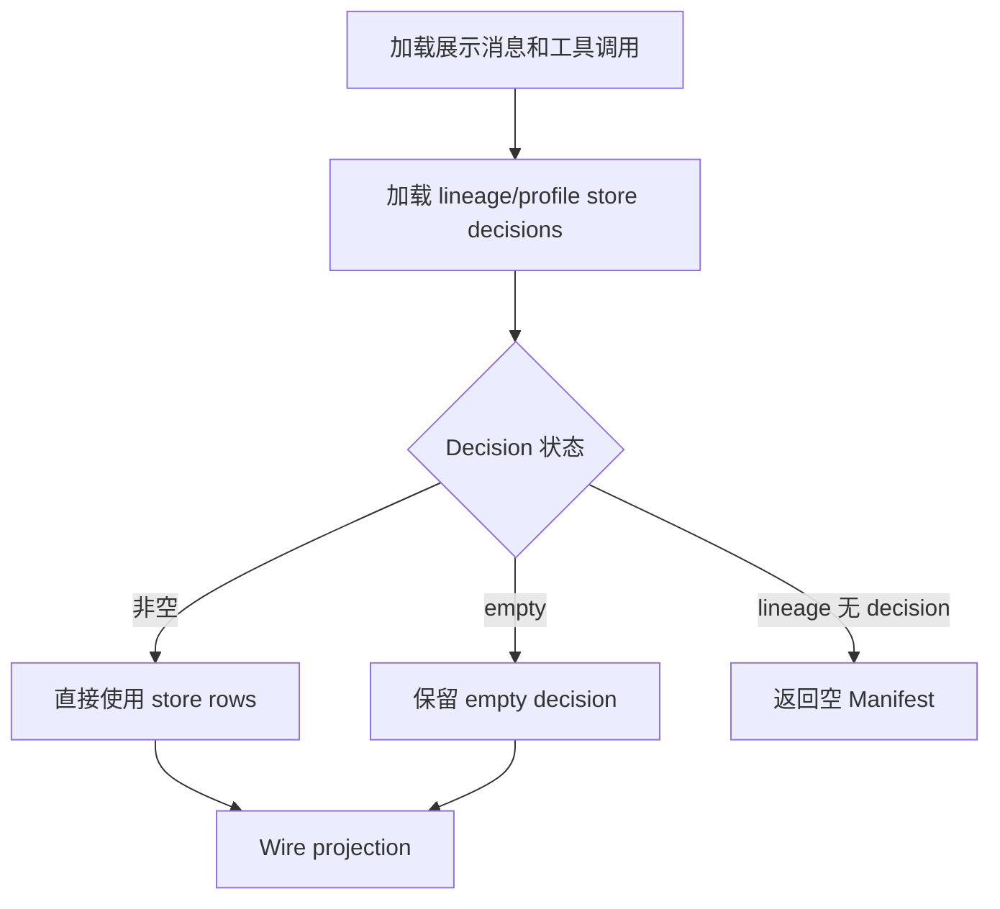

# Session Manifest Artifacts 实现

本文是 Artifacts 证据提取、路径安全、turn 归属、持久化与显式 backfill/read-repair 的唯一实现说明。对外资源语义、HTTP/SSE 字段和 wire 示例以 [Session Manifest HTTP/SSE 契约](../api/session-manifest-api.md) 为准。

实现入口：`integration/session_manifest/manifest.py`、`integration/session_manifest/store.py`、`api/streaming.py`、`api/gateway_chat.py`，以及 Fork 的 `integration/session_manifest/external_references/`。

## 1. 状态层与不变量

Artifacts 的权威持久化状态层是 `{HERMES_WEBUI_STATE_DIR}/session_manifest.db`。v1 只持久化 artifacts，不持久化 todos/references。

身份键：

```text
lineage_key + profile + workspace_root + turn_key + record_kind + path
```

核心不变量：

1. 工具事件和最终 assistant 提取必须限定在当前 turn slice。
2. 中间 assistant prose 不提取路径。
3. 不扫描 terminal stdout、目录列表、heredoc/Python 源码或整个 workspace。
4. 非空 DB decision 是该 turn 的权威记录；正常完成结算时，同轮最终 assistant 明确列出且存在的文件会追加到该 decision，重复路径保留工具来源。
5. Empty decision 只能由显式维护操作使用同轮完整 transcript 的强证据原子修复。
6. `GET /api/session/manifest` 是只读操作，不更新 artifact store、session recency 或 session-list 事件。
7. 同一稳定 `tool_call_id` 的重放不得跨 turn 重复归属。
8. 工具来源只接受成功 completed 事件；成功文件读取只建立同 turn 瞬态 evidence，不进入 wire/store。
9. `workspace_root=""` 是历史默认根别名：读取时映射到启动时的 `HERMES_WEBUI_DEFAULT_WORKSPACE`，不回填数据库；decision 与 artifact identity 必须按逻辑 root 隔离。


## 2. Decision-first 构建流程




`build_session_manifest()` 仍会派生 todos/references 和 turn 结构，但 artifacts 的最终权威来源遵循上图。

### Decision 类型

- **非空 decision**：该 turn 至少有一条 `path != ""` 的 artifact row。
- **Empty decision**：该 turn 只有一条 `path = ""`、`preview = "file"`、`source_tool = "assistant_prose"` 的 marker；marker 不进入 wire。
- **无 decision**：当前 lineage/profile/逻辑 workspace root 没有任何 store row；GET 返回空 Manifest，不读取 transcript、tool calls 或 legacy sidecar 重建，也不写入 DB。

`repair_empty_manifest_turns()` 与 `backfill_missing_manifest_records()` 保留给显式维护操作；`GET /api/session/manifest` 不调用它们。前者只扫描当前逻辑 root 的 empty turns；提取到成果后，`replace_manifest_turn_records()` 按 `(lineage_key, profile, workspace_root, turn_key)` 删除旧 marker 并在同一事务写入新 rows。已有非空 turn 不参与 repair。

## 3. Turn 与工具事件

`_message_turns()` 以每条非 compression-marker 的 `role=user` 消息开启一轮：

```text
turn_key = user._turn_key 或 turn:<user_msg_idx>
```

每轮记录 `start_msg_idx` / `end_msg_idx`。`_tool_calls_for_turn()` 使用消息范围限制 `session.tool_calls`，避免 earlier turn 的写入路径污染当前轮。

`_collect_tool_events()` 将以下来源规范化为 `ToolEvent`。Mutation/read/terminal/skill/todo 等工具证据只有完成结果存在、`_tool_event_succeeded()` 确认 completed 且未报告失败后才解析其 args/result/diff；`skill_view` 还要求结果明确 `success: true`。调用 start、孤立 result、in-progress、取消、失败或非零 `exit_code` 均不产生 Manifest 证据。持久化 `session.tool_calls` 仅接受明确 `done: true` 且未标记失败的已结算 row，不能由前端展示层的 `done` 补值反推成功。

来源：

- assistant `tool_use` / `tool_calls` 与 `role=tool` 结果配对；
- `_partial_tool_calls`；
- `session.tool_calls`，通过 `assistant_msg_idx` 归属 turn。

以 `[CONTEXT COMPACTION — REFERENCE ONLY]` 开头的 assistant 消息不提供 artifact prose/media 证据。

## 4. Artifact 证据来源


| 来源                 | `source_tool`          | 证据                                                |
| ------------------ | ---------------------- | ------------------------------------------------- |
| Workspace mutation | 实际工具名                  | 结构化参数与 diff                                       |
| Skill mutation     | `skill_manage` 或实际写入工具 | mutation action、skill name/path、真实 `SKILL.md`     |
| Terminal           | `terminal`             | 成功命令中的静态 `-o`/`--output`/`--print-to-pdf` 操作数     |
| Media              | `media`                | assistant 显式 `MEDIA:<local-path>`                 |
| Final assistant    | `assistant_prose`      | 当前 turn 最后一条 assistant 中经边界校验的既存路径      |
| Legacy             | 原有 source 或规范化值        | `session.turn_artifacts`，仅 lineage 完全无 decision 时 |


### 4.1 Mutation 工具

`ARTIFACT_MUTATION_TOOLS`：

```text
write_file
create_file
edit_file
patch
apply_patch
mcp_filesystem_write_file
mcp_filesystem_edit_file
```

结构化参数包括：

```text
path, file_path, target, destination, filename,
paths[], edits[].path
```

Diff 补充：

- Unified diff：`+++ b/path` / `--- a/path`
- ApplyPatch：`*** Add File:` / `*** Update File:`

Mutation 工具可以先形成内部记录；最终 wire 再判断是否可预览或是否有足够 provenance 输出 expired。

### 4.2 Skill artifacts

- `skill_manage` 仅接受 `action ∈ {create, edit, patch, write_file}`。
- 结果若有明确成功 path，优先使用结果 path。
- 通用 mutation 工具写入 profile skills 根下的 `.../SKILL.md` 也识别为 skill artifact。
- Wire path 是 canonical skill 名，不是磁盘绝对路径。
- Integration/SkillHub 不可用、skill 不存在或仍为 `in_progress` 时不输出正常预览行；有充分历史 provenance 时可输出 `expired`。


### 4.3 MEDIA:

_MEDIA_TOKEN_RE 只读取非 `internal_scaffold` / `context_anchor` assistant 消息中的显式 MEDIA:。远程 URL 跳过。Workspace 内 media 规范化为相对路径；允许的 workspace 外本地 media 保留绝对路径并走 session media preview。

User 消息中的 MEDIA:、工具结果 JSON 的相似字段和普通 URL 都不作为 media artifact。

### 4.4 最后一条 assistant

每个 turn 只扫描最后一条 role=assistant。_paths_from_last_assistant_message() 使用：

- _BROAD_FILENAME_EXT_RE：绝对路径、相对路径、裸文件名；
- _LAST_ASSISTANT_TILDE_PATH_RE：~/... 路径候选。

绝对路径可以在 session workspace 内或外：前者按既有 workspace 相对路径表示，后者原样以绝对路径表示为直接引用。相对路径和裸文件名只以当前 `session.workspace` 为基准解析，解析后必须仍位于该目录；不会借用前序 turn、工具输出或目录描述补全。后续纯问答 turn 若最后一条 assistant 明确列出一个实际存在的 workspace 文件，仍可产生该 turn 的 `assistant_prose` artifact。

不依赖“已保存”“文件路径”等交付关键词。候选必须：

- 相对路径解析后位于 session workspace；绝对路径则通过外部直接引用策略；
- 当前真实存在且可预览；
- 不是 `uploads/` 输入文件；
- 不命中 `.git`、`node_modules`、缓存、构建目录等 cruft；
- 不超过每轮候选上限；
- canonical path 去重。

正则只接受完整 token 边界：`report.pdf附件`、`report.pdf.bak` 和 `abc/report.pdfx` 不会截断为 `report.pdf`。因此最终回复表格中的 ``报告.html`` 可成为成果；不存在的 ``摘要.md`` 不会被推断补全。中间 assistant 即使写出绝对路径或“文件位置”也不产生 prose artifact。

### 4.5 Read evidence

`ARTIFACT_EXCLUSION_READ_TOOLS` 包含文件读取工具。成功 completed 读取事件只从结构化 args 收集当前 turn 的 canonical workspace path，形成瞬态 evidence：

- 不进入顶层/per-turn references；
- 不进入 SSE 或 artifact store；
- 不从 stdout/result 猜路径；
- 只抑制同 turn、同 path 的 `assistant_prose` 候选；
- 不抑制 mutation、terminal、`MEDIA:` 或 skill mutation；
- 不跨 turn，稳定 tool-call replay 仍服从 turn owner。

因此 read→edit、edit→read、read→edit→read 均保留单一 mutation artifact；失败/取消 read 不建立 evidence。

### 4.6 Terminal

`terminal` 不是通用 mutation 工具。调用/start 事件只提供结构化 `args.command`；必须与同一 `tool_call_id` / `tool_use_id` 的完成结果配对，且 `_execution_event_succeeded()` 确认成功后，`_terminal_output_paths()` 才解析：

```text
-o PATH
--output PATH
--output=PATH
cp SOURCE DEST
cp -- SOURCE DEST
python .../md2word.py INPUT OUTPUT [options]
```

`cp` 只接受单 source、单 destination，且只登记 destination；recursive、选项、多 source、变量和 glob 均拒绝。静态绝对 destination 可以是 workspace 外的直接引用，但仍须通过第 5 节的外部路径策略和安全打开。最后一种位置参数规则只适用于脚本 basename 精确为 `md2word.py` 的 Python 调用；不会推广为未知 CLI 的通用“最后一个参数即输出”规则。

支持受控 `cd DIR && ...` 的命令本地目录。拒绝：

- 变量、命令替换、通配符；
- 多行 heredoc 和嵌入源码；
- 动态/歧义 shell 路径；
- 不存在、目录、cruft 或不可预览文件。

不会扫描 stdout、`ls` 列表、`cat` 输入、Python `open()` 源码或 workspace 快照。

### 4.7 Turn 绑定与 orphan

当前 worker 结算前校验最新真实 user 的 `_turn_key` 与 `stream_turn_key`。带 `_hermes_message_class: internal_scaffold` 或 `context_anchor` 的 Agent 内部 user/assistant 行不是真实 turn 边界，必须跳过；最终未标记 assistant 仍归属前一个真实 user。缺 key、key 冲突或 user 内容边界冲突时，不写 store record，也不创建 empty decision。normal、gateway、error 与 cancel 路径共用同一个结算入口；任何非 `persisted` 结果都会在 turn journal 记录 expected/actual key、stage 与 terminal reason。

历史 store record 若找不到同 key 的 user anchor，仍保留在顶层 `artifacts`，并把 key 暴露在 `diagnostics.orphan_turn_keys`；它不会进入正常 `turns[]`，因此不会产生错误的 per-turn chip。历史归属修复必须使用显式 old key → new key 映射，不能按编号相邻或文本相似度自动迁移。

`scripts/rebind_manifest_turn.py` 默认只报告命中的 lineage/profile/path 证据。确认映射后再增加 `--apply`；工具在单个 SQLite 事务中 upsert 新 key 并删除旧 key，重复路径由 store 唯一键合并。

## 5. 路径规范化与安全

### 默认 workspace 与 Artifact 根

`session.workspace` 是未指定目标时的默认写入目录；普通 file artifact 的资格根则由唯一入口 `artifact_workspace_root_for_session(session)` 决定：当 session workspace 位于运行时 `DEFAULT_WORKSPACE` 下时使用该默认根，否则使用 session 自身根。该值必须贯穿 tool-complete SSE、turn reconcile、持久化、GET projection 与 preview，避免“流中可见、刷新后消失”。

用户显式指定的绝对路径不因此被拒绝写入。位于 Artifact 根内的文件仍是普通 workspace artifact；位于根外、且来源属于允许的成功 mutation/terminal 或最终 assistant prose 时，是外部直接引用。两者都沿用同一 store identity，`workspace_root` 仍是会话 Artifact 根而不是外部文件目录，公开 wire 不新增字段。

所有候选先经 `_resolve_manifest_path(workspace, raw)`：

1. 清理引号和无效形态；
2. 排除 `ARTIFACT_IGNORE_RE`；
3. 相对路径使用 `(workspace / path).resolve()`；
4. workspace 内候选输出 POSIX 相对路径；workspace 外绝对候选保留规范化后的绝对路径。

外部直接引用仅接受允许来源的绝对路径，且登记和预览都经 `integration/session_manifest/external_references/policy.py` 逐组件 `O_NOFOLLOW` 打开：拒绝 symlink、目录、设备文件、`uploads/`、cruft、状态根下的 sessions、cron、logs、checkpoints、backups、`.ssh`、`.gnupg` 和系统受保护根。聊天附件根（`HERMES_WEBUI_ATTACHMENT_DIR/<session_id>/`，默认 `STATE_DIR/attachments/<session_id>/`）与 `HERMES_HOME/memories/` 是例外：其中的文件只有在已被同一 Manifest 机制持久化为精确 Artifact row 后才能走既有只读预览；它不会被目录扫描或仅凭绝对路径自动开放，附件也不会因上传本身自动成为 Artifact。状态根按运行时 `HERMES_HOME`、`HERMES_WEBUI_STATE_DIR` 和默认 Hermes Home 展开；项目自身恰好名为 `sessions` 的目录不会仅因名称被拒绝。绝不根据任意请求中的绝对路径读取文件；必须先有匹配的持久化 Artifact row。

`_artifact_path_is_real()` / wire preview helpers 负责：

- 文件存在且不是目录；
- 非 cruft；
- 未超预览大小；
- skill `SKILL.md` 存在；
- integration/preview backend 可用。

外部引用是活链接：内容修改或同名替换后继续读取当前安全版本；仅文件不存在、不再是普通文件、成为 symlink 或命中拒绝策略时，在 GET 投影为 `status: "expired"`，预览接口不返回字节。系统不复制、移动、哈希或为此新增 SQLite 字段。

搜索命中、目录列表、只读工具、workspace 全量扫描、相似字段和跨字段补全均不产生 artifact。

## 6. 持久化

正常流式完成顺序：

```text
final assistant 已进入 s.messages
→ 当前 user._turn_key 与 stream/SSE key 一致
→ s.save() 持久化 transcript
→ _persist_turn_artifact_paths(stream_turn_key) 合并 stream-owned 工具证据与同轮最终 assistant 的真实文件
→ upsert_manifest_records()
→ completed journal event
```

先保存 transcript，确保 artifact/empty decision 不会先于其证据 durable。无成果时写 empty decision；提取或 store 写入失败会作为可观测的持久化失败处理，不能被伪装为 empty decision 或已完成 turn。

首次结算会将合并后的 stream 和 transcript 证据统一通过存在性与预览 gate 后再写入 store。因此同一轮内已经删除、改名或变得不可预览的候选不会形成 artifact record；若无其它候选，该 turn 写 empty decision，避免后续 read-repair 从已失效证据回填。该 gate 不解析或推断重命名目标，例如 `mv old.jpg new.png` 不会自动把 `new.png` 登记为成果。

Store row 最小字段：

```text
session_id, lineage_key, profile, workspace_root, turn_key, record_kind,
path, preview, source_tool, created_at, updated_at
```

Profile 只来自 `session.profile`，缺失写空字符串；不从 active profile、parent、workspace 或 path 推断。

Legacy `session.turn_artifacts` 不再是新会话写入目标，只在显式 backfill 操作且 lineage 完全无 decision 时作为输入。Manifest GET 不读取它，也绝不将其回填至 store。Legacy 空 source 规范化为 `assistant_prose`，不伪装成写入工具。

## 7. 对外投影边界

本模块只决定候选能否投影，不定义对外 JSON。`preview=file` 接受可预览的 workspace file、已登记且当前安全的外部直接引用，或允许的 media；`preview=skill` 仅接受可预览 canonical skill。外部绝对路径只会在持久化 row 存在后进入 wire，随后通过既有 `GET /api/integration/workspace/file?path=...` 预览；该 URL 的绝对路径分支只查精确登记记录并用同一 fd 读取。历史证据存在但目标已不可预览时可投影为 expired；结算前已失效或没有 provenance 的候选一律不输出。字段、去重优先级和 SSE 帧均以 [Session Manifest HTTP/SSE 契约](../api/session-manifest-api.md) 为准。

`extract_manifest_delta_from_tool_event()` 只接受成功 `tool_complete`；`extract_manifest_delta_from_turn_reconcile()` 在 assistant durable 后、`done` 前产生当前 turn 的补充候选。两者只更新 Inspector 乐观态，聊天区 chips 始终在 `done` 后以 GET 为准。

## 8. 关键函数


| 函数                                         | 职责                                |
| ------------------------------------------ | --------------------------------- |
| `build_session_manifest`                   | GET manifest 总入口                  |
| `_message_turns` / `_turn_message_slice`   | Turn 分组与切片                        |
| `_collect_tool_events`                     | Transcript/tool_calls → ToolEvent |
| `_collect_media_artifact_events`           | `MEDIA:` → events                 |
| `_collect_final_assistant_artifact_events` | 当前轮末条 prose → events              |
| `_tool_event_succeeded`                    | 统一工具成功门槛                          |
| `ARTIFACT_EXCLUSION_READ_TOOLS`            | 文件读取瞬态排除分类                        |
| `_terminal_output_paths`                   | 受控 terminal 输出操作数                 |
| `_extract_turn_artifact_entries`           | 单 turn 共享提取                       |
| `_resolve_manifest_path`                   | 路径规范化                             |
| `_artifact_path_is_real`                   | Reconcile/持久化存在性闸门                |
| `external_references.policy`               | 外部路径策略与无跟随 fd 打开              |
| `external_references.references`           | 外部行判定与已登记 record 查询            |
| `external_references.preview`              | 复用既有 workspace preview URL 的授权读取 |
| `upsert_manifest_records`                  | 普通 store upsert                   |
| `replace_manifest_turn_records`            | 原子替换单 turn decision               |
| `repair_empty_manifest_turns`              | 显式维护时的 empty-only read-repair   |
| `backfill_missing_manifest_records`        | 显式维护时、lineage 无 decision 的 backfill |
| `_row_to_wire` / `_rows_to_wire`           | Wire 与 expired projection         |
| `_persist_turn_artifact_paths`             | Turn 完成持久化                        |


## 9. 测试

```bash
./scripts/test.sh tests/test_session_manifest.py tests/test_session_manifest_store.py tests/test_session_manifest_contract.py tests/test_session_manifest_replay.py -q
```

重点覆盖：

- 工具参数/diff 与 stable tool-call turn 归属；
- Final assistant Unicode/相对路径/裸文件名；
- 中间 assistant prose 不提取；成功 read evidence 仅抑制同轮 final prose；
- Terminal `-o` 与 stdout/heredoc 排除；
- Workspace、`uploads/`、cruft、缺失文件过滤；
- 外部绝对 Artifact 的登记、既有 preview URL、受保护路径/symlink 拒绝与 expired 投影；
- Skill canonicalization；
- Manifest GET 不触发 history backfill 或 empty-decision 修复；显式维护的 empty decision 原子修复、profile/lineage 隔离和幂等；
- Expired provenance；
- Transcript save 早于 manifest decision。
