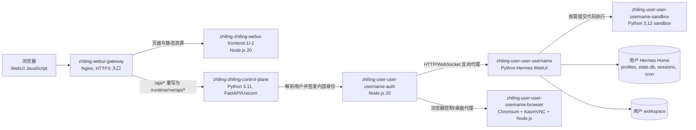
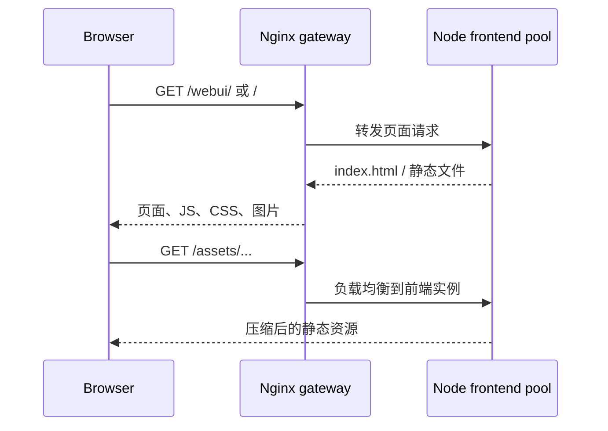
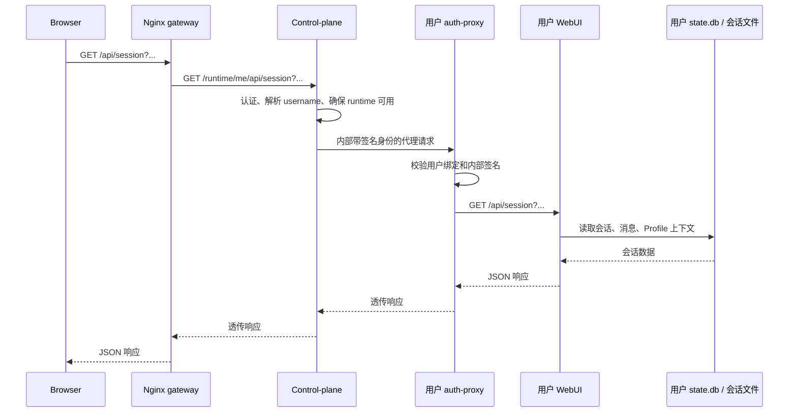
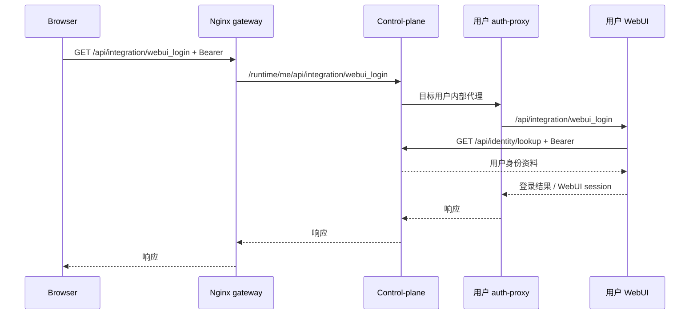

# Zhiling 平台 WebUI 请求链路

本文说明 Zhiling 平台部署中，浏览器访问共享 WebUI 入口后，请求如何到达某个用户的 Hermes WebUI 容器。它描述的是平台部署拓扑，不替代单机 Hermes WebUI 的启动说明，也不定义公开 HTTP API 契约。

文中的 `<username>` 是平台用户名。例如用户 `wzq` 对应主容器 `zhiling-user-user-wzq`。不应依赖容器 IP；服务间通过 Docker 网络名称发现。

## 1. 总览



普通业务 API 的主链路是：

```text
Browser
  -> zhiling-webui-gateway
  -> zhiling-zhiling-control-plane
  -> zhiling-user-user-<username>-auth
  -> zhiling-user-user-<username>
  -> response 原路返回
```

`browser` 和 `sandbox` 是按能力使用的旁路，不是每个 `/api/*` 请求的必经节点。

## 2. 服务清单、技术栈与职责

| 层级 | 容器/组件 | 已核实的技术栈 | 主要职责 | 普通 `/api/*` 是否经过 |
| --- | --- | --- | --- | --- |
| 浏览器 | WebUI 页面 | HTML、CSS、浏览器原生 JavaScript；WebUI 源仓库后端为 Python + vanilla JS | 渲染会话、发起 `fetch`、消费 SSE、建立需要时的 WebSocket。浏览器只知道共享入口，不直接访问用户容器。 | 起点 |
| 边缘入口 | `zhiling-webui-gateway` | Nginx，TLS 终止、反向代理、WebSocket 升级 | 接收共享 HTTPS 入口；按 URL 选择静态前端池、control-plane 或浏览器代理；保留转发协议/主机头。 | 是 |
| 页面前端池 | `zhiling-zhiling-webui-frontend-1`、`-2` | Node.js 20；`node:http`、文件流、Brotli/gzip | 服务 `dist` 中的 WebUI 页面和静态资源；处理缓存/压缩；为少数启动和运行时路径向 control-plane 反向代理。 | 通常否；入口 Nginx 对 `/api/*` 直接转 control-plane |
| 平台控制面 | `zhiling-zhiling-control-plane` | Python 3.11、FastAPI、Uvicorn | 校验平台身份、解析当前用户、维护用户运行时生命周期、选择对应 auth-proxy，并向其传递受签名的内部身份。也承担运行时启动/健康检查及平台级后台协调。 | 是 |
| 用户认证与代理 | `zhiling-user-user-<username>-auth` | Node.js 20；`node:http`、`node:https`、`crypto` | 验证 control-plane 的内部签名和用户绑定，维护/刷新 WebUI 代理会话，将 HTTP、SSE 与 WebSocket 代理到用户 WebUI；同时承接浏览器桌面及控制路由。 | 是 |
| 用户 WebUI 主服务 | `zhiling-user-user-<username>` | Python 3；`server.py` + `ThreadingHTTPServer`；WebUI 业务代码为 Python + vanilla JS | 实现 `/api/session`、聊天、profiles、技能、cron、工作区及 integration handlers；读取/写入该用户的会话与配置状态；在进程内驱动 Hermes Agent。 | 是，业务终点 |
| 共享浏览器运行时 | `zhiling-user-user-<username>-browser` | Chromium、Chrome DevTools Protocol、KasmVNC、Openbox、Node.js | 提供受控浏览器和可交互桌面预览；将自动化控制与浏览器桌面会话隔离在用户范围内。 | 仅 `/browser/*`、`/api/browser/*` 等浏览器路径 |
| 代码沙箱 | `zhiling-user-user-<username>-sandbox` | Python 3.12 sandbox 镜像 | 承载用户隔离的代码执行任务；由运行时按任务调用，而不是作为 WebUI API 的固定反向代理。 | 否，按任务使用 |

### 2.1 控制面为什么是链路中的关键节点

`zhiling-zhiling-control-plane` 是共享入口到“哪一个用户容器”的决策点，不是用户业务 API 的最终处理者。当前部署的启动命令为：

```text
python3.11 -m uvicorn app.main:app --host 0.0.0.0 --port 13001
```

该命令没有 `--workers`，因此当前是一个 Uvicorn worker 进程。它内部可使用线程池和连接池并发转发，但 CPU 饱和、身份校验阻塞、运行时状态刷新或上游连接排队仍会在此处放大为多个用户的 API 等待。增加 worker 是容量手段之一，但应先用分层时延确认瓶颈位于 control-plane，而不是用户 WebUI、下游模型或网络。

### 2.2 用户容器与数据边界

每个业务用户拥有独立的一组主 WebUI、auth-proxy、browser 和 sandbox 容器。主 WebUI 的持久化边界是该用户的 `hermes-home` 和 workspace：

| 数据 | 所有者 | 用途 |
| --- | --- | --- |
| `active_profile`、profiles 配置 | 用户 WebUI | 决定当前执行 Profile 及其模型、技能、配置。 |
| `state.db` | 用户 Profile / Hermes Agent | 会话、消息、任务执行等持久化状态。命名 Profile 各自持有对应状态库。 |
| `sessions/` 与 WebUI state 目录 | 用户 WebUI | WebUI sidecar、会话显示和运行时辅助状态。 |
| `cron/` 与 `cron/output/` | 用户 Profile / Hermes Agent | 定时任务定义和输出物。 |
| workspace | 用户 | Agent 的文件操作和项目工作目录。 |

gateway 与 control-plane 不应成为这些用户业务数据的权威存储。gateway 是无状态路由层；control-plane 保存的是平台身份、用户运行时和路由所需的平台级状态。

## 3. 路由分类

入口 Nginx 先按路径分流。对排障最重要的是不要把下面三类请求混在一起。

| 请求类别 | 入口匹配 | 首个上游 | 后续路径 | 说明 |
| --- | --- | --- | --- |
| 页面与静态资源 | `/`、`/webui/`、`/assets/*`、常见 JS/CSS/图片扩展名 | `webui_frontend_pool` | 返回静态文件；前端服务遇到特定运行时路径时可再代理 control-plane | 用于加载和更新界面资源。 |
| 普通运行时 API | `/api/*` | control-plane | `/api/x` 重写为 `/runtime/me/api/x`，再到目标用户 auth-proxy 和 `:8787` WebUI | 例如 `/api/session`、`/api/models`、聊天 API。 |
| 浏览器预览与控制 | `/browser/*`、`/api/browser/*` | 用户 auth-proxy | auth-proxy 转发到该用户 browser runtime 或桌面会话 | gateway 先以子请求解析用户并获取对应 auth-proxy 地址，保留 WebSocket。 |

Nginx 对 control-plane 使用按认证信息一致性哈希的 upstream，并保持连接复用。此做法有助于同一登录上下文的连接复用，但不能替代 control-plane 的应用层并发与下游健康度。

## 4. 典型请求时序

### 4.1 页面首次加载



页面加载成功不代表用户 WebUI 容器或 control-plane 已能处理业务 API；两者是不同 upstream。

### 4.2 普通 API：`GET /api/session`



对该类请求，用户 WebUI 才是业务处理终点。control-plane 当前只缓存少量相对稳定的运行时元数据路径，例如 models、profiles、settings；`/api/session` 不在该缓存范围内，因此每次仍必须完成用户路由和业务读取。

### 4.3 集成登录：`GET /api/integration/webui_login`

这个接口虽然沿用普通 API 的外层路径，但 Bearer token 存在时会多一次从用户 WebUI 回调 control-plane 的身份查询：



#### 每一步做什么

| 步骤 | 节点 | 处理动作 | 结果与时延含义 |
| --- | --- | --- | --- |
| 1 | Browser | 携带当前登录态的 Bearer token 发起 `GET /api/integration/webui_login`。token 只放在请求头，不应写入前端日志或 URL。 | 请求进入共享入口；浏览器侧网络、证书或连接复用的问题会在这一步之前体现。 |
| 2 | `zhiling-webui-gateway` | 命中该接口的精确 Nginx 路由，将路径改写为 `/runtime/me/api/integration/webui_login`，并转发到 control-plane。响应缓冲关闭，以便保留代理响应行为。 | gateway 不查询用户身份资料；它的耗时主要是入口排队及到 control-plane 的连接/读取。 |
| 3 | control-plane（外层 runtime proxy） | 校验平台登录态，解析“当前请求属于哪个 username”，确保该用户运行时可用，选择对应的 `zhiling-user-user-<username>-auth`。随后构造含用户、会话、时间戳和签名的内部代理请求。 | 这一步把共享请求绑定到一个用户容器；认证、运行时刷新或转发执行器排队都会增加外层等待。 |
| 4 | 用户 auth-proxy | 校验内部身份的签名、时间窗口和 username 是否与本容器固定用户一致；创建或恢复代理会话，并将请求转发给本用户的 `:8787` WebUI。 | 此层拒绝跨用户或过期/伪造的内部请求；其日志可区分身份校验、会话刷新和上游 WebUI 连接耗时。 |
| 5 | 用户 WebUI：`integration/identity/handlers.py` | 确认 integration 开关和请求路径。若请求没有 Bearer token，直接读取本进程身份缓存并返回，不进行身份回调。 | 无 Bearer 的缓存命中不经过步骤 6-7；缓存未命中或已失效时返回相应错误结果。 |
| 6 | 用户 WebUI：`integration/identity/client.py` | 有 Bearer token 时，创建同步 HTTPX 客户端，以 10 秒超时调用 control-plane 的 `GET /api/identity/lookup`，并仅透传该 Bearer token。 | 这是该接口相较 `/api/session` 新增的一次内层网络往返，也是排查 10 秒级等待的首要观测点。 |
| 7 | control-plane（identity lookup） | 校验内层 Bearer token，并从平台身份/用户组织数据中读取当前用户资料，返回结构化身份响应。 | 该步骤与外层 control-plane 请求是两次独立处理；外层已完成用户路由不代表内层查询一定很快。 |
| 8 | 用户 WebUI | 解析 identity lookup 的状态和 JSON。状态为 200 时写入进程内身份会话缓存；查询连接失败会转换为脱敏的 502 响应。当前 MCP header 同步逻辑处于禁用状态，不在此请求内执行。 | 缓存写入很轻量；慢响应通常来自步骤 3、4、6 或 7，而不是该缓存操作。 |
| 9 | 用户 auth-proxy | 将 WebUI 的状态码、响应头和响应体代理回 control-plane，必要时保留该代理会话对应的 cookie/连接语义。 | 这里应检查上游首字节和响应透传是否被阻塞，尤其是 keep-alive 或代理会话刷新。 |
| 10 | control-plane 与 gateway | control-plane 透传用户侧响应；gateway 再将其作为外部 HTTPS 响应返回浏览器。 | 浏览器看到的总耗时包含所有前序步骤。需要用 request ID 或同一时间窗口关联四层日志，不能只看最后一层 WebUI 日志。 |

用户 WebUI 的 `integration/identity/client.py` 使用同步 HTTPX 请求查询 `/api/identity/lookup`，配置超时为 10 秒。成功身份会保留在进程内会话缓存中；没有 Bearer 的后续读取可命中该缓存。因而该接口的慢响应应额外检查这一次嵌套的 control-plane identity lookup，而不能只看主 WebUI 处理时间。

### 4.4 浏览器预览与接管

```text
Browser
  -> gateway /browser/* 或 /api/browser/*
  -> gateway 子请求到 control-plane 解析当前用户和 auth-proxy 地址
  -> 该用户 auth-proxy
  -> browser runtime 的控制 API 或 KasmVNC 桌面/WebSocket
```

这条路径的主要耗时来源可能是浏览器容器启动、Chromium、桌面编码或 WebSocket，而不是 WebUI 的 `/api/session` 处理逻辑。

## 5. 认证与信任边界

1. 浏览器到 gateway：共享 HTTPS 入口接收 cookie 或 Bearer 等平台凭据。
2. gateway 到 control-plane：gateway 只做路径分流和转发；当前用户的权威解析在 control-plane。
3. control-plane 到 auth-proxy：control-plane 传递当前用户、会话和时间戳等内部身份信息，并以 HMAC 签名；auth-proxy 校验签名、时间窗口和固定用户名是否匹配。
4. auth-proxy 到用户 WebUI：auth-proxy 创建或恢复受限的 WebUI 代理会话，再透传 HTTP、SSE、WebSocket。用户 WebUI 不应信任来自外网的伪造内部身份头。
5. 用户 WebUI 到 identity lookup：`webui_login` 的 Bearer 查询是额外的回调边界，应记录脱敏的请求 ID、状态码和耗时，不能记录 token。

## 6. 时延归因与日志位置

一次浏览器可见的总时延可拆为：

```text
T_total = T_gateway + T_control_plane + T_auth_proxy + T_webui + T_storage/downstream + T_response_transfer
```

对于流式聊天，`T_webui` 还应拆成“首个 SSE 头/首个 token”等待时间和后续持续传输时间；不能用完整流结束时间代表首包时延。

| 层 | 优先证据 | 能回答的问题 |
| --- | --- | --- |
| gateway | Nginx access/error log；应包含 request id、`request_time`、`upstream_response_time` | 请求是否到达入口、入口到上游花了多久、是否 502/504。 |
| control-plane | Uvicorn/应用日志；认证、runtime 刷新、执行器排队、连接/读取耗时 | 是否在用户路由前等待，是否选错/找不到用户运行时。 |
| auth-proxy | `zhiling-user-user-<username>-auth` 容器日志 | 内部身份校验、session 刷新、到 `:8787` 的上游建连和 SSE 透传。 |
| 用户 WebUI | 用户 `webui/server-8787.log`；`[SESSION_TIMING]` | `/api/session` 业务 handler、会话文件和 `state.db` 读取本身是否慢。 |
| Hermes Agent | 对应 Profile 的 `agent.log`、`errors.log`、`gateway.log` | 模型调用、cron、数据库错误、工具或 Agent 运行时问题。 |
| browser/sandbox | 对应容器 stdout | 浏览器启动、桌面会话、自动化控制或沙箱任务异常。 |

### 6.1 建议的判定顺序

1. 使用同一个 `request_id`（或时间窗口、session ID）串联 gateway、control-plane、auth-proxy、WebUI 日志。
2. 对比 gateway 的总时长与用户 WebUI `SESSION_TIMING`：若前者远大于后者，慢点在转发链路或其排队/下游依赖，而非会话业务 handler。
3. 对 `webui_login` 单独记录 identity lookup 时间；它具有普通 `/api/session` 没有的内层 control-plane 往返。
4. 对直连用户 WebUI 的诊断请求仅用于隔离问题；它绕过了生产认证、路由和代理链路，不能当作完整端到端时延。
5. 只有在 control-plane 的排队/CPU/上游等待得到证据后，再评估增加 Uvicorn worker。worker 数还需与 CPU、连接池、用户容器数和下游限流共同配置。

## 7. 运行与故障边界

| 现象 | 优先检查的层 | 不应直接得出的结论 |
| --- | --- | --- |
| 页面和静态资源慢 | gateway、frontend pool、浏览器缓存 | 不应直接归因于用户 WebUI 或 Agent。 |
| `/api/session` 慢但 WebUI `SESSION_TIMING` 很短 | gateway、control-plane、auth-proxy | 不应仅因主容器存在就认定“容器本身慢”。 |
| `webui_login` 慢 | 外层链路 + identity lookup | 不应把额外身份回调误认为单一 WebUI handler 慢。 |
| `/browser/*` 慢或黑屏 | auth-proxy、browser runtime、KasmVNC/Chromium | 不应按普通 API 链路检查 `state.db`。 |
| 模型发现或聊天慢 | 用户 WebUI、Hermes Agent、DNS/模型 Provider | 不应通过增加 Nginx 或前端池实例解决。 |

## 8. 已知边界与维护原则

- 端口、镜像 tag、超时和容器副本数属于部署配置，可能随环境变化；运维排查以运行中容器的命令、Nginx 配置和日志为准。
- 控制面和 auth-proxy 处理身份与用户隔离。排障输出不得记录 Bearer token、cookie、HMAC secret 或完整身份资料。
- 本文只描述平台路由。上游 Hermes WebUI 对 `/api/*` 的公开行为仍以代码和对应 API/契约文档为准。
- 若新增或变更平台专属 HTTP 路由，应按 `integration/` 的边界和 OpenAPI 规则更新相应文档，不应将业务逻辑扩散到 gateway 配置中。
