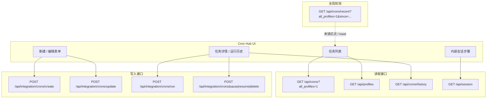

# Cron Hub API 说明

本文梳理 Cron Hub 前端页面与 WebUI 后端之间的接口交互。

Cron Hub 是 integration 层提供的跨 Profile 定时任务面板，前端实现位于
[`integration/assets/hermes_integration_crons.js`](../integration/assets/hermes_integration_crons.js)。
开启 `HERMES_INTEGRATION=1` 后，页面配置
`window.__HERMES_CONFIG__.integrationCronAllProfiles` 为 true 时才会启用。

完整机器可读接口定义见
[`integration/swagger/openapi.json`](../integration/swagger/openapi.json)，本地运行时也可打开 `/docs` 查看。

## 1. 总览

Cron Hub 与上游 Tasks 面板的核心区别：

- Cron Hub 跨 Profile 聚合任务，列表读取 `GET /api/crons?all_profiles=1`。
- Cron Hub 的创建操作走 `POST /api/integration/crons/create`，只选择一个 `profile`；任务会存储并运行在该 Profile 下。
- Cron Hub 的编辑、运行、删除操作走 `POST /api/integration/crons/*`，请求体使用 `profile` + `job_id` 定位任务。
- Cron Hub 的运行历史读取复用 `GET /api/crons/history`，查询参数使用 `profile` 表示任务所在 Profile。

术语：

- `profile`：Cron Hub 统一使用的任务 Profile；任务会落在该 Profile 的 `cron/jobs.json`，运行时也使用该 Profile，输出写入该 Profile 的 `cron/output/<job_id>/`。

参数迁移：

- 旧文档和早期实现曾在读取类接口中使用 `owner_profile` 表示任务存储 Profile。
- Cron Hub 现在保证存储 Profile 与执行 Profile 相同，因此外部 API 统一迁移为 `profile`。
- 新接口不再保留 `owner_profile` 查询参数兼容；调用方应将 `owner_profile=<name>` 改为 `profile=<name>`。

## 2. 前端调用点汇总

| 场景 | 方法 | 路径 | 前端调用 |
|------|------|------|----------|
| 加载 / 刷新 Cron Hub 列表 | GET | `/api/crons?all_profiles=1` | `HermesIntegrationCrons.load()` |
| 加载 Profile 下拉 | GET | `/api/profiles` | `ensureProfiles()` |
| 读取运行历史 | GET | `/api/crons/history?job_id=&profile=&limit=50` | `loadDetailRuns()` |
| 内嵌查看会话步骤 | GET | `/api/session?session_id=&messages=1&resolve_model=0` | `toggleEmbeddedSession()` |
| 新建任务 | POST | `/api/integration/crons/create` | `saveForm()` |
| 更新任务 | POST | `/api/integration/crons/update` | `saveForm()` |
| 立即运行 | POST | `/api/integration/crons/run` | `runCurrent()` |
| 暂停任务 | POST | `/api/integration/crons/pause` | `pauseCurrent()` |
| 恢复任务 | POST | `/api/integration/crons/resume` | `resumeCurrent()` |
| 删除任务 | POST | `/api/integration/crons/delete` | `deleteCurrent()` |
| 全局完成轮询 | GET | `/api/crons/recent?all_profiles=1&since=` | `static/panels.js` 的 `startCronPolling()` |

全局完成轮询不在 `hermes_integration_crons.js` 中，但会调用
`window.HermesIntegrationCrons.markUnreadFromCompletion()`，用于给 Cron Hub 列表标记新运行红点。

## 3. 通用请求约定

同源请求使用 `api()` 包装器发起，默认请求头包含：

```http
Content-Type: application/json
```

`POST`、`PUT`、`PATCH`、`DELETE` 等同源写请求由 `static/index.html` 的 fetch 包装自动追加：

```http
X-Hermes-CSRF-Token: <csrf token>
```

错误处理约定：

- 后端返回非 2xx 时，前端 `api()` 会读取 JSON 中的 `error` 字段。
- 若没有 `error`，则使用 HTTP status text。
- Cron Hub 表单错误直接显示在表单错误区域，其他操作多通过 toast 提示。

## 4. 读取类接口

### 4.1 GET `/api/crons?all_profiles=1`

加载 Cron Hub 左侧任务列表，跨 Profile 返回任务分组。

请求参数：

| 参数 | 必填 | 说明 |
|------|------|------|
| `all_profiles` | 是 | Cron Hub 固定传 `1`，表示跨 Profile 聚合 |

响应示例：

```json
{
  "all_profiles": true,
  "profiles": [
    {
      "profile": "default",
      "jobs": [
        {
          "id": "daily_report",
          "name": "Daily Report",
          "schedule": "0 9 * * *",
          "schedule_display": "0 9 * * *",
          "prompt": "Summarize yesterday's work",
          "enabled": true,
          "deliver": "local",
          "profile": "default",
          "toast_notifications": true,
          "execution_bucket": "waiting",
          "execution_state": "scheduled_waiting",
          "last_run_at": 1717200000,
          "last_status": "success"
        }
      ]
    }
  ]
}
```

字段说明：

- `profiles[].profile` 是任务所在 Profile，也是 Cron Hub 任务的存储与执行 Profile。
- `profiles[].jobs[].profile` 是任务记录中的 Profile；Cron Hub 创建/更新的任务应与分组层 `profile` 相同。
- `profiles[].jobs[].execution_bucket` 是前端展示大类：`running`（执行中）、`waiting`（待执行；已完成、停用等也归并到这里）、`error`（执行异常）。
- `profiles[].jobs[].execution_state` 是细分原因：`manual_running`、`last_run_error`、`schedule_error`、`scheduled_waiting`、`last_success_waiting`、`last_unknown_waiting`、`paused_waiting`、`disabled_waiting`、`not_yet_run_waiting`。暂停任务不覆盖上次执行状态；上次失败的暂停任务仍返回 `error` / `last_run_error`。
- 前端会把分组展平成 `{ ownerProfile, job }` 列表后渲染；Cron Hub 状态筛选下拉按 `execution_bucket` 过滤。

`execution_state` 取值说明：

| 值 | 所属 `execution_bucket` | 含义 |
|----|-------------------------|------|
| `manual_running` | `running` | 任务已通过 WebUI 手动触发，并且当前进程内仍标记为运行中。 |
| `last_run_error` | `error` | 最近一次运行结果为失败；即使任务当前已暂停，也保留这个失败状态。 |
| `schedule_error` | `error` | 任务自身处于调度异常状态（如 `state=error`），但最近一次运行状态未明确标为 `error`。 |
| `scheduled_waiting` | `waiting` | 任务有明确的 `next_run_at`，正在等待下一次调度。 |
| `last_success_waiting` | `waiting` | 最近一次运行成功，当前未运行；一次性任务已完成也归入此类。 |
| `last_unknown_waiting` | `waiting` | 存在最近一次运行状态，但不是 `success` / `error`；前端按待执行处理，详情可继续展示原始状态。 |
| `paused_waiting` | `waiting` | 任务已暂停，且没有可参考的最近运行状态。若暂停前最近一次成功/失败，会分别返回 `last_success_waiting` / `last_run_error`。 |
| `disabled_waiting` | `waiting` | 任务已关闭（`enabled=false`），但按 Cron Hub 的最小展示分类归入待执行大类。 |
| `not_yet_run_waiting` | `waiting` | 任务尚未运行过，也没有明确的下一次调度时间或暂停/关闭状态。 |

### 4.2 GET `/api/profiles`

加载 Profile 列表，用于 Cron Hub 的筛选下拉、新建任务 Profile 下拉，以及按所选 Profile 展示可选 skills。

响应示例：

```json
{
  "profiles": [
    { "name": "default" },
    { "name": "research" }
  ]
}
```

integration 开启后，Profile 条目可能包含 `info`、`skills`、`memory_snapshot` 等扩展字段。Cron Hub 依赖 `name` 渲染 Profile 下拉，并在新建任务时读取所选 Profile 的 `skills` 作为技能选择器数据源。

### 4.3 GET `/api/crons/history`

读取某个任务的运行历史元数据，不返回 Markdown 正文。

请求参数：

| 参数 | 必填 | 说明 |
|------|------|------|
| `job_id` | 是 | 任务 ID |
| `profile` | Cron Hub 必传 | 任务所在 Profile |
| `limit` | 否 | Cron Hub 固定传 `50` |
| `offset` | 否 | 分页偏移，默认 `0` |

请求示例：

```http
GET /api/crons/history?job_id=daily_report&profile=default&limit=50
```

响应示例：

```json
{
  "job_id": "daily_report",
  "runs": [
    {
      "filename": "2026-06-01_09-00-00.md",
      "size": 4096,
      "modified": 1780275600,
      "usage": {
        "model": "gpt-5.5",
        "input_tokens": 1000,
        "output_tokens": 500,
        "estimated_cost_usd": 0.02
      },
      "session_id": "20260601_090000_abcd1234"
    }
  ],
  "total": 1,
  "offset": 0
}
```

`session_id` 存在时，Cron Hub 会显示查看会话步骤的按钮。

### 4.4 GET `/api/session`

在 Cron Hub 内嵌展开某次运行对应的完整会话消息。

请求参数：

| 参数 | Cron Hub 取值 | 说明 |
|------|---------------|------|
| `session_id` | 运行记录返回值 | 会话 ID |
| `messages` | `1` | 返回消息列表 |
| `resolve_model` | `0` | 不解析模型 |

请求示例：

```http
GET /api/session?session_id=20260601_090000_abcd1234&messages=1&resolve_model=0
```

响应示例：

```json
{
  "session": {
    "session_id": "20260601_090000_abcd1234",
    "title": "Daily Report",
    "message_count": 4,
    "messages": [
      {
        "role": "user",
        "content": "Summarize yesterday's work",
        "timestamp": 1780275600
      },
      {
        "role": "assistant",
        "content": "Summary...",
        "timestamp": 1780275610
      }
    ]
  }
}
```

Cron Hub 的 `Open session` 按钮会切换到聊天面板，并复用 `loadSession(sessionId)` 重新加载该会话。

### 4.5 GET `/api/crons/recent?all_profiles=1&since=...`

全局完成轮询接口。该接口由 `static/panels.js` 中的 `startCronPolling()` 调用，而不是 Cron Hub 文件直接调用。

请求参数：

| 参数 | 必填 | 说明 |
|------|------|------|
| `since` | 否 | Unix 秒，只返回 `last_run_at > since` 的完成项 |
| `all_profiles` | 否 | integration cron 开启时传 `1`，跨 Profile 聚合 |

`since` 来源与推进规则：

- `since` 由前端变量 `_cronPollSince` 提供，页面加载时初始化为 `Date.now() / 1000`，即当前浏览器打开页面时的 Unix 秒。
- `startCronPolling()` 每 30 秒发起一次请求；integration cron 开启时请求 `/api/crons/recent?all_profiles=1&since=${_cronPollSince}`。
- 后端不会生成新的游标，只会把请求传入的 `since` 原样放回响应，并返回所有 `last_run_at > since` 的任务完成项。
- 前端只有在本轮响应的 `completions` 非空时，才会用每条完成项的 `completed_at` 推进水位：`_cronPollSince = Math.max(_cronPollSince, c.completed_at)`。
- 如果连续多次轮询没有新的完成项，`completions` 为空，`_cronPollSince` 不会变化；因此 Network 里看到多次请求的 `since` 相同是正常现象。
- 页面处于后台时，轮询会因 `document.hidden` 直接跳过；回到前台后仍沿用上一次的 `_cronPollSince`。

响应示例：

```json
{
  "completions": [
    {
      "job_id": "daily_report",
      "name": "Daily Report",
      "status": "success",
      "completed_at": 1780275610,
      "toast_notifications": true,
      "profile": "default",
      "session_id": "20260601_090000_abcd1234"
    }
  ],
  "since": 1780275580
}
```

前端行为：

- `toast_notifications !== false` 时弹出完成 toast。
- 有 `profile` 和 `job_id` 时，Cron Hub 标记对应任务为未读。
- 有 `session_id` 时，后续可在详情中打开完整会话步骤。

### 4.6 GET `/api/integration/crons/unread`

Cron Hub 未读运行统计接口。该接口按各 Profile 的
`cron/output/<job_id>/*.md` 运行输出文件统计未读消息，已读状态保存在
WebUI 默认 Hermes home 下的 integration 状态文件中，因此刷新页面或重启
WebUI 后仍可保留未读游标。

响应示例：

```json
{
  "unread_count": 3,
  "jobs": [
    {
      "profile": "default",
      "job_id": "daily_report",
      "name": "Daily Report",
      "unread_count": 2,
      "latest_completed_at": 1780275610,
      "latest_filename": "2026-06-02_18-30-00.md"
    }
  ]
}
```

前端行为：

- Cron Hub 初始化和刷新时拉取该接口，同步列表红点与导航未读角标。
- `unread_count` 是运行输出条数，不只是有未读的任务数。

## 5. 写入类接口

写入类接口均位于 `/api/integration/crons/*`，仅在 integration cron 开启时生效。

### 5.1 POST `/api/integration/crons/create`

在指定 `profile` 下创建任务。Cron Hub 会把任务存储 Profile 和执行 Profile 绑定为同一个值。

请求体：

```json
{
  "profile": "research",
  "name": "Daily Report",
  "schedule": "0 9 * * *",
  "prompt": "Summarize yesterday's work",
  "deliver": "local",
  "skills": ["daily-summary"],
  "toast_notifications": true
}
```

字段说明：

| 字段 | 必填 | 说明 |
|------|------|------|
| `profile` | 是 | 任务 Profile；同时作为存储 Profile 和执行 Profile，Cron Hub 不允许使用服务器默认 |
| `prompt` | 是 | 任务提示词 |
| `schedule` | 是 | Cron 表达式或 Hermes 支持的自然语言间隔 |
| `name` | 否 | 任务名称 |
| `deliver` | 否 | 投递方式，默认 `local` |
| `skills` | 否 | 创建时附加的技能名列表，来自所选 Profile |
| `toast_notifications` | 否 | 是否显示完成 toast，默认 true |

成功响应：

```json
{
  "ok": true,
  "profile": "research",
  "job": {
    "id": "daily_report",
    "name": "Daily Report",
    "schedule": "0 9 * * *",
    "profile": "research"
  }
}
```

### 5.2 POST `/api/integration/crons/update`

更新指定 `profile` 下的任务。Cron Hub 不支持把任务迁移到另一个 Profile；`profile` 必须指向该任务当前所在的 Profile。

请求体：

```json
{
  "profile": "default",
  "job_id": "daily_report",
  "name": "Daily Report v2",
  "schedule": "0 10 * * *",
  "prompt": "Summarize yesterday's work",
  "deliver": "local",
  "toast_notifications": true
}
```

字段说明：

| 字段 | 必填 | 说明 |
|------|------|------|
| `profile` | 是 | 任务所在 Profile（存储与执行相同） |
| `job_id` | 是 | 任务 ID |
| 其他字段 | 否 | 传给 `cron.jobs.update_job` 的更新内容 |

成功响应：

```json
{
  "ok": true,
  "profile": "default",
  "job": {
    "id": "daily_report",
    "name": "Daily Report v2"
  }
}
```

任务不存在时返回 404。

### 5.3 POST `/api/integration/crons/run`

立即运行指定任务。

请求体：

```json
{
  "profile": "default",
  "job_id": "daily_report"
}
```

成功响应：

```json
{
  "ok": true,
  "job_id": "daily_report",
  "status": "running"
}
```

如果任务已在运行：

```json
{
  "ok": false,
  "job_id": "daily_report",
  "status": "already_running",
  "elapsed": 12.3
}
```

Cron Hub 当前不会像 Tasks 面板一样轮询 `/api/crons/status`，运行完成状态主要依赖全局 `/api/crons/recent` 轮询刷新。

### 5.4 POST `/api/integration/crons/pause`

暂停任务。

请求体：

```json
{
  "profile": "default",
  "job_id": "daily_report",
  "reason": "manual pause"
}
```

成功响应：

```json
{
  "ok": true,
  "job": {
    "id": "daily_report",
    "state": "paused"
  }
}
```

### 5.5 POST `/api/integration/crons/resume`

恢复任务。

请求体：

```json
{
  "profile": "default",
  "job_id": "daily_report"
}
```

成功响应：

```json
{
  "ok": true,
  "job": {
    "id": "daily_report",
    "enabled": true
  }
}
```

### 5.6 POST `/api/integration/crons/delete`

删除任务，并清理该任务关联的历史残留：materialized WebUI 会话、跨 profile 的 `state.db` cron 会话行，以及 owner profile 下的 `cron/output/<job_id>/` 产物目录。

请求体：

```json
{
  "profile": "default",
  "job_id": "daily_report"
}
```

成功响应：

```json
{
  "ok": true,
  "job_id": "daily_report",
  "history_cleanup": {
    "ok": true,
    "deleted": true,
    "job_id": "daily_report",
    "deleted_session_ids": ["cron_daily_report_20260530_153152"],
    "deleted_sidecars": ["cron_daily_report_20260530_153152"],
    "deleted_profiles": ["default:cron_daily_report_20260530_153152"],
    "deleted_output_dirs": ["/home/user/.hermes/cron/output/daily_report"],
    "deleted_output_files": 1
  }
}
```

### 5.7 POST `/api/integration/crons/unread/read`

将某个 Cron Hub 任务当前已有的运行输出标记为已读。后端会把该任务最新
`.md` 运行输出文件的 `mtime` 写入已读游标；之后只有更新的输出文件会重新
计入未读。

请求体：

```json
{
  "profile": "default",
  "job_id": "daily_report"
}
```

成功响应：

```json
{
  "ok": true,
  "profile": "default",
  "job_id": "daily_report",
  "read_until": 1780275610,
  "latest_filename": "2026-06-02_18-30-00.md"
}
```

## 6. Cron Hub 未直接调用的相关接口

以下接口与定时任务相关，但 **Cron Hub 当前没有直接调用**。Tasks 面板（`static/panels.js`）会使用它们；了解这些接口有助于对照 Cron Hub 与上游 Tasks 的能力差异。

| 接口 | 调用方 | 说明 |
|------|--------|------|
| `GET /api/crons/delivery-options` | Tasks 面板 | 动态获取投递渠道；Cron Hub 表单当前硬编码 local / discord / telegram / slack |
| `GET /api/crons/status` | Tasks 面板 | 手动运行状态轮询；Cron Hub 当前不轮询 |
| `GET /api/gateway/status` | Tasks 面板 | Gateway 配置 / 运行状态提示；Cron Hub 当前不展示 |
| `GET /api/skills` | Tasks 面板 | 创建任务时选择 skills；Cron Hub 当前没有 skills 选择 |

### 6.1 GET `/api/crons/delivery-options`

**用途**：返回 cron 任务可选的「结果投递平台」列表，供 Tasks 创建/编辑表单动态填充 `deliver` 下拉框。

**请求**：无 query 参数。

**响应示例**：

```json
{
  "platforms": [
    { "value": "local", "label": "Local (save output only)" },
    { "value": "origin", "label": "Origin (reply to creator)" },
    { "value": "discord", "label": "Discord" },
    { "value": "feishu", "label": "Feishu" },
    { "value": "slack", "label": "Slack" },
    { "value": "telegram", "label": "Telegram" }
  ]
}
```

**实现要点**：

- 固定包含 `local`、`origin`。
- 其余平台来自 Hermes Agent 的 `cron.scheduler._KNOWN_DELIVERY_PLATFORMS`（如 telegram、discord、slack、feishu、wecom、signal 等），按名称排序追加。
- 每项包含 `value`（写入 job 的 `deliver` 字段）和 `label`（UI 展示文案）。

**Tasks 面板用法**：

- `_populateCronDeliverOptions()` 首次打开表单时请求并缓存到 `_cronDeliveryOptionsCache`。
- 编辑已有任务时，若当前 `deliver` 不在列表中，会追加带 `*` 的选项以保留原值。

**Cron Hub 差异**：

- 表单中 `deliver` 选项写死在 HTML 里（local / discord / telegram / slack），不调用本接口。
- 因此 Cron Hub 无法自动展示 feishu、wecom、signal 等扩展平台，除非改前端代码。

---

### 6.2 GET `/api/crons/status`

**用途**：查询 **WebUI 手动触发** 的 cron 运行是否仍在进行中。仅跟踪进程内 `_RUNNING_CRON_JOBS` 登记的任务，不反映 gateway 调度器后台 tick 的全局状态。

**请求参数**：

| 参数 | 必填 | 说明 |
|------|------|------|
| `job_id` | 否 | 指定任务 ID；省略时返回所有 running 任务 |

**响应（指定 `job_id`）**：

```json
{
  "job_id": "daily_report",
  "running": true,
  "elapsed": 12.3
}
```

- `running`：是否在 WebUI 侧被标记为运行中。
- `elapsed`：`running=true` 时已运行秒数（一位小数）。

**响应（省略 `job_id`）**：

```json
{
  "running": {
    "daily_report": 12.3,
    "weekly_sync": 4.1
  }
}
```

**Tasks 面板用法**：

- 用户点击「Run now」（`POST /api/crons/run` 或 integration run）后，`_startCronWatch(jobId)` 每 **3 秒** 轮询 `GET /api/crons/status?job_id=...`。
- `running=false` 时停止轮询，并刷新运行历史（`_loadCronDetailRuns`）。
- 详情页顶部显示「Running…」指示器和已运行时长。

**Cron Hub 差异**：

- `POST /api/integration/crons/run` 同样会调用 `_mark_cron_running`，但 Cron Hub **不轮询** 本接口。
- 运行结束主要依赖全局 `GET /api/crons/recent`（30 秒）感知完成并弹 toast / 未读红点，无法像 Tasks 那样实时展示「运行中」状态。

---

### 6.3 GET `/api/gateway/status`

**用途**：检测 Hermes Gateway 守护进程是否配置、是否在运行，以及已连接的消息平台。Tasks 面板用它在列表上方展示 Gateway 相关提示。

**请求**：无 query 参数。

**响应示例**：

```json
{
  "running": false,
  "configured": true,
  "platforms": [
    { "name": "telegram", "label": "Telegram" },
    { "name": "discord", "label": "Discord" }
  ],
  "last_active": "2026-06-01T09:00:00",
  "session_count": 3
}
```

**字段说明**：

| 字段 | 说明 |
|------|------|
| `configured` | 是否检测到 gateway 相关配置/元数据 |
| `running` | gateway 进程是否存活（优先读 `agent_health` 的 `alive` 三态） |
| `platforms` | 当前 identity map 中出现的消息平台 |
| `last_active` | gateway 会话元数据文件最近修改时间（ISO8601） |
| `session_count` | identity map 中的会话条目数 |

**Tasks 面板用法**：

- `loadCrons()` 时调用 `loadCronGatewayNotice()`。
- 若 `configured && running` 均为 true，不展示提示。
- 若未配置或未运行，在 Tasks 列表上方显示告警文案和 Docker 文档链接。

**Cron Hub 差异**：

- Cron Hub 面板没有对应的 gateway notice 区域，也不调用本接口。
- 跨 Profile 查看/管理任务时，Cron Hub 用户看不到「离线定时任务需要 gateway」的引导。

---

### 6.4 GET `/api/skills`

**用途**：返回**当前活跃 Profile** 下已安装的本地 skills 列表。Tasks 创建 cron 时用于 skill 多选器（创建后 skills 不可再编辑）。

**请求参数**：

| 参数 | 必填 | 说明 |
|------|------|------|
| `category` | 否 | 按分类过滤 |

**响应示例**：

```json
{
  "skills": [
    { "name": "web-search", "category": "tools", "description": "..." },
    { "name": "pdf", "category": "docs" }
  ]
}
```

**Tasks 面板用法**：

- 打开创建/复制表单时请求 `GET /api/skills`，缓存到 `_cronSkillsCache`。
- 用户在 `#cronFormSkillSearch` 中搜索并挑选 skills，保存时写入 `POST /api/crons/create` 的 `skills` 数组。
- 编辑已有任务时 skill 选择器 disabled（skills 创建后不可改）。

**Cron Hub 差异**：

- 创建表单的 skills 来自所选 Profile 的 `GET /api/profiles` 扩展数据，不单独调用 `GET /api/skills`。
- `POST /api/integration/crons/create` 支持 body 中的 `skills`；编辑已有任务时 skill 选择器 disabled（skills 创建后不可改）。

## 7. 与 Tasks 面板接口差异

| 能力 | Cron Hub | Tasks 面板 |
|------|----------|------------|
| 列表 | `GET /api/crons?all_profiles=1` | `GET /api/crons` |
| 新建 | `POST /api/integration/crons/create` | `POST /api/crons/create` |
| 更新 | `POST /api/integration/crons/update` | `POST /api/crons/update` |
| 删除 | `POST /api/integration/crons/delete` | `POST /api/crons/delete` |
| 立即运行 | `POST /api/integration/crons/run` | 单 Profile 上游 run 接口 |
| 暂停 / 恢复 | `POST /api/integration/crons/pause|resume` | `POST /api/crons/pause|resume` |
| 历史 / 输出 | `profile` 指定任务 Profile | 当前活跃 Profile |
| 投递渠道选项 | 表单硬编码 | `GET /api/crons/delivery-options` |
| Skills 选择 | `GET /api/profiles` 扩展数据（创建时） | `GET /api/skills`（创建时） |
| 手动运行状态 | 不轮询 status | `GET /api/crons/status` |
| Gateway 提示 | 不展示 | `GET /api/gateway/status` |
| 运行输出读取 | 仅 `history` 元数据 | `history` + `run`（Tasks） |

## 8. 数据流



## 9. 参考文件

| 文件 | 说明 |
|------|------|
| [`integration/assets/hermes_integration_crons.js`](../integration/assets/hermes_integration_crons.js) | Cron Hub 前端实现和接口调用 |
| [`static/panels.js`](../static/panels.js) | `HermesCronShared` 与全局 cron recent 轮询 |
| [`integration/crons/handlers.py`](../integration/crons/handlers.py) | `/api/integration/crons/*` 写接口实现 |
| [`integration/crons/listing.py`](../integration/crons/listing.py) | 跨 Profile 列表与 recent 聚合 |
| [`integration/README.md`](../integration/README.md) | integration 路由概览 |
| [`integration/swagger/openapi.json`](../integration/swagger/openapi.json) | OpenAPI 定义 |
