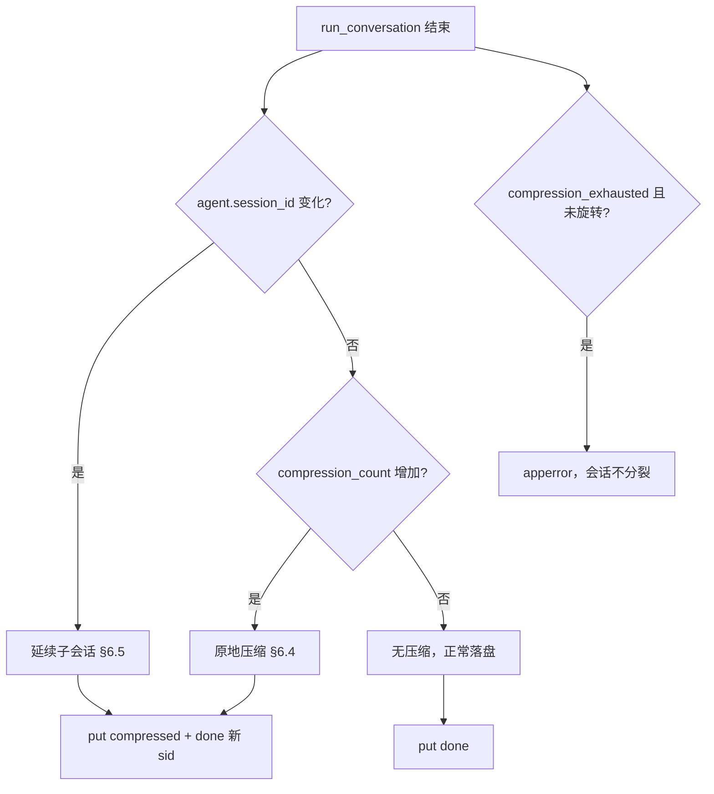

# 多轮会话交互流程

本文档说明 Hermes WebUI 在**同一个会话内进行多轮对话**时，前端与后端之间的完整交互逻辑、数据流及关键实现细节。

---

## 1. 架构总览

多轮对话基于 **同一 `session_id` + 每轮独立的 `stream_id`** 组织。每一轮对话遵循严格的生命周期：

```
用户发送  →  POST /api/chat/start  →  后台 Agent 启动  →  SSE 推送事件  →  'done' 落盘
```

### 涉及的主要文件

| 文件 | 作用 |
|------|------|
| `api/routes.py` | HTTP 路由分发：POST `/api/chat/start`、GET `/api/chat/stream` 等 |
| `api/streaming.py` | Agent 流式执行：`_run_agent_streaming()`、`_handle_chat_steer()` |
| `static/messages.js` | 前端发送消息、SSE 连接与事件处理 |
| `static/ui.js` | 前端 UI 辅助函数 |
| `api/session_manifest.py` | 会话 Manifest（成果/待办/参考）管理 |
| `api/compression_anchor.py` | 自动压缩锚点管理 |

---

## 2. 核心数据模型

### Session（会话）

每个 session 在服务端持久化存储，关键字段：

```
s = {
  session_id: str,           # 会话唯一 ID，跨轮不变
  messages: Message[],       # 展示用消息列表，每轮累加
  context_messages: Message[],  # 发给模型的完整上下文（含压缩历史）
  active_stream_id: str|None,  # 当前活跃的 stream ID
  pending_user_message: str|None,  # 尚未被 Agent 消费的用户消息
  pending_attachments: [],    # 待处理的附件
  workspace: str,             # 工作区路径
  model: str,                 # 模型名称
  model_provider: str,        # 模型提供商
  profile: str,               # 所属 profile
  tool_calls: ToolCall[],     # 全会话工具调用记录
  ...
}
```

### Stream（流）

每轮对话生成一个独立 stream：

```python
stream_id = uuid.uuid4().hex  # 每轮新生成
STREAMS[stream_id] = StreamChannel  # SSE 事件队列
```

### 消息列表的累积

```
# 第一轮完成后
s.messages = [
  {role: "user",     content: "第一轮的问题"},
  {role: "assistant", content: "第一轮的回答", tool_calls: [...]},
]

# 第二轮完成后
s.messages = [
  {role: "user",     content: "第一轮的问题"},
  {role: "assistant", content: "第一轮的回答", tool_calls: [...]},
  {role: "user",     content: "第二轮的问题"},
  {role: "assistant", content: "第二轮的回答", tool_calls: [...]},
]

# 以此类推...每轮追加一对 user + assistant 消息
```

---

## 3. 完整交互流程

### 3.1 前端发送消息（`messages.js`）

```
用户按下回车/发送按钮
  │
  ├─ 如果当前有活跃 stream（S.activeStreamId !== null）
  │   ├─ steer 模式  → POST /api/chat/steer（注入提示，不中断）
  │   ├─ interrupt 模式 → 队列消息 + 取消当前流
  │   └─ queue 模式 → 队列消息，等 drain 自动发送
  │
  └─ 如果没有活跃 stream（正常发送路径）
      │
      ├─ 乐观 UI：push user msg → S.messages → renderMessages()
      ├─ 显示 thinking spinner
      ├─ POST /api/chat/start {session_id, message, model, workspace, ...}
      │
      ├─ 成功 → 获取 stream_id
      │   ├─ S.activeStreamId = stream_id
      │   ├─ 连接 SSE EventSource → /api/chat/stream?stream_id=xxx
      │   └─ 等待 SSE 事件
      │
      └─ 失败
          ├─ 409（session 已有活跃 stream）→ 队列消息
          ├─ 404（session 已被删除）→ 重置 UI
          └─ 其他错误 → 显示错误提示
```

### 3.2 后端处理 `/api/chat/start`（`routes.py` `_handle_chat_start`）

```
POST /api/chat/start
  Body: {session_id, message, model, workspace, model_provider, attachments, ...}
  │
  ├─ 1. 验证字段（session_id、message 必填）
  ├─ 2. 加载 session（get_session）
  ├─ 3. 解析 workspace、model、provider
  │     └─ 支持从 profile 配置中读取默认 provider/model
  │
  ├─ 4. 检查并发保护
  │     ├─ _active_stream_blocks_chat_start()
  │     │   → 检查 STREAMS 字典 + ACTIVE_RUNS 字典
  │     │   → 检查 pending_user_message 是否在宽限期内（30s）
  │     └─ 如果冲突 → 返回 409 {"error": "该会话已有正在进行的对话流"}
  │
  ├─ 5. _start_chat_stream_for_session()
  │     ├─ _prepare_chat_start_session_for_stream()
  │     │   ├─ s.workspace = workspace
  │     │   ├─ s.model = model
  │     │   ├─ s.active_stream_id = stream_id（新生成 uuid4）
  │     │   ├─ s.pending_user_message = msg
  │     │   ├─ s.pending_attachments = attachments
  │     │   ├─ 设置 provisional title（从消息内容推断）
  │     │   ├─ 如果 save_mode == "eager" → 立即写入用户消息到 s.messages
  │     │   └─ s.save()
  │     │
  │     ├─ 注册 SSE channel（create_stream_channel → STREAMS[stream_id]）
  │     │
  │     └─ 启动后台线程 _run_agent_streaming(session_id, msg, model, ...)
  │
  └─ 6. 返回 JSON {stream_id, effective_model, ...}
```

### 3.3 Agent 流式执行（`streaming.py` `_run_agent_streaming`）

```
_run_agent_streaming(session_id, msg_text, model, workspace, stream_id, ...)
  │
  ├─ 1. 注册 ACTIVE_RUNS
  ├─ 2. 初始化 RunJournal（崩溃恢复用）
  ├─ 3. 创建 cancel_event 信号量
  ├─ 4. 加载 session，获取 _previous_messages（全部历史）
  │     └─ _previous_messages = s.messages（含之前所有轮次）
  │
  ├─ 5. 构建 Agent（含预设、技能、MCP 等）
  │     └─ agent.run_conversation(msg_text, _previous_messages, ...)
  │         └─ Agent 以全部历史为上下文开始执行
  │
  ├─ 6. Agent 执行过程中实时推送 SSE 事件
  │     ├─ 'token' {text}               → 流式文本
  │     ├─ 'reasoning' {text}           → 推理过程
  │     ├─ 'interim_assistant' {text}   → 中间小结（工具调用后）
  │     ├─ 'tool' {name, args, tid}     → 工具开始
  │     ├─ 'tool_complete' {name, result, tid} → 工具完成
  │     ├─ 'manifest_delta' {...}       → 侧栏增量更新
  │     ├─ 'todo_state' {todos, ts}     → Todos 面板快照
  │     ├─ 'browser_preview' {url}      → 浏览器预览
  │     ├─ 'approval' {...}             → 需要用户批准
  │     ├─ 'clarify' {...}              → 需要用户澄清
  │     ├─ 'state_saved' {...}          → 持久化状态变更
  │     ├─ 'title' {title}              → 标题更新
  │     ├─ 'context_status' {...}       → 上下文加载状态
  │     ├─ 'goal' {...}                 → 目标评估状态
  │     └─ 'goal_continue' {...}        → 目标继续（自动下一轮）
  │
  ├─ 7. Agent 完成（run_conversation 返回）
  │     ├─ 检查 cancel 信号 → 走取消路径
  │     ├─ 合并/去重 _result_messages
  │     ├─ 清理 XML 工具调用标签（DeepSeek 等）
  │     ├─ 处理自动压缩（见 §6.3：可能原地压缩或旋转 session_id）
  │     ├─ 持久化：
  │     │   ├─ s.context_messages = _next_context_messages（压缩后）
  │     │   ├─ s.messages = _merge_display_messages(...)（展示用）
  │     │   ├─ s.active_stream_id = None（清除）
  │     │   └─ s.save()
  │     │
  │     ├─ 发送 'done' 事件 {session: {...}, usage: {...}}
  │     ├─ 发送 'metering' 事件（最终 TPS 指标）
  │     │
  │     └─ 发送 'stream_end' 事件 → SSE 连接关闭
  │
  └─ 8. finally 块
        ├─ 停止 metering ticker
        ├─ 注销 approval/clarify 回调
        ├─ 清理环境变量
        ├─ 清理 STREAMS/CANCEL_FLAGS/AGENT_INSTANCES
        ├─ 持久化 inflight 状态（用于恢复）
        └─ 发布 session_list_changed 事件
```

### 3.4 前端 SSE 事件处理（`messages.js` `attachStream`）

```
EventSource → /api/chat/stream?stream_id=xxx
  │
  ├─ 'token' 事件
  │   ├─ assistantText += d.text
  │   ├─ syncInflightAssistantMessage()
  │   └─ _scheduleRender() → rAF 节流更新 DOM
  │
  ├─ 'reasoning' 事件
  │   ├─ reasoningText += d.text
  │   ├─ liveReasoningText += d.text
  │   └─ _updateLiveThinkingCard()
  │
  ├─ 'tool' 事件（工具开始）
  │   ├─ upsertLiveToolCall(d, 'start')
  │   ├─ appendLiveToolCard()
  │   └─ _freshSegment = true（准备下一段助理文本）
  │
  ├─ 'tool_complete' 事件
  │   ├─ upsertLiveToolCall(d, 'complete')
  │   ├─ noteWorkspaceMutationsFromToolCall()
  │   └─ refreshOpenPreviewIfMutated()
  │
  ├─ 'manifest_delta' 事件
  │   ├─ HermesSessionInspector.applyDelta()
  │   └─ HermesIntegrationWorkspace.onManifestDelta()
  │
  ├─ 'todo_state' 事件
  │   ├─ 检查时间戳防过期
  │   ├─ S.todos = d.todos（整体替换）
  │   └─ scheduleTodosRefresh()
  │
  ├─ 'approval' 事件 → showApprovalForSession()
  ├─ 'clarify' 事件 → showClarifyForSession()
  │
  ├─ 'done' 事件（核心终结事件）
  │   ├─ _streamFinalized = true（防止后续 rAF 干扰）
  │   ├─ _cancelAnimationFramePendingStreamRender()
  │   ├─ finalizeThinkingCard()
  │   │
  │   ├─ 更新会话状态
  │   │   ├─ S.session = d.session（服务端确认的最新状态）
  │   │   ├─ S.messages = d.session.messages
  │   │   ├─ S.activeStreamId = null ★★★ 关键：标记本轮完成
  │   │   ├─ S.toolCalls = _mergeSettledToolCallsWithLiveMetadata()
  │   │   └─ S.lastUsage = d.usage
  │   │
  │   ├─ 计算本轮 token 用量 delta（用于 per-turn 显示）
  │   ├─ 持久化 reasoning 到最后一条 assistant 消息
  │   ├─ 清理运算中状态
  │   │   ├─ clearLiveToolCards()
  │   │   ├─ S.busy = false
  │   │   ├─ clearOwnerInflightState()
  │   │   └─ removeThinking()
  │   │
  │   ├─ 刷新 Manifest（成果/待办/参考）
  │   ├─ 渲染消息（renderMessages）
  │   └─ 标记会话已读
  │
  ├─ 'stream_end' 事件
  │   └─ SSE 连接关闭
  │
  ├─ 'cancel' 事件
  │   └─ 显示取消信息，清理状态
  │
  └─ 'apperror' 事件
      └─ 显示错误提示
```

### 3.5 第二轮及后续轮次

```
第二轮交互
  │
  ├─ 第一轮完成后：S.activeStreamId === null
  │   → 输入框可用，用户可输入新消息
  │
  ├─ 重复 3.1-3.4 的完整流程
  │   └─ session_id 不变（同一会话）
  │
  ├─ 关键区别：
  │   ├─ 后端加载 session 时，s.messages 包含第一轮全部消息
  │   ├─ Agent 以完整历史 [user, assistant, user, ...] 为上下文
  │   ├─ 新的 stream_id 生成（旧的已清理）
  │   └─ 新的 SSE 连接建立（旧的已关闭）
  │
  └─ 可以持续 N 轮，直到上下文触压缩（见 §6.3–6.5）
```

---

## 4. 并发控制与防重复

### 4.1 前端侧

- `S.activeStreamId`：非空时阻止新消息发送（走队列/steer/中断）
- `LIVE_STREAMS[activeSid]`：记录当前活跃的 SSE 连接，防止重复连接

### 4.2 后端侧

`_active_stream_blocks_chat_start()`（`routes.py` `~11883`）：

```python
def _active_stream_blocks_chat_start(session, stream_id):
    # 检查 STREAMS 字典（活跃的 SSE 通道）
    if stream_id in STREAMS:
        return True

    # 检查 ACTIVE_RUNS（后台 worker 仍存活）
    if stream_id in ACTIVE_RUNS:
        return True

    # 检查 pending_user_message 宽限期（默认 30s）
    if session.pending_user_message and age < grace_seconds:
        return True

    return False
```

---

## 5. `/api/chat/steer` — 不中断的指导注入

当 Agent 正在运行时，用户可以通过 steer 模式发送指导文本。

`_handle_chat_steer()`（`streaming.py` `~7737`）：

```
POST /api/chat/steer {session_id, text}
  │
  ├─ 1. 从 SESSION_AGENT_CACHE 获取缓存的 Agent 实例
  ├─ 2. 验证 Agent 支持 steer() 方法
  ├─ 3. 验证 session 有活跃的 active_stream_id
  ├─ 4. 验证 stream 仍在 STREAMS 中
  ├─ 5. 调用 agent.steer(text)
  │     └─ 将文本注入到下一个工具结果的消息中
  │     └─ Agent 在下一轮迭代中看到指导内容
  └─ 6. 返回 {accepted: true/false, fallback: reason/null}
```

Steer 模式的 fallback 路径：

| fallback 原因 | 处理方式 |
|---------------|----------|
| `no_cached_agent` | 降级为中断 + 队列 |
| `agent_lacks_steer` | 降级为中断 + 队列 |
| `session_not_found` | 返回错误 |
| `not_running` | 正常发送新消息 |
| `stream_dead` | 返回错误 |
| `steer_error` | 返回错误 |

---

## 6. 会话过程中的压缩与派生子会话

第 3 节描述的是「同一 `session_id` 下多轮累加」的常态路径。长会话在**某一轮流式执行过程中**，Agent 的 `ContextCompressor` 可能介入：先尝试摘要/索引历史以腾出 token 预算；若仍无法继续，则**派生延续子会话**并旋转 `session_id`。本节从「流内压缩时序 → 结果分流 → 子会话 lineage → 展示拼接」串联这条旁路逻辑。

相关补充：压缩对 `_turn_key` / manifest 的影响见 [`docs/turn-key-backend.md`](turn-key-backend.md) 第 8 节。

---

### 6.1 双轨 transcript：模型上下文 vs 展示历史

理解压缩行为的前提是区分 Session 上两条消息轨：

| 字段 | 消费者 | 压缩时的典型变化 |
|------|--------|------------------|
| `context_messages` | Agent / 模型 API | **会被替换或缩短** — 中间轮次合成 `[CONTEXT COMPACTION — REFERENCE ONLY]` 摘要，或 LCM 索引后移出 inline 上下文 |
| `messages` | WebUI 聊天区、`GET /api/session`、manifest | **被动压缩时不删旧轮** — 通过 `_merge_display_messages_after_agent_result()` 在旧 display 骨架上**追加**压缩标记 + 当前轮；**手动 `/compress` 时与 context 同步替换** |

```
                    ┌─────────────────────────────────────────┐
  每轮 chat/start   │  _run_agent_streaming                   │
       │            │                                         │
       ▼            │  _previous_context_messages ──► Agent   │  ← 模型只看 context
  run_conversation  │  _previous_messages ──────────► merge   │  ← UI 保留完整 display
       │            └─────────────────────────────────────────┘
       ▼
  流式结束落盘       s.context_messages = 压缩后的模型视角
                    s.messages         = merge 后的展示视角
```

**主动压缩**（`/compress`、`POST /api/session/compress`）：两条轨**同时**被 `compressed` 列表替换，中间轮次从 display 中消失。

**被动压缩**（Agent 在 `run_conversation()` 内自动触发）：仅 `context_messages` 被大幅缩短；`messages` 仍保留全部历史 user/assistant 行，并插入一条压缩标记气泡供 UI 渲染分隔线。

---

### 6.2 压缩模式与引擎

压缩模式由 `Session` 上的 `compression_anchor_mode` 和 `compression_anchor_engine` 字段决定，前端通过 `_compressionModeForSession()`、`_compressionEngineForSession()` 读取（`static/ui.js:7436`）。

#### 6.2.1 轻量压缩（Context Compaction / `summary_compaction`）

| 项目 | 说明 |
|------|------|
| 模式值 | `summary_compaction`（默认） |
| UI 标签 | "上下文压缩"（Context compaction） |
| 引擎 | `compressor`（默认） |

行为：LLM 将早期对话总结为一段 `[CONTEXT COMPACTION — REFERENCE ONLY]` 标记，原始消息被替换掉。消息条数大幅减少、token 节省，但原始内容不可逆地丢失（保存在 `pre_compression_snapshot` 备份会话文件中）。

相关代码：
- 前端渲染区分：`_engineAwareCompressionCopy()`（`static/ui.js:7449`）在 `engine!=='lcm'` 且 `mode!=='lossless_retrieval'` 时显示 Context Compaction 标签
- 后端压缩标记检测：`is_context_compression_marker()`（`api/compression_anchor.py:56`）识别 `[context compaction`、`context compaction` 等开头的内容

#### 6.2.2 重度压缩（Indexed Context / `lossless_retrieval`）

| 项目 | 说明 |
|------|------|
| 模式值 | `lossless_retrieval` |
| UI 标签 | "已索引上下文"（Indexed context） |
| 引擎 | `lcm`（Lossless Context Management） |

行为：使用 LCM 引擎，将历史消息索引存储到外部，**不丢失内容**，后续轮次可通过上下文工具按需检索旧消息。更重的代价：需要额外存储和检索机制。

前端展示：
```javascript
// static/ui.js:7449
function _engineAwareCompressionCopy(engine, mode){
  if(engine==='lcm' || mode==='lossless_retrieval'){
    return {
      label: t('retrieval_context_label'),       // "已索引上下文"
      preview: t('retrieval_context_preview'),     // "较早消息已存储，可通过上下文工具检索"
    };
  }
  return {
    label: t('context_compaction_label'),         // "上下文压缩"
    preview: t('reference_only_label'),            // "仅供参考"
  };
}
```

---

### 6.3 单轮流式执行中的压缩时序

压缩**不是**独立的 HTTP 请求，而是嵌在第 3.3 节 `_run_agent_streaming()` 的 `agent.run_conversation()` 调用内部。WebUI 在流式前后各做一层观测与落盘。

#### 6.3.1 流式开始前

```
_run_agent_streaming 进入 run_conversation 之前
  │
  ├─ _previous_messages          ← s.messages（展示轨，含历史全部轮次）
  ├─ _previous_context_messages  ← 合并 state.db / context_messages + 本轮 user
  └─ _pre_compression_count      ← agent.context_compressor.compression_count 快照
```

`_pre_compression_count` 用于流式结束后判断「本轮是否发生过至少一次压缩」（即使 `session_id` 未旋转）。

#### 6.3.2 流式执行中（Agent 内部）

```
agent.run_conversation(msg_text, _previous_context_messages, ...)
  │
  ├─ ContextCompressor 监控 token 占用
  │     ├─ 未超阈值 → 正常 tool / token SSE
  │     └─ 接近/超过阈值 → compress()
  │           ├─ HEAD：保护前 N 轮（含 system）
  │           ├─ MIDDLE：LLM 摘要 或 LCM 外部索引
  │           └─ TAIL：保留最近 token 预算内的轮次
  │
  ├─ （可选）Agent status 回调 → put('compressing', {...})
  │     └─ 前端 Worklog 显示「Compressing context」运行中分隔卡
  │
  └─ 若上下文仍无法继续：
        ├─ 仍可压缩 → 继续当前 session_id（原地压缩）
        └─ 压缩耗尽 → hermes-agent 分配新 session_id（延续子会话）
              └─ agent.session_id ≠ 传入的 session_id
```

压缩进行中，SSE 仍照常推送 `token` / `tool` / `tool_complete` 等事件；`compressing` 仅作 UI 提示，**不**阻塞流。

#### 6.3.3 流式结束后（WebUI 落盘）

`run_conversation` 返回后，`_run_agent_streaming` 按固定顺序处理压缩副作用（`api/streaming.py` ~6430–6853）：

```
Agent 返回 result
  │
  ├─ 1. 合并 transcript
  │     s.context_messages ← 去重后的模型结果
  │     s.messages         ← _merge_display_messages_after_agent_result(...)
  │
  ├─ 2. 检测 session_id 旋转（优先于错误路径）
  │     if agent.session_id != session_id:
  │         → §6.5 延续子会话迁移（旧 id 归档、新 id 接管）
  │
  ├─ 3. 终端失败检查（auth / compression_exhausted / silent failure …）
  │     compression_exhausted → apperror，hint 建议开新会话
  │
  ├─ 4. 检测本轮是否压缩（旋转 或 compression_count 增加）
  │     if _compressed:
  │         ├─ 设置 compression_anchor_* 元数据
  │         ├─ 裁剪 context 中过大的 tool result
  │         └─ put('compressed', { old_session_id, new_session_id, usage })
  │
  ├─ 5. s.save() + put('done', { session: s.compact()|messages, usage })
  └─ 6. put('stream_end')
```

**时序要点**：

- `compressed` 在 `done` **之前**发出，前端可在 Worklog 先画完压缩分隔线，再用 `done.session` 做最终结算。
- `done.session.session_id` 已是旋转后的 **tip id**（若发生过延续）；`localStorage` / URL 在 `done` 处理里同步更新。
- `stream_end` 仍携带**本轮启动时**的 `stream_id` 对应参数，与 `done` 内的新 `session_id` 可能不同 — 客户端以 `done.session` 为准。

#### 6.3.4 压缩结果决策树



---

### 6.4 原地压缩（session_id 不变）

以下场景**不派生子会话**，所有轮次仍落在同一 JSON 文件：

#### 场景 A：正常多轮（未触发压缩）

- `s.messages` 逐轮追加 `[user, assistant, …]`
- `compression_count` 不变

#### 场景 B：手动压缩（`/compress`）

用户执行 `/compress` 或 `POST /api/session/compress`，**不经过** SSE 流：

```
POST /api/session/compress {session_id, focus_topic?}
  │
  ├─ 构建 AIAgent，调用 context_compressor.compress(original_messages)
  ├─ 加锁检查：无活跃 stream、消息未被并发修改
  │
  ├─ 原地替换（display 与 context 同步）：
  │   ├─ s.messages = compressed
  │   ├─ s.context_messages = compressed
  │   ├─ s.tool_calls = []
  │   └─ s.save()
  │
  └─ session_id 不变；`.json.bak` 可手动恢复
```

#### 场景 C：被动原地压缩（流内、阈值内）

- Agent 在 `run_conversation()` 内调用 `compress()`，但 **未** 分配新 `session_id`
- `context_messages` 缩短；`messages` 保留旧轮并 **追加** 压缩标记
- 流式结束后设置锚点并推送 `compressed` SSE：

```python
# streaming.py ~6796
for _mi, _m in enumerate(s.messages):
    if _is_context_compression_marker(_m):
        _last_marker_raw_idx = _mi
s.compression_anchor_visible_idx = ...
s.compression_anchor_message_key = _compression_anchor_message_key(anchor_msg)
s.compression_anchor_summary = ...
put('compressed', {
    'old_session_id': session_id,
    'new_session_id': session_id,          # 原地时与 old 相同
    'continuation_session_id': session_id,
    ...
})
```

压缩标记由 `is_context_compression_marker()`（`api/compression_anchor.py`）识别，UI 将其渲染为「上下文压缩 / 已索引上下文」分隔卡，**不算**真实 user turn。

---

### 6.5 派生子会话（Continuation / session_id 旋转）

当 Agent 判定上下文**无法继续压缩**（`compression_exhausted`、context length + cannot compress further 等），hermes-agent 在库内分配**新 `session_id`**，WebUI 将其建模为**延续子会话**，而非用户可见的「新对话」。

#### 6.5.1 触发与检测

```python
# streaming.py ~6448
_agent_sid = getattr(agent, 'session_id', None)
if _agent_sid and _agent_sid != session_id:
    old_sid = session_id
    new_sid = _agent_sid
    _compression_continuation_session_id = new_sid
```

常见触发信号（`streaming.py` ~892–927）：

1. `compression_exhausted` / `compression exhausted`
2. `context length exceeded` + `cannot compress further`
3. `max compression attempts reached`

若旋转**未**发生但出现上述错误 → `apperror`（`type: compression_exhausted`），**不**创建子会话。

#### 6.5.2 lineage 数据模型

一次旋转产生两个持久化实体：

| 实体 | session_id | 关键字段 | 角色 |
|------|------------|----------|------|
| **归档父会话** | `old_sid` | `pre_compression_snapshot=true` | 只读快照，保存压缩前完整 transcript；侧栏隐藏 |
| **延续 tip 会话** | `new_sid` | `parent_session_id=old_sid`，`pre_compression_snapshot=false` | 当前活跃会话，后续轮次写入此处 |

多次旋转形成**链**（非树）：`tip → parent → parent.parent → … → root`，每次只增加一个 snapshot 父节点。

```
  root (abc)          seg-1 (def)              tip (ghi)
  ─────────          ─────────────            ─────────────
  20 轮完整历史  ──►  pre_compression_snapshot  ──►  压缩后续 3 轮
  end_reason=         parent=abc                 parent=def
  compression         messages=压缩前状态         messages=当前活跃
```

`_preserve_pre_compression_snapshot(s, old_sid)`（`streaming.py` ~2848）职责：

- 将 `old_sid.json` 标记 `pre_compression_snapshot=true`
- 清除 `active_stream_id` / `pending_*` 等运行时字段，避免侧栏显示「父会话仍在跑」
- **不**删除旧文件 — 与早期「rename 覆盖」不同，保证压缩失败时仍有 recoverable history

#### 6.5.3 旋转后的内存迁移

```
检测到 agent.session_id != session_id
  │
  ├─ s.session_id = new_sid
  ├─ _preserve_pre_compression_snapshot(s, old_sid)
  ├─ s.parent_session_id = old_sid        # 覆盖旧 parent，保证链连续
  ├─ s.pre_compression_snapshot = False   # tip 必须是可编辑会话
  │
  ├─ SESSIONS / SESSION_AGENT_LOCKS / SESSION_AGENT_CACHE 键迁移
  ├─ profile / workspace 等身份字段保留到 tip
  │
  └─ put('compressed', {
        old_session_id: old_sid,
        new_session_id: new_sid,
        continuation_session_id: new_sid,
     })
```

#### 6.5.4 展示层：拼接与侧栏折叠

**消息拼接** — 打开 tip 时，`GET /api/session` 经 `_webui_sidecar_lineage_messages_for_display()` 向上遍历 `parent_session_id`，**仅**拼接 `pre_compression_snapshot=true` 的祖先：

```python
# api/routes.py ~2975
for _ in range(max_hops):
    parent = Session.load(parent_id)
    if not parent or not parent.pre_compression_snapshot:
        break
    segments.append(parent)
merged = merge_session_messages_append_only(祖先们..., session.messages)
```

Fork 虽有 `parent_session_id`，但父节点**不是** snapshot → **不拼接**，保持独立对话。

**侧栏折叠** — `_project_agent_session_rows()`（`api/agent_sessions.py` ~271）将 `end_reason in {compression, cli_close}` 的链折叠为**一条**逻辑会话；`_is_continuation_session()` 区分延续 vs fork / 普通 child：

```python
def _is_continuation_session(parent, child):
    if child.get('session_source') == 'fork':
        return False
    if parent.get('end_reason') not in {'compression', 'cli_close'}:
        return False
    # parent/child source 一致且 child.started_at >= parent.ended_at
    ...
```

前端 `_sessionLineageKey()`（`static/sessions.js` ~3989）在缺少 `_lineage_root_id` 元数据时，仍可根据 `pre_compression_snapshot` + `parent_session_id` 折叠压缩链（#2489）。

#### 6.5.5 manifest 与 turn_key 跨边界行为

- 每个 `session_id` 的 manifest **只索引本段** `messages`；父 snapshot 中的轮次不在 tip manifest 里重复出现。
- 展示拼接后 UI 仍能看到完整聊天历史，但 Inspector 的 per-turn 产物需按 `_turn_key` 在本段内查找。
- tip 内新 user 消息由 `_next_turn_key()` 在本段 transcript 上独立编号。
- 详见 [`turn-key-backend.md` §8.8](turn-key-backend.md#88-压缩延续session_id-旋转)。

---

### 6.6 会话创建方式对比

除压缩延续外，还有用户主动创建会话的路径 — 与延续子会话**语义不同**：

| 场景 | 触发方式 | API / 路径 | 特征 |
|------|----------|------------|------|
| **New Conversation** | 侧栏 / `/new` | `POST /api/session/new` | 全新根会话，无 parent |
| **Fork / 分支** | `/branch`、"Fork from here" | `POST /api/session/branch` | `session_source="fork"`，独立对话，不拼接 |
| **切换 Profile** | 用户切换配置 | — | 为新 profile 创建会话 |
| **压缩延续** | Agent 流内压缩耗尽 | （无独立 API） | `session_id` 旋转 + `pre_compression_snapshot` 父节点 |

```
压缩延续 (Continuation)                     Fork / 分支
─────────────────                          ──────────
自动（Agent 内部）                           用户主动
旧会话 → pre_compression_snapshot            普通会话，非 snapshot
侧栏折叠为一条                                独立侧栏行
end_reason=compression                       session_source=fork
parent 链拼接 display                         不拼接
```

#### 全场景对照

| 场景 | 是否分裂 | session_id | 旧消息去向 | 触发 |
|------|----------|------------|------------|------|
| 正常对话 | 否 | 不变 | 追加 | 用户发消息 |
| 手动 `/compress` | 否 | 不变 | display+context 同步替换 | 用户 |
| 被动原地压缩 | 否 | 不变 | context 缩短；display 追加标记 | 流内自动 |
| 压缩耗尽旋转 | **是** | 新 tip id | 父 JSON 归档为 snapshot | 流内自动 |
| New | — | 全新 | — | 用户 |
| `/branch` | — | 全新 fork id | 复制到新会话 | 用户 |

---

### 6.7 前端 SSE 与 session_id 迁移

| 事件 | 时机 | 前端行为 |
|------|------|----------|
| `compressing` | Agent 开始 summarizer LLM 调用 | Worklog 插入 running 压缩卡；**不**调用 `renderMessages()`（会擦掉未落盘的 live tool 卡） |
| `compressed` | 压缩完成、锚点已写入 | 压缩卡切为 done；更新 ctx 指示器 usage；原地旋转时 `new_session_id === old_session_id` |
| `done` | 本轮终结 | `S.session = d.session`；若 `session_id` 已旋转则更新 `localStorage` + URL；`S.activeStreamId = null` |
| `apperror` | 含 `compression_exhausted` | 显示错误；若旋转已发生，`d.session` / `new_session_id` 仍指向 tip |

`compressed` 处理器（`static/messages.js` ~3139）用 `old_session_id` / `new_session_id` 与当前 `S.session.session_id` 做匹配，避免 stale stream 误更新。

`done` 处理器（~2898）以 `d.session.session_id` 为权威来源完成 tip 切换；`stream_end` 的 `session_id` 参数可能仍是本轮启动 id，**不应**单独用于覆盖当前会话。

---

### 6.8 关键代码位置

| 功能 | 文件 | 行号（约） |
|------|------|-----------|
| 双轨 merge（display vs context） | `api/streaming.py` | `3719` `_merge_display_messages_after_agent_result` |
| 流开始前 `_pre_compression_count` | `api/streaming.py` | `6237` |
| session_id 旋转检测与迁移 | `api/streaming.py` | `6448–6550` |
| 压缩完成锚点 + `compressed` SSE | `api/streaming.py` | `6776–6853` |
| 压缩耗尽错误分类 | `api/streaming.py` | `892–927` |
| 手动压缩 | `api/routes.py` | `14143` `_handle_session_compress` |
| 压缩锚点 / 标记识别 | `api/compression_anchor.py` | 全部 |
| lineage 消息拼接 | `api/routes.py` | `2975` `_webui_sidecar_lineage_messages_for_display` |
| 延续 vs fork 判定 | `api/agent_sessions.py` | `214` `_is_continuation_session` |
| 侧栏压缩链折叠 | `api/agent_sessions.py` | `271` `_project_agent_session_rows` |
| 归档 snapshot 持久化 | `api/streaming.py` | `2848` `_preserve_pre_compression_snapshot` |
| 前端 `compressing` / `compressed` | `static/messages.js` | `3110` / `3139` |
| 前端 lineage 折叠 | `static/sessions.js` | `3989` `_sessionLineageKey` |
| 压缩模式 UI 文案 | `static/ui.js` | `7436` / `7449` |
| New / Fork API | `api/routes.py` | `6961` / `7681` |

---

## 7. 异常恢复路径

### 7.1 SSE 断线重连

```
SSE onerror
  │
  ├─ 检查 session 是否仍活跃
  ├─ GET /api/chat/stream/status?stream_id=xxx
  │
  ├─ 如果 stream 仍 active → 重新连接 SSE（含 run journal replay）
  ├─ 如果 stream 已结束但有 journal → replay 模式
  └─ 如果 stream 已结束无 journal → _restoreSettledSession()
      └─ 重新加载 session 的最新状态
```

### 7.2 页面关闭/隐藏

```javascript
// 页面隐藏时 SSE 断开 → 暂缓错误处理
// 页面重新可见时重连
document.addEventListener('visibilitychange', resume);
window.addEventListener('focus', resume);
window.addEventListener('pageshow', resume);
```

### 7.3 刷新恢复

```javascript
// localStorage 中保存 INFLIGHT 状态
const INFLIGHT_STATE_KEY = 'hermes-webui-inflight-state';

// 刷新后恢复：
// 1. 读取 INFLIGHT 状态（含 stream_id, messages）
// 2. GET /api/chat/stream/status 检查 stream
// 3. 如果 stream 仍活跃 → 重新连接 SSE + journal replay
// 4. 如果 stream 已结束 → 重新加载 session
```

---

## 8. 接口一览

| 接口 | 方法 | 用途 | 请求体/参数 | 返回 |
|------|------|------|-------------|------|
| `/api/chat/start` | POST | 发送消息，启动 Agent | `{session_id, message, model, workspace, ...}` | `{stream_id, effective_model, ...}` |
| `/api/chat/stream` | GET | SSE 流式连接 | `?stream_id=xxx` | SSE 事件流 |
| `/api/chat/stream/status` | GET | 检查 stream 状态 | `?stream_id=xxx` | `{active, replay_available}` |
| `/api/chat/cancel` | POST | 取消当前流 | `{stream_id}` | `{ok: true}` |
| `/api/chat/steer` | POST | 注入指导文本（不中断） | `{session_id, text}` | `{accepted, fallback}` |
| `/api/session/compress` | POST | 手动压缩上下文 | `{session_id, focus_topic?}` | `{ok, summary, ...}` |
| `/api/session/manifest` | GET | 拉取会话 Manifest | `?session_id=xxx` | `{artifacts, references, todos}` |

---

## 9. SSE 事件类型汇总

| 事件 | 阶段 | 触发时机 | 前端处理 |
|------|------|----------|----------|
| `token` | 流式 | 模型输出文本 token | 追加 assistantText → 渲染 |
| `reasoning` | 流式 | 模型推理/思考过程 | 更新 Thinking Card |
| `interim_assistant` | 流式 | 工具调用后的中间小结 | 插入 interim 气泡 |
| `tool` | 流式 | 工具开始执行 | 创建/更新 Live Tool Card |
| `tool_complete` | 流式 | 工具执行完成 | 标记完成，记录文件变更 |
| `manifest_delta` | 全阶段 | 成果/待办/参考增量 | 侧栏 Inspector 增量合并 |
| `todo_state` | 全阶段 | Todos 快照更新 | 整体替换 Todos 面板 |
| `approval` | 全阶段 | 需要用户批准工具调用 | 显示 Approval Card |
| `clarify` | 全阶段 | 需要用户澄清 | 显示 Clarify Card |
| `state_saved` | 全阶段 | 持久化状态变更 | Toast 提示 |
| `title` | 全阶段 | 会话标题更新 | 更新标题 |
| `context_status` | 全阶段 | 上下文预填充状态 | Composer 状态提示 |
| `goal` | 全阶段 | 目标评估状态 | Composer 状态 + Toast |
| `goal_continue` | 全阶段 | 目标驱动自动续轮 | 自动发起下一轮 |
| `browser_preview` | 流式 | 浏览器预览可用 | 打开预览/Toast |
| `metering` | 流式 | 周期性 TPS 更新 | 更新速率显示 |
| `compressing` | 流式 | Agent 开始自动压缩 summarizer 调用 | Worklog 插入 running 压缩分隔卡 |
| `compressed` | 流式 | 压缩完成（原地或旋转后） | 压缩卡切 done；更新 ctx 指示器 |
| `done` | 终结 | Agent 完成本轮 | 替换消息、清空状态、启用输入 |
| `stream_end` | 终结 | SSE 流结束 | 关闭 EventSource |
| `cancel` | 终结 | 用户/系统取消 | 清理、显示取消信息 |
| `apperror` | 异常 | 应用级错误 | 显示错误提示 |

---

## 10. 关键代码位置

| 功能 | 文件 | 行号（约） |
|------|------|-----------|
| `/api/chat/start` 处理入口 | `api/routes.py` | `12305` `_handle_chat_start` |
| stream 启动与防重复 | `api/routes.py` | `11964` `_start_chat_stream_for_stream` |
| 持久化 pending 状态 | `api/routes.py` | `11831` `_prepare_chat_start_session_for_stream` |
| 活跃 stream 防重复检查 | `api/routes.py` | `11883` `_active_stream_blocks_chat_start` |
| Agent 后台执行主循环 | `api/streaming.py` | `4604` `_run_agent_streaming` |
| SSE `put` 函数（事件入队） | `api/streaming.py` | `4881` |
| `done` 事件发射 | `api/streaming.py` | `7425` |
| `/api/chat/steer` 处理 | `api/streaming.py` | `7737` `_handle_chat_steer` |
| SSE stream 连接处理 | `api/routes.py` | `9421` `_handle_sse_stream` |
| 前端发送消息入口 | `static/messages.js` | `~690` |
| 前端 `POST /api/chat/start` 调用 | `static/messages.js` | `946` |
| SSE 事件绑定（`_wireSSE`） | `static/messages.js` | `2466` |
| `done` 事件前端处理 | `static/messages.js` | `2836` |
| SSE 断线重连 | `static/messages.js` | `1532` `_reattachOrRestoreAfterDeferredStreamError` |
| INFLIGHT 状态持久化 | `static/ui.js` | `4854` |
