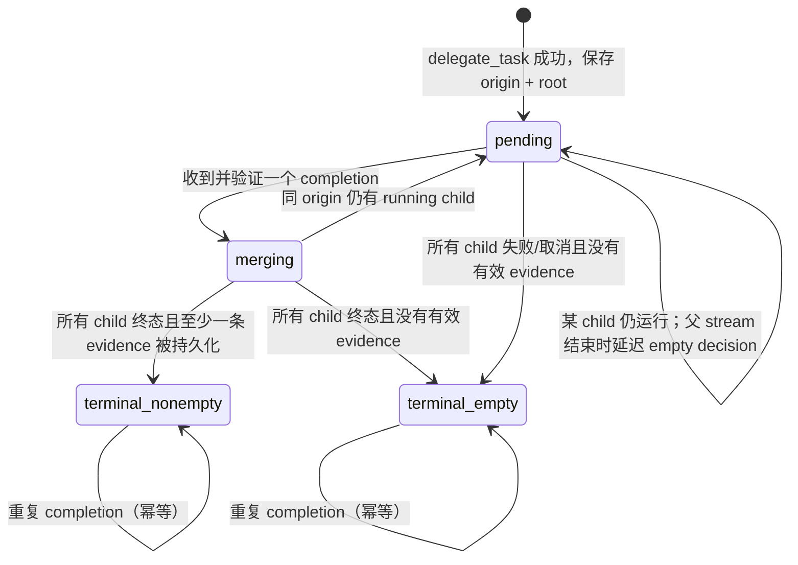

# 异步委派的 Workspace 边界与成果归属

- **状态：** Proposed
- **作者：** @wzq
- **创建日期：** 2026-08-14
- **关联契约：** [异步委派完成的 Turn 对齐与实时展示](async-delegation-turn-alignment.md)、[Session Manifest HTTP/SSE 契约](../api/session-manifest-api.md)、[Session Manifest Artifacts 实现](../architecture/session-manifest-artifacts.md)

## 问题

一个 WebUI session 已有自己的 `Session.workspace`，例如：

```text
/workspace/sessions/024b17a12137
```

WebUI 在启动 Agent 时也会把这个路径作为 `TERMINAL_CWD` 注入。这个值只能设定
相对路径的默认工作目录，不能约束显式绝对路径。后台子任务若调用：

```json
{"path":"/workspace/国内主流Agent平台调研报告.md"}
```

Agent 的文件工具会按这个绝对路径写入，而不是将其重写到 session workspace。因此，
文件最终出现在 `/workspace/`，不是 `/workspace/sessions/<session_id>/`。这不是
`TERMINAL_CWD` 被错误覆盖，而是“默认 cwd”和“可写路径边界”是两种不同的契约。

这还会引发一个独立但相邻的问题：第一轮真实 user turn 可能没有 artifact。当前
Manifest 只接受父 stream 自身的、结构化且成功的 mutation 事件；它刻意不扫描 terminal
stdout，也不把 `read_file` 当作成果写入证据。异步子任务的写入事件只存在于子任务
transcript，父任务通常只看到 `delegate_task` 的成功结果和完成摘要。因此即便子任务被
改为写进正确 workspace，父 turn 仍可能先写入 empty decision，之后 `GET /manifest` 也不会
回填它。

现有 [异步委派 Turn 对齐 RFC](async-delegation-turn-alignment.md) 已解决完成唤醒的逻辑
turn 所有权：completion 的后续消息、MEDIA 和 artifact 归属到派发时的真实 user turn。它
不传递子任务的写入证据，也不定义子任务的 workspace 边界；本 RFC 补齐这两个缺口。

## 目标

1. 每次后台 `delegate_task` 派发都冻结一个唯一、规范化的 workspace root，来源只能是
   派发时的 `Session.workspace`。
2. 受该 root 约束的子任务，其文件 mutation 工具只能修改 root 内的真实路径；相对路径以
   root 为基准，绝对路径和 symlink 逃逸均被拒绝。
3. 子任务在成功完成后，以结构化、可校验的方式把实际写入成果回传；父任务绝不从摘要、
   stdout 或目录扫描猜测成果。
4. 已登记的异步子任务仍在运行时，父 origin turn 不得写入不可逆的 empty artifact
   decision；所有子任务终态后才结算为空或非空。
5. 所有异步成果必须用 `delegation_id → origin turn_key` 的既有映射归属，不能按“最新
   user”、文本相似度或路径相似度推断。
6. 实现必须在 session、profile 与 workspace root 三个维度隔离，并对重复 completion、
   取消和乱序完成保持幂等。

## 非目标

- 不扫描 workspace、terminal stdout、子任务摘要、模型 prose 或历史 transcript 来寻找
  artifact。
- 不自动修复历史 empty decision，也不迁移或重绑旧会话的 artifact；历史记录仍按现有
  显式维护工具处理。
- 不改变同步委派或普通非委派 Agent 运行的文件行为；v1 只覆盖后台 `delegate_task`。
- 不把“子任务 terminal 默认 cwd 是 workspace”表述为沙箱安全保证。shell 仍可使用绝对
  路径写到 workspace 外；若要约束 terminal，需要独立的容器挂载/OS sandbox/allow-write
  policy 设计，不能靠 prompt 或 cwd 假装解决。
- 不让 Hermes Agent 的异步完成正文携带或猜测 WebUI turn key。turn 所有权仍是 WebUI
  sidecar 状态。

## 术语与权威状态

| 名称 | 权威拥有者 | 定义 |
| --- | --- | --- |
| session workspace root | WebUI `Session.workspace` | 某个 session 的持久 workspace；派发前 canonicalize，且必须是存在的目录。 |
| dispatch workspace root | WebUI 异步委派 sidecar | 成功派发时冻结的 session root；之后不从环境变量、进程 cwd 或当前 profile 重新推断。 |
| child workspace scope | Hermes Agent task context | 绑定 child task id 与 dispatch root 的短生命周期能力；只在后台 child 运行期间有效。 |
| child mutation evidence | Hermes Agent | 子任务成功完成的 allow-list mutation tool 返回的 canonical 路径，非 stdout、非摘要。 |
| origin turn | `async_delegation_origins[delegation_id].turn_key` | 派发后台任务的真实 user turn。 |
| artifact settlement | WebUI Manifest store | origin turn 对已登记异步委派的 `pending` / `terminal` 结算状态。 |

下列不变量必须同时成立：

```text
child_path.resolve().relative_to(dispatch_workspace_root.resolve()) succeeds
completion.delegation_id maps to exactly one same-session origin record
origin_record.workspace_root == dispatch_workspace_root
artifact.turn_key == origin_record.turn_key
```

任何一条不成立，都应拒绝该条 evidence 并记录可诊断原因；不得降级为猜测或绑定到其他
turn。

## 提案

### 1. 派发时冻结 workspace，而非依赖进程环境

WebUI 在收到一个成功的后台 `delegate_task` 结果时，取得当前 session 的
`Session.workspace`，执行 `resolve()`、目录存在性与可信 session-root 校验，再把这个
canonical absolute root 与现有 origin record 一起原子保存：

```json
{
  "async_delegation_origins": {
    "deleg_123": {
      "turn_key": "turn:1",
      "workspace_root": "/workspace/sessions/024b17a12137",
      "created_at": 1786004400,
      "status": "running",
      "wakeup_state": "idle",
      "artifact_settlement": "pending",
      "artifact_protocol_version": 1
    }
  }
}
```

`workspace_root` 是 dispatch identity 的一部分。已有旧 record 没有该字段时不得补猜；
它们保持现有行为。注册与 origin mapping 必须在同一次 session sidecar 保存中成功，不能
出现“任务已派发但没有 root/turn 归属”的半状态。

WebUI 仍设置 `TERMINAL_CWD`，以便 terminal 和相对路径拥有正确默认目录。但 Agent 获得
workspace scope 的来源应是 task-scoped、显式传递的值，例如 parent Agent 的
`_webui_workspace_root`，而不是全局 `os.environ`。同一进程可同时服务多个 session，进程
环境不是并发隔离的权威状态。

### 2. Agent 的 child workspace scope 与文件工具边界

Hermes Agent 的后台委派实现增加一个仅供 child 使用的 workspace-scope registry：

```text
child_task_id -> canonical workspace_root
```

创建 child 前，`delegate_tool` 从 parent 的显式 workspace root 创建此 scope；child 的
默认 cwd 也设为该 root。无 scope 的普通 Agent、CLI 和同步流程不改变现有兼容行为。

所有可以改变文件系统的 child file tool 都必须在真正执行前使用同一个解析函数：

```python
requested = Path(raw_path)
candidate = (root / requested).resolve() if not requested.is_absolute() else requested.resolve()
candidate.relative_to(root.resolve())  # ValueError -> reject
```

实际实现须覆盖 `write_file`、`create_file`、`edit_file`、`patch`、`apply_patch`，以及向
child 暴露的同类 MCP filesystem mutation 工具。多路径操作（例如 patch 的新增、更新、
重命名目标）须逐个验证；不得只验证第一个参数。路径经过 `resolve()` 后再检查，因而
`../` 与指向 root 外的 symlink 都会被拒绝。

错误应明确说明“后台子任务只能写入本会话 workspace”，但不得泄露其他 session 的实际
路径。拒绝是 tool failure，不应把外部路径悄悄改写到 root 下，因为这种改写会掩盖用户
意图并可能覆盖错误文件。

terminal 的默认 cwd 同步改为 root，改善下面这种常见写法：

```sh
mkdir -p reports && printf '...' > reports/result.md
```

但 terminal 的绝对路径写入不进入 v1 的“受限 file mutation”安全保证。产品若要求这项
保证，后续 RFC 必须用实际执行隔离实现，而非扩大本 RFC 的责任。

### 3. 只收集已完成的结构化 child mutation evidence

Agent 为每个 child 维护一个内存 evidence ledger。只有满足全部条件的 tool event 才能
写入 ledger：

1. tool 属于 Manifest 的 mutation allow-list；
2. 调用有明确 completed/success 状态，未报告 error 或非零执行失败；
3. 结果提供实际的 resolved path，或能由该次结构化 mutation 参数和 diff 唯一得出；
4. canonical path 位于该 child workspace scope；
5. 写入结束时该路径仍是普通、可预览的文件，且不在 uploads、`.git`、缓存或其它
   artifact exclusion 区域。

ledger 存相对于 root 的 POSIX 路径并按 path 去重。读取工具、terminal stdout、目录列举、
模型文字和 `delegate_task` summary 永远不能进入 ledger。子任务取消、异常或 timeout 时，
只回传已成功结束的工具 evidence；未完成调用不推断为成功。

后台 batch completion 在现有 completion payload 上可选增加协议化字段：

```json
{
  "protocol_version": 1,
  "delegation_id": "deleg_123",
  "status": "completed",
  "workspace_root": "/workspace/sessions/024b17a12137",
  "artifacts": [
    {
      "path": "reports/国内主流Agent平台调研报告.md",
      "child_source_tool": "write_file",
      "preview": "file"
    }
  ]
}
```

这里的 root 仅供 WebUI 做相等性校验；artifact path 必须是相对路径。completion 不携带
`turn_key`、用户内容、绝对子文件路径或未过滤的 tool output。`artifacts` 缺失表示旧 Agent
或不支持该协议，不能由 WebUI 从 summary 补造。

### 4. WebUI 的验证、归属与 settlement 状态机

WebUI 收到协议 v1 completion 时按以下顺序处理：

1. 以完整 session/profile identity 查找 `delegation_id` 的 origin record；不存在或重复映射
   时拒绝。
2. 检查 protocol version、completion root 与 record 的 `workspace_root` 完全相等。
3. 对每条 relative `path` 重新按 record root resolve，拒绝绝对路径、`..`、symlink escape、
   不存在、目录、不可预览或 cruft 文件。
4. 以已登记的 `turn_key` 写入 artifact store；wire 的 `source_tool` 使用 `delegate_task`，
   child 的实际工具名仅在 journal/诊断 provenance 中保存，避免将 child `write_file` 伪装为
   父 transcript 内的直接工具调用。
5. 用 `delegation_id` 记录 completion receipt（含 digest/path set），重复或重放事件只做
   幂等确认，不新增 artifact。
6. 将该 delegation 标为 terminal；同一 origin turn 的全部已登记 delegation 都 terminal
   后，执行最终 empty/non-empty decision 结算。

阶段 4 至 6 必须放在同一把 session/manifest identity 锁或同一事务性临界区，防止两个
completion 并发时一个错误地写入 empty marker。异步 evidence 只能追加到**同一 root、同一
origin turn、同一已登记 delegation**；这不是对历史 empty decision 的 read-repair，也不能
被普通 `GET /manifest` 调用触发。

状态转移如下：



父 origin stream 自身有直接 artifact 时，照现有规则立即写入非空 record；异步 child
completion 后以受限 merge 追加。父 stream 没有直接 artifact、但同 turn 存在 `pending`
delegation 时，不写 empty marker，只在 turn journal 写入 `artifact_settlement_deferred`。
最后一个 delegation 终态后：已有任何有效 artifact 则标为 non-empty；否则只写一个现有
格式的 empty marker。这样 Manifest 的 decision-first 契约仍成立，只是对于明确登记的
异步工作，decision 的最终性被延后到工作真正结束。

若 completion 因 root 不一致、path 非法或 record 不存在而被拒绝，它仍使对应已验证
`delegation_id` 的 lifecycle 到达 terminal，但 journal 必须保留 rejection reason。所有
delegation 终态后，无有效 artifact 时才写 empty marker；不能因为一条坏 evidence 使
origin turn 永远 pending。

### 5. 进程/持久化边界与恢复

child workspace scope 和 evidence ledger 是 Agent 运行期状态；WebUI origin mapping、
workspace root、completion receipt 与 artifact decision 是 durable 状态。进程在 child 完成
前重启时，WebUI 可根据已有 `async_delegation_origins` 和 Agent 的 completion 重放继续
验证。没有协议 v1 completion 的旧任务不尝试恢复 artifact，只按旧语义完成。

WebUI 在恢复时不得用当前 `Session.workspace` 覆盖 origin record 中已经冻结的 root。若
record root 不存在、session 已删除或 profile identity 不同，completion 必须 fail closed；
可以结束 lifecycle，但不写 artifact 到其他 workspace。

## 跨仓库实施边界

这是一个 WebUI 主导、Hermes Agent 协作的契约。两端须分开发布、分别测试；只升级一侧时
不能改变旧任务的 artifact 语义。

| 仓库 | 实现位置 | 责任 |
| --- | --- | --- |
| Hermes WebUI | `integration/async_delegation_turns/` 新增 artifact settlement 状态/处理；`api/streaming.py` 仅保留根注入与 completion hook | 冻结 root、保存 origin、验证 completion、持久化/投影 artifact。 |
| Hermes WebUI | `integration/session_manifest/store.py` 与 manifest 现有持久化入口 | 提供仅限已登记 delegation 的原子 merge 和延迟 empty decision。 |
| Hermes Agent | `tools/delegate_tool.py` 与 task-context 辅助模块 | 建立/清理 child workspace scope、默认 cwd、收集 child evidence、发出 v1 completion。 |
| Hermes Agent | `tools/file_tools.py` 及同类 mutation adapter | 在执行前以 scope 为界验证所有 mutation path，并报告 canonical 成功路径。 |

Fork 特有的 WebUI 业务逻辑放在 `integration/`；上游接缝文件只增加小的调用点或数据注入。
若 completion payload 成为公开 SSE/API 字段，须同时更新对应 API contract；如果它只在
WebUI 与 Agent 的内部 completion 通道流动，则不向公开 Manifest wire 增加 child task id、
绝对 root 或原始 tool output。

## 测试与验收

### Hermes Agent

- child 使用相对路径写入时，文件落在 dispatch root；绝对 root 内路径也允许。
- `/workspace/foo.md`、`../foo.md`、经 symlink 指向 root 外的路径均被拒绝，且 root 外文件
  不存在或未变化。
- patch、multi-edit、rename/destination 与 MCP mutation adapter 对每个目标均执行边界检查。
- 同一 Agent 进程的两个 session root 并发派发不会串用环境变量或 cwd；取消、异常、timeout
  后 scope 被清理，后续非委派调用不继承约束。
- ledger 只收集 completed successful mutation；read、failed mutation、terminal stdout、summary
  与未完成调用均不产生 artifact。
- batch completion 的相对 paths 稳定去重，且不含 turn key、绝对 artifact path 或原始 stdout。

### Hermes WebUI

- 用报告的复现场景建 fixture：`turn:1` 成功派发三个 child，child 各在 session workspace
  写入；全部完成后 Manifest 的 `turn:1.artifacts` 包含对应相对路径，不产生 orphan turn。
- 父 stream 先结束、child 仍运行时没有 empty marker；最后一个 child 结束后恰好产生一份
  terminal decision。
- 有父直接 artifact 时先持久化，child 后完成后只向同一 turn/root 合并；不会覆盖或复制。
- completion 乱序、重复投递、重放后没有重复 path；一个 child 失败/取消不阻止其他 child
  的有效 artifact。
- root 不一致、绝对路径、外部路径、symlink escape、错误 session/profile 或未知 delegation
  都被拒绝，且不会污染任何其他 session/turn。
- 用户在 child 运行期间发出后续真实 turn 时，completion 仍归属 dispatch 时的 origin turn。
- 旧 origin record、旧 Agent completion、历史 empty decision 保持原有行为；`GET /manifest`
  始终只读，不会触发上述 merge 或 repair。

验收时至少人工执行一次三子任务写入：确认所有生成文件都在
`/workspace/sessions/<session_id>/` 内，Session Inspector 的原始 turn 显示三个 artifact，
且没有因读取或 terminal 输出额外登记文件。

## 发布、兼容与迁移

分两阶段上线，并保留一个可关闭的 feature gate，例如
`HERMES_ASYNC_DELEGATION_WORKSPACE_ARTIFACTS`：

1. **Agent 先行。** Agent 支持显式 child scope 和可选 v1 completion 字段，但未收到 WebUI
   root 时维持兼容行为；本阶段不要求 WebUI 解析新字段。
2. **WebUI 启用。** WebUI 在成功派发时写入 `workspace_root` 与 protocol version，并只对
   同时满足“origin record 为 v1 + completion 为 v1 + root 完全匹配”的事件启动 deferred
   settlement/merge。其余任务完全走旧路径。

不要做历史 DB 回填、workspace 扫描或根据 summary 的修复。上线前已经写入的 empty decision
保留为空；若运营确需修复，仍通过单独、人工审核的显式维护流程进行。双端灰度期间应记录
不含敏感正文的计数指标：scope 拒绝数、completion root mismatch、evidence rejection、
deferred settlement 数、幂等重放数与 terminal-empty 数。

待双方部署稳定后，可以把 feature gate 默认打开，但应保留至少一个版本周期的关闭开关和
兼容解析路径。文档同步更新：本 RFC、Session Manifest artifacts 契约、异步委派 Turn
alignment RFC 的关联链接，以及 Agent 的工具协议说明。

## 实施切分

每一步都应在对应仓库中保持测试通过；开始实现前先确认维护者接受此 RFC 与集成落点。

| 切分 | 改动 | 可验证结果 |
| --- | --- | --- |
| 1 | Agent 新增 task-scoped workspace root、生命周期清理和 file mutation 边界测试。 | child 相对写入正确，root 外/escape 写入失败。 |
| 2 | Agent 增加 evidence ledger 与 v1 completion payload，覆盖成功、失败、取消、重放。 | payload 只包含 root 内的相对、成功写入路径。 |
| 3 | WebUI 在成功 dispatch 时原子保存 v1 origin root/settlement 状态；父结算识别 pending 并延迟 empty marker。 | child 运行中 origin turn 不会被过早固定为空。 |
| 4 | WebUI 新增 completion 验证、幂等 receipt 与受限 artifact merge。 | 有效 child evidence 精确归属 origin turn；非法 evidence 无污染。 |
| 5 | 端到端并发/恢复测试、feature gate、运营指标与契约文档更新。 | 多 session、多 child、后续 user turn 和重放均满足不变量。 |

## 被否决的方案

- **只改 prompt 或 `TERMINAL_CWD`：** 能改善相对路径，但绝对路径仍可逃出 workspace，且
  不会把子任务工具事件变成父 turn artifact。
- **父任务 `read_file` 子任务输出：** 读取是瞬态证据，按 Manifest 契约不应产生 artifact。
- **扫描 `/workspace`、解析 terminal stdout 或 completion summary：** 这会把不属于 session
  的文件、失败写入或模型猜测误登记为成果，违背显式、成功结构化证据原则。
- **按 completion 到达时的最新 user turn 归属：** 用户可以继续对话，必然错绑；必须使用
  `delegation_id` 的 dispatch-time origin mapping。
- **自动替换历史 empty marker：** 这会把一次读操作变成有副作用的 backfill，并会把不完整
  历史证据伪装成确定成果。

## 开放问题

1. v1 是否需要在公开 SSE 中暴露异步 artifact settlement 状态，还是仅由 Manifest 最终
   projection 呈现？建议先仅内部使用，避免暴露 child task id 与运行细节。
2. `source_tool` 当前建议为 `delegate_task`，child 实际 mutation tool 只进内部 journal；若
   产品需要在 Inspector 展示二级 provenance，应单独扩展 wire schema，而不是复用父工具名。
3. 若产品要求 terminal 也不可写 root 外，应选择 Docker bind mount、macOS sandbox 还是
   remote executor allow-list；这需要独立的威胁模型与跨平台 RFC。
