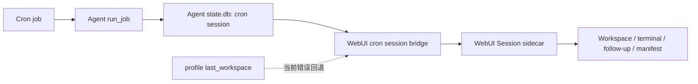
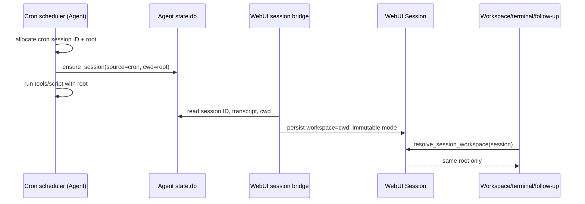

# Cron 会话独立 Workspace

- **Status:** Proposed
- **Author:** Hermes WebUI maintainers
- **Created:** 2026-08-11

## 问题

Cron Hub 会把 Hermes Agent 的 `source=cron` 运行物化为 WebUI 会话，以便在侧栏、会话详情、Session Inspector 和 Workspace 面板中查看它们。每一次运行通常有独立的 `cron_<job>_<timestamp>` session ID，但 workspace 的归属并不稳定：

- Agent 运行时仅将 job 的 `workdir` 作为临时 `TERMINAL_CWD` / `cwd`；没有 `workdir` 时沿用调度器环境。
- WebUI 的 cron materializer 通过 `import_cli_session()` 建立 sidecar，而该函数当前以 profile 的 `last_workspace` 作为 workspace。
- `no_agent` 脚本任务在进入 Agent `state.db` 前会短路，不能可靠地持久化 session ID 和 `cwd`。

因此两个不同 cron 执行可能在 WebUI 中显示为同一 workspace；用户在物化后继续对某个 `cron_*` 会话发送消息时，也可能在错误的目录中读写文件。这个问题同时破坏了 workspace 文件浏览、终端、附件、Session Manifest artifact root 和删除清理的隔离边界。

## 目标

1. 每个新 Cron execution 对应一个稳定、不可变、可恢复的 workspace root；该 root 与该 execution 的 `cron_*` session ID 一一对应。
2. Cron Agent 运行、Agent `state.db`、WebUI Session sidecar、后续聊天、终端和 Manifest 使用同一个已解析 workspace 值。
3. 默认不让两个执行共享可写目录；运行一个 Git 项目任务时，使用每次执行独立的 Git worktree。
4. `no_agent`、成功、模型/脚本失败、手工执行、调度执行、跨 Profile、重启后物化和 WebUI follow-up 都保持相同契约。
5. 不能证明 execution workspace 时，不将 `last_workspace`、进程 cwd 或其他 Profile 的目录误称为该次运行 root；用户的后续会话固定使用 WebUI 已批准的默认 workspace。
6. 删除 Cron job 时，精确清理由该 job 的运行拥有的 workspace，而不按模糊路径或 job ID 猜测删除。

## 实现边界：第一期功能完整，WebUI 最小接缝

第一期包含 managed/worktree 分配、job 删除清理、cron follow-up 保护和 Cron
Hub 的状态展示；这些不是后续阶段的功能。最小侵入指的是实现位置，而不是删减
上述行为：Fork 专属逻辑必须集中在 `integration/crons/`，上游同步时只需处理少数
明确、稳定的接缝。

- **Agent 侧**：仅修改 `cron/` 内的 job、scheduler 与 execution workspace；不修改
  `state.db` 或 `executions.db` 的表结构，不得改变普通 CLI、Gateway 或非 cron
  session 的 cwd 规则。
- **WebUI integration 层**：policy 解析、Agent record 校验、worktree adapter、删除
  编排、materialization、状态映射和 Cron Hub UI 全部位于 `integration/crons/` 与
  `integration/assets/`。
- **WebUI 上游接缝**：`api/routes.py` 仅委派 Cron Hub handler；`api/models.py` 仅
  扩展 `import_cli_session()` 的显式 workspace 参数；`api/workspace.py` 仅提供一次
  共享的 `workspace_state` gate 与受锚定路径 primitive。不得在
  `api/streaming.py`、`api/gateway_chat.py`、`api/terminal.py`、`api/upload.py` 等
  文件各自复制 cron 判断。
- **统一 gate**：所有会话消费入口已经或应经 `resolve_session_workspace()` 解析
  `Session.workspace`。对 `source_tag="cron"` 且 `workspace_state="workspace_unverified"`
  的会话，该函数忽略 sidecar 路径并返回 WebUI 已批准的默认 workspace；调用方不读取
  policy，也不各自添加 condition。若某个
  入口未经过该函数，应修复为调用该函数，而不是在该入口实现 cron 专用逻辑。
- **删除**：`integration/crons/` 从已验证的 Agent record 收集 root，并调用 Agent
  cron cleanup/worktree API；WebUI 不在 `api/routes.py`、普通 session 删除或通用
  worktree helper 中实现 Cron root 的推导和递归删除。

接缝实现必须记录在 `integration/README.md`；开始实现前还必须恢复或新增
`docs/hermes-external-integration.md`，并在其中镜像接缝清单。每个接缝应是 import +
单次委派或参数扩展，不承载 policy、路径拼接、清理算法或历史兼容分支。

## 非目标

- 不为历史 cron 运行复制、移动或猜测 workspace 内容。
- 不改变普通 WebUI session 的现有 managed/external/worktree 语义。
- 不将 Session Manifest 变成 workspace 文件索引或执行日志。
- 不在本 RFC 中引入完整的非 Git 目录快照/复制功能；非 Git 项目隔离需要另行设计复制语义、忽略规则、符号链接和大文件限额。
- 不改变 Hermes Agent 的普通 CLI、消息平台或 Gateway session workspace 策略。

## 术语与身份

| 术语 | 含义 | 权威来源 |
| --- | --- | --- |
| Cron job | `jobs.json` 中可重复触发的任务定义 | Agent cron store |
| Cron execution | job 的一次实际尝试，不论成功、失败或 `no_agent` | Agent execution/session records |
| Cron session | 与 execution 对应的 `source=cron` session；ID 为 `cron_*` | Agent `state.db.sessions.id` |
| workspace root | 该 session 实际运行、文件浏览和后续聊天使用的绝对目录 | Agent `state.db.sessions.cwd` |
| workspace strategy | 创建 root 的方式：`managed` 或 `worktree` | job 的 versioned workspace policy |
| materialized session | WebUI 侧保存的 Session sidecar；是 Agent session 的展示与后续聊天载体 | WebUI sidecar |

`state.db.sessions.cwd` 已存在，且最接近 Agent 的实际工具执行上下文。本方案不新增第二个竞争字段：对 `source=cron` 的新记录，`cwd` 的契约提升为“该 execution 的 canonical workspace root”。

## 当前链路与缺口



当前关键实现点：

- Agent `cron/scheduler.py` 的 LLM 路径调用 `ensure_session(..., cwd=job.workdir)`，但 `no_agent` 路径不会建立同等 session 记录。
- WebUI `integration/crons/session_bridge.py` 导入 Agent transcript。
- `api/models.py` 的 `import_cli_session()` 当前传入 `get_last_workspace()`，故 materializer 没有使用 execution 的 cwd。
- 普通 WebUI 新会话已经在 `api/routes.py` 和 `api/workspace.py` 中具备 managed workspace 与 immutable-session 校验。

## 决策

### 每次 execution 独占一个 workspace，而不是每个 job 共享一个

一个 cron job 的每次执行都会生成新的 `cron_*` session，因而每次 execution 都创建一个 root。不能按 job ID 分配目录，否则下一次运行仍会与上次运行共享文件、未清理状态和工具副作用。

稳定映射为：

```text
(profile, cron session ID) -> 一个 immutable workspace root
```

建议目录命名：

```text
<HERMES_WEBUI_DEFAULT_WORKSPACE>/sessions/cron/<profile-key>/<session-id>/
```

路径由服务端生成。`profile-key` 和 `session-id` 仅可作为经验证的单一路径组件；禁止从 task name、prompt、job ID 或浏览器传来的路径拼接目录。实现应复用/扩展现有 managed-workspace 的防 traversal、拒绝 symlink escape、原子创建和根目录检查机制。

### Workspace strategy

Cron Hub 对**新建或已显式迁移**的 job 持久化一个 versioned workspace policy，而不是将某个运行生成的绝对 root 写回 `jobs.json`：

```json
{
  "workspace_policy": {
    "version": 1,
    "strategy": "managed",
    "base_workspace": "/approved/base"
  }
}
```

支持的策略：

| strategy | 适用场景 | execution root | 规则 |
| --- | --- | --- | --- |
| `managed` | 报告、下载、临时产物、无源代码任务 | 新建的 `sessions/cron/<profile>/<session-id>` | 新建 V1 job 的默认策略；空目录，Agent/脚本在此运行 |
| `worktree` | Git 项目代码任务 | 基于 `base_workspace` 的 detached Git worktree | 每次执行独立创建；必须由服务器验证为 Git repo |

`worktree` 必须使用 detached worktree，位置仍在 managed cron namespace 下，并在 session 元数据保存 `worktree_path`、`worktree_repo_root`、`worktree_created_at` 与 `workspace_mode="worktree"`。不得把用户当前分支、当前 checkout 或其他 Cron execution 当作可写 execution root。

V1 不支持“将一个非 Git 目录复制成独立工作区”。如果任务需要非 Git 项目目录，用户可将其变为 Git repo 后选择 `worktree`，或使用 `managed` 并在 prompt/script 中显式准备输入；不提供共享 external workspace 的静默降级。这一点是隔离契约的一部分。

#### 版本与历史 job 兼容

`workspace_policy` 缺失是一个明确的 **legacy** 状态，不是“默认使用
`managed`”的简写。已有 job 必须继续按当前 `workdir` 与既有调度规则运行；
本 RFC 不会因为上线或读取 `jobs.json` 而为它补写 policy、创建独立目录，或
改变其脚本/工具 cwd。

创建入口可以允许调用方省略 `workspace_policy`，但服务端在首次保存前必须解析
当前 Profile 的已批准 default base，并将完整的 `{version: 1, strategy:
"managed", base_workspace: ...}` 写入新 job。因而，持久化后的新 job 不存在
“缺 policy 但实际是 V1”的第三种状态。更新 legacy job 时，缺少该字段必须保持
缺失；只有用户通过明确的迁移动作提交完整 V1 policy，才进入本 RFC 的独立
workspace 语义。迁移不得修改历史 execution、历史 `cwd` 或既有 sidecar。

### 执行前先分配身份和 workspace

对持久化 V1 policy 的 job，Agent `run_job()` 必须在模型解析、预检查脚本、SessionDB 初始化之外尽早完成下列顺序：

1. 生成或接收本次稳定的 `_cron_session_id`。
2. 根据 owner Profile 和 job policy 解析 workspace strategy 与 base；验证 base 在该 Profile 允许的 workspace 边界内。
3. 创建/获取该 session ID 的 execution root 或 worktree，保证重试幂等。
4. 将 root 写入本次内存 job copy 的 `workdir`，并将它作为唯一的 `TERMINAL_CWD` / script cwd。
5. 写入 Agent `state.db.sessions`：`source="cron"`、`id`、`cwd=<root>`；这一步成功后才开始 Agent 或脚本执行。

失败语义：

- workspace policy 非法、base 不可访问、worktree 创建失败或 `cwd` 不能持久化时，本次 execution 不得落回共享 cwd 执行。
- 有可写 `state.db` 时，写入同一 cron session 的失败消息与 `end_reason="cron_error"`。
- V1 `state.db` 不可用时，调度器保留其现有的运行错误日志/执行记录。WebUI 将该运行标记为 `workspace_unverified`，不把猜测路径作为 execution root；用户仍可在已批准的 WebUI 默认 workspace 中继续该 transcript。legacy job 不使用这条 V1 规则：它可绑定到 Profile 已批准的共享继续 workspace。

`no_agent` 不再在身份分配之前短路。它同样分配 session、root、`cwd`，然后以该 root 作为脚本进程 cwd；脚本成功、静默、超时和失败均拥有可追溯 session。这样 WebUI 不需要由输出文件名或最新 job 状态推测 workspace。

### 单一权威值的端到端传递



WebUI 的 materializer 必须在查询 Agent session 时读取 `cwd`，并将其传给 `import_cli_session()`；该函数需要新增显式 `workspace` 和 `workspace_mode` 参数，不能再在 cron 路径内部读取 `get_last_workspace()`。

对新 cron session：

- WebUI 可验证的来源是当前进程的显式 hand-off，或按该 job/session 精确选中的 `source=cron` Agent `state.db` 记录；两者的 `cwd` 缺失、不是绝对目录、目录不再存在或越出已批准 base 时，标记 `workspace_unverified`。后续 Chat、Workspace、Terminal 和文件操作固定使用 WebUI 已批准的默认 workspace，而不使用或声称该 sidecar 路径是 execution root。
- `cwd` 验证通过时，sidecar 写入相同路径及 `workspace_mode`；后续 `resolve_session_workspace()` 沿用现有 managed/worktree 的不可替换规则。
- 已存在的 sidecar 只允许幂等重放相同 canonical root。唯一的修复例外是：`workspace_unverified` sidecar 仍只有 Cron 初始 user prompt（尚无 WebUI follow-up）时，可由上述精确 Agent record 补回 canonical root；已有 follow-up 的不同 root 仍是完整性冲突，不覆盖旧值、不刷新 Manifest artifact root，并记录可诊断错误。

所有执行和消费路径都必须使用 `Session.workspace`：浏览器 Chat、Gateway Chat、SSE streaming、pending turn drain、process wakeup、goal、terminal、上传、文件下载、Git API、Session Manifest 和 workspace preview。它们不能重新读取 job policy、全局 cwd 或 last workspace。

#### 定时执行与手动继续会话

Cron 的一次调度执行是一次 autonomous run。每次触发都分配新的
`cron_*` session ID，因而下一次调度不会自动续接上一轮 execution 的对话上下文、
session ID 或 workspace；该规则与当前 Cron 语义一致。

用户从 WebUI 打开某次已验证、已物化的 Cron session 后发送 follow-up，属于对
**该次 execution** 的手动继续会话。它必须保留该 session 已展示的 transcript，且
Chat、Gateway、队列、wakeup 与 goal 都只能解析并使用该 sidecar 已持久化的
immutable workspace，不得另建 workspace 或改写为其他执行的 root。

这不改变该 job 后续的定时触发。之后的 Cron trigger 仍以新的 session/root 独立运行；
它不会读取上次 execution workspace 中未清理的文件，也不会把用户对旧 execution 的
follow-up 当成下一次调度的输入。需要跨运行传递结果时，仍使用既有 `context_from` 或
显式输出/输入机制，而不是依赖共享 workspace 或 session continuation。

`workspace_unverified` 的 Cron session 仍可查看 transcript/output，并可继续聊天、使用
Workspace、Terminal、上传和文件操作；这些操作固定使用 WebUI 已批准的默认 workspace，
不属于也不反向声明为该次 execution 的历史 cwd。这只适用于 V1 当前运行缺少或不匹配其
显式 hand-off 或精确 Agent `state.db` record 的情形，不影响该 job 后续按其既有或 V1 调度规则继续运行。

legacy session 使用 `legacy_shared`：它允许 follow-up、Workspace、Terminal、上传和
文件操作，并将 workspace 标记为 `external`。该 root 是 Profile 明确批准的后续继续
目录，不是对该次历史执行实际 `cwd` 的反向声明。

### 历史运行和兼容性

此 RFC 只对持久化了 V1 policy 的新 execution 强制独立 root；legacy job 的新一轮执行仍属于旧契约。

| 数据形态 | 行为 |
| --- | --- |
| 当前 V1 Cron run，携带合法 policy、session ID 与 `cwd` | 按 `cwd` 物化为 managed/worktree session |
| legacy job 的后续 execution（`workspace_policy` 缺失） | 继续按既有 `workdir` / 调度规则执行；不自动创建 V1 root |
| 历史 Cron session，已有 sidecar workspace | root 与本次 legacy binding 相同时更新为 `legacy_shared`；root 不同则保持原 root 与状态，不重写 |
| 历史 Agent session，`cwd` 合法但无 V1 policy | 作为 legacy `external/legacy_shared` 物化；它不声称该 root 独立 |
| 历史 Agent session，`cwd` 缺失或不可信 | 按 `workdir`，再按 Profile 已批准默认 workspace 绑定为 `legacy_shared`；该值只用于后续继续，不反推历史实际 cwd |
| Agent `state.db` 暂不可读，或历史扫描未带当前 V1 policy | legacy 可绑定到 Profile 已批准默认 workspace；V1 不产生猜测 workspace，已有 sidecar 保持原值，否则只读展示 transcript/output |

历史 job 的下次调度仍按原 `workdir` / 调度规则运行；它不会因为 WebUI 对某条历史
session 的 `legacy_shared` 绑定而停止或改变执行。legacy session 的后续交互统一使用
已批准的共享目录，不复制、移动或声称识别出了历史 execution 的真实目录。

V1 policy 只决定当前及未来 execution 的创建方式，不用于反向解释历史 session。
Agent 在当前 run 的内存 job copy 中传递已解析 policy、稳定 session ID 与 canonical
`cwd`；`materialize_after_cron_run()` 将三者一并交给 session bridge。bridge 仅在
该次显式 V1 输入存在、`cwd` 验证通过时创建可交互 sidecar，并将 root/mode 持久化到
WebUI Session。重启后的 history/poll/backfill 只可复用这个 sidecar；没有 V1 sidecar 的
历史行保持只读，不能因为当前 `jobs.json` 恰好已有 policy 而升级。没有 V1 policy 的
legacy 历史行可重新计算其 `legacy_shared` continuation binding。

### 删除、保留与恢复

workspace 生命周期由产生它的 cron session 所有：

1. 当前 V1 run 成功 materialize 后，WebUI Session sidecar 的 immutable workspace 是该 execution 后续交互与清理的恢复根；Agent `state.db.cwd` 只在该次 materialization 时作为输入。
2. attachments 与 Manifest artifact records 只引用该 root，不拥有它。
3. 删除 V1 job 时，WebUI 仅从该 job、owner profile 下已验证的 materialized sidecar 收集 canonical roots，再逐一验证它们位于 `sessions/cron/<profile-key>/` 管理命名空间中。无 sidecar 或无法证明归属的 root 不删除，作为 orphan 诊断项保留。
4. 普通 managed root 使用受锚定的递归删除；worktree 先执行受验证的 `git worktree remove`，再删除空的管理目录。失败项记录在响应/日志中，不得以成功掩盖。
5. 仅在 state.db sidecar、attachments、output、Manifest records 和 workspace/worktree 都处理完成后，删除 API 才返回完整成功；否则返回明确的部分失败并保留可重试信息。

实现约束：删除编排先清理已验证的 execution workspace，再删除 Agent session、输出和
WebUI sidecar。任一 workspace 清理失败时返回 HTTP `409`，保留 job、session sidecar
和 state.db 记录，并将 sidecar 标记为 `cleanup_failed`；这样下一次重试仍有完整的
immutable root 归属证据。只有 workspace 清理及其余历史清理全部成功后，才从
`jobs.json` 移除 job。

删除单个 materialized cron session 的语义与 job 删除不同：默认只删除 WebUI 展示和 follow-up sidecar，不删除 Agent execution record 或 workspace。是否提供“删除此 execution 和 workspace”的显式动作留作后续 UX 决策，不能复用普通 session delete 的隐式行为。

恢复时，V1 sidecar 决定 root；WebUI 重启、cron polling、`/api/crons/history`、`/api/crons/recent` 和 output backfill 只能重放同一 V1 sidecar workspace。没有 V1 sidecar 的历史 run 只读展示，不依据当前 job policy 或单独的 Agent `cwd` 创建 workspace。legacy run 可重算 `legacy_shared` binding，但仅采用可信历史 `cwd`/`workdir` 或 Profile 已批准默认目录；Session Manifest 已将 `workspace_root` 作为 artifact identity 的一部分，故同一 root 的重放保持幂等，而不同 root 不会混合 artifacts。

## API 与数据变更

### Agent

| 范围 | 变更 |
| --- | --- |
| Cron job schema | 新建或显式迁移的 job 增加 `workspace_policy`，仅保存策略和 base，不保存每次 execution root；缺字段的既有 job 保持 legacy `workdir` 语义 |
| Cron scheduler（V1 job） | 统一为 Agent/no_agent 分配 session ID、root、`cwd`、状态与清理；以 root 运行工具和脚本；legacy job 保持现有调度路径 |
| `state.db.sessions` | 不需要新增 `cwd` 列；为 cron session 保证写入 canonical absolute root |
| execution metadata | 不新增字段；V1 policy 只作为当前 run 的内存输入传给 materializer，成功 materialization 后由 WebUI Session sidecar 保存 root/mode |
| worktree support | 创建、失败回滚、session 删除、job 删除和调度器崩溃后的 orphan recovery |

本方案不要求 Agent execution 表关联 session ID 与 policy version；WebUI 不通过输出文件名时间邻近关系推测可交互 workspace 身份。

### WebUI integration

| 文件/模块 | 改动 |
| --- | --- |
| `integration/crons/` | 新增 workspace-policy 校验、materialization 映射、worktree adapter、生命周期、删除编排和状态模块；保留 `api/routes.py` 为薄路由 seam |
| `integration/crons/session_bridge.py` | 查询并验证 Agent `cwd`/policy 元数据；创建和 reconcile sidecar 时持久化同一 workspace |
| `api/models.py` | `import_cli_session()` 接收显式 workspace/mode；一般 CLI 导入保持原有兼容回退，cron 调用不允许该回退 |
| `api/workspace.py` | 复用并扩展 managed root 创建、root 验证、受锚定删除；在 `resolve_session_workspace()` 一次性执行 cron `workspace_state` gate，不得复制不安全的递归删除 |
| `api/routes.py` | 仅接入 integration handler；不在大文件中加入 cron business logic 或单独的 follow-up 校验 |
| `integration/swagger/openapi.json` | Cron create/update schema、session/history 响应中的 workspace 状态与错误码同步 |
| `integration/README.md` | 更新 Cron Hub 生命周期、历史兼容和删除语义 |

Cron Hub 的新建请求可省略 `workspace_policy`；服务端必须在写入前将其规范化为完整的 V1 `managed` policy，并使用当前 Profile 的已批准 default base（Profile 自己的 `last_workspace`、配置 workspace 或 terminal cwd）。编辑既有 legacy job 时，省略该字段表示保持 legacy，不能隐式迁移：

```json
{
  "profile": "default",
  "name": "生成日报",
  "workspace_policy": {
    "version": 1,
    "strategy": "worktree",
    "base_workspace": "/approved/project"
  }
}
```

路径只能由服务器通过 Profile-aware trusted-workspace 规则验证。新增 integration API 的错误可读文案必须为中文，JSON 路径段保持 snake_case。

## 具体代码改动地图

本节是实施入口，不以“搜索 cron 关键字后在大文件内追加逻辑”为实现方式。Cron 专属业务逻辑新增在 `integration/crons/`；`api/routes.py` 只保留已有调用点的薄接线。下表中的 **新增** 表示应创建独立模块，**修改** 表示必须调整的现有代码位置。

### Hermes Agent 仓库

| 优先级 | 文件与现有入口 | 改动 | 产出/不变量 |
| --- | --- | --- | --- |
| P0 | `cron/jobs.py`：`_normalize_workdir()`、`create_job()`、`update_job()` | **修改**：新增 `workspace_policy` 的解析、版本验证与持久化；新建 job 缺字段时写入完整 V1 `managed` policy，既有 legacy job 的 update 缺字段时保持缺失；保留 `workdir` 仅作为 legacy 字段，不能让 V1 execution root 写回 job 定义。 | `jobs.json` 对 V1 job 保存经验证的 `{version, strategy, base_workspace}`，不保存动态 session root；无 policy 的历史 job 保持既有语义。 |
| P0 | `cron/execution_workspace.py`（**新增**） | **新增**：集中实现 `resolve_workspace_policy()`、`allocate_execution_workspace()`、`validate_execution_workspace()`、`cleanup_execution_workspace()`；输入为 owner Profile、policy、cron session ID。 | 唯一能创建 `sessions/cron/<profile-key>/<session-id>`、验证命名空间和回收 root 的 Agent 侧 choke point。 |
| P0 | `cron/scheduler.py`：`run_job()` 的 V1 `no_agent` short-circuit、`_cron_session_id` 分配、`SessionDB.ensure_session(... cwd=...)`、`_job_workdir` / `TERMINAL_CWD` 设置 | **修改**：仅对 V1 job 把 session ID + workspace 分配提到其执行分支之前；V1 `no_agent` 同样先写 `state.db`；将 allocation 返回的 root 写入 `ensure_session(cwd=...)`、脚本 `cwd` 和 Agent `TERMINAL_CWD`。删除“workdir 消失则回退调度器 cwd”的 V1 分支，改为终止该次 execution；legacy job 保留现有 short-circuit 与 cwd 语义。 | 每个 V1 execution 在工具/脚本开始前已有 `source=cron`、稳定 ID 与 canonical `cwd`；执行失败也不写入共享 cwd；legacy execution 行为不变。 |
| P0 | Agent 与 WebUI 的当前 run 调用契约 | **修改**：在已有内存 job copy 上携带已解析 V1 policy、稳定 session ID 和 allocation 返回的 canonical `cwd`，直至 `materialize_after_cron_run()`；不向 `state.db` 或 `executions.db` 加字段。 | 只有当前 V1 run 能创建可交互 sidecar；历史扫描不能按当前 job 配置升级旧 session。 |
| P1 | Agent worktree helper（当前 WebUI `api/worktrees.py:create_worktree_for_workspace()` 间接调用 Agent `_setup_worktree()`） | **新增 Agent 专用接口**：支持调用方指定 execution target，并创建 detached worktree。不要直接复用普通交互式 `_setup_worktree()`，它返回 Agent 默认 worktree 位置与分支语义，不能保证位于 cron namespace。 | worktree path 属于 execution root，原 checkout 和用户分支不被改写。 |
| P1 | `cron/scheduler.py` 的调度分池与 `_terminal_cwd_lock`（约 `sequential_jobs` / `parallel_jobs`） | **修改**：所有 V1 execution 都有独立 cwd；保留锁以保护 process-global env，但调度分类不能因为 job 未显式填写 legacy `workdir` 而将它当作无 cwd 的并行旧路径。 | 并发运行时不观察到其他 execution 的 cwd。 |
| P1 | Agent 测试：`tests/cron/test_jobs.py`、`test_cron_workdir.py`、`test_cron_no_agent.py`、`test_scheduler.py`、`test_parallel_pool.py`、`test_cron_profile_isolation.py` | **修改/新增用例**：policy schema、两次运行不同 root、脚本 cwd、state.db cwd、并发隔离、跨 Profile、worktree 回滚与 root 创建失败。 | Agent 负责证明“实际执行 cwd”等于 state.db cwd。 |

### Hermes WebUI 仓库：Cron API 与运行编排

| 优先级 | 文件与现有入口 | 改动 | 产出/不变量 |
| --- | --- | --- | --- |
| P0 | `integration/crons/workspace_policy.py`（**新增**） | **新增**：解析来自 Cron Hub 的 policy；调用 Profile-aware trusted workspace 校验；将当前 run 传入的 policy、session ID 和 Agent `cwd` 解析成 `CronWorkspaceBinding`（`root`、`mode`、`state`、`strategy`）。 | WebUI 的单一 validation choke point；当前 run 缺任一输入、或 `cwd` 冲突/越界一律得到 `workspace_unverified`，而不是 fallback。 |
| P0 | `integration/crons/handlers.py`：`_handle_create()`、`_handle_update()` | **修改**：白名单接收 `workspace_policy`，先调用新 policy helper，再传给 `cron.jobs.create_job()` / `update_job()`；create 缺字段时生成完整 V1 policy，legacy update 缺字段时保持 legacy；不要让当前 `updates` comprehension 透传未验证的嵌套字段。 | `/api/integration/crons/create|update` 只持久化服务端验证后的 policy，并返回标准化结果。 |
| P0 | `api/routes.py`：`_handle_cron_create()`、`_handle_cron_run()`、`_run_cron_tracked()`、`_cron_job_subprocess_main()` | **修改（薄接线）**：使上游单 Profile API 与 Cron Hub API 都携带相同 policy；手工 run 的内存 job copy 必须带 session ID/policy 到子进程；run 完成仍经 `materialize_after_cron_run()`。不要在此文件实现目录创建、验证或删除算法。 | 自动/手工、上游/Cron Hub 入口不会产生不同的 workspace 语义。 |
| P0 | `integration/crons/session_bridge.py`：`_materialize_cron_session_found()`、`materialize_cron_session()`、`materialize_cron_session_run()`、批量 history 物化 | **修改**：当前 run 路径接收 policy/session ID/cwd 并调用 `CronWorkspaceBinding`；Gateway 轮询可使用精确选中的 Agent `state.db` record 代替已丢失的内存 hand-off；仅未继续对话的 `workspace_unverified` sidecar 可补回该 root；history/output fallback 不带可验证记录时只能复用 sidecar 或生成只读记录。 | sidecar workspace 只能来自可验证的 V1 execution record 或其自身既有值；相同 session ID 重放幂等，已有 follow-up 的不同 root 不覆盖。 |
| P0 | `api/models.py`：`import_cli_session()`；外部 session fallback `get_session_for_file_ops()` / `_ExternalSessionView` | **修改**：`import_cli_session()` 接收显式 `workspace`、`workspace_mode`、`workspace_state`；普通 CLI 调用维持当前 fallback，cron 调用必须声明 `require_workspace_binding=True`。外部 session file-op fallback 不得给 unverified cron session 返回 `get_last_workspace()`。 | 消除 cron materialization 到 `last_workspace` 的隐式回退。 |
| P1 | `api/workspace.py`：`create_managed_workspace()`、`resolve_session_workspace()` | **修改**：抽出可复用的受锚定 root 创建/验证/删除 primitive，供 integration Cron helper 使用；对 `workspace_unverified` Cron session 固定返回 WebUI 默认 workspace，绝不使用未验证 sidecar root。 | verified root 不可替换；未验证 session 可继续会话但不会访问猜测 execution root；其它会话管线文件无 cron 分支。 |
| P1 | `integration/crons/worktree.py`（**新增**） | **新增**：调用 Agent 的 cron 专用 worktree API；删除时将已验证的 execution binding 传给 Agent。不得复用或修改普通 `api/worktrees.py` 的 session lifecycle。 | 只移除归属该 execution 的 worktree，普通 WebUI worktree 行为不变。 |
| P1 | `integration/crons/hooks.py`：`materialize_after_cron_run()` | **修改**：将当前 job copy 的 V1 policy、execution session ID、canonical cwd 和 Agent result 一起传入 materializer；不允许仅靠 output filename 或当前 `jobs.json` 生成可交互 workspace session。 | output fallback 只能复用既有 verified sidecar，或生成只读 unverified 历史。 |
| P1 | `integration/crons/session_bridge.py`：`delete_materialized_cron_session_source()`、`delete_cron_job_history()` | **修改**：在删除 Agent state rows 前从已验证的 materialized sidecar 收集每个 binding；调用 managed/worktree 清理；返回 `workspace_cleanup` 的逐项结果。 | 单 session delete 不删除 root；job delete 仅删除受控 cron namespace 内、确属该 job/session 的 root；无法证明归属的 root 保留为 orphan。 |
| P1 | 已有 `resolve_session_workspace()` 调用方 | **不新增 cron 专用改动**：Chat、Gateway、streaming、terminal、upload、队列、wakeup、goal 与 Manifest 通过共享 resolver 使用已持久化 `Session.workspace`；仅发现未调用 resolver 的入口时，改为调用它。 | 不重算 policy、不复制 gate；所有入口得到同一 fail-closed 结果。 |

### WebUI 前端、契约和测试

| 优先级 | 文件/入口 | 改动 | 验证重点 |
| --- | --- | --- | --- |
| P2 | `static/hermes_integration_crons.js`（Cron Hub）及相邻 integration CSS | **修改**：新建/编辑表单传递 `workspace_policy`；渲染 `ready`、`legacy_shared`、`workspace_unverified`、`cleanup_failed`，并在 unverified 时说明后续会话使用默认 workspace。 | 桌面、窄屏、移动端；不增加侧栏常驻控件。 |
| P2 | `integration/swagger/openapi.json`、`integration/README.md` | **修改**：create/update request schema，job/history/session response 的 workspace strategy/state，删除的 partial cleanup response。 | API 文档和实际错误/状态码一致；错误文案为中文。 |
| P0 | `integration/tests/crons/test_handlers.py`、`test_session_bridge.py`、`test_hooks.py`、`test_execution_model.py`、`test_manifest_turns.py` | **修改/新增**：创建/更新 policy 校验、state.db cwd → sidecar mapping、重复物化、缺失/冲突 cwd、manual run、history/output fallback、job cleanup。 | WebUI 负责证明“展示与 follow-up root”等于 Agent 记录。 |
| P1 | `tests/test_session_managed_workspace.py`、`tests/test_session_import_workspace_validation.py`、`tests/test_cron_manual_run_persistence.py`、`tests/test_cron_history_database.py`、`tests/test_issue3975_cron_reply_materialization.py`、`tests/test_worktree_remove.py` | **修改/新增**：immutable follow-up、legacy 行为、删除范围、worktree 生命周期与 error path。 | 不能回归普通 session/import/worktree 行为。 |

### 修改依赖顺序

```text
Agent policy + execution allocation + current-run job copy
  -> WebUI CronWorkspaceBinding + session bridge
  -> import_cli_session / resolve_session_workspace gate
  -> delete/recovery paths
  -> Cron Hub UI + OpenAPI + docs
```

WebUI 不应先合并“自动创建 cron workspace”的半成品：在 Agent 尚未同时提供当前 run 的 V1 policy、session ID 与 canonical `cwd` 时，只能保留只读 legacy-safe 物化。这样不会让前端或 WebUI sidecar 通过历史推断成为 workspace 身份的猜测来源。

## UI 方案

Cron Hub 的新建/编辑表单增加“执行工作区”选择：

- **新建独立目录**：`managed`，说明“本次任务文件仅属于该次运行”。
- **从 Git 项目创建独立 worktree**：`worktree`，选择一个已登记 workspace；不可用时在表单提交前显示原因。

会话详情与 Cron history 显示 strategy、实际 root 的友好名称和状态：`ready`、`legacy_shared`、`workspace_unverified`、`cleanup_failed`。`workspace_unverified` 保留“原 execution workspace 未验证”的提示，并允许打开会话；后续操作使用 WebUI 默认 workspace。

不在侧栏热区额外增加常驻控件；这是低频的任务配置，应放入 Cron Hub 创建/编辑表单和任务详情溢出菜单。实现 UI 时需提供桌面、窄屏、移动端前后截图。

## 实施顺序

1. **Agent 契约与测试**：定义 policy schema；统一 Agent/no_agent execution identity；在当前 run 传递 canonical `cwd` 与 policy；实现 managed/worktree 创建、失败回滚和恢复。
2. **WebUI materialization**：读取 authoritative `cwd`；改造 `import_cli_session()` 参数；为新记录写入 immutable workspace；移除 cron 路径上的 last-workspace fallback。
3. **运行时 gate**：在 `resolve_session_workspace()` 集中验证 cron `workspace_state`；逐项确认 HTTP、Gateway、SSE、pending turn、process wakeup、goal 和 Manifest 都经过该 resolver，遗漏入口只接入 resolver。
4. **清理与恢复**：在 `integration/crons/` 按 canonical root 编排 job delete、调用 Agent worktree remove、返回 partial failure 与安全重试；补齐重启/poll/backfill 幂等性。
5. **Cron Hub UI 与 API 文档**：在 integration assets 增加 policy 表单和状态展示，并同步 OpenAPI、integration README、接缝清单和面向用户的说明。
6. **渐进发布**：先以 feature flag 仅允许手工 Cron Hub run；验证后扩展到自动调度。所有缺少 `workspace_policy` 的既有 job 固定维持 legacy 行为；新建 job 由服务端显式写入 V1 policy，运营者只能通过确认的迁移动作将旧 job 升级到 V1。

每个实现 PR 必须先在对应仓库验证其最小 vertical slice，不跨仓库混入无关重构。Agent 仓库默认只读；其改动须由单独的 Agent PR/版本依赖交付。WebUI 在当前 run 未提供 V1 policy、session ID 或 canonical `cwd` 时保持 legacy-safe 路径，不假定本地源码版本一致。

## 测试与验收矩阵

| 场景 | 可观察断言 |
| --- | --- |
| 两个 job 同时运行 | root 不同；工具写入互不可见；无全局 `TERMINAL_CWD` 泄漏 |
| 同一 job 连续两次运行 | 两个 session/root 不同；第二次不读取第一次未清理文件 |
| managed Agent task | state.db cwd、sidecar workspace、实际工具 cwd、Manifest workspace_root 全相等 |
| worktree Agent task | 每次使用 detached worktree；原 checkout/分支不变；删除后 worktree registry 无残留 |
| no_agent 成功/静默/失败/超时 | 都有稳定 session/cwd；脚本 cwd 正确；失败不回退共享目录 |
| 既有 legacy job | 读取、运行和普通编辑后 `workspace_policy` 仍缺失，实际 cwd 仍等于原 `workdir`；不得创建 V1 root |
| 新建 job 未提交 policy | 服务端保存完整 V1 `managed` policy；首次 execution 使用独立 root |
| 显式迁移 legacy job | 仅迁移后的新 execution 使用 V1 root；此前 execution、`cwd` 与 sidecar 均不改变 |
| V1 workspace 创建或 state.db 写入失败 | 不执行到共享 cwd；错误可见；不会生成带 last workspace 的 session |
| Agent/WebUI 重启后 | 已有 V1 sidecar 的 cron poll、history、output backfill 重放同一 root，不重复创建目录或 Manifest rows；无 V1 sidecar 的历史 run 保持只读，legacy run 重新绑定已批准的共享继续目录 |
| 多 Profile 与同名 job ID | roots、state records、sidecars、删除范围均按完整 `(profile, session ID)` 隔离 |
| V1 execution follow-up | 对同一已验证、已物化的 Cron session 手动追问保留其 transcript，`/api/chat/start`、Gateway、队列、wakeup、goal 都只使用已持久化 root；改 workspace 返回冲突 |
| 下一次 Cron trigger | 分配新的 session/root；不自动续接上一 execution 的对话上下文、workspace 或用户 follow-up；两次文件互不可见 |
| 旧运行 | 能读 transcript；以可信 `cwd`/`workdir` 或已批准默认目录作为 `legacy_shared` 继续目录，不错误声称该目录是历史 cwd |
| job 删除 | 只删除归属 roots/sidecars/attachments/output；root 外、其他 Profile、其他 job 的文件保持不变 |
| Manifest | 相同 root 重放幂等；不同 root 的 artifact identity 不合并；unverified root 不预览文件 |

测试必须包含真正的多 execution 和多 Profile 数据，不能只以单个 mock session 断言调用参数。新测试先在当前代码上失败，修复后再通过；WebUI Python 测试使用 `./scripts/test.sh`。

## 运维、观测与回滚

- 记录 session ID、owner/execution Profile、strategy、canonical root、创建/清理阶段和失败原因；日志不得记录 prompt、凭据或完整环境变量。
- 增加管理员可见的 orphan 诊断：存在 managed root 但无 state record、存在 worktree registry 项但无 session、或 sidecar root 与 state.db cwd 冲突。
- feature flag 关闭后不删除已创建 root；已创建的 V1 session 仍按照其持久化 root 只读/可恢复，避免把旧运行重新映射到 last workspace。
- 回滚只停止新 policy 的创建，不回滚 `cwd` 的历史事实，不批量删除目录，也不修改 legacy sidecar。

## 开放问题

1. managed execution 是否需要可配置的保留期和配额；这必须在 job/session 引用、未读历史和用户下载需求之上设计，不能直接按时间删除。
2. worktree 是否允许保留提交、分支或 stash；V1 使用 detached worktree，避免把自动任务的分支管理混入本变更。
3. 是否为单次 execution 提供显式“删除 workspace”操作；应当独立于普通 session delete，并有清晰的不可恢复确认。
4. 非 Git 项目的隔离复制是否值得支持；若支持，需要单独 RFC 处理输入快照、`.gitignore`、symlink、权限、容量、原子性和秘密文件排除。
