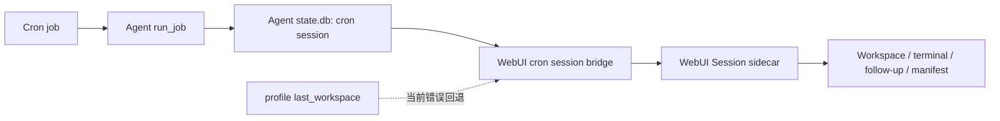
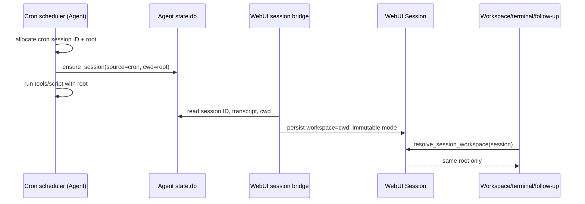

# Cron 会话独立 Workspace

- **Status:** Proposed
- **Author:** Hermes WebUI maintainers
- **Created:** 2026-08-11

## 问题

Cron Hub 会把 Hermes Agent 的 `source=cron` 运行物化为 WebUI 会话，以便在侧栏、会话详情、Session Inspector 和 Workspace 面板中查看它们。每一次运行通常有独立的 `cron_<job>_<timestamp>` session ID，但 workspace 的归属并不稳定：

- Agent 运行时仅将 job 的 `workdir` 作为临时 `TERMINAL_CWD` / `cwd`；没有 `workdir` 时沿用调度器环境。
- WebUI 的 cron materializer 通过 `import_cli_session()` 建立 sidecar，而该函数当前以 profile 的 `last_workspace` 作为 workspace。
- `no_agent` 脚本任务在进入 Agent `state.db` 前会短路，不能可靠地持久化 session ID 和 `cwd`。

因此两个不同 cron 执行可能在 WebUI 中显示为同一 workspace；用户在物化后继续对某个 `cron_*` 会话发送消息时，也可能在错误的目录中读写文件。这个问题同时破坏了 workspace 文件浏览、终端、附件、Session Manifest artifact root 和删除清理的隔离边界。

## 目标

1. 每个新 Cron execution 对应一个稳定、不可变、可恢复的 workspace root；该 root 与该 execution 的 `cron_*` session ID 一一对应。
2. Cron Agent 运行、Agent `state.db`、WebUI Session sidecar、后续聊天、终端和 Manifest 使用同一个已解析 workspace 值。
3. 默认不让两个执行共享可写目录；运行一个 Git 项目任务时，使用每次执行独立的 Git worktree。
4. `no_agent`、成功、模型/脚本失败、手工执行、调度执行、跨 Profile、重启后物化和 WebUI follow-up 都保持相同契约。
5. 不能证明 workspace 时 fail closed：不回退到 `last_workspace`、进程 cwd 或其他 Profile 的目录。
6. 删除 Cron job 时，精确清理由该 job 的运行拥有的 workspace，而不按模糊路径或 job ID 猜测删除。

## 非目标

- 不为历史 cron 运行复制、移动或猜测 workspace 内容。
- 不改变普通 WebUI session 的现有 managed/external/worktree 语义。
- 不将 Session Manifest 变成 workspace 文件索引或执行日志。
- 不在本 RFC 中引入完整的非 Git 目录快照/复制功能；非 Git 项目隔离需要另行设计复制语义、忽略规则、符号链接和大文件限额。
- 不改变 Hermes Agent 的普通 CLI、消息平台或 Gateway session workspace 策略。

## 术语与身份

| 术语 | 含义 | 权威来源 |
| --- | --- | --- |
| Cron job | `jobs.json` 中可重复触发的任务定义 | Agent cron store |
| Cron execution | job 的一次实际尝试，不论成功、失败或 `no_agent` | Agent execution/session records |
| Cron session | 与 execution 对应的 `source=cron` session；ID 为 `cron_*` | Agent `state.db.sessions.id` |
| workspace root | 该 session 实际运行、文件浏览和后续聊天使用的绝对目录 | Agent `state.db.sessions.cwd` |
| workspace strategy | 创建 root 的方式：`managed` 或 `worktree` | job 的 versioned workspace policy |
| materialized session | WebUI 侧保存的 Session sidecar；是 Agent session 的展示与后续聊天载体 | WebUI sidecar |

`state.db.sessions.cwd` 已存在，且最接近 Agent 的实际工具执行上下文。本方案不新增第二个竞争字段：对 `source=cron` 的新记录，`cwd` 的契约提升为“该 execution 的 canonical workspace root”。

## 当前链路与缺口



当前关键实现点：

- Agent `cron/scheduler.py` 的 LLM 路径调用 `ensure_session(..., cwd=job.workdir)`，但 `no_agent` 路径不会建立同等 session 记录。
- WebUI `integration/crons/session_bridge.py` 导入 Agent transcript。
- `api/models.py` 的 `import_cli_session()` 当前传入 `get_last_workspace()`，故 materializer 没有使用 execution 的 cwd。
- 普通 WebUI 新会话已经在 `api/routes.py` 和 `api/workspace.py` 中具备 managed workspace 与 immutable-session 校验。

## 决策

### 每次 execution 独占一个 workspace，而不是每个 job 共享一个

一个 cron job 的每次执行都会生成新的 `cron_*` session，因而每次 execution 都创建一个 root。不能按 job ID 分配目录，否则下一次运行仍会与上次运行共享文件、未清理状态和工具副作用。

稳定映射为：

```text
(profile, cron session ID) -> 一个 immutable workspace root
```

建议目录命名：

```text
<HERMES_WEBUI_DEFAULT_WORKSPACE>/sessions/cron/<profile-key>/<session-id>/
```

路径由服务端生成。`profile-key` 和 `session-id` 仅可作为经验证的单一路径组件；禁止从 task name、prompt、job ID 或浏览器传来的路径拼接目录。实现应复用/扩展现有 managed-workspace 的防 traversal、拒绝 symlink escape、原子创建和根目录检查机制。

### Workspace strategy

Cron Hub 在创建/更新 job 时持久化一个 versioned workspace policy，而不是将某个运行生成的绝对 root 写回 `jobs.json`：

```json
{
  "workspace_policy": {
    "version": 1,
    "strategy": "managed",
    "base_workspace": "/approved/base"
  }
}
```

支持的策略：

| strategy | 适用场景 | execution root | 规则 |
| --- | --- | --- | --- |
| `managed` | 报告、下载、临时产物、无源代码任务 | 新建的 `sessions/cron/<profile>/<session-id>` | 默认；空目录，Agent/脚本在此运行 |
| `worktree` | Git 项目代码任务 | 基于 `base_workspace` 的 detached Git worktree | 每次执行独立创建；必须由服务器验证为 Git repo |

`worktree` 必须使用 detached worktree，位置仍在 managed cron namespace 下，并在 session 元数据保存 `worktree_path`、`worktree_repo_root`、`worktree_created_at` 与 `workspace_mode="worktree"`。不得把用户当前分支、当前 checkout 或其他 Cron execution 当作可写 execution root。

V1 不支持“将一个非 Git 目录复制成独立工作区”。如果任务需要非 Git 项目目录，用户可将其变为 Git repo 后选择 `worktree`，或使用 `managed` 并在 prompt/script 中显式准备输入；不提供共享 external workspace 的静默降级。这一点是隔离契约的一部分。

### 执行前先分配身份和 workspace

Agent `run_job()` 必须在模型解析、预检查脚本、SessionDB 初始化之外尽早完成下列顺序：

1. 生成或接收本次稳定的 `_cron_session_id`。
2. 根据 owner Profile 和 job policy 解析 workspace strategy 与 base；验证 base 在该 Profile 允许的 workspace 边界内。
3. 创建/获取该 session ID 的 execution root 或 worktree，保证重试幂等。
4. 将 root 写入本次内存 job copy 的 `workdir`，并将它作为唯一的 `TERMINAL_CWD` / script cwd。
5. 写入 Agent `state.db.sessions`：`source="cron"`、`id`、`cwd=<root>`；这一步成功后才开始 Agent 或脚本执行。

失败语义：

- workspace policy 非法、base 不可访问、worktree 创建失败或 `cwd` 不能持久化时，本次 execution 不得落回共享 cwd 执行。
- 有可写 `state.db` 时，写入同一 cron session 的失败消息与 `end_reason="cron_error"`。
- `state.db` 不可用时，调度器保留其现有的运行错误日志/执行记录，但 WebUI 不得将该运行物化为带猜测 workspace 的可交互 session；它只能显示为 `workspace_unverified` 的只读历史项，直到存在可验证的 Agent record。

`no_agent` 不再在身份分配之前短路。它同样分配 session、root、`cwd`，然后以该 root 作为脚本进程 cwd；脚本成功、静默、超时和失败均拥有可追溯 session。这样 WebUI 不需要由输出文件名或最新 job 状态推测 workspace。

### 单一权威值的端到端传递



WebUI 的 materializer 必须在查询 Agent session 时读取 `cwd`，并将其传给 `import_cli_session()`；该函数需要新增显式 `workspace` 和 `workspace_mode` 参数，不能再在 cron 路径内部读取 `get_last_workspace()`。

对新 cron session：

- `cwd` 缺失、不是绝对目录、目录不再存在、越出已批准 base，或与已持久化 sidecar workspace 不一致时，标记 `workspace_unverified` 并拒绝 workspace 文件操作、terminal 和 follow-up。
- `cwd` 验证通过时，sidecar 写入相同路径及 `workspace_mode`；后续 `resolve_session_workspace()` 沿用现有 managed/worktree 的不可替换规则。
- 已存在的 sidecar 只允许幂等重放相同 canonical root。任何不同 root 都是完整性冲突：不覆盖旧值、不刷新 Manifest artifact root，并记录可诊断错误。

所有执行和消费路径都必须使用 `Session.workspace`：浏览器 Chat、Gateway Chat、SSE streaming、pending turn drain、process wakeup、goal、terminal、上传、文件下载、Git API、Session Manifest 和 workspace preview。它们不能重新读取 job policy、全局 cwd 或 last workspace。

### 历史运行和兼容性

此 RFC 只对启用后的新 execution 强制独立 root。

| 数据形态 | 行为 |
| --- | --- |
| 新 Cron session，`cwd` 合法且 policy 标记为 v1 | 按 `cwd` 物化为 managed/worktree session |
| 历史 Cron session，已有 sidecar workspace | 保持原值；不迁移、不重写 |
| 历史 Agent session，`cwd` 合法但无 v1 policy | 可作为 legacy external workspace 只读物化；不声称它独立 |
| 历史 Agent session，`cwd` 缺失或不可信 | 仍可查看 transcript/output，但不展示/开放 workspace 交互；绝不回退 last workspace |
| Agent `state.db` 暂不可读 | 不产生猜测 workspace；稍后由安全的 read-repair 重新物化 |

为避免把历史的 `cwd` 误判为新隔离根，Agent 应在 session 的持久化 metadata 或 execution record 中写入 `workspace_policy_version=1` 与 strategy。WebUI 以该标记区分新契约和 legacy records；不依赖 `cron_` 前缀、目录名称或文件存在性推断。

### 删除、保留与恢复

workspace 生命周期由产生它的 cron session 所有：

1. session/worktree 创建成功后，Agent state.db 的 `cwd` 是恢复根。
2. WebUI sidecar、attachments、Manifest artifact records 只引用该 root，不拥有它。
3. 删除 job 时，WebUI 先按 owner profile 与 job 的 session records 收集所有 canonical roots，再逐一验证它们位于 `sessions/cron/<profile-key>/` 管理命名空间中。
4. 普通 managed root 使用受锚定的递归删除；worktree 先执行受验证的 `git worktree remove`，再删除空的管理目录。失败项记录在响应/日志中，不得以成功掩盖。
5. 仅在 state.db sidecar、attachments、output、Manifest records 和 workspace/worktree 都处理完成后，删除 API 才返回完整成功；否则返回明确的部分失败并保留可重试信息。

删除单个 materialized cron session 的语义与 job 删除不同：默认只删除 WebUI 展示和 follow-up sidecar，不删除 Agent execution record 或 workspace。是否提供“删除此 execution 和 workspace”的显式动作留作后续 UX 决策，不能复用普通 session delete 的隐式行为。

恢复时，Agent state.db 的 `cwd` 决定 root；WebUI 重启、cron polling、`/api/crons/history`、`/api/crons/recent` 和 output backfill 必须产生同一 sidecar workspace。Session Manifest 已将 `workspace_root` 作为 artifact identity 的一部分，故同一 root 的重放保持幂等，而不同 root 不会混合 artifacts。

## API 与数据变更

### Agent

| 范围 | 变更 |
| --- | --- |
| Cron job schema | 增加 `workspace_policy`，仅保存策略和 base，不保存每次 execution root |
| Cron scheduler | 统一为 Agent/no_agent 分配 session ID、root、`cwd`、状态与清理；以 root 运行工具和脚本 |
| `state.db.sessions` | 不需要新增 `cwd` 列；为 cron session 保证写入 canonical absolute root |
| execution metadata | 增加 `workspace_policy_version` 和 `workspace_strategy`，供 WebUI 区分 V1 与 legacy |
| worktree support | 创建、失败回滚、session 删除、job 删除和调度器崩溃后的 orphan recovery |

如 Agent 现有 execution 表没有可靠地将 session ID 与 policy version 关联，应在 Agent 仓库完成向后兼容 migration；WebUI 不应通过输出文件名时间邻近关系承担该身份责任。

### WebUI integration

| 文件/模块 | 改动 |
| --- | --- |
| `integration/crons/` | 新增 workspace-policy 校验、materialization 映射、生命周期和清理模块；保留 `api/routes.py` 为薄路由 seam |
| `integration/crons/session_bridge.py` | 查询并验证 Agent `cwd`/policy 元数据；创建和 reconcile sidecar 时持久化同一 workspace |
| `api/models.py` | `import_cli_session()` 接收显式 workspace/mode；一般 CLI 导入保持原有兼容回退，cron 调用不允许该回退 |
| `api/workspace.py` | 复用并扩展 managed root 创建、root 验证、受锚定删除；不得复制不安全的递归删除 |
| `api/routes.py` | 仅接入 integration handler、让 cron follow-up 在开始 run 前验证 workspace；不在大文件中加入 cron 业务逻辑 |
| `integration/swagger/openapi.json` | Cron create/update schema、session/history 响应中的 workspace 状态与错误码同步 |
| `integration/README.md` | 更新 Cron Hub 生命周期、历史兼容和删除语义 |

Cron Hub V1 请求建议使用下列可选字段；缺省值为 `managed` 加当前 Profile 的已批准 default base：

```json
{
  "profile": "default",
  "name": "生成日报",
  "workspace_policy": {
    "strategy": "worktree",
    "base_workspace": "/approved/project"
  }
}
```

路径只能由服务器通过 Profile-aware trusted-workspace 规则验证。新增 integration API 的错误可读文案必须为中文，JSON 路径段保持 snake_case。

## 具体代码改动地图

本节是实施入口，不以“搜索 cron 关键字后在大文件内追加逻辑”为实现方式。Cron 专属业务逻辑新增在 `integration/crons/`；`api/routes.py` 只保留已有调用点的薄接线。下表中的 **新增** 表示应创建独立模块，**修改** 表示必须调整的现有代码位置。

### Hermes Agent 仓库

| 优先级 | 文件与现有入口 | 改动 | 产出/不变量 |
| --- | --- | --- | --- |
| P0 | `cron/jobs.py`：`_normalize_workdir()`、`create_job()`、`update_job()` | **修改**：新增 `workspace_policy` 的解析、版本验证与持久化；保留 `workdir` 仅作为 legacy 字段，不能让 V1 execution root 写回 job 定义。 | `jobs.json` 保存经验证的 `{version, strategy, base_workspace}`，不保存动态 session root。 |
| P0 | `cron/execution_workspace.py`（**新增**） | **新增**：集中实现 `resolve_workspace_policy()`、`allocate_execution_workspace()`、`validate_execution_workspace()`、`cleanup_execution_workspace()`；输入为 owner Profile、policy、cron session ID。 | 唯一能创建 `sessions/cron/<profile-key>/<session-id>`、验证命名空间和回收 root 的 Agent 侧 choke point。 |
| P0 | `cron/scheduler.py`：`run_job()` 的 `no_agent` short-circuit、`_cron_session_id` 分配、`SessionDB.ensure_session(... cwd=...)`、`_job_workdir` / `TERMINAL_CWD` 设置 | **修改**：把 session ID + workspace 分配提到所有分支之前；`no_agent` 同样先写 `state.db`；将 allocation 返回的 root 写入 `ensure_session(cwd=...)`、脚本 `cwd` 和 Agent `TERMINAL_CWD`。删除“workdir 消失则回退调度器 cwd”的 V1 分支，改为终止该次 execution。 | 每个新 execution 在工具/脚本开始前已有 `source=cron`、稳定 ID 与 canonical `cwd`；执行失败也不写入共享 cwd。 |
| P0 | Agent 的 session/execution metadata 写入位置（`SessionDB.ensure_session()` 的可扩展 metadata 或 cron execution ledger） | **修改或 migration**：写入 `workspace_policy_version=1`、`workspace_strategy`、owner profile 与 session ID 的可查询关联。 | WebUI 能区分 V1 root 与 legacy `cwd`，不依赖 ID 前缀、目录名或 output 文件时间。 |
| P1 | Agent worktree helper（当前 WebUI `api/worktrees.py:create_worktree_for_workspace()` 间接调用 Agent `_setup_worktree()`） | **新增 Agent 专用接口**：支持调用方指定 execution target/metadata，并创建 detached worktree。不要直接复用普通交互式 `_setup_worktree()`，它返回 Agent 默认 worktree 位置与分支语义，不能保证位于 cron namespace。 | worktree path 属于 execution root，原 checkout 和用户分支不被改写。 |
| P1 | `cron/scheduler.py` 的调度分池与 `_terminal_cwd_lock`（约 `sequential_jobs` / `parallel_jobs`） | **修改**：所有 V1 execution 都有独立 cwd；保留锁以保护 process-global env，但调度分类不能因为 job 未显式填写 legacy `workdir` 而将它当作无 cwd 的并行旧路径。 | 并发运行时不观察到其他 execution 的 cwd。 |
| P1 | Agent 测试：`tests/cron/test_jobs.py`、`test_cron_workdir.py`、`test_cron_no_agent.py`、`test_scheduler.py`、`test_parallel_pool.py`、`test_cron_profile_isolation.py` | **修改/新增用例**：policy schema、两次运行不同 root、脚本 cwd、state.db cwd、并发隔离、跨 Profile、worktree 回滚与 root 创建失败。 | Agent 负责证明“实际执行 cwd”等于 state.db cwd。 |

### Hermes WebUI 仓库：Cron API 与运行编排

| 优先级 | 文件与现有入口 | 改动 | 产出/不变量 |
| --- | --- | --- | --- |
| P0 | `integration/crons/workspace_policy.py`（**新增**） | **新增**：解析来自 Cron Hub 的 policy；调用 Profile-aware trusted workspace 校验；将 Agent 提供的 `cwd`、policy metadata 解析成 `CronWorkspaceBinding`（`root`、`mode`、`state`、`strategy`）。 | WebUI 的单一 validation choke point；`cwd` 缺失/冲突/越界一律得到 `workspace_unverified`，而不是 fallback。 |
| P0 | `integration/crons/handlers.py`：`_handle_create()`、`_handle_update()` | **修改**：白名单接收 `workspace_policy`，先调用新 policy helper，再传给 `cron.jobs.create_job()` / `update_job()`；不要让当前 `updates` comprehension 透传未验证的嵌套字段。 | `/api/integration/crons/create|update` 只持久化服务端验证后的 policy，并返回标准化结果。 |
| P0 | `api/routes.py`：`_handle_cron_create()`、`_handle_cron_run()`、`_run_cron_tracked()`、`_cron_job_subprocess_main()` | **修改（薄接线）**：使上游单 Profile API 与 Cron Hub API 都携带相同 policy；手工 run 的内存 job copy 必须带 session ID/policy 到子进程；run 完成仍经 `materialize_after_cron_run()`。不要在此文件实现目录创建、验证或删除算法。 | 自动/手工、上游/Cron Hub 入口不会产生不同的 workspace 语义。 |
| P0 | `integration/crons/session_bridge.py`：`_materialize_cron_session_found()`、`materialize_cron_session()`、`materialize_cron_session_run()`、批量 history 物化 | **修改**：扩展 state.db session 查询，取得 `cwd` 和 V1 metadata；调用 `CronWorkspaceBinding`；创建、已存在 reconcile、output fallback 三条路径都保存同一 root/mode/state。 | sidecar workspace 只能来自 Agent 的 authoritative record；相同 session ID 重放幂等，不同 root 不覆盖。 |
| P0 | `api/models.py`：`import_cli_session()`；外部 session fallback `get_session_for_file_ops()` / `_ExternalSessionView` | **修改**：`import_cli_session()` 接收显式 `workspace`、`workspace_mode`、`workspace_state`；普通 CLI 调用维持当前 fallback，cron 调用必须声明 `require_workspace_binding=True`。外部 session file-op fallback 不得给 unverified cron session 返回 `get_last_workspace()`。 | 消除 cron materialization 到 `last_workspace` 的隐式回退。 |
| P1 | `api/workspace.py`：`create_managed_workspace()`、`resolve_session_workspace()` | **修改**：抽出可复用的受锚定 root 创建/验证/删除 primitive，供 Cron helper 使用；`resolve_session_workspace()` 遇到 `workspace_state != ready` 的 cron session 拒绝请求。 | root 不可替换；路径验证与普通 managed workspace 共用安全实现。 |
| P1 | `api/worktrees.py`：`create_worktree_for_workspace()`、`remove_worktree_for_session()` | **修改或新增 cron wrapper**：普通会话 helper 目前依赖 Agent 默认 `_setup_worktree()`，不能直接满足 cron target namespace；增加显式 cron worktree adapter，删除时校验 session ownership、stream/terminal 状态与 repo root。 | 只移除归属该 execution 的 worktree。 |
| P1 | `integration/crons/hooks.py`：`materialize_after_cron_run()` | **修改**：将 execution session ID、workspace binding 状态和 Agent result 一起传入 materializer；不允许仅靠 output filename 生成可交互 workspace session。 | output fallback 只能是有 verified binding 的 workspace session，或只读 unverified 历史。 |
| P1 | `integration/crons/session_bridge.py`：`delete_materialized_cron_session_source()`、`delete_cron_job_history()` | **修改**：在删除 Agent state rows 前收集并验证每个 binding；调用 managed/worktree 清理；返回 `workspace_cleanup` 的逐项结果。 | 单 session delete 不删除 root；job delete 仅删除受控 cron namespace 内、确属该 job/session 的 root。 |
| P1 | `api/routes.py`、`api/streaming.py`、`api/gateway_chat.py`、`api/terminal.py`、`api/upload.py` | **修改**：在 Chat、Gateway、streaming、terminal、upload 的既有 `resolve_session_workspace()` / session 获取边界上统一执行 workspace-state gate；无需分别重算 policy。 | follow-up、队列、wakeup、goal、终端与文件操作只用已持久化 `Session.workspace`。 |

### WebUI 前端、契约和测试

| 优先级 | 文件/入口 | 改动 | 验证重点 |
| --- | --- | --- | --- |
| P2 | `static/hermes_integration_crons.js`（Cron Hub）及相邻 integration CSS | **修改**：新建/编辑表单传递 `workspace_policy`；渲染 `ready`、`legacy_shared`、`workspace_unverified`、`cleanup_failed`，并在 unverified 时禁用 Workspace/Terminal/继续聊天。 | 桌面、窄屏、移动端；不增加侧栏常驻控件。 |
| P2 | `integration/swagger/openapi.json`、`integration/README.md` | **修改**：create/update request schema，job/history/session response 的 workspace strategy/state，删除的 partial cleanup response。 | API 文档和实际错误/状态码一致；错误文案为中文。 |
| P0 | `integration/tests/crons/test_handlers.py`、`test_session_bridge.py`、`test_hooks.py`、`test_execution_model.py`、`test_manifest_turns.py` | **修改/新增**：创建/更新 policy 校验、state.db cwd → sidecar mapping、重复物化、缺失/冲突 cwd、manual run、history/output fallback、job cleanup。 | WebUI 负责证明“展示与 follow-up root”等于 Agent 记录。 |
| P1 | `tests/test_session_managed_workspace.py`、`tests/test_session_import_workspace_validation.py`、`tests/test_cron_manual_run_persistence.py`、`tests/test_cron_history_database.py`、`tests/test_issue3975_cron_reply_materialization.py`、`tests/test_worktree_remove.py` | **修改/新增**：immutable follow-up、legacy 行为、删除范围、worktree 生命周期与 error path。 | 不能回归普通 session/import/worktree 行为。 |

### 修改依赖顺序

```text
Agent policy + execution allocation + state.db metadata
  -> WebUI CronWorkspaceBinding + session bridge
  -> import_cli_session / resolve_session_workspace gate
  -> delete/recovery paths
  -> Cron Hub UI + OpenAPI + docs
```

WebUI 不应先合并“自动创建 cron workspace”的半成品：在 Agent 尚未同时提供 session ID、canonical `cwd` 与 V1 metadata 时，只能保留只读 legacy-safe 物化。这样不会让前端或 WebUI sidecar 成为 workspace 身份的猜测来源。

## UI 方案

Cron Hub 的新建/编辑表单增加“执行工作区”选择：

- **新建独立目录**：`managed`，说明“本次任务文件仅属于该次运行”。
- **从 Git 项目创建独立 worktree**：`worktree`，选择一个已登记 workspace；不可用时在表单提交前显示原因。

会话详情与 Cron history 显示 strategy、实际 root 的友好名称和状态：`ready`、`legacy_shared`、`workspace_unverified`、`cleanup_failed`。`workspace_unverified` 只保留 transcript/output 入口，并禁用 Workspace、Terminal、上传与“继续聊天”。

不在侧栏热区额外增加常驻控件；这是低频的任务配置，应放入 Cron Hub 创建/编辑表单和任务详情溢出菜单。实现 UI 时需提供桌面、窄屏、移动端前后截图。

## 实施顺序

1. **Agent 契约与测试**：定义 policy schema；统一 Agent/no_agent execution identity；持久化 `cwd` 与 policy version；实现 managed/worktree 创建、失败回滚和恢复。
2. **WebUI materialization**：读取 authoritative `cwd`；改造 `import_cli_session()` 参数；为新记录写入 immutable workspace；移除 cron 路径上的 last-workspace fallback。
3. **运行时 gate**：在所有 cron follow-up 和文件/终端入口验证 `workspace_state`，覆盖 HTTP、Gateway、SSE、pending turn、process wakeup、goal 和 Manifest。
4. **清理与恢复**：按 canonical root 实现 job delete、worktree remove、partial failure 报告与安全重试；补齐重启/poll/backfill 幂等性。
5. **Cron Hub UI 与 API 文档**：增加 policy 表单、状态展示、OpenAPI、integration README 和面向用户的说明。
6. **渐进发布**：先以 feature flag 仅允许手工 Cron Hub run；验证后扩展到自动调度；旧 job 默认维持 legacy 行为，运营者可显式迁移到 V1 policy。

每个实现 PR 必须先在对应仓库验证其最小 vertical slice，不跨仓库混入无关重构。Agent 仓库默认只读；其改动须由单独的 Agent PR/版本依赖交付。WebUI 在检测到 Agent 未提供 V1 metadata 时保持 legacy-safe 路径，不假定本地源码版本一致。

## 测试与验收矩阵

| 场景 | 可观察断言 |
| --- | --- |
| 两个 job 同时运行 | root 不同；工具写入互不可见；无全局 `TERMINAL_CWD` 泄漏 |
| 同一 job 连续两次运行 | 两个 session/root 不同；第二次不读取第一次未清理文件 |
| managed Agent task | state.db cwd、sidecar workspace、实际工具 cwd、Manifest workspace_root 全相等 |
| worktree Agent task | 每次使用 detached worktree；原 checkout/分支不变；删除后 worktree registry 无残留 |
| no_agent 成功/静默/失败/超时 | 都有稳定 session/cwd；脚本 cwd 正确；失败不回退共享目录 |
| workspace 创建或 state.db 写入失败 | 不执行到共享 cwd；错误可见；不会生成带 last workspace 的 session |
| Agent/WebUI 重启后 | cron poll、history、output backfill 物化到同一 root，不重复创建目录或 Manifest rows |
| 多 Profile 与同名 job ID | roots、state records、sidecars、删除范围均按完整 `(profile, session ID)` 隔离 |
| follow-up | `/api/chat/start`、Gateway、队列、wakeup、goal 都只能使用已持久化 root；改 workspace 返回冲突 |
| 旧运行 | 能读 transcript；缺可信 cwd 时 workspace 能力关闭，不错误显示 last workspace |
| job 删除 | 只删除归属 roots/sidecars/attachments/output；root 外、其他 Profile、其他 job 的文件保持不变 |
| Manifest | 相同 root 重放幂等；不同 root 的 artifact identity 不合并；unverified root 不预览文件 |

测试必须包含真正的多 execution 和多 Profile 数据，不能只以单个 mock session 断言调用参数。新测试先在当前代码上失败，修复后再通过；WebUI Python 测试使用 `./scripts/test.sh`。

## 运维、观测与回滚

- 记录 session ID、owner/execution Profile、strategy、canonical root、创建/清理阶段和失败原因；日志不得记录 prompt、凭据或完整环境变量。
- 增加管理员可见的 orphan 诊断：存在 managed root 但无 state record、存在 worktree registry 项但无 session、或 sidecar root 与 state.db cwd 冲突。
- feature flag 关闭后不删除已创建 root；已创建的 V1 session 仍按照其持久化 root 只读/可恢复，避免把旧运行重新映射到 last workspace。
- 回滚只停止新 policy 的创建，不回滚 `cwd` 的历史事实，不批量删除目录，也不修改 legacy sidecar。

## 开放问题

1. managed execution 是否需要可配置的保留期和配额；这必须在 job/session 引用、未读历史和用户下载需求之上设计，不能直接按时间删除。
2. worktree 是否允许保留提交、分支或 stash；V1 使用 detached worktree，避免把自动任务的分支管理混入本变更。
3. 是否为单次 execution 提供显式“删除 workspace”操作；应当独立于普通 session delete，并有清晰的不可恢复确认。
4. 非 Git 项目的隔离复制是否值得支持；若支持，需要单独 RFC 处理输入快照、`.gitignore`、symlink、权限、容量、原子性和秘密文件排除。
