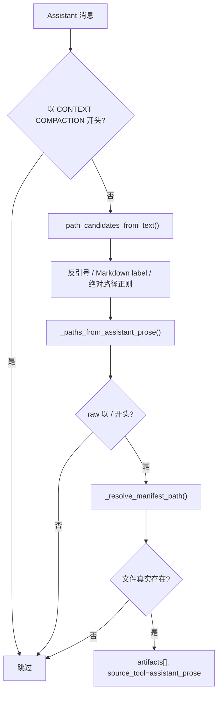
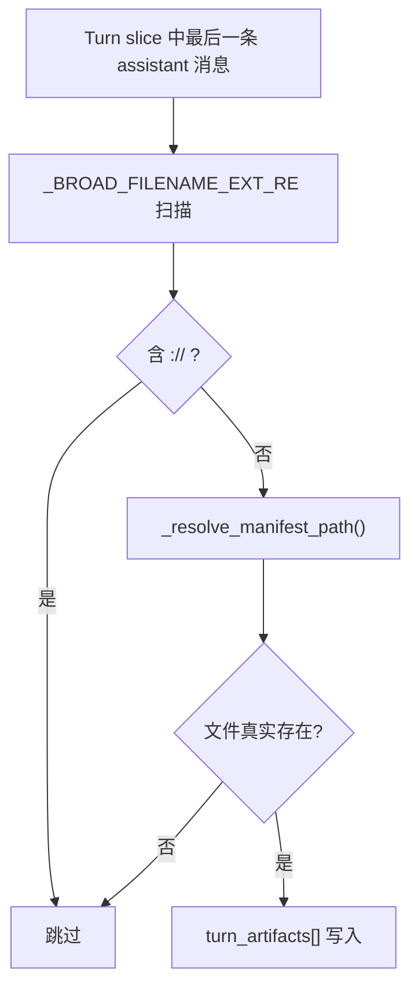

# Session Manifest 成果路径正则规则

本文档说明 `api/session_manifest.py` 中**成果（artifacts）**路径的提取规则，重点是正则匹配、过滤条件与入库门槛。

相关契约见 [session-inspector-manifest.md](./session-inspector-manifest.md)、[session-manifest-api.md](./session-manifest-api.md)。实现文件：`api/session_manifest.py`。

---

## 1. 成果来源总览

成果路径不只来自 assistant 正文正则，而是多路汇总：

| 来源 | `source_tool` | 路径如何得到 |
|------|---------------|--------------|
| 写入类工具 | `write_file` / `edit_file` / `patch` / `apply_patch` 等 | 工具结构化参数 + diff 文本正则 |
| `MEDIA:` 标记 | `media` | `_MEDIA_TOKEN_RE` |
| Assistant 正文 | `assistant_prose` | 三条路径正则 + 绝对路径硬过滤 |
| Assistant 末条正文 | `assistant_prose` | `_BROAD_FILENAME_EXT_RE` + 工作空间存在性校验（仅最后一轮最后一条 assistant 消息） |
| Skill 变更 | `skill_manage` 等 | 参数 / 结果路径（非本文重点） |

**`assistant_prose` 的入库时机**：首轮 `_extract_manifest_records` 不直接处理 prose；在 per-turn **reconcile** 阶段（`_collect_assistant_prose_artifact_events` → `_reconcile_candidate_paths`）写入 `artifacts[]`。

---

## 2. 正则一览

当前文件中与成果相关的正则共 **7 条**：

| 名称 | 模式 | 用途 |
|------|------|------|
| `ARTIFACT_IGNORE_RE` | `(^|/)(?:\.git\|\.hg\|\.svn\|node_modules\|\.venv\|venv\|__pycache__\|dist\|build\|\.next\|\.cache)(?:/|$)` | 路径规范化时排除依赖/构建目录 |
| `_MEDIA_TOKEN_RE` | `MEDIA:([^\s\)\]]+)` | 提取 `MEDIA:<path>` 本地路径 |
| `_CODE_SPAN_RE` | `` `([^`\n]+)` `` | 反引号包裹内容 |
| `_MARKDOWN_LINK_LABEL_RE` | `\[([^\]]+)\]\([^)]+\)` | Markdown 链接的 label 文本 |
| `_BROAD_ABSOLUTE_PATH_RE` | `(/[^\s`'"<>|，,；;。：)\]]+\.[A-Za-z0-9][A-Za-z0-9]+)` | 行内裸绝对路径 |
| `_BROAD_FILENAME_EXT_RE` | `([\w\u4e00-\u9fff/._-]{1,240}\.[A-Za-z0-9]{2,8})` | 仅最后一条 assistant 消息的相对路径/裸文件名，经工作空间存在性校验 |
| `_DIFF_PATH_RE` | `(?:^|\n)(?:\+\+\+\|---)\s+(?:[ab]/)([^\n\t]+)` | unified diff 的 `+++` / `---` 头 |
| `_DIFF_ADD_UPDATE_RE` | `^\*\*\* (?:Add\|Update) File:\s+(.+)$` | `*** Add File:` / `*** Update File:` 行 |

> **说明**：写入类工具的路径主要来自结构化参数（`path`、`file_path`、`target` 等），不依赖额外正则；diff 正则用于从 patch 文本补全路径。

---

## 3. `assistant_prose` 提取流程

### 3.1 消息级前置过滤

扫描 assistant 消息前，若正文以以下前缀开头，**整段跳过**：

```
[CONTEXT COMPACTION — REFERENCE ONLY]
```

（代码中为 Unicode em dash `—`，即 `\u2014`，不是 ASCII 连字符 `-`。）

用途：系统生成的上下文压缩摘要里常含历史绝对路径，不应算作本轮新成果。

### 3.2 候选生成（`_path_candidates_from_text`）

按**行**扫描，对每行依次应用三条正则，生成 `PathCandidate`：

| 正则 | `candidate_source` | `confidence` |
|------|-------------------|--------------|
| `_CODE_SPAN_RE` | `code_span` | `explicit` |
| `_MARKDOWN_LINK_LABEL_RE` | `markdown_link_label` | `explicit` |
| `_BROAD_ABSOLUTE_PATH_RE` | `absolute_path` | `broad` |

每条候选经 `_resolve_manifest_path` 规范化：

- workspace 内文件 → 相对 workspace 的路径（如 `notes/report.docx`）
- workspace 外文件 → 保留绝对路径
- 命中 `ARTIFACT_IGNORE_RE` → 丢弃

### 3.3 二次过滤（`_paths_from_assistant_prose`）

在候选之上再应用两条硬规则：

1. 丢弃 `confidence == 'contextual'`（当前实现已不再产生此类候选）
2. **`candidate.raw` 必须以 `/` 开头** — 只认原始文本中的绝对路径

因此：

- 反引号里的裸文件名（`` `result.json` ``）→ **不进** `assistant_prose`
- 相对路径（`./src/main.py`）→ **不进**
- 行内裸基名（`data.csv`）→ **不进**
- 绝对路径（`/Users/wzq/workspace/report.docx`）→ **可进**（须满足后续存在性检查）

### 3.4 Reconcile 入库（`_reconcile_candidate_paths`）

`assistant_prose` 事件的路径已在 `_collect_assistant_prose_artifact_events` 写入 `event.args['path']`；reconcile 阶段直接透传 `args_paths`，不再做二次正则提升。

最终入库前还须通过：

- `_artifact_path_is_real`：workspace 内文件必须真实存在且可预览
- 不与同轮 `references` 重复

---

## 4. `media` 提取流程

1. 同样跳过 `[CONTEXT COMPACTION — REFERENCE ONLY]` 开头的 assistant 消息
2. `_MEDIA_TOKEN_RE.findall(text)` 提取 `MEDIA:` 后的路径
3. 含 `://` 的 URL 跳过
4. `_resolve_manifest_path` 规范化后写入 `source_tool: media`

---

## 5. 写入类工具 diff 正则

用于 `ARTIFACT_MUTATION_TOOLS` 事件的参数与结果文本：

| 正则 | 匹配示例 |
|------|----------|
| `_DIFF_PATH_RE` | `+++ b/src/app.py`、`--- a/src/app.py` |
| `_DIFF_ADD_UPDATE_RE` | `*** Add File: docs/readme.md` |

与 `_paths_from_args` 提取的结构化路径合并后，作为写入类工具成果。

---

## 6. `_BROAD_ABSOLUTE_PATH_RE` 细则

```
(/[^\s`'"<>|，,；;。：)\]]+\.[A-Za-z0-9][A-Za-z0-9]+)
```

| 约束 | 说明 |
|------|------|
| 必须以 `/` 开头 | 只匹配绝对路径 |
| 必须含扩展名 | `.` + 至少 2 段字母数字（如 `.md`、`.docx`、`.py`） |
| 终止符 | 遇空白、反引号、引号、`<>`、`|`、中英文标点、`)`、`]` 即截断 |

示例：

| 文本 | 是否匹配 |
|------|----------|
| `/Users/wzq/workspace/report.docx` | 是 |
| `/tmp/foo` | 否（无扩展名） |
| `file:///path/doc.pdf` | 部分匹配（从第二个 `/` 起视上下文而定） |

---

## 7. 行为对照表

| 场景 | 是否成为 `assistant_prose` 成果 |
|------|--------------------------------|
| `输出在 \`result.json\`` | 否 |
| `入口在 ./src/main.py` | 否 |
| `你可以用 data.csv 测试` | 否 |
| `📄 文件位置：/Users/.../report.docx`（文件存在） | 是 |
| `报告在 /tmp/nonexistent/report.docx`（文件不存在） | 否 |
| `[CONTEXT COMPACTION — REFERENCE ONLY] .../old.md` | 否（整消息跳过） |
| `MEDIA:notes/chart.png` | 是（`source_tool: media`，非 prose） |
| `write_file` 写入 `src/app.py` | 是（`source_tool: write_file`，非 prose） |
| **仅最后一条 assistant 消息**，表格中 `华为官网当季新品摘要.md`（文件存在） | **是**（`_BROAD_FILENAME_EXT_RE` + 存在性校验） |
| **非最后一条** assistant 消息，表格中 `华为官网当季新品摘要.md`（文件存在） | 否（仅扫最后一条） |
| 最后一条 assistant 消息，`README.md`（文件不存在） | 否（存在性校验失败） |

---

## 8. 端到端流程



Manifest 构建入口 `build_session_manifest()` 顺序：

1. `_collect_tool_events` + `_collect_media_artifact_events` → `_extract_manifest_records`（写入类工具、media）
2. `_apply_turn_reconcile_to_manifest_records`（per-turn 补全 `assistant_prose` / 再次校验 media）

**末条 assistant 消息相对路径扫描流程**（`_persist_turn_artifact_paths` 中的 `_paths_from_last_assistant_message`）：



此通道仅作用于 `_persist_turn_artifact_paths`（streaming.py 中 turn 完成时调用），**不通过 reconcile 通道**，且只扫当前 turn 切片中最后一条 assistant 消息。

---

## 9. 已移除的历史规则

以下规则曾在早期实现或计划中存在，**当前代码已删除**，不再生效：

| 已删除项 | 原用途 |
|----------|--------|
| `_BROAD_RELATIVE_PATH_RE` | 匹配 `./`、`../` 相对路径 |
| `_BROAD_BASENAME_RE` | 匹配裸文件名（如 `data.csv`） |
| `_DELIVERY_LABELED_RE` / `_DELIVERY_CONTEXT_RE` | 交付关键词 + 语境二次确认 |
| `_RESULT_PATH_RE` | 从工具 stdout 扫路径 |
| `_promote_artifact_candidates` | 候选路径证据提升 |
| Pandoc `-o` 命令参数解析 | 从 terminal 命令推断输出文件 |

若文档其它处仍描述「交付关键词即可收录相对路径 / 裸文件名」，以本文与 `api/session_manifest.py` 为准。

> **例外（v2）**：`_BROAD_FILENAME_EXT_RE` 新增了一条窄范围的相对路径/裸文件名扫描通道，**仅作用于最后一轮的最后一条 assistant 消息**（通常是交付摘要），且必须通过工作空间真实存在性校验才会入库。这与早期 `_BROAD_RELATIVE_PATH_RE` 的全量宽泛扫描有本质区别——后者对所有消息生效且无存在性门槛，因此被移除。详见第 2 节和第 7 节。

---

## 10. 测试

相关用例见 `tests/test_session_manifest.py`，重点包括：

- `test_paths_from_assistant_prose_labeled_unicode_path` — 绝对路径 + 文件存在
- `test_build_session_manifest_relative_path_without_delivery_context` — 相对路径不进 artifacts
- `test_build_session_manifest_code_span_path_without_delivery_context` — 反引号裸名不进 artifacts
- `test_build_session_manifest_basename_no_delivery_context_not_artifact` — 裸基名不进 artifacts
- `test_build_session_manifest_path_missing_file_not_artifact` — 文件不存在不进 artifacts

本地验证：

```bash
python3 -m pytest tests/test_session_manifest.py -q
```
