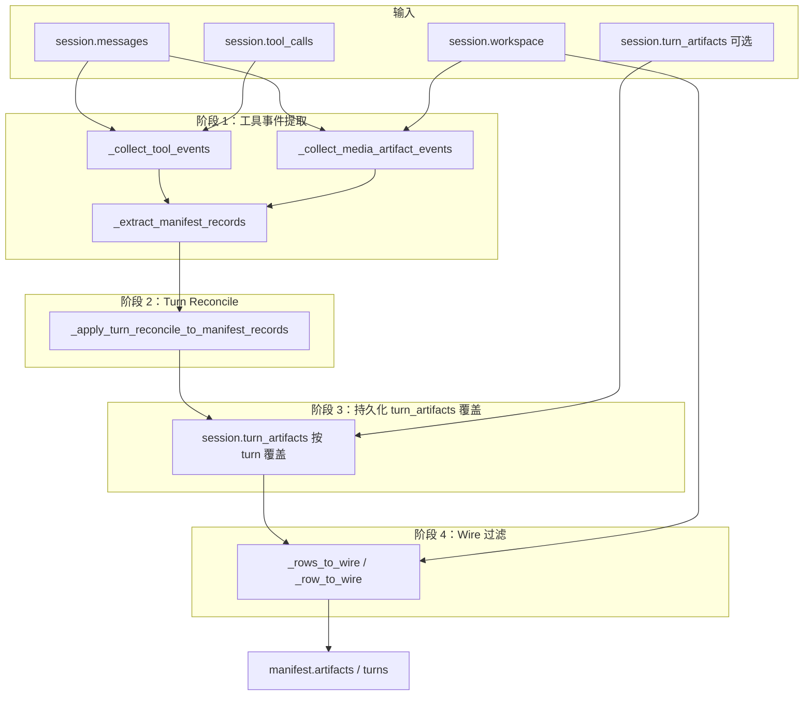

# `/api/session/manifest` — Artifacts 入库逻辑

本文档梳理 **`GET /api/session/manifest`** 响应中 `manifest.artifacts[]` 与 `manifest.turns[].artifacts[]` 的完整构建链路：数据来源、分阶段处理、过滤门槛与流式增量关系。

相关实现：`api/session_manifest.py`（构建）、`api/routes.py`（HTTP）、`api/streaming.py` / `api/gateway_chat.py`（SSE）。产品语义见 [session-inspector-manifest.md](./session-inspector-manifest.md)；HTTP 契约见 [session-manifest-api.md](./session-manifest-api.md)；路径正则见 [session-manifest-artifact-regex.md](./session-manifest-artifact-regex.md)。

---

## 1. HTTP 入口

```
GET /api/session/manifest?session_id=<sid>
```

处理位置：`api/routes.py`

```python
session = get_session(sid)
manifest = build_session_manifest(session)

# 若当前 session 有活跃流，合并 SSE 乐观态
if stream_id and live_manifest:
    manifest = merge_manifest_delta(manifest, live_manifest, scope="active_stream")

return {"manifest": manifest}
```

**要点：**

- 权威构建函数是 `build_session_manifest(session)`。
- 流式进行中，GET 会把 `STREAM_LIVE_MANIFEST[stream_id]` 里的 delta **叠加**到持久化 manifest 上（按 `path` 去重合并）。
- 本轮 `done` 后应以 GET 结果为准；SSE 仅为乐观更新。

---

## 2. 总览：构建流水线

`build_session_manifest()` 对 artifacts 的处理分 **四个阶段** + **最终 wire 过滤**：



| 阶段 | 函数 | 作用 |
|------|------|------|
| 1 | `_extract_manifest_records` | 从工具白名单事件直接归纳 artifact **内部记录** |
| 2 | `_apply_turn_reconcile_to_manifest_records` | 按 turn 补全 `MEDIA:`、`assistant_prose`；**须文件真实存在** |
| 3 | `session.turn_artifacts` | 流式 turn 结束时持久化的写入工具路径，**覆盖**该 turn 的 reconcile 结果 |
| 4 | `_rows_to_wire` | 仅输出可预览条目（文件存在 / skill 存在） |

---

## 3. 阶段 0：前置准备

`build_session_manifest()` 开头：

```python
messages = _load_display_messages(session)   # CLI + state DB 合并展示消息
messages = _ensure_turn_keys(messages)       # 补全 user 消息的 _turn_key
tool_calls = list(session.tool_calls or [])
workspace = Path(session.workspace).expanduser().resolve()
skills_dir = _skills_dir_for_session(session)  # {HERMES_HOME}/skills
```

**Turn 分组**（`_message_turns`）：每条 `role=user` 消息（跳过 context compression marker）开启一轮，得到 `turn_key`（优先 `_turn_key`，否则 `turn:{idx}`）、`start_msg_idx`、`end_msg_idx`。

---

## 4. 阶段 1：工具事件 → 内部 artifact 记录

### 4.1 事件收集

| 来源 | 函数 | 说明 |
|------|------|------|
| 消息 transcript | `_collect_tool_events(messages, tool_calls)` | 配对 assistant `tool_use` / `tool_calls` 与 `role=tool` 结果；含 `_partial_tool_calls`（流式进行中） |
| Session 级 tool_calls | 同上 | `source=session_tool_calls`，按 `assistant_msg_idx` 归因 turn |
| Assistant `MEDIA:` | `_collect_media_artifact_events(messages, workspace)` | 合成 `ToolEvent(name='media', args={'path': ...})` |

**跳过：** 以 `[CONTEXT COMPACTION — REFERENCE ONLY]` 开头的 assistant 消息（Unicode em dash `\u2014`）。

### 4.2 写入 artifacts 的工具白名单

**Workspace 文件写入**（`ARTIFACT_MUTATION_TOOLS`）：

```
write_file, create_file, edit_file, patch, apply_patch,
mcp_filesystem_write_file, mcp_filesystem_edit_file
```

**Skill 变更**：

- `skill_manage` 且 `action ∈ {create, edit, patch, write_file}` → 技能名（非磁盘路径）
- 上述写入工具若路径落在 `{HERMES_HOME}/skills/.../SKILL.md` → 也识别为 skill artifact

**Media：**

- `source_tool = "media"`，来自 assistant 正文 `MEDIA:<local-path>`

**本阶段不处理：**

- `assistant_prose`（assistant 正文 regex 路径）——留给阶段 2 reconcile
- 只读工具（`read_file`、`grep` 等）——进入 references，不进 artifacts

### 4.3 `_extract_manifest_records` 归纳规则

对每个 `ToolEvent`：

1. **写入类工具**：从 args（`path`、`file_path`、`target`、`paths[]`、`edits[].path` 等）+ result/diff 文本（`_DIFF_PATH_RE`、`_DIFF_ADD_UPDATE_RE`）收集路径 → `add_artifact(path)`
2. **`media`**：`args_paths` → `add_artifact(path)`
3. **`skill_manage` 变更**：解析技能名 → `add_skill_artifact`
4. **Skill 路径检测**：若磁盘路径在 skills 根下且为 `SKILL.md` → skill artifact

合并逻辑（`_merge_file_records` / `_merge_skill_records`）：

- 按 **规范化 path** 去重
- 同 path 多次命中保留 `hits[]`；`source_tool` 按优先级更新（写入工具 > media/assistant_prose）

**本阶段不做文件存在性校验**——路径只要通过 `_resolve_manifest_path` 规范化即可进入内部记录；能否出现在 API 响应由阶段 4 `_row_to_wire` 决定。

---

## 5. 路径规范化（各阶段共用）

所有路径经 `_resolve_manifest_path(workspace, raw)`：

```
raw 字符串
  → _clean_manifest_path_raw（去引号、ARTIFACT_IGNORE_RE、形态校验）
  → 相对路径：(ws / path).resolve() → relative_to(ws) → POSIX 相对路径
  → 绝对路径且在 workspace 外：保留绝对路径（主要给 MEDIA workspace 外文件）
  → 命中 node_modules / .git / __pycache__ 等：丢弃
```

**不在正则里拼接 workspace**——边界判断用 `Path.resolve()` + `relative_to()`，见 [session-manifest-artifact-regex.md](./session-manifest-artifact-regex.md)。

---

## 6. 阶段 2：Turn Reconcile（补全 + 存在性闸门）

函数：`_apply_turn_reconcile_to_manifest_records` → 对每个 turn 调用 `_merge_reconcile_artifacts_for_turn`。

### 6.1 本轮额外收集的事件

对 **turn 消息切片** + **scoped tool_calls**：

```python
events = _collect_tool_events(turn_messages, scoped_tool_calls)
events += _collect_media_artifact_events(turn_messages, workspace)
events += _collect_assistant_prose_artifact_events(turn_messages, workspace)
```

### 6.2 Reconcile 候选路径（`_reconcile_candidate_paths`）

| event.name | 是否纳入 reconcile |
|------------|-------------------|
| `ARTIFACT_MUTATION_TOOLS` | **否**（阶段 1 已处理） |
| `skill_manage` 变更 | **否** |
| `media` | **是** |
| `assistant_prose` | **是** |
| 只读 / 发现类工具 | **否** |
| 其他工具 | **否**（当前实现返回空） |

### 6.3 assistant_prose 提取条件

1. `_path_candidates_from_text`：反引号、Markdown link label、裸绝对路径 regex
2. **`candidate.raw` 必须以 `/` 开头**——相对路径、裸文件名不进 artifacts
3. `_resolve_manifest_path` 规范化

### 6.4 Reconcile 硬门槛

对每个候选 path：

```python
if path in turn_reference_paths: continue      # 已在 references 中则跳过
if not _artifact_path_is_real(workspace, path): continue  # 须 workspace 内真实可预览文件
```

`_artifact_path_is_real` = `_file_preview_path` 非空（文件存在、非目录、非 cruft、未超大小上限）。

通过后 `_merge_file_records` 写入 **session 级** `artifact_records` 与 **turn 级** `turn_record['artifacts']`。

---

## 7. 阶段 3：`session.turn_artifacts` 覆盖

流式 pipeline 在 turn 完成时（`api/streaming.py` `_persist_turn_artifact_paths`）：

```python
paths = _extract_turn_artifact_paths(turn_slice, tool_calls, workspace)
session.turn_artifacts[turn_key] = paths
```

`_extract_turn_artifact_paths` **仅**从 `ARTIFACT_MUTATION_TOOLS` 的 args + diff 取路径，**不含** prose/media。

`build_session_manifest` 中若存在 `session.turn_artifacts`：

- 对每个 turn，用持久化 path 列表 **替换** 该 turn 的 reconcile artifacts
- 每条 path 仍须 `_artifact_path_is_real`
- 写入 session 级 `artifact_records`（`source_tool` 固定为 `write_file`）
- **原因**：reconcile 可能受跨 turn prose 污染；写入工具路径更可靠（见 `docs/turn-key-backend.md` §8.3）

---

## 8. 阶段 4：Wire 输出（API 可见行）

### 8.1 `_rows_to_wire` → `_row_to_wire`

内部记录 → 对外三字段（+ 可选 `profile`）：

```json
{
  "path": "notes/report.md",
  "preview": "file",
  "source_tool": "write_file",
  "profile": "default"
}
```

| `preview` | 条件 |
|-----------|------|
| `"file"` | `_file_preview_path` 成功（workspace 内相对路径） |
| `"file"` | 或 `source_tool=media` 且 `_session_media_preview_path` 成功（workspace **外**绝对路径） |
| `"skill"` | integration 启用 + skills 目录存在对应 `SKILL.md`；`skill_manage` 类变更须 `status != in_progress` |

**任一条件不满足 → 该行不出现在 `artifacts[]`。**

### 8.2 去重

- Session 级 `artifacts[]`：按 `path` 排序、去重（`_merge_rows_by_path`）
- Turn 级 `turns[].artifacts[]`：同样经 `_rows_to_wire` 过滤

### 8.3 `source_tool` 优先级（同 path 多次命中）

写入类工具 > `media` / `assistant_prose`（`_artifact_source_priority`）。

---

## 9. 流式 SSE 路径（乐观态）

与 GET 构建共用同一套提取函数，但触发时机不同：

| 时机 | 函数 | 进入 artifacts 的路径 |
|------|------|----------------------|
| `tool_start` / `tool_complete` | `extract_manifest_delta_from_tool_event` | 单条工具事件 → `_extract_artifacts_and_references` → `_rows_to_wire` |
| assistant 持久化后、`done` 前 | `extract_manifest_delta_from_turn_reconcile` | 本轮 reconcile（media + assistant_prose + 存在性校验） |

SSE 事件名：`manifest_delta`。客户端经 `merge_manifest_delta` 合并；GET 时服务端再次与 `STREAM_LIVE_MANIFEST` 合并。

**注意：**

- `tool_start` 时文件可能尚未落盘 → `_row_to_wire` 可能暂时为空
- Reconcile delta 的 `source.kind = "turn_complete"`、`source.tool = "reconcile"`
- Per-turn 聊天 chips 以 turn `done` 后 GET 为准，不依赖 reconcile SSE

---

## 10. Artifacts 来源矩阵

| 来源 | `source_tool` | 阶段 | 须文件存在（reconcile 前） | 须可预览（wire） |
|------|---------------|------|---------------------------|------------------|
| 写入类工具 args/diff | `write_file` 等 | 1 | 否 | 是 |
| `skill_manage` 变更 | `skill_manage` | 1 | 否（skill 须存在） | 是 |
| skills 下 `SKILL.md` 写入 | 原工具名 | 1 | 否 | 是 |
| Assistant `MEDIA:`（workspace 内） | `media` | 1 + 2 | 阶段 2 是 | 是 |
| Assistant `MEDIA:`（workspace 外） | `media` | 1 + 2 | 阶段 2 是（内） / wire 用 media 预览 | 是 |
| Assistant 正文绝对路径 | `assistant_prose` | **仅 2** | **是** | 是 |
| `session.turn_artifacts` | `write_file`（固定） | 3 | **是** | 是 |

**明确不算 artifacts：**

- 只读 / 搜索 / 列目录工具
- 无 `MEDIA:` 的 assistant 随口路径（无 `/` 前缀的 prose）
- `role=user` 中的 `MEDIA:`
- `MEDIA:https://...` 远程 URL
- workspace 外路径（**除** `source_tool=media`）
- 目录、缺失文件、过大文件、cruft 文件名

---

## 11. 端到端示例

假设一轮对话中 agent 执行了 `write_file(path="out/report.md")`，assistant 回复含 `` `/tmp/ws/out/report.md` `` 与 `MEDIA:/Users/me/photo.png`：

```
1. _collect_tool_events          → ToolEvent(write_file, path=out/report.md)
2. _extract_manifest_records     → 内部记录 path=out/report.md, source_tool=write_file
3. _collect_assistant_prose      → 若 raw 以 / 开头且文件存在 → assistant_prose
4. _collect_media_artifact_events → media 事件
5. reconcile                     → media/prose 候选经 _artifact_path_is_real 过滤后合并
6. turn_artifacts（若有）         → 可能用 write_file 路径覆盖 turn 级列表
7. _rows_to_wire                 → out/report.md preview=file；photo.png 若 workspace 外且 media 预览通过则 preview=file
8. GET 响应                      → manifest.artifacts[] 仅含通过 wire 的行
```

---

## 12. 关键函数索引

| 函数 | 文件 | 职责 |
|------|------|------|
| `build_session_manifest` | `session_manifest.py` | 总入口 |
| `_collect_tool_events` | 同上 | 消息 → ToolEvent |
| `_collect_media_artifact_events` | 同上 | `MEDIA:` → events |
| `_collect_assistant_prose_artifact_events` | 同上 | prose regex → events |
| `_extract_manifest_records` | 同上 | 阶段 1 归纳 |
| `_apply_turn_reconcile_to_manifest_records` | 同上 | 阶段 2 |
| `_resolve_manifest_path` | 同上 | 路径规范化 |
| `_artifact_path_is_real` | 同上 | reconcile / turn_artifacts 存在性闸门 |
| `_row_to_wire` / `_rows_to_wire` | 同上 | 阶段 4 wire 过滤 |
| `extract_manifest_delta_from_tool_event` | 同上 | SSE 单工具 delta |
| `extract_manifest_delta_from_turn_reconcile` | 同上 | SSE turn reconcile delta |
| `merge_manifest_delta` | 同上 | GET / 客户端合并 delta |
| `_persist_turn_artifact_paths` | `streaming.py` | 持久化 turn_artifacts |

---

## 13. 测试

```bash
python3 -m pytest tests/test_session_manifest.py tests/test_session_manifest_contract.py -q
```

重点用例：相对路径无交付语境不进 artifacts、文件不存在不进 artifacts、MEDIA/workspace 内外路径、turn_artifacts 覆盖 reconcile、skill_manage wire gate。
