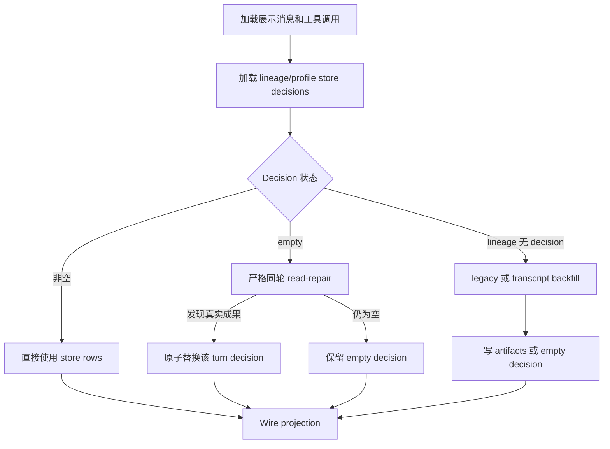

# Session Manifest Artifacts 实现

本文是 Artifacts 证据提取、路径安全、turn 归属、持久化、backfill/read-repair 和 wire projection 的唯一实现说明。产品语义见 [session-inspector-manifest.md](./session-inspector-manifest.md)；HTTP/SSE 字段见 [session-manifest-api.md](./session-manifest-api.md)。

实现入口：`api/session_manifest.py`、`api/session_manifest_store.py`、`api/streaming.py`、`api/gateway_chat.py`。

## 1. 状态层与不变量

Artifacts 的权威持久化状态层是 `{HERMES_WEBUI_STATE_DIR}/session_manifest.db`。v1 只持久化 artifacts，不持久化 todos/references。

身份键：

```text
lineage_key + profile + turn_key + record_kind + path
```

核心不变量：

1. 工具事件和最终 assistant 提取必须限定在当前 turn slice。
2. 中间 assistant prose 不提取路径。
3. 不扫描 terminal stdout、目录列表、heredoc/Python 源码或整个 workspace。
4. 非空 DB decision 是该 turn 的权威记录；正常完成结算时，同轮最终 assistant 明确列出且存在的文件会追加到该 decision，重复路径保留工具来源。
5. Empty decision 只能用同轮完整 transcript 的强证据原子修复。
6. Read-repair 不更新 session recency 或 session-list 事件。
7. 同一稳定 `tool_call_id` 的重放不得跨 turn 重复归属。
8. 工具来源只接受成功 completed 事件；成功文件读取只建立同 turn 瞬态 evidence，不进入 wire/store。


## 2. Decision-first 构建流程




`build_session_manifest()` 仍会派生 todos/references 和 turn 结构，但 artifacts 的最终权威来源遵循上图。

### Decision 类型

- **非空 decision**：该 turn 至少有一条 `path != ""` 的 artifact row。
- **Empty decision**：该 turn 只有一条 `path = ""`、`preview = "file"`、`source_tool = "assistant_prose"` 的 marker；marker 不进入 wire。
- **无 decision**：当前 lineage/profile 没有任何 store row，允许 legacy/transcript backfill。

`repair_empty_manifest_turns()` 只扫描 empty turns；提取到成果后，`replace_manifest_turn_records()` 按 `(lineage_key, profile, turn_key)` 删除旧 marker 并在同一事务写入新 rows。已有非空 turn 不参与 repair。

## 3. Turn 与工具事件

`_message_turns()` 以每条非 compression-marker 的 `role=user` 消息开启一轮：

```text
turn_key = user._turn_key 或 turn:<user_msg_idx>
```

每轮记录 `start_msg_idx` / `end_msg_idx`。`_tool_calls_for_turn()` 使用消息范围限制 `session.tool_calls`，避免 earlier turn 的写入路径污染当前轮。

`_collect_tool_events()` 将以下来源规范化为 `ToolEvent`。Mutation/read/terminal/skill/todo 等工具证据只有完成结果存在、`_tool_event_succeeded()` 确认 completed 且未报告失败后才解析其 args/result/diff；`skill_view` 还要求结果明确 `success: true`。调用 start、孤立 result、in-progress、取消、失败或非零 `exit_code` 均不产生 Manifest 证据。持久化 `session.tool_calls` 仅接受明确 `done: true` 且未标记失败的已结算 row，不能由前端展示层的 `done` 补值反推成功。

来源：

- assistant `tool_use` / `tool_calls` 与 `role=tool` 结果配对；
- `_partial_tool_calls`；
- `session.tool_calls`，通过 `assistant_msg_idx` 归属 turn。

以 `[CONTEXT COMPACTION — REFERENCE ONLY]` 开头的 assistant 消息不提供 artifact prose/media 证据。

## 4. Artifact 证据来源


| 来源                 | `source_tool`          | 证据                                                |
| ------------------ | ---------------------- | ------------------------------------------------- |
| Workspace mutation | 实际工具名                  | 结构化参数与 diff                                       |
| Skill mutation     | `skill_manage` 或实际写入工具 | mutation action、skill name/path、真实 `SKILL.md`     |
| Terminal           | `terminal`             | 成功命令中的静态 `-o`/`--output`/`--print-to-pdf` 操作数     |
| Media              | `media`                | assistant 显式 `MEDIA:<local-path>`                 |
| Final assistant    | `assistant_prose`      | 当前 turn 最后一条 assistant 中的既存 workspace 文件名/路径      |
| Legacy             | 原有 source 或规范化值        | `session.turn_artifacts`，仅 lineage 完全无 decision 时 |


### 4.1 Mutation 工具

`ARTIFACT_MUTATION_TOOLS`：

```text
write_file
create_file
edit_file
patch
apply_patch
mcp_filesystem_write_file
mcp_filesystem_edit_file
```

结构化参数包括：

```text
path, file_path, target, destination, filename,
paths[], edits[].path
```

Diff 补充：

- Unified diff：`+++ b/path` / `--- a/path`
- ApplyPatch：`*** Add File:` / `*** Update File:`

Mutation 工具可以先形成内部记录；最终 wire 再判断是否可预览或是否有足够 provenance 输出 expired。

### 4.2 Skill artifacts

- `skill_manage` 仅接受 `action ∈ {create, edit, patch, write_file}`。
- 结果若有明确成功 path，优先使用结果 path。
- 通用 mutation 工具写入 profile skills 根下的 `.../SKILL.md` 也识别为 skill artifact。
- Wire path 是 canonical skill 名，不是磁盘绝对路径。
- Integration/SkillHub 不可用、skill 不存在或仍为 `in_progress` 时不输出正常预览行；有充分历史 provenance 时可输出 `expired`。


### 4.3 MEDIA:

_MEDIA_TOKEN_RE 只读取 assistant 消息中的显式 MEDIA:。远程 URL 跳过。Workspace 内 media 规范化为相对路径；允许的 workspace 外本地 media 保留绝对路径并走 session media preview。

User 消息中的 MEDIA:、工具结果 JSON 的相似字段和普通 URL 都不作为 media artifact。

### 4.4 最后一条 assistant

每个 turn 只扫描最后一条 role=assistant。_paths_from_last_assistant_message() 使用：

- _BROAD_FILENAME_EXT_RE：绝对路径、相对路径、裸文件名；
- _LAST_ASSISTANT_TILDE_PATH_RE：~/... 路径候选。

显式相对/绝对路径直接走路径安全与预览 gate。裸文件名不从正文中的目录描述补全，而按以下优先级选择首个唯一 exact-basename 匹配：当前 turn 的成功强工具/MEDIA 路径、当前构建中此前 turn 已确认 artifact 路径、workspace 根目录真实文件。任一优先级层出现多个不同路径时视为歧义并跳过，且不降级到下一层。后续纯问答 turn 若最后一条 assistant 明确列出一个能唯一解析的既有文件，仍可产生该 turn 的 `assistant_prose` artifact。

不依赖“已保存”“文件路径”等交付关键词。候选必须：

- 解析后位于 session workspace；
- 当前真实存在且可预览；
- 不是 `uploads/` 输入文件；
- 不命中 `.git`、`node_modules`、缓存、构建目录等 cruft；
- 不超过每轮候选上限；
- canonical path 去重。

因此最终回复表格中的 ``报告.html`` 可成为成果；不存在的 ``摘要.md`` 不会被推断补全。中间 assistant 即使写出绝对路径或“文件位置”也不产生 prose artifact。

### 4.5 Read evidence

`ARTIFACT_EXCLUSION_READ_TOOLS` 包含文件读取工具。成功 completed 读取事件只从结构化 args 收集当前 turn 的 canonical workspace path，形成瞬态 evidence：

- 不进入顶层/per-turn references；
- 不进入 SSE 或 artifact store；
- 不从 stdout/result 猜路径；
- 只抑制同 turn、同 path 的 `assistant_prose` 候选；
- 不抑制 mutation、terminal、`MEDIA:` 或 skill mutation；
- 不跨 turn，稳定 tool-call replay 仍服从 turn owner。

因此 read→edit、edit→read、read→edit→read 均保留单一 mutation artifact；失败/取消 read 不建立 evidence。

### 4.6 Terminal

`terminal` 不是通用 mutation 工具。调用/start 事件只提供结构化 `args.command`；必须与同一 `tool_call_id` / `tool_use_id` 的完成结果配对，且 `_execution_event_succeeded()` 确认成功后，`_terminal_output_paths()` 才解析：

```text
-o PATH
--output PATH
--output=PATH
cp SOURCE DEST
cp -- SOURCE DEST
python .../md2word.py INPUT OUTPUT [options]
```

`cp` 只接受单 source、单 destination，且只登记 destination；recursive、选项、多 source、变量、glob 和 workspace 外 destination 均拒绝。最后一种位置参数规则只适用于脚本 basename 精确为 `md2word.py` 的 Python 调用；不会推广为未知 CLI 的通用“最后一个参数即输出”规则。

支持受控 `cd DIR && ...` 的命令本地目录。拒绝：

- 变量、命令替换、通配符；
- 多行 heredoc 和嵌入源码；
- 动态/歧义 shell 路径；
- workspace 外路径；
- 不存在、目录、cruft 或不可预览文件。

不会扫描 stdout、`ls` 列表、`cat` 输入、Python `open()` 源码或 workspace 快照。

### 4.7 Turn 绑定与 orphan

当前 worker 结算前校验最新真实 user 的 `_turn_key` 与 `stream_turn_key`。带 `_verification_stop_synthetic` 或 `_pre_verify_synthetic` 的 Agent 内部 user nudge 不是真实 user，必须跳过；未标记的 interim assistant 仍是正常可见内容。缺 key、key 冲突或 user 内容边界冲突时，不写 store record，也不创建 empty decision。normal、gateway、error 与 cancel 路径共用同一个结算入口；任何非 `persisted` 结果都会在 turn journal 记录 expected/actual key、stage 与 terminal reason。

历史 store record 若找不到同 key 的 user anchor，仍保留在顶层 `artifacts`，并把 key 暴露在 `diagnostics.orphan_turn_keys`；它不会进入正常 `turns[]`，因此不会产生错误的 per-turn chip。历史归属修复必须使用显式 old key → new key 映射，不能按编号相邻或文本相似度自动迁移。

`scripts/rebind_manifest_turn.py` 默认只报告命中的 lineage/profile/path 证据。确认映射后再增加 `--apply`；工具在单个 SQLite 事务中 upsert 新 key 并删除旧 key，重复路径由 store 唯一键合并。

## 5. 路径规范化与安全

所有候选先经 `_resolve_manifest_path(workspace, raw)`：

1. 清理引号和无效形态；
2. 排除 `ARTIFACT_IGNORE_RE`；
3. 相对路径使用 `(workspace / path).resolve()`；
4. 通过 `relative_to(workspace)` 强制 workspace 边界；
5. 输出 POSIX 相对路径。

普通 file artifacts 和 final-assistant artifacts 必须位于 workspace。Workspace 外路径仅对显式 `source_tool=media` 使用独立 media preview gate。

`_artifact_path_is_real()` / wire preview helpers 负责：

- 文件存在且不是目录；
- 非 cruft；
- 未超预览大小；
- skill `SKILL.md` 存在；
- integration/preview backend 可用。

搜索命中、目录列表、只读工具、workspace 全量扫描、相似字段和跨字段补全均不产生 artifact。

## 6. 持久化

正常流式完成顺序：

```text
final assistant 已进入 s.messages
→ 当前 user._turn_key 与 stream/SSE key 一致
→ s.save() 持久化 transcript
→ _persist_turn_artifact_paths(stream_turn_key) 合并 stream-owned 工具证据与同轮最终 assistant 的真实文件
→ upsert_manifest_records()
→ completed journal event
```

先保存 transcript，确保 artifact/empty decision 不会先于其证据 durable。无成果时写 empty decision；提取或 store 写入失败会作为可观测的持久化失败处理，不能被伪装为 empty decision 或已完成 turn。

Store row 最小字段：

```text
session_id, lineage_key, profile, turn_key, record_kind,
path, preview, source_tool, created_at, updated_at
```

Profile 只来自 `session.profile`，缺失写空字符串；不从 active profile、parent、workspace 或 path 推断。

Legacy `session.turn_artifacts` 不再是新会话写入目标，只在 lineage 完全无 decision 时作为 backfill 输入。Legacy 空 source 规范化为 `assistant_prose`，不伪装成写入工具。

## 7. Wire projection 与 expired

对外基础字段为 `path`、`preview`、`source_tool`；Artifacts 可选 `profile`，Artifacts/References 可选 `status: "expired"`。完整 schema 见 [session-manifest-api.md](./session-manifest-api.md)。

正常行：

- `preview=file`：workspace file 或允许的 media 可预览；
- `preview=skill`：canonical skill 可预览。

Expired 行：

- file artifact 有 per-turn/store provenance 但文件已缺失；
- skill reference/artifact 有明确 provenance 但 skill 已缺失。

缺失但没有持久化/per-turn provenance 的候选不输出。Expired 行不可点击预览。

去重与优先级：

- Session/turn 内按 canonical path 去重；
- References 只允许成功 `skill_view` 的 skill row；同技能 artifact > skill reference；
- 同 path 的 source 优先级为 mutation tool > `media` / `assistant_prose`；
- skill 按 canonical skill 名去重。


## 8. SSE

- `extract_manifest_delta_from_tool_event()`：`tool_start` 不产生 artifact/reference；只有成功 `tool_complete` 可产生工具候选。文件 read 永不产生公开 delta，成功 `skill_view` 可产生 reference。
- `extract_manifest_delta_from_turn_reconcile()`：assistant durable 后、`done` 前，按当前 turn 工具强证据、`MEDIA:` 和 final assistant 生成 `turn_complete` delta。
- 候选未通过 preview gate 时不发送。
- SSE 只更新 Inspector 乐观态；per-turn chips 以 `done` 后 GET 为准。


## 9. 关键函数


| 函数                                         | 职责                                |
| ------------------------------------------ | --------------------------------- |
| `build_session_manifest`                   | GET manifest 总入口                  |
| `_message_turns` / `_turn_message_slice`   | Turn 分组与切片                        |
| `_collect_tool_events`                     | Transcript/tool_calls → ToolEvent |
| `_collect_media_artifact_events`           | `MEDIA:` → events                 |
| `_collect_final_assistant_artifact_events` | 当前轮末条 prose → events              |
| `_tool_event_succeeded`                    | 统一工具成功门槛                          |
| `ARTIFACT_EXCLUSION_READ_TOOLS`            | 文件读取瞬态排除分类                        |
| `_terminal_output_paths`                   | 受控 terminal 输出操作数                 |
| `_extract_turn_artifact_entries`           | 单 turn 共享提取                       |
| `_resolve_manifest_path`                   | 路径规范化                             |
| `_artifact_path_is_real`                   | Reconcile/持久化存在性闸门                |
| `upsert_manifest_records`                  | 普通 store upsert                   |
| `replace_manifest_turn_records`            | 原子替换单 turn decision               |
| `repair_empty_manifest_turns`              | Empty-only read-repair            |
| `backfill_missing_manifest_records`        | Lineage 无 decision 时 backfill     |
| `_row_to_wire` / `_rows_to_wire`           | Wire 与 expired projection         |
| `_persist_turn_artifact_paths`             | Turn 完成持久化                        |


## 10. 测试

```bash
./scripts/test.sh tests/test_session_manifest.py tests/test_session_manifest_store.py tests/test_session_manifest_contract.py tests/test_session_manifest_replay.py -q
```

重点覆盖：

- 工具参数/diff 与 stable tool-call turn 归属；
- Final assistant Unicode/相对路径/裸文件名；
- 中间 assistant prose 不提取；成功 read evidence 仅抑制同轮 final prose；
- Terminal `-o` 与 stdout/heredoc 排除；
- Workspace、`uploads/`、cruft、缺失文件过滤；
- Skill canonicalization；
- Empty decision 原子修复、profile/lineage 隔离和幂等；
- Expired provenance；
- Transcript save 早于 manifest decision。
