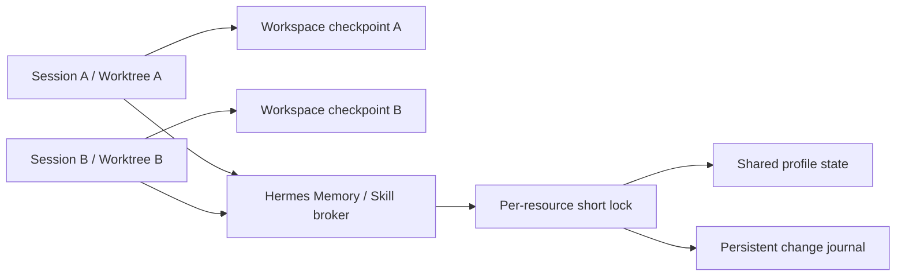
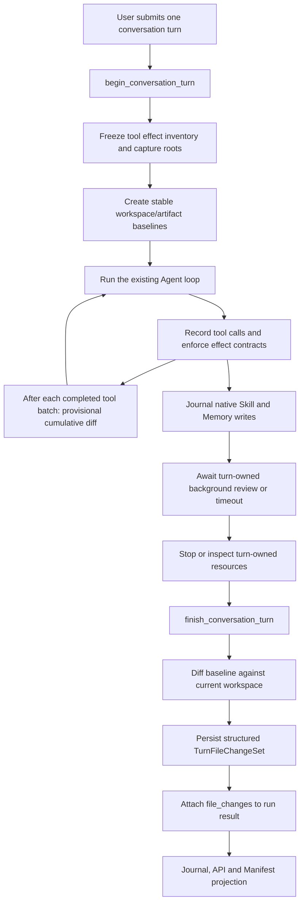

# 基于 Hermes Agent Checkpoint 与原生状态 Journal 的轮次变更捕获方案

> 状态：待实现。本方案是轻量、跨平台方案，复用 Hermes Agent 现有 `CheckpointManager`、tool hooks、process registry、session 持久化和 `run_conversation()` 生命周期，不引入 VM、overlay filesystem、系统调用审计或平台专用 watcher。第 19 节列出实施前必须闭环的审查问题与推荐解法；这些问题未通过对应验收前，不得对外宣称“完整捕获”。

## 1. 目标与结论

目标是稳定捕获当前所有 Hermes 内置工具在一次用户 conversation turn 中造成的、落入已声明持久范围的最终净文件变化，并向 Hermes WebUI 提供两类结构化变更：

- 当前 session workspace 内的文件最终净变化；
- 由该轮直接工具调用或该轮派生的后台 review 导致的 Skill、Memory 等 Hermes 持久状态变化。

首期输出以下变化类型：

- `created`：新增文件；
- `modified`：内容发生变化；
- `deleted`：文件被删除；
- `type_changed`：普通文件模式变化，或普通文件与符号链接之间的类型变化；目录不属于首期 Git capture 资源；
- 可选 `renamed`：只在 Git 提供足够稳定的 rename 证据时输出，否则表示为 `deleted + created`。

首期不实现独立 Runner、每轮 shadow workspace、CAS 归档和事务回写。workspace 的权威证据来自 Hermes Agent 现有 shadow Git checkpoint；共享受管状态的权威证据来自 Hermes 原生受控写入口追加的 durable journal，而不是工具参数、shell 命令解析、stdout 或 assistant 文本。

该方案的 workspace 完整性保证是：

> 无论由哪个内置工具、工具子进程或子代理产生，都捕获 capture policy 纳入的 workspace 与已登记 Artifact root 在该轮开始和最终结算之间的最终净变化。

对于共享 profile 状态，准确保证为：

> 捕获经过 Hermes 原生受控写入口提交，并携带当前 `session_id + turn_id + stream_id` 因果上下文的持久状态变化。

“所有内置工具”不等于“整台宿主机的所有文件 I/O”。用户可见变更范围固定为 workspace、已登记 Artifact root 和受管 profile 资源；Agent 日志、SQLite WAL、浏览器 profile/cache、临时目录、模型缓存和远程系统副作用不进入用户 ChangeSet。这些排除必须以资源类型写入 policy，不得靠临时路径模式静默漏掉。

该方案不能严格证明 workspace diff 中的每个变更必然由某一工具调用产生，因为 Agent 与用户编辑器仍直接操作同一真实 workspace，所以 workspace 必须表示为 `capture_mode=checkpoint`。内置工具若能写任意宿主路径，必须将用户交付输出归一到 workspace/Artifact root；无法证明未发生范围外持久写入时，本轮必须失败闭合为 `partial` 或 `unsupported`，不得返回 `complete=true`。Memory、Skill 等原生受管工具必须经 Hermes broker 写入；通用 Terminal、Python 子进程或第三方工具可能绕过 broker 时，跨平台默认只能声明 `persistent_write_boundary=cooperative`。只有当前 backend 已用可验证的平台隔离阻止绕过时，才能升级为 `persistent_write_boundary=brokered`。

### 1.1 推荐并发模型



推荐方案不对整个 conversation、profile 或 `HERMES_HOME` 加全局锁。不同 worktree、不同 Skill 以及不冲突的任务真正并行；只有两个写入提交到同一个 Memory 文件或同一个 Skill 时，才在“读旧值、原子替换、追加 journal”临界区短暂串行。

### 1.2 推荐持久化边界

- Agent 每 profile 的 `state.db` 保存 `turn_change_sets` 与 `managed_state_change_events`，分别承担 ChangeSet 权威快照和持久状态 WAL；它们不依赖 WebUI 生命周期。
- WebUI 继续复用现有 `{HERMES_WEBUI_STATE_DIR}/session_manifest.db`：已有 `session_manifest_records` 保持 Artifact-only，新建 `turn_change_projections` 保存脱敏 Changes 展示投影。
- 首期不建逐文件数据库表；有界 workspace 净变化原子保存在 `changes_json`，待出现跨轮次路径查询、数据库分页或超大 ChangeSet 的真实需求后再规范化。
- Agent 与 WebUI 各自迁移自己的数据库，Hermes Agent 不直接打开或写入 `session_manifest.db`。

## 2. 复用的 Hermes Agent 能力

### 2.1 CheckpointManager

Hermes Agent 现有 `tools/checkpoint_manager.py` 已实现：

- 为工作目录创建 shadow Git repository；
- 将当前目录状态存为 checkpoint commit；
- 列出 checkpoint 历史；
- 将 checkpoint 与当前工作目录比较；
- 从 checkpoint 恢复文件；
- 不在用户项目中创建或修改 `.git` 状态。

Hermes Agent 当前 v2 checkpoint 不是每个 workspace 一个仓库，而是同一 `HERMES_HOME` 下的 workspace 共用一个 bare Git object store，通过每个 workspace 的逻辑 ref、index 和 metadata 隔离：

```text
{HERMES_HOME}/checkpoints/store/
  objects/                         # 同一 HERMES_HOME 下的 workspace 共享
  info/exclude                     # 同一 store 共享，当前仅初始化时写入
  refs/hermes/<workspace-hash>     # 每 workspace 逻辑 ref，可能被收纳到 packed-refs
  indexes/<workspace-hash>         # 每 workspace index
  projects/<workspace-hash>.json   # 每 workspace metadata
```

逻辑 ref 在 GC 后可能收纳于 `packed-refs`，因此不能假定 `refs/hermes/<workspace-hash>` 始终是独立物理文件。不同 profile 若使用不同 `HERMES_HOME`，则不共享该 store。

这是本方案的主要复用点，也是必须显式处理的共享状态边界。当前实现尚无 workspace 级或 store 级的显式跨进程锁；Git 自身的对象/ref 锁以及 `update-ref` CAS 不能保护完整的 stage、commit、prune、GC 操作序列。方案实施时需新增 workspace 级锁保护对应 ref/index，并以 store 级锁协调初始化、pin ref、prune、GC 及共享配置变更。当前 `info/exclude` 只在 store 初始化时写入；若未来允许运行期更新，也必须纳入 store 级协调。

### 2.2 Tool hooks

Hermes Agent 在统一工具分发层已提供：

- `pre_tool_call`；
- `post_tool_call`；
- `tool_name`；
- `args`；
- `result`；
- `task_id`；
- `session_id`；
- `tool_call_id`。

本方案只用这些 hook 记录“本轮调用过哪些工具”，不从参数或结果推导权威文件列表。

### 2.3 run_conversation 生命周期

`AIAgent.run_conversation()` 已经是一次用户消息的轮次边界：

- 入口创建用户消息；
- 中间可包含多次模型 API iteration 和多个工具调用；
- 出口统一处理正常完成、取消、超限和部分错误；
- 最终持久化 session 并返回结构化 result。

因此 ChangeSet identity 和最终结算边界应放在 `run_conversation()` 的整个用户轮次上。当前每次 API iteration 可复用为增量观测点：工具 batch 全部完成后发布相对 conversation baseline 的 provisional revision，但不取代整轮 final diff。

### 2.4 Session 持久化

Hermes Agent 已会将 user、assistant、tool call 和 tool result 写入 session JSON/SQLite。轮次文件变更应作为独立结构化记录与 session 关联，不应塞入 assistant 文本或依赖后续重新解析 transcript。

### 2.5 原生 Skill、Memory 写入机制

Hermes 已有适合复用的持久学习写入口：

- `tools/memory_tool.py` 通过 `MemoryStore`、文件锁和原子替换修改 `{HERMES_HOME}/memories/MEMORY.md` 与 `USER.md`；
- `tools/skill_manager_tool.py` 统一处理 Skill 的 create/edit/patch/delete/write_file/remove_file；
- `tools/write_approval.py` 会把待批准的 Memory/Skill 写入持久化到 `{HERMES_HOME}/pending/{memory,skills}`；
- `tools/skill_provenance.py` 已用 `ContextVar` 区分 foreground 与 `background_review` 来源；
- `agent/background_review.py` 在主回复完成后异步执行 Memory/Skill 自我改进。

因此 Skill/Memory 不应纳入 workspace checkpoint，也不应对整个共享 `HERMES_HOME` 做每轮前后 diff。应在这些原生写入口成功提交或成功暂存时追加结构化变更事件，并扩展现有 provenance 上下文。

## 3. 现有实现与目标实现的差距

CheckpointManager 已有核心能力，但现有行为不能直接满足轮次捕获：

| 现有行为 | 问题 | 目标行为 |
| --- | --- | --- |
| `new_turn()` 在每次模型 API iteration 前调用 | 一次用户轮次可出现多个 checkpoint 边界 | 增加独立 conversation-turn tracker |
| 只在 `write_file` / `patch` 前 checkpoint | 无法覆盖未知工具 | 用户轮次开始时无条件 baseline |
| Terminal 只有命中破坏性命令正则才 checkpoint | `python`、`cp`、`touch`、构建器等可漏掉 | 不依赖 terminal 命令分类 |
| `diff()` 返回文本 diff/stat | WebUI 难以稳定消费 | 返回 NUL-safe 结构化路径状态 |
| checkpoint 不与 `session_id/turn_id` 强关联 | 无法稳定投影到某轮 | 增加 durable turn change set |
| 不区分 capture 完整与部分失败 | UI 可能把漏项当成零变化 | 显式 `complete/partial/failed` |
| 工具注册表没有文件副作用契约 | 新内置工具可以绕过输出范围和 settle 检查 | 每个内置工具强制声明 effect class 和 settlement class |

### 3.1 内置工具文件副作用契约

为了覆盖当前和以后新增的所有内置工具，在现有 `tools.registry.ToolEntry` 增加两个轻量字段，不新建一套工具运行时：

```python
filesystem_effects: frozenset[Literal[
    "none",             # 无用户持久文件副作用
    "workspace",        # 输出必须落入 workspace
    "artifact",         # 输出通过 Artifact root registrar 登记
    "managed_state",    # 通过 Hermes broker/journal 提交
    "delegated",        # 调用子工具/子代理，继承上下文
    "unbounded",        # 可写任意宿主路径，无隔离时不得 complete
]]
settlement: Literal["synchronous", "turn_owned", "persistent"]
```

这些字段用于决定 capture roots、输出归一和结算策略，不用来生成文件列表。文件列表仍由 baseline/final 状态差分和受管资源 journal 产生。

最小覆盖规则：

1. `write_file`/`patch` 为 `workspace + synchronous`；Terminal 为 `unbounded + turn_owned`。
2. `execute_code`/`delegate_task` 为 `delegated + turn_owned`，必须传播同一 TurnCaptureContext。
3. `memory`/`skill_manage`/`cronjob` 及其它受管持久工具为 `managed_state`，必须经原生写入口记 journal。
4. 图片、音频、视频、浏览器下载/截图等用户交付文件为 `artifact`，最终路径必须由统一 registrar 归一到已登记 root。
5. 纯读取、网络或远程副作用工具可为 `none`；其运行时 cache/log 属于 policy 明确排除的 operational state。
6. `computer_use` 或任何无法限定本地输出的工具标记 `unbounded`；本轮使用后，除非当前 backend 提供可验证的写边界，否则至少为 `partial`。
7. CI 从 registry 枚举所有 built-in entry；缺少上述字段、effect 与 toolset 矛盾，或 `artifact/managed_state/delegated` 没有对应 adapter 时直接失败。MCP 与第三方 plugin 不属于“内置工具完整覆盖”；未声明 effect contract 时按 `unbounded` 处理。

## 4. 总体流程



核心原则：

1. baseline 在本轮任何工具调用前完成。
2. 不根据工具名或命令文本推导文件列表；只用 effect contract 决定范围和 settle 策略。
3. 文件列表来自 workspace/Artifact root 状态差分。
4. 每个 tool batch 结束后可发布相对整轮 baseline 的 provisional revision；整轮 final diff 是最终权威。
5. hook 提供轮次级 tool provenance 和 effect contract 执行状态，不根据参数猜测变更。
6. 捕获结果先 durable，再向 WebUI 发送轮次完成事件。
7. workspace/Artifact root 使用 checkpoint 或同构 inventory 证据；共享受管状态使用原生写入事件证据，二者不能混为同一种保证。

## 5. Agent 侧设计

### 5.1 新增 TurnFileChangeTracker

在 Hermes Agent 中增加一个组合 `CheckpointManager` 的轻量协调器：

```text
tools/turn_file_changes.py
  TurnFileChangeTracker
  TurnCaptureContext
  TurnFileChangeSet
  FileChange
```

建议接口：

```python
class TurnFileChangeTracker:
    def begin_turn(
        self,
        *,
        session_id: str,
        turn_id: str,
        turn_key: str | None,
        stream_id: str,
        workspace: str,
        task_id: str,
    ) -> TurnCaptureContext:
        ...

    def note_tool_start(
        self,
        *,
        tool_call_id: str,
        tool_name: str,
        task_id: str,
        started_at: float,
    ) -> None:
        ...

    def note_tool_complete(
        self,
        *,
        tool_call_id: str,
        success: bool,
        completed_at: float,
    ) -> None:
        ...

    def finish_iteration(
        self,
        *,
        iteration_id: int,
        outcome: str,
    ) -> TurnFileChangeSet:
        ...

    def finish_turn(self, *, outcome: str) -> TurnFileChangeSet:
        ...

    def fail_turn(self, *, stage: str, error_code: str) -> TurnFileChangeSet:
        ...
```

Tracker 每个 `stream_id` 一个 context，不使用全局当前轮次变量。同一进程内多 session 并发时，状态必须按 `stream_id/task_id` 隔离。

### 5.2 begin_turn

`begin_turn()` 必须在本轮第一个 tool call 之前：

1. 解析 workspace 真实路径；
2. 校验 workspace 为支持的本地目录；
3. 冻结 capture policy 和 `policy_hash`；
4. 调用 CheckpointManager 创建当前状态快照；
5. 取得稳定 `baseline_commit`，并立即创建 `refs/turn-captures/<change_set_id>/baseline` pin ref；
6. 持久化 `capture_status=started`；
7. 返回不可变 TurnCaptureContext。

现有 `_take()` 在当前状态与 HEAD 相同时会跳过 commit，所以新接口不能只返回 `bool`，而应返回可比较的 HEAD：

```python
CheckpointRef(
    workspace="/resolved/workspace",
    commit_hash="...",
    created_new_commit=False,
)
```

如果是首次捕获且 workspace 为空，CheckpointManager 必须创建一个可表示空树的初始 commit，否则后续无法对新建文件做稳定 diff。

### 5.3 工具记录

`pre_tool_call` 和 `post_tool_call` 将事件传给 Tracker，并从已冻结 registry snapshot 读取 effect contract，但不得从 `args.path`、terminal command 或 result 提取权威文件变更。

持久化的 provenance 最小包含：

```json
{
  "tool_call_id": "call_123",
  "tool_name": "terminal",
  "task_id": "parent-task",
  "started_at": 1710000000.1,
  "completed_at": 1710000001.8,
  "success": true
}
```

还需记录 `filesystem_effects`、`settlement`、`effect_contract_version` 和 `effect_status`。工具可同时具有多个 effect，但 `none` 不得与其它值并存。工具缺少契约、Artifact root 登记失败、managed-state broker 被绕过、delegated context 丢失或 unbounded writer 无法收敛时，Tracker 必须将本轮标记为 partial/unsupported。

因为 Hermes Agent 支持并行工具和子代理，首期只声称“这些工具参与了该轮”，不声称某个文件一定属于某一 `tool_call_id`。

### 5.3.1 iteration 增量捕获

每次模型返回的工具 batch 在并行/分段执行全部 join 后，调用 `finish_iteration()`。它相对整轮 baseline `C0` 计算当前累计净变化 `diff(C0, Ci)`，持久化并发布 `revision=N, settlement=provisional`。不将相邻 iteration 的 delta 简单追加，否则后续删除、恢复或改名无法正确覆盖早期结果。

现有 `CheckpointManager.new_turn()` 继续只承担 `/rollback` 的 iteration 内去重；它不是 ChangeSet identity，也不作为增量捕获已完成的证据。

### 5.4 finish_turn

`finish_turn()` 在 Agent 主循环和所有可收敛 turn-owned writer 结束后执行，对前面的 provisional revision 做最终校准：

1. 先调用现有 task resource cleanup/process registry，尝试停止属于本轮的仍在执行的工具资源；
2. 检查是否存在已知未结束后台进程；
3. 将当前 workspace 完整加入 shadow Git index；
4. 相对 `baseline_commit` 运行 NUL-safe 状态差分；
5. 构造结构化 FileChange 列表；
6. 持久化 TurnFileChangeSet；
7. 清理该轮专用 capture index 中只用于比较的 staged 状态；
8. ChangeSet durable 成功后删除 baseline pin ref；删除前任何 prune/GC 都不得回收该 commit；
9. 将 ChangeSet 放入 `run_conversation()` 返回值。

建议的 Git 命令为：

```bash
GIT_INDEX_FILE=<turn-capture-index> git add -A
GIT_INDEX_FILE=<turn-capture-index> git diff --cached --name-status -z --find-renames=50% <baseline_commit>
GIT_INDEX_FILE=<turn-capture-index> git diff --cached --raw -z <baseline_commit>
```

返回解析必须使用 NUL delimiter，不按换行或空格拆分，以支持包含空格、制表符和 Unicode 的文件名。首期若不能固定 Git 版本与 rename 阈值，则默认关闭 rename 推断，统一输出 `deleted + created`，避免将启发式相似度误表述为因果证据。

### 5.5 异常路径

Tracker 必须在 `finally` 类似的统一收口中完成，覆盖：

- 正常 assistant final response；
- 用户 cancel/interruption；
- Provider 错误；
- iteration budget 用尽；
- 工具错误；
- session 持久化前的其它可恢复异常。

如果 baseline 不存在、Git 命令失败、workspace 在遍历时消失，或已知后台 writer 仍在运行，必须写：

```json
{
  "capture_status": "failed",
  "complete": false,
  "error_code": "turn_file_capture_incomplete"
}
```

不得用空 `changes=[]` 表示捕获失败。

### 5.6 Skill、Memory 等共享状态捕获

新增轻量 `PersistentStateChangeJournal`，但不新增一套文件系统事务层。它只接收 Hermes 现有受控写入口在提交后的事实事件。

每轮建立并显式传播：

```python
TurnWriteContext(
    session_id=session_id,
    turn_id=turn_id,
    stream_id=stream_id,
    tool_call_id=tool_call_id,
    task_id=task_id,
    origin="foreground",  # 或 background_review
)
```

该上下文可扩展 `tools/skill_provenance.py` 的现有 `ContextVar`，不能使用进程级全局“当前 session”。创建后台线程、子代理或 executor task 时必须显式复制上下文；后台 review 还要记录 `parent_turn_id`。

在以下成功点追加 durable event：

| 现有入口 | 事件类型 | 资源 |
| --- | --- | --- |
| `MemoryStore.add/replace/remove` 原子替换成功后 | `memory_committed` | `MEMORY.md` 或 `USER.md` |
| `skill_manage` 成功返回前 | `skill_committed` | Skill 目录内相对路径 |
| `write_approval.stage_write` 原子替换成功后 | `persistent_write_staged` | pending record |
| pending approve/reject | `persistent_write_approved/rejected` | pending ID 与最终资源 |
| curator archive/restore 等已有受控入口 | `skill_archived/restored` | Skill 名称与归档位置 |

事件至少记录逻辑 action、资源类型、profile identity、相对逻辑路径、提交前后内容哈希、时间、origin 和完整 TurnWriteContext。Memory 内容以及可能包含秘密的文件内容不直接复制到事件表。

事件写入与实际状态提交必须使用可恢复的 `prepared -> state_applied -> committed` 协议：

1. 在资源锁内读取旧状态并计算 `before_hash/after_hash`；
2. 先 durable 写入 `prepared` 事件，再原子替换状态文件，最后将事件标记为 `committed`；
3. 启动恢复扫描未结算 `prepared` 事件：当前哈希等于 `after_hash` 时补记 committed，等于 `before_hash` 时标记 aborted，其他值标记 integrity violation；
4. journal prepared 失败时禁止执行真实写入；状态已提交但 committed 标记失败时返回 `persistent_capture_status=partial` 并依赖恢复扫描收敛；
5. 同一 `event_id` 幂等，工具重试不得生成重复业务事件；
6. 多会话共享同一 profile 时，Memory 文件锁和每个 Skill 的资源锁只串行化冲突写入，不阻塞不同 workspace 的 Agent 主流程。

`pending` 需要区分“提出”与“生效”：原轮次创建 pending record 时记录 `persistent_write_staged`；用户稍后批准造成的真实 Memory/Skill 落盘属于批准操作的新审计事件，并通过 `source_turn_id` 关联原轮次，不回写或篡改原轮次已经结算的 ChangeSet。

### 5.7 后台 review 与轮次结算

Hermes 的 Memory/Skill background review 在 assistant 主回复之后运行。WebUI 因此需要区分：

```text
assistant_done  -> 主回复已可展示
turn_settled    -> workspace diff 与该轮派生的后台 review 均已结算
```

`_spawn_background_review()` 注册一个带 `parent_turn_id` 的 turn-owned future/refcount。正常完成时 journal 最终事件并减少 refcount；达到配置的 settle timeout 时仍返回 ChangeSet，但该轮只能标记为 `provisional`，不得发布语义为“不再更改”的 `turn_settled`：

```json
{
  "persistent_capture_status": "partial",
  "limitations": ["background_review_timeout"]
}
```

后台 review 超时后若最终完成，其事件仍按原 `parent_turn_id` 追加，并发布 `turn_file_changes_updated` 修订事件；修订必须递增 `revision`，不能静默覆盖客户端已经看到的结果。迟到修订不能依赖已关闭的单次 `/api/chat/stream`；它必须先进入 durable event store，再由可重放 per-session event stream 或 GET 轮询交付。只有 refcount 归零或后台任务已进入不可恢复终态后，才发布最终 `turn_settled`。

### 5.8 共享状态的轻量 broker 边界

跨平台首期将 `{HERMES_HOME}/memories`、`skills`、`pending` 定义为受管状态目录，默认使用 `persistent_write_boundary=cooperative`：

1. `memory`、`skill_manage`、approval 和 curator 继续复用 Hermes 主进程内的原生写入入口，只在这些入口增加 TurnWriteContext、资源锁和 journal；
2. 通用 File Tool 复用现有 safe-root 机制，将可写根固定为当前精确 worktree，拒绝解析到受管状态目录；
3. `execute_code`、子代理和后台任务传播同一 TurnCaptureContext，可正常调用带 TurnWriteContext 的 broker；
4. broker 成功提交状态和 journal 后才向工具调用方返回成功；
5. Terminal、`computer_use` 及其子进程保持 `unbounded` 契约；当前 backend 没有可验证写边界时，调用过这类工具的轮次至少为 `partial + unbounded_write_scope`。

受管目录的 before/after inventory 只作为低成本完整性哨兵，不作为某轮文件列表的权威来源。若发现没有对应 journal event 的变化，记录 `observed_unattributed`，相关轮次或 profile health 标记为 `partial`/`integrity_violation` 并告警；不得按时间窗口把变化强行分配给某个 session。该 inventory 使用便携的目录遍历与 metadata/hash 比对，不引入平台 watcher。

若某平台已有成熟、可选的 sandbox adapter，可额外将受管目录对通用工具设为不可写；通过对应隔离验收后才返回 `persistent_write_boundary=brokered`。该 adapter 不是 Phase 1 或“已声明范围内稳定捕获”的前置条件。

## 6. 轮次与 checkpoint 边界

### 6.1 两种“turn”必须分开

当前 CheckpointManager `new_turn()` 的语义更接近“一次模型 tool-loop iteration 内去重”，不能直接作为用户 conversation turn 身份。

建议保留原有 API 以兼容 rollback 行为，新增：

```python
checkpoint_mgr.begin_conversation_turn(...)
checkpoint_mgr.finish_conversation_turn(...)
```

或者将这两个方法完全放在 `TurnFileChangeTracker` 中，避免改变原有 `/rollback` 语义。

### 6.2 快照时间线

```text
T0  begin_turn: baseline=C0
T1  model iteration 1 -> tools A/B in parallel
T2  tools A/B joined -> provisional revision 1 = diff(C0, C1)
T3  model iteration 2 -> tool C + subagent calls
T4  tool C/subagent joined -> provisional revision 2 = diff(C0, C2)
T5  assistant_done; await turn-owned background review/process or timeout
T6  cleanup/settle known task resources
T7  finish_turn: final revision = diff(C0, Cf)
T8  persist workspace + persistent-state ChangeSet
T9a all turn-owned work converged: emit turn_settled
T9b timeout: emit turn_settlement_provisional; publish a higher revision and turn_settled after convergence
```

在 T0 之前或 final settlement 之后的变更不属于该 ChangeSet。T0-T7 期间用户编辑器产生的变更也会被包含，这是 checkpoint 模式的已知边界。iteration revision 用于提前展示和崩溃恢复，只有 final revision 表示整轮最终净变化。

## 7. Capture policy

### 7.1 范围

首期支持的可捕获持久范围：

- `terminal.backend=local`；
- `terminal.backend=docker` 的 `docker-bind` 模式：容器 `/workspace` 必须是已验证的、宿主可直接遍历的 read-write bind mount；
- 宿主机可直接遍历的 workspace（本地 workspace 或已验证的 `docker-bind` source）；
- 一个用户 conversation turn 对一个 workspace root；
- 由 Hermes Agent 进程可直接遍历的文件系统；
- 在 begin 阶段登记且与 workspace 不重叠的 Artifact roots；
- 经原生 broker/journal 提交的 profile 受管状态。

首期明确不支持：

- Docker `tmpfs`、named volume、宿主不可见 volume，以及无法确认 `/workspace` 挂载的容器；
- SSH、Modal、Daytona 等非本地文件环境；
- 远程 MCP 在外部服务中产生的文件；
- workspace/Artifact roots 外的任意普通宿主文件路径（通过受控入口写入的 profile 状态除外）；
- 未注册为 turn-owned task、在 Agent 轮次结算后继续产生的后台变更。

不支持的 backend 必须返回 `capture_status=unsupported`，不能静默返回空文件列表。

完整性按“已调用工具”计算，而不要求每轮启动所有 adapter。当且仅当本轮每个已调用内置工具的 effect contract 都已结算，且所有适用 capture root/journal 都完整时，才可返回 `complete=true`。

### 7.2 多会话并发与 worktree 契约

WebUI 现有 worktree 模式会调用 Hermes Agent `_setup_worktree()`，生成类似以下目录：

```text
<repo>/.worktrees/hermes-a1b2c3/
<repo>/.worktrees/hermes-d4e5f6/
```

它们具有相同前缀，但是彼此独立的兄弟目录。`/api/session/new` 在 worktree 创建成功后会将 `session.workspace` 设为精确 `worktree_info.path`。只要后续捕获始终使用这个精确根，相同字符串前缀不会导致 ChangeSet 混合。

例如：

```text
session A root = /repo/.worktrees/hermes-a1b2c3
session B root = /repo/.worktrees/hermes-d4e5f6
```

对 A 的 baseline/final 遍历不会进入 B，对 B 也一样。CheckpointManager 按完整 canonical workspace path 计算 workspace hash，因此两个 worktree 使用共享 Git object store 中不同的 ref 和 index。不同 workspace 的 snapshot/diff 可并行，但 store 初始化、GC、prune、共享 exclude 变更和活动 baseline pin 管理必须经过 store 级协调。

实现必须满足以下不变量：

1. Tracker 直接使用已验证的 `session.workspace` 精确根，不得调用会向上搜索 `.git`/`pyproject.toml` 的 `get_working_dir_for_path()`。
2. workspace identity 使用 canonical resolved path；在 POSIX 上同时记录 `st_dev + st_ino`，Windows 使用等价 volume/file identity，防止 symlink、路径别名或大小写差异将同一物理目录伪装为两个 workspace。
3. 同时运行的两个 workspace root 必须互不包含：A 不能是 B 的祖先，B 也不能是 A 的祖先。
4. 主仓库 workspace 与其 `.worktrees/**` 不得同时作为互相覆盖的 capture root。主仓库捕获 policy 必须排除 `.worktrees/**`。
5. 每个精确 workspace root 使用一把跨进程锁和一把进程内 mutex，防止同一 worktree 出现两个重叠轮次，也防止并行 tool thread 共用同一 index；不同兄弟 worktree 的锁不得互相阻塞。
6. shadow repository 打开时校验其持久化 `HERMES_WORKDIR` 与当前 canonical workspace identity 一致；哈希冲突或 identity 不一致时失败闭合。
7. worktree 在活动 stream、Terminal 或未结算 ChangeSet 存在时不得删除或复用其目录名。
8. 每个轮次使用独立 capture index，不与 `/rollback` 或现有 iteration checkpoint 共用 per-project index。
9. 活动 baseline 使用 pin ref 保持可达；任何 store 级 prune/GC 都必须保留 pin ref，并且不得与 pin 创建/删除并发。

还需要区分“WebUI 为 session 选择了独立 workspace”和“所有工具只能写该 workspace”。前者当前已有，后者不能仅靠 cwd 保证：

- File Tools 应将 `HERMES_WRITE_SAFE_ROOT` 固定到当前 session worktree；
- 子代理必须继承同一精确 worktree root；
- Browser/download/document 工具的默认输出目录必须在当前 worktree；
- local Terminal 仍可通过绝对路径或 `..` 写父目录、主仓库或兄弟 worktree；现有 checkpoint 只能捕获当前 root 内的最终变化，无法阻止或归属这种越界写入。

因此并发支持分为两个等级：

| 模式 | 能力 | 保证 |
| --- | --- | --- |
| `checkpoint-worktree` | 不同 session 使用不重叠兄弟 worktree，并行 baseline/diff | 正确捕获每个 worktree 根内的最终净变化；不防止 Terminal 越界写入 |
| `strict-worktree` | 可选的 OS sandbox 适配层，禁止写当前 worktree/Artifact roots 外路径 | 可将本地文件变更限定在已声明范围；不是跨平台首期前置依赖 |

跨平台首期默认使用 `checkpoint-worktree`。当本轮使用 Terminal、`computer_use` 或其它 `unbounded` 工具时，若当前平台没有可验证写边界，即使 workspace diff 成功也只能返回 `partial + unbounded_write_scope`。这是不引入重型 Runner 的必要产品语义，不得用命令正则或平台 watcher 猜测为 complete。

### 7.2.1 Docker bind workspace 契约

Docker 首期不在容器内实现第二套 checkpoint。Tracker 在 begin 阶段通过现有 environment factory 取得容器，再从 `docker inspect` 的结构化 `Mounts` 中确认 `/workspace` 对应的 bind source；对该宿主 source 使用现有 `CheckpointManager`。不解析 `docker_volumes` 字符串，以兼容 Docker Desktop、Windows drive 和未来的挂载参数更新。

`TurnFileChangeSet` 的工作区 identity 使用宿主 bind source，但向工具与 WebUI 展示的路径始终以容器逻辑根 `/workspace` 为准，不暴露 source 绝对路径。`/root`、`/tmp` 和安装器缓存定义为 Docker operational state；工具交付文件必须写入 `/workspace` 或已登记的 Artifact mount。当前 cwd 在已登记 root 外，或有未登记的 read-write mount 时，本轮必须返回 `partial` 并附带 `docker_outside_capture_root` 或 `docker_untracked_rw_mount`。

当 Docker 用于 WebUI 多 workspace 时，容器/environment key 必须包含 `profile + workspace_fingerprint`，子代理继承父轮的 key。不同 workspace 不得继续复用同一 `/workspace` 容器；若现有配置只能使用全局 `default` 容器，首期只能对该容器串行捕获且返回 `partial + shared_docker_workspace`。同一 capture root 仍使用已规定的跨进程锁。

Skill/Memory 是同一 profile 下的共享资源，不属于任何 worktree。它们的并发归属不使用路径前缀或目录 diff，而使用 5.6 节的 TurnWriteContext 和原生事件 journal。不同 worktree 可并行执行；只有写同一个 Memory 文件或同一个 Skill 的短临界区需要资源级串行。

### 7.3 include/exclude

可复用 CheckpointManager 的 Git staging 机制，但不能直接把共享 `info/exclude` 当作每轮 policy。每轮必须生成不可变 policy manifest，显式记录是否遵守 workspace `.gitignore`、是否进入嵌套 Git repository、哪些路径因敏感规则/大小/权限被排除。不能让用户以为被排除的文件也已捕获。

首期固定排除：

- `.git/**`；
- Agent 日志、capture 自身的 DB/WAL/锁文件、浏览器 profile/cache 和工具临时目录等 `resource_class=operational` 路径；
- 已声明的敏感路径，例如 `.env*`。

`node_modules/**`、`dist/**`、`build/**`、virtualenv、cache、coverage 产物以及超过配置上限的大文件/目录，属于可配置的成本排除，而非不可见的固定规则。首期若采用这些排除，必须在 policy manifest 和 ChangeSet 中逐项返回；某个内置工具的交付本来落在这类路径时，本轮不能宣称捕获了该交付。

上述是 workspace capture policy，不是 operational state 定义。只有固定的 operational 排除不会改变用户 workspace 的声明范围；任何成本排除都会收窄该轮范围，`capture_scope_complete=true` 仍只表示该收窄后的 policy 已完整捕获。

对 `docker-bind`，policy manifest 另记录 `execution_backend=docker`、`capture_adapter=docker_bind`、容器逻辑 root、已登记的 workspace/Artifact/operational mounts 及其只读属性，且这些字段计入 `policy_hash`。挂载判定只以 `docker inspect` 的结构化 descriptor 为准，不从 `docker_extra_args` 推断。非 bind `/workspace`、不可访问 source、缺少 descriptor 或存在未登记可写 mount 时，不能降级为普通 local capture；必须明确返回 `unsupported` 或 `partial`。

`.env*` 等敏感文件需要特别处理。现有 shadow Git checkpoint 会存储文件内容，因此不应为了“所有文件”而默认将凭据写入 checkpoint object database。首期继续排除敏感文件，并在 ChangeSet 中返回：

```json
{
  "excluded_patterns": [".env", ".env.*"],
  "capture_scope_complete": true
}
```

`capture_scope_complete=true` 只意味 policy 纳入范围已完整捕获，不意味 workspace 的每一个物理文件都在范围内。

Git 本身不跟踪空目录。首期 `changes[]` 的资源单位定义为普通文件和符号链接；空目录新建/删除、普通文件与目录之间的转换，不宣称为 Git checkpoint 可完整表达的 `type_changed`。如产品必须展示目录级变化，需另加 filesystem inventory，不得从 Git path diff 猜测。

### 7.4 限额

至少需要：

- `max_files`；
- `max_total_bytes`；
- `max_changed_files`；
- `max_diff_bytes`；
- `checkpoint_timeout_seconds`。

超出限额时应将捕获标记为 `failed` 或 `partial`，不得截断后仍标记 `complete=true`。

## 8. 数据模型

### 8.1 TurnFileChangeSet

```json
{
  "schema_version": 1,
  "change_set_id": "...",
  "session_id": "...",
  "turn_id": "...",
  "turn_key": "turn:42",
  "stream_id": "...",
  "workspace": "/resolved/workspace",
  "workspace_fingerprint": "...",
  "execution_backend": "docker",
  "capture_adapter": "docker_bind",
  "logical_workspace_root": "/workspace",
  "capture_mode": "checkpoint",
  "persistent_capture_mode": "native_journal",
  "workspace_isolation": "worktree",
  "write_boundary": "cooperative",
  "persistent_write_boundary": "cooperative",
  "effect_contract_version": 1,
  "tool_effects_complete": true,
  "capture_status": "complete",
  "persistent_capture_status": "complete",
  "complete": true,
  "revision": 1,
  "baseline_commit": "...",
  "policy_hash": "...",
  "started_at": "...",
  "finished_at": "...",
  "outcome": "completed",
  "external_concurrency_possible": true,
  "excluded_patterns": [".git/**", ".env*", "node_modules/**"],
  "capture_roots": [
    {"root_id": "workspace", "resource_class": "workspace", "status": "complete"}
  ],
  "summary": {
    "created": 1,
    "modified": 2,
    "deleted": 0,
    "type_changed": 0,
    "renamed": 0
  },
  "changes": [
    {
      "path": "src/app.py",
      "change_type": "modified",
      "old_mode": "100644",
      "new_mode": "100644",
      "old_object_id": "...",
      "new_object_id": "..."
    }
  ],
  "persistent_changes": [
    {
      "event_id": "evt_456",
      "resource_type": "memory",
      "logical_path": "memories/MEMORY.md",
      "action": "add",
      "commit_state": "committed",
      "origin": "background_review",
      "tool_call_id": "call_456",
      "parent_turn_id": "turn_42",
      "before_hash": "...",
      "after_hash": "..."
    }
  ],
  "tools_used": [
    {
      "tool_call_id": "call_123",
      "tool_name": "write_file",
      "task_id": "parent-task",
      "success": true,
      "filesystem_effects": ["workspace"],
      "settlement": "synchronous",
      "effect_status": "settled"
    }
  ],
  "error_code": null
}
```

WebUI 对外 API 不应返回宿主绝对 workspace 路径；返回时将它投影为 workspace ID 和相对路径。

### 8.2 状态

```text
capture_status:
  started
  complete
  partial
  failed
  unsupported
  not_applicable
```

含义：

- `complete`：policy 纳入范围的 baseline/final diff 完整，且本轮所有已调用内置工具的 effect contract 均已结算。
- `partial`：已获得部分数据，但已知存在截断、未收敛 writer 或遍历问题。
- `failed`：无法形成可用 ChangeSet。
- `unsupported`：当前 backend/workspace 不在首期矩阵内。
- `not_applicable`：该捕获子系统对当前轮次不适用，例如没有 workspace，或当前 profile 未启用任何受管持久资源。它不等于失败或不支持。

UI 必须区分“完整且零变化”与“捕获失败”：

```text
complete + changes=[]  !=  failed
```

`capture_status` 描述 workspace/Artifact roots 的状态捕获；`persistent_capture_status` 独立描述受管 profile 资源的原生事件捕获。`write_boundary` 描述普通文件边界，`persistent_write_boundary` 描述共享 profile 状态边界，不能混用。总字段 `complete=true` 仅在 `tool_effects_complete=true`、每个适用的 capture root/持久子系统都为 complete，其余子系统为 `not_applicable` 时成立。`unsupported` 不等于 `not_applicable`。`observed_unattributed`、未收敛 writer、未声明 effect 或 background review 超时都会使总状态至少为 partial。

## 9. 持久化

### 9.1 Agent 侧权威记录

轮次变更应在 Hermes Agent 侧先持久化，再返回 WebUI。原因是 Agent 可能已完成 diff，但 WebUI 在接收结果前崩溃或断开。

建议在 Agent 每个 profile 自己的 `state.db` 增加两张权威表。首期不增加逐文件明细表：workspace 变化受 `max_changed_files` 限制，并且主要按轮次整包读取，因此将净变化原子保存在 `changes_json`；只有后续出现跨轮次按路径查询、数据库分页或超大 ChangeSet 的明确需求时，再规范化为明细表。

```text
turn_change_sets
  change_set_id
  session_id
  turn_id
  turn_key
  stream_id
  workspace_fingerprint
  capture_mode
  persistent_capture_mode
  capture_status
  persistent_capture_status
  settlement_status
  complete
  revision
  baseline_commit
  policy_hash
  outcome
  started_at
  finished_at
  settled_at
  updated_at
  summary_json
  changes_json
  tools_json
  limitations_json
  error_code

managed_state_change_events
  event_id
  operation_id
  session_id
  turn_id
  parent_turn_id
  source_turn_id
  stream_id
  tool_call_id
  task_id
  profile_fingerprint
  resource_type
  resource_identity
  logical_path
  action
  action_metadata_json
  changed_paths_json
  commit_state
  origin
  actor_type
  actor_id
  pending_id
  before_hash
  after_hash
  owner_pid
  owner_started_at
  error_code
  created_at
  updated_at
```

`turn_change_sets` 是当前最高 revision 的权威快照，`changes_json` 只保存有界的 workspace 净变化；持久状态明细仍以 `managed_state_change_events` 为权威，并由 ChangeSet 按 turn context 聚合。`managed_state_change_events.session_id/turn_id/stream_id` 必须允许为空，因为 approval、启动恢复等操作可能不属于 conversation turn。

唯一约束至少包含：

- `turn_change_sets`: `PRIMARY KEY(change_set_id)`、`UNIQUE(session_id, stream_id)`，以阻止同一 stream 重放创建第二个 ChangeSet；
- `managed_state_change_events`: `PRIMARY KEY(event_id)`、`UNIQUE(operation_id, resource_identity)`；
- ChangeSet revision 使用行内 CAS：`UPDATE ... SET revision=N+1 ... WHERE change_set_id=? AND revision=N`，受影响行数必须为 1；不再声明对单行无实际约束作用的 `UNIQUE(change_set_id, revision)`；
- 至少为 `managed_state_change_events(commit_state, updated_at)`、`managed_state_change_events(session_id, turn_id)`、`managed_state_change_events(parent_turn_id)` 和 `turn_change_sets(session_id, turn_id)` 建索引，以支持启动恢复、后台 review 聚合与按轮次查询。

持久状态事件从 `prepared` 推进到新终态并导致 ChangeSet revision 更新时，两张 Agent 表必须在同一个 SQLite 事务中提交；文件系统状态与 SQLite 之间仍由 5.6 节的可恢复 WAL 协议收敛。

相同 `stream_id` 重放不得创建第二个 ChangeSet；相同 `event_id` 重放不得重复应用持久状态写入。

### 9.2 WebUI 侧投影复用 `session_manifest.db`

现有 `{HERMES_WEBUI_STATE_DIR}/session_manifest.db` 继续作为 WebUI 的 profile-aware 展示状态库，不废弃、不迁入 Agent `state.db`。保留已有 `session_manifest_records` 及其 Artifact-only 语义，新增独立 Changes 投影表：

```text
turn_change_projections
  change_set_id
  session_id
  lineage_key
  profile
  turn_key
  stream_id
  workspace_id
  agent_revision_seen
  projection_revision_applied
  capture_status
  persistent_capture_status
  settlement_status
  complete
  summary_json
  changes_json
  persistent_changes_json
  limitations_json
  projection_error
  created_at
  updated_at
```

约束至少包含：

- `PRIMARY KEY(change_set_id)`；
- `UNIQUE(profile, session_id, stream_id)`，防止同一 Agent result 重复投影；
- `INDEX(profile, session_id, turn_key)`，支持按会话轮次读取；
- `projection_revision_applied <= agent_revision_seen`，投影更新用 revision CAS，旧 SSE、重放 result 或迟到的低 revision 不得覆盖新状态。

`agent_revision_seen` 表示 WebUI 已验证接收的最高 Agent revision，`projection_revision_applied` 表示已成功转换并写入展示快照的最高 revision。转换失败时可以只推进 seen、记录 `projection_error`，不得推进 applied 或覆盖旧的可用 `changes_json`；若连 projection 表事务也失败，则在 turn journal 记录 received-but-unprojected。启动、刷新或 GET read-repair 发现 projection 缺失或 `seen > applied` 时，按稳定 identity 向 Agent 查询最高 durable revision 并重跑同一个 projection helper。

该表保存的是已经过 WebUI 边界脱敏的展示快照，不保存 Git object、宿主绝对 workspace、原始 `before_hash/after_hash` 或 WAL 恢复元数据。`workspace_id` 使用 WebUI 已授权的本地身份，不接受 Agent 返回的宿主路径直接作为授权依据。现有 `session_manifest_records` 继续只保存 Artifact decision；不得通过新增 `record_kind=change` 将 Changes 混入该表。`session_manifest.db` 的 schema migration 仍只由 WebUI 管理，Hermes Agent 不直接打开或写入这个数据库。

### 9.3 run_conversation 返回值

现有 result 增加：

```python
result["file_changes"] = turn_file_change_set.to_dict()
```

即使 `capture_status=failed|partial|unsupported|not_applicable`，也必须返回该字段，使 WebUI 能显示真实状态。

### 9.4 数据库所有权与保留

- Agent `state.db` 是 ChangeSet 与持久状态 WAL 的唯一权威。CLI、Gateway、cron 或无 WebUI 运行时仍必须能够完成持久化和恢复；不得依赖 `HERMES_WEBUI_STATE_DIR`。
- WebUI `session_manifest.db` 是 Artifact 与 Changes 的展示投影。删除或重建它不能影响 Agent WAL 完整性；恢复后可从 Agent 最高 durable revision 重建 Changes projection，但不能仅凭 Changes 重建 Artifact decision。
- Agent 清理只删除超过 retention 的终态 ChangeSet/event；`prepared`、`state_applied`、活动 capture lease 和仍被 baseline pin 引用的记录禁止按年龄清理。
- WebUI projection 随其明确的 session/lineage 保留策略清理，不向 Agent 级联删除。删除 session 时必须先处理同 lineage 是否仍有可见 anchor，不能只按 `session_id` 粗暴删除共享 Artifact/Changes 记录。
- 两个数据库分别由各自进程管理 schema：Hermes Agent 只迁移 `state.db`，Hermes WebUI 只迁移 `session_manifest.db`。禁止两个仓库共同维护同一张表的 DDL 版本。

## 10. WebUI 接入

### 10.1 状态边界

- Agent ChangeSet 是文件变更权威来源。
- WebUI 在现有 `session_manifest.db.turn_change_projections` 保存已接收的最高 Agent revision 和脱敏 Changes 展示快照，不保存 Git object 或 Agent WAL 元数据。
- `session_manifest.db.session_manifest_records` 只保存适合 UI 展示的 Artifact decision，不是全量文件变更账本；Changes 不复用它的 `record_kind`。
- transcript 不嵌入完整 ChangeSet，避免历史消息膨胀。

### 10.2 SSE

在轮次完成前发送：

```json
{
  "event": "turn_file_changes",
  "stream_id": "...",
  "turn_key": "turn:42",
  "execution_backend": "docker",
  "capture_adapter": "docker_bind",
  "logical_workspace_root": "/workspace",
  "capture_mode": "checkpoint",
  "persistent_capture_mode": "native_journal",
  "workspace_isolation": "worktree",
  "write_boundary": "cooperative",
  "persistent_write_boundary": "cooperative",
  "effect_contract_version": 1,
  "tool_effects_complete": true,
  "capture_status": "complete",
  "persistent_capture_status": "complete",
  "complete": true,
  "revision": 1,
  "summary": {
    "created": 1,
    "modified": 2,
    "deleted": 0,
    "type_changed": 0
  },
  "changes": [
    {"path": "report.md", "change_type": "created"}
  ],
  "persistent_changes": [
    {"resource_type": "memory", "logical_path": "memories/MEMORY.md", "action": "add", "origin": "background_review"}
  ]
}
```

主回复先发送 `assistant_done`。若所有 turn-owned writer/review 均已收敛，发送 `turn_file_changes` 和最终 `turn_settled`；若超时，发送 `turn_file_changes` 与 `turn_settlement_provisional`，不得提前发送 `turn_settled`。后台 review 迟到的事件先 durable，再通过可重放 per-session event stream 或 GET 查询暴露更高 `revision` 的 `turn_file_changes_updated`，最后发布 `turn_settled`。SSE 是乐观投影。页面刷新或断线重连后，WebUI 应通过 Agent 持久化记录或 WebUI 的已确认投影恢复，不只依赖之前浏览器是否收到 SSE。

### 10.3 Manifest 投影

ChangeSet 与 Manifest 必须保持两个不同语义：

- ChangeSet `changes[]` 是 policy 范围内的全量最终净变化，展示在独立 Changes 详情中；
- Manifest Artifacts 仍表示经明确成果证据创建、修改或交付的文件/Skill，不是 workspace 变更列表；
- Checkpoint ChangeSet 可用于验证强成果候选在该轮是否确有净变化，但不能单独将路径提升为 Artifact；
- 用户 IDE、Git hook、构建器或未归属 writer 的变化可进入 Changes，但没有强成果证据时不进入 Artifacts。

Manifest 投影规则：

- 已有强成果证据的路径，若 ChangeSet 中为 `created` / `modified` / `renamed` 且最终仍存在、可预览，可进入 artifacts；
- `deleted` 仅进入详情，默认不生成可点击 artifact；
- `type_changed` 仅进入详情；目录变化不在首期 Git capture 保证范围内；
- `capture_status=complete`、`persistent_capture_status=complete` 且两类变化均为空时，写入零变化 authority marker；
- `partial/failed/unsupported` 不得写成零变化 decision；`not_applicable` 不参与对应子系统的零变化判断；
- ChangeSet 存在时，assistant prose、成功工具结构化参数/diff、显式 `MEDIA:` 和 Skill mutation 仍是 Artifact 证据来源；但 ChangeSet 可拒绝“声称修改但最终无净变化”的弱候选。
- 零变化 authority marker 只证明 Changes 为空，不得覆盖该轮通过明确交付证据引用的已有 Artifact；两类 decision 必须分字段持久化。

### 10.4 API

建议增加：

```text
GET /api/session/turn-file-changes?session_id=<id>&turn_key=<key>
```

返回：

```json
{
  "session_id": "...",
  "turn_key": "turn:42",
  "execution_backend": "docker",
  "capture_adapter": "docker_bind",
  "logical_workspace_root": "/workspace",
  "capture_mode": "checkpoint",
  "persistent_capture_mode": "native_journal",
  "workspace_isolation": "worktree",
  "write_boundary": "cooperative",
  "persistent_write_boundary": "cooperative",
  "capture_status": "complete",
  "persistent_capture_status": "complete",
  "complete": true,
  "revision": 1,
  "summary": {},
  "changes": [],
  "persistent_changes": [],
  "tools_used": [],
  "limitations": [
    "external_concurrency_possible"
  ]
}
```

路由命名、认证、CSRF 和 OpenAPI 同步按本仓库 integration 规则实施。如果该 API 放在 Fork `integration/` 层，路径段使用 snake_case：

```text
GET /api/integration/turn_files/changes
```

## 11. 实施位置

### 11.1 Hermes Agent

| 位置 | 改动 |
| --- | --- |
| `tools/registry.py` | `ToolEntry` 增加 `filesystem_effects`、`settlement` 和 contract version，并暴露可冻结的 built-in inventory |
| `tools/checkpoint_manager.py` | 新增返回稳定 commit ref 的 snapshot API，以及 NUL-safe 结构化 diff |
| `tools/turn_file_changes.py` | 新增轮次 tracker、数据模型、状态机和轻量 Artifact root registrar；只有后续出现独立复用需求时才拆模块 |
| `tools/environments/docker.py` | 增加可稳定调用的 Docker capture descriptor，从 `docker inspect` 解析 `/workspace` 和 Artifact mounts 的 source/destination/read-only 映射，不暴露 Docker CLI 字符串解析细节给 tracker |
| `tools/terminal_tool.py` | 暴露供 tracker 复用的“取得或创建 environment”入口；Docker capture 模式以 `profile + workspace_fingerprint` 作为 environment key，子代理继承该 key |
| `tools/persistent_change_journal.py` | 仅承担受控状态写事件、TurnWriteContext 和幂等收敛；数据库连接、迁移和查询复用 `hermes_state.py` |
| `tools/memory_tool.py` | 在现有资源锁内于原子提交后记录 Memory 事件 |
| `tools/skill_manager_tool.py` | 在成功的 Skill mutation 后记录事件并增加每 Skill 资源锁 |
| `tools/write_approval.py` | pending stage/approve/reject 记录来源轮次和后续生效关联 |
| `tools/skill_provenance.py` | 扩展现有 origin ContextVar 为完整轮次写上下文 |
| `agent/background_review.py` | 继承 parent turn context，注册/完成 turn-owned future |
| `agent/tool_executor.py` | 在现有统一分发处校验 effect contract 并传播 TurnCaptureContext，不解析命令推导文件列表 |
| `agent/conversation_loop.py` | 每个工具 batch join 后调用 `finish_iteration()`，所有退出路径进入同一 finalizer |
| `model_tools.py` | 在现有 hook 调用处向 tracker 记录 provenance，不解析文件路径 |
| `run_agent.py` | 在用户轮次入口 begin，统一退出处 finish，result 增加 `file_changes` |
| `hermes_state.py` | 新增 `turn_change_sets` 与 `managed_state_change_events` 权威表、CAS 更新、恢复扫描和查询方法 |
| `tools/process_registry.py` | 提供按 task/stream 检查已知活动 writer 的方法；无法证明时标记 partial |

### 11.2 Hermes WebUI

本仓库是 Fork，新逻辑优先放在：

```text
integration/turn_files/
  __init__.py
  models.py
  store.py
  projection.py
  api.py
```

Changes 投影不新建 sidecar 数据库；`store.py` 复用现有 `session_manifest.db` 文件并独立管理 `turn_change_projections` schema/CAS，`projection.py` 负责 Agent ChangeSet 到脱敏展示快照的转换。若 integration 需要取得数据库路径，在 `api/session_manifest_store.py` 只增加稳定 path accessor 这一薄接缝，不把 Fork 的 ChangeSet 业务逻辑放入核心 store。

薄接缝：

| 位置 | 改动 |
| --- | --- |
| `api/streaming.py` | 从 Agent result 接收 `file_changes`，调用 integration 持久化/投影 helper |
| `integration/turn_files/store.py` | 在现有 `session_manifest.db` 管理 `turn_change_projections` schema 与 profile-aware revision CAS；不修改 `session_manifest_records` |
| `api/session_manifest_store.py` | 仅在需要时暴露稳定的 Manifest DB path accessor，作为 integration 薄接缝 |
| `api/turn_journal.py` | 只记录流生命周期与 ChangeSet expected/received 诊断，不再作为 Changes 持久化权威 |
| `api/session_manifest.py` | 分别消费 Artifact decision 与 Changes projection，不将 Changes 自动提升为 Artifact |
| `api/routes.py` | 仅添加 integration route 分发 |
| `integration/swagger/openapi.json` | 同步查询 API |
| `integration/README.md` | 记录路由和 Agent 版本依赖 |

## 12. 版本与兼容性

WebUI 不得通过导入私有函数猜测 Agent 是否支持该能力。Hermes Agent 应暴露明确 capability：

```json
{
  "turn_file_changes": {
    "schema_version": 1,
    "capture_modes": ["checkpoint"],
    "effect_contract_version": 1,
    "builtin_effect_contracts": true,
    "iteration_revisions": true,
    "capture_root_classes": ["workspace", "artifact"],
    "persistent_capture_modes": ["native_journal"],
    "persistent_resources": ["memory", "skills", "pending", "cronjob"],
    "persistent_write_boundaries": ["cooperative", "brokered"],
    "backends": ["local", "docker"],
    "backend_adapters": {
      "docker": ["docker_bind"]
    }
  }
}
```

WebUI 行为：

- capability 存在且 schema 受支持：启用轮次文件变更 UI；
- capability 不存在：不展示“零变更”，只表示当前 Agent 不支持该功能；
- schema 过新：保留原始状态并提示升级 WebUI，不猜测字段。

## 13. 已知限制

### 13.1 外部并发编辑

T0 到 final settlement 之间，用户 IDE、Git hook、其它 Agent 或后台程序对 workspace 的变更会进入同一 ChangeSet。

可通过以下辅助信息提示，但不能完全消除：

- tool call 时间线；
- Agent 现有 `file_state` writer 记录；
- watcher 事件；
- workspace Git/index 状态。

因此 API 固定返回 `external_concurrency_possible=true`。

对 WebUI 管理的兄弟 worktree，只要精确根和不重叠检查成立，不同 session 的正常相对路径写入不会进入对方 ChangeSet。`external_concurrency_possible` 仍保留，因为 IDE、宿主进程与 Terminal 越界写入不受 checkpoint 隔离。

### 13.2 后台进程

若 Terminal 启动脱离 Agent 生命周期的后台进程，它可在 finish diff 之后继续写文件。

首期处理：

- 已知且由 process registry 管理的后台进程：终止/等待后 diff；
- 已知但不允许终止的 persistent process：`capture_status=partial`；
- 未经 registry 登记的脱离进程：无法保证，在 limitations 中固定声明。

### 13.3 最终净变化

文件修改后又恢复为 baseline，或创建后又删除，不会出现在最终 ChangeSet。这符合“轮次交付了什么”的产品语义，但不是完整文件操作审计日志。

### 13.4 Docker 与其它远程 backend

首期 Docker 仅支持 `docker-bind`：在容器创建后、任何工具前解析已验证的 `/workspace` bind source，并在宿主端执行现有 begin/final checkpoint。这不需要容器内 Git，也不将 `docker cp` 或终端文本解析当作捕获证据。

Docker `tmpfs`、named volume 和无宿主 bind 的挂载在首期返回 unsupported；要支持它们必须单独实现 container-native snapshot adapter。SSH、Modal、Daytona 仍需要各自的原生 snapshot/diff adapter 才可支持，不得通过解析终端输出伪装支持。

### 13.5 共享 profile 状态

同一 profile 的 Memory、Skills 与 pending approval 是多会话共享状态。原生 journal 能准确记录受控入口的因果来源，但不能让冲突写入同时提交；冲突资源仍需短时加锁。普通工具若可直接写这些目录，则只能发现未归属变化，不能准确归因。

## 14. 安全与隐私

- WebUI 只接收 workspace-relative 路径，不向浏览器暴露宿主绝对路径。
- 不在 SSE、journal 或 Manifest 中保存文件内容。
- 默认排除已知敏感路径，并将 checkpoint store 视为可能含敏感内容的受保护数据；路径规则只能降低 API key、OAuth token、Cookie 等内容进入 shadow Git 的风险，不能提供内容级零泄漏保证。
- 路径解析使用 canonical workspace root，拒绝 `..`、绝对路径注入和越界预览。
- ChangeSet API 按 session/profile/workspace 授权，不能只凭 `change_set_id` 访问。
- 浏览器只接收 profile-relative 逻辑路径和必要的状态字段；`before_hash/after_hash` 默认仅留在 Agent 内部，不通过 WebUI API/SSE 暴露。Memory 内容、pending payload、Skill 中的秘密文件不得进入事件流。如需跨边界比对，使用服务端密钥 HMAC 或不可逆的随机版本 ID，不直接暴露低熵内容哈希。
- 原生 Memory/Skill/pending 工具只通过 broker 写入；通用 Terminal/脚本在 cooperative 模式下可能绕过该边界，因此一旦调用就失败闭合为 partial，不声称已完整归因。
- shadow checkpoint Git object 包含被纳入文件的历史内容，必须继续使用 Hermes state 权限、保留上限和清理规则。

## 15. 实施分期

首期遵守“扩展现有机制，不新建平行运行时”的代码预算：

- 一个 `TurnCaptureContext` 贯穿现有 tool loop，不新建 Runner 或第二套调度器；
- 一个 conversation baseline 被所有 iteration 复用，`finish_iteration()` 只重算累计 diff，不为每个工具创建快照链；
- 数据库复用 Agent `state.db` 和 WebUI `session_manifest.db`，不新增 sidecar DB；
- 新代码优先收敛为 Agent 的 tracker/journal 两个小模块，其余位置只增加契约字段或薄钩子；
- 不为单个工具编写命令解析器、watcher 或专用 diff 实现。

### Phase 1A：Agent workspace 捕获主链

- 在 `ToolEntry` 增加 `filesystem_effects` 和 `settlement`，为所有当前内置工具建立可执行 inventory；
- 增加 registry 完整性测试，任何新内置工具缺少 effect contract 时 CI 失败；
- 扩展 CheckpointManager snapshot/diff API；
- 实现 TurnFileChangeTracker；
- 接入 `run_conversation()` 入口和统一退出；
- 在每个工具 batch join 后生成累计 provisional revision，并以整轮 final diff 结算；
- 接入 tool provenance；
- 在每 profile Agent `state.db` 新增 `turn_change_sets`；
- 支持 local 与已验证的 Docker `docker-bind` workspace；在 begin 阶段就创建 Docker environment 并解析 `/workspace` bind source，tmpfs/named volume/未验证挂载明确返回 unsupported；
- Docker WebUI 多 workspace 使用 `profile + workspace_fingerprint` 分配 environment key，而不是复用全局 `default` 容器；
- 对 File Tool 和子代理强制现有 safe root，将 Terminal/`computer_use` 标记为 `unbounded`，无可验证写边界时失败闭合为 partial。

Phase 1A 合入后即可为 workspace 变化提供结构化结果，但在 Artifact 与 managed-state adapter 完成前，不宣称“所有内置工具完整覆盖”。

### Phase 1B：Artifact 与受管状态补齐

- 在每 profile Agent `state.db` 新增 `managed_state_change_events`；
- 扩展 Skill provenance 为 TurnWriteContext；
- 接入 Memory、Skill、pending 原生变更 journal；
- 将 background review 纳入 turn-owned settle 生命周期；
- 将内置媒体生成、语音、浏览器下载/截图的最终输出接入统一 Artifact root registrar；
- 默认声明 `persistent_write_boundary=cooperative`；仅在当前平台有现成 sandbox adapter 且通过隔离验收时，可选升级为 `brokered`。

Phase 1A/1B 均可通过 Agent 单元测试和 CLI 人工验证，不改 WebUI UI，且应分别以独立小 PR 合入。

### Phase 2：WebUI 持久化与 API

- 识别 Agent capability/schema；
- 接收 `result.file_changes`；
- 扩展现有 `session_manifest.db`，新增 `turn_change_projections`，以 revision CAS 写入脱敏 Changes 快照；
- turn journal 只记录 expected/received 与投影错误，Changes 展示权威来自 projection 表；
- 新增查询 API；
- 完成页面刷新和重连恢复。

### Phase 3：Manifest 和 UI

- 用 ChangeSet authority decision 取代当轮文本/命令猜测；
- 聊天轮次展示 created/modified 文件 chips；
- Inspector 展示全量变更、捕获状态和限制；
- partial/failed/unsupported 使用非成功状态，不显示为零变更；not_applicable 显示为未启用或不适用，不显示为错误。

### Phase 4：其它远程 backend 与可选 workspace strict 模式

- 为 SSH、Modal、Daytona 以及 Docker tmpfs/named volume 增加原生 snapshot/diff adapter；
- 仅在产品后续必须证明变更一定属于该 Agent 轮次，或必须让 `unbounded` 工具也达到 complete 时，再实施 [轮次级文件事务与归档方案](./轮次级文件事务与归档方案.md) 中的 Runner/shadow work 隔离；
- checkpoint 模式与 strict 模式使用同一 ChangeSet schema，仅 `capture_mode` 和保证等级不同。

## 16. 测试计划

### 16.1 CheckpointManager

- 首次空 workspace 能获得稳定 baseline；
- 非空 workspace 第一次 snapshot；
- 当前状态与 HEAD 相同时返回原 HEAD；
- 新建、修改、删除、普通文件模式变化、普通文件与符号链接转换和 rename；
- baseline pin 在其它 workspace 执行 prune/GC 时仍保持可达，并在终态持久化后可靠清理；
- `.gitignore`、嵌套 repository、空目录、超限文件和文件/目录转换均按 policy 返回准确状态；
- 带空格、换行和 Unicode 的文件名；
- exclude 规则和超限错误；
- diff 后 shadow index 清理；
- 两个 workspace 不串状态。
- Docker `docker-bind` 的 `/workspace` bind source 与同一容器内的结构化 mount descriptor 一致；宿主端 baseline/final diff 与容器内工具写入结果一致。

### 16.2 Agent 轮次

- registry 中每个 built-in tool 都有合法 effect contract，删除任意一个声明时测试失败；
- 不调用工具且零变化；
- `write_file` / `patch` 变更；
- terminal `python script.py`、`cp`、`touch`、重定向；
- 未知新工具直接生成文件；
- 每个工具 batch 结束后 provisional revision 相对同一 baseline 重算；后续删除/恢复会覆盖早期变化；
- 并行工具和子代理；
- 正常、cancel、Provider error 和 iteration limit；
- 后台 process 已收敛和未收敛两种结果；
- capture 失败不会被记成零变化；
- 相同 `stream_id` 重放幂等；
- 多 session 并发不串 tool provenance。
- 同一仓库下十个兄弟 worktree 并发捕获，各自 ChangeSet 只包含自身根内变更；
- symlink/大小写别名指向同一物理根时识别为同一 workspace；
- 祖先/子目录 capture root 重叠时在 begin 阶段拒绝；
- 主仓库 capture 不遍历 `.worktrees/**`；
- 不同兄弟 worktree 可并行，同一 worktree 两个重叠轮次被跨进程锁阻止；
- Terminal 尝试绝对路径/`..` 越界时，checkpoint 模式暴露 limitation，strict-worktree 模式必须拒绝写入。
- `execute_code` 与 `delegate_task` 完整传播 TurnCaptureContext，内层工具不重复建立 ChangeSet；
- 图片/音频/视频/下载/截图输出归一到已登记 Artifact root，临时文件不进入用户 ChangeSet；
- 使用 `unbounded` 工具且 backend 无可验证写边界时，即使 workspace diff 成功也只能返回 partial；
- Agent 日志、SQLite WAL、锁文件、浏览器 cache/profile 和工具临时目录按 operational resource class 排除。
- Docker environment 在 baseline 之前就创建，不允许第一个 Terminal/File Tool 已写入后才解析 capture root；
- Docker `/workspace` 为 tmpfs、named volume、不存在的 source 或无法获取 mount descriptor 时返回 unsupported，不返回空 ChangeSet；
- Docker 未登记的 read-write mount、在 `/workspace`/Artifact root 外的 cwd、未纳入 registry 的持久容器 writer 分别返回对应 limitation 与 partial；
- 两个不同 WebUI workspace 不复用同一 Docker environment key，子代理继承父级 key，同一 bind source 的重叠轮次被锁阻止。

### 16.3 Skill、Memory 持久状态

- foreground Memory add/replace/remove 事件包含正确 turn context 与前后哈希；
- Skill create/edit/patch/delete/write_file/remove_file 均生成幂等事件；
- pending stage 属于原轮次，后续 approve/reject 生成新事件并保留 `source_turn_id`；
- background review 在 assistant_done 后修改 Memory/Skill，最终归属原 `parent_turn_id`；
- background review 超时先产生 partial，迟到完成后递增 revision 并发送更新事件；
- 十个不同 worktree、同一 profile 并行写不同 Skill 时不互相阻塞且不串归属；
- 两个会话并发写同一 Memory/Skill 时资源锁保护提交，事件顺序与落盘哈希链一致；
- cooperative 模式下 File Tool/子代理的 safe root 拒绝直接修改共享状态目录，Memory/Skill broker 正常成功；
- cooperative 模式调用 Terminal/Python 子进程时本轮至少为 partial；完整性 inventory 发现直接写入时产生 `observed_unattributed`，且不能返回 `persistent_write_boundary=brokered`；
- 可选 sandbox adapter 的测试只在该 adapter 可用的平台运行；通过后才验证 Terminal/Python 子进程的绕过写入被拒绝并返回 `brokered`；
- journal 写入失败时 persistent capture 为 partial，不返回空成功。
- 在 `prepared` 前后、状态替换后和 `committed` 前注入崩溃，恢复扫描均能收敛到明确终态；
- Skill 多文件变更的目录 manifest、逐路径 action 与落盘状态一致；
- 在不启动 WebUI、没有 `HERMES_WEBUI_STATE_DIR` 的 CLI/Gateway 场景，Agent 权威表仍可写入、查询和恢复；
- Agent retention 不删除未终态 WAL、活动 capture lease 或仍被 baseline pin 引用的记录。

### 16.4 WebUI

- Agent capability 有/无/过新；
- SSE 收到 ChangeSet 后的乐观投影；
- assistant_done 与 turn_settled 分离，迟到 revision 可幂等更新；
- 刷新后通过 durable 状态恢复；
- `complete + []` 显示零变化；
- `partial/failed/unsupported/not_applicable` 显示准确状态；
- Manifest authority marker 不被 transcript backfill 覆盖；
- Changes 与 Manifest Artifacts 分开持久化和展示，workspace 扫描结果不会自动升级为 Artifact；
- `turn_change_projections` 与现有 `session_manifest_records` 共用 `session_manifest.db` 但互不改写，profile/session/workspace 授权不串数据；
- 乱序投递 revision 3、1、2 后 projection 仍保持 revision 3，投影失败时 `agent_revision_seen` 可高于 `projection_revision_applied`；
- 删除或重建 WebUI `session_manifest.db` 后可从 Agent 恢复 Changes，且不会影响 Agent WAL；
- 工具重放不产生第二份轮次成果；
- Agent 已持久而 WebUI 未收到结果时，可按最高 revision 查询恢复且不产生重复投影；
- session/profile/workspace 授权和路径越界测试。

## 17. 验收标准

首期完成需同时满足：

1. baseline 在该用户轮次任何可能产生 workspace/Artifact 副作用的 prologue、插件或工具执行前完成。
2. registry 中当前每个内置工具都有 effect contract，并由 CI 防止新工具未声明就合入。
3. 任意内置工具在 policy 范围内产生的最终净变化都能由统一 diff/journal 发现，无需新增工具参数或命令解析器。
4. 每个 tool batch join 后发布累计 provisional revision，整轮 final revision 正确校准删除、恢复、改名和迟到 writer。
5. `complete=true` 仅在已调用工具的 effect contract、所有 capture roots 和所有适用 journal 均完整结算时成立；`unbounded`/未声明/未收敛副作用必须失败闭合。
6. NUL-safe 路径解析支持特殊文件名。
7. 正常、取消和错误路径都产生明确 capture status。
8. 捕获失败、不完整和零变化三者在数据与 UI 中不可混淆。
9. ChangeSet 在 WebUI 完成事件前已持久化，页面刷新不丢失。
10. 旧 Hermes Agent 或不支持的 backend 显示 unsupported，不返回假的空列表。
11. API 和 UI 始终表示 `capture_mode=checkpoint` 以及外部并发/后台进程限制。
12. 现有 `/rollback` 和 checkpoint 历史行为不发生回归。
13. 不重叠的兄弟 worktree 可真正并行捕获，同一物理根或嵌套根不会被当作两个独立 workspace。
14. `write_boundary=cooperative` 不被描述为 workspace 越界写隔离；仅通过 workspace OS sandbox 验收后才可返回 `write_boundary=sandboxed`。
15. 所有受控 Memory、Skill、pending 写入均带 session/turn/tool/origin 因果上下文并先 durable 后发布。
16. background review 的变化归属触发它的原轮次；超时和迟到修订不会伪装成已完整结算。
17. 跨平台默认返回 `persistent_write_boundary=cooperative`；原生受管工具必须经 broker，通用无界工具被调用时失败闭合为 partial。只有可选平台隔离通过绕过写入测试后才返回 `brokered`。
18. cooperative 模式中的未归属变化不会被按时间窗口错误分配给某轮，并明确报告 `observed_unattributed` 与 partial。
19. 活动 baseline 由 pin ref 保持可达，跨 workspace prune/GC 不会破坏进行中的 capture，终态后不会永久泄漏 pin。
20. persistent journal 通过崩溃注入证明 `prepared -> state_applied -> committed` 可恢复，Skill 多文件变更具有一致的目录 manifest。
21. Changes 与 Manifest Artifacts 使用不同证据和持久化决策，checkpoint 扫描结果不会自动成为成果。
22. Agent durable record 到 WebUI 的查询恢复支持 revision CAS，断线、重启和重放均不丢失或重复投影。
23. `not_applicable` 不被显示为失败，也不阻止其它适用子系统形成总体 complete。
24. Agent 权威表不依赖 WebUI 生命周期；`session_manifest.db` 继续承载 Artifact 与 Changes 两种隔离投影，删除、清理、profile 切换和乱序 revision 不会跨层或跨 profile 破坏状态。
25. Agent 和 WebUI 相关自动化测试全部通过。
26. Docker `docker-bind` 在 baseline 前已验证容器 `/workspace` 与宿主 bind source，所有对外路径仍为 `/workspace` 相对路径；Docker tmpfs/named volume、未登记可写 mount、共享 `default` 容器和未收敛 writer 不得伪装为 complete。

## 18. 轻量方案边界与后续升级条件

本方案默认使用跨平台的 baseline/final 状态差分、原生 journal、tool hooks 和 process registry，不将 OS sandbox、watcher 或 Runner 作为完整性前置。这能稳定覆盖所有内置工具在已声明 workspace/Artifact/profile-state 范围内的最终净变化，但不声称捕获整台宿主机的所有 I/O。

仅在出现以下明确需求时，才需要升级到完整 Runner/shadow work 事务方案：

- 必须证明文件变更只来自某一 Agent 轮次；
- 必须隔离多个并发 Agent 对同一 workspace 的写入；
- 必须在用户确认前不修改真实 workspace；
- 必须归档 before/after 内容并支持逐路径回放；
- 必须对取消或失败轮次提供完整事务恢复；
- 必须将本地文件变更作为安全审计证据，而不只是用户交付索引。
- 必须让 Terminal、`computer_use` 等 `unbounded` 工具在任意宿主路径写入时仍返回 `complete=true`。

在此之前，checkpoint + effect contract + native journal 的复杂度、跨平台能力、现有代码复用率和产品收益更匹配当前需求。

## 19. 实施前必须闭环的问题与推荐解法

本节是对方案的实施阻断清单。每个问题都要在对应 Phase 开始前落成数据契约、失败语义和可执行验收，不得只在 `limitations` 中留一句说明。

### 19.1 共享 checkpoint store 与 baseline 存活

**问题**：同一 `HERMES_HOME` 下的 workspace 共用 Git object store、`info/exclude` 和 GC 边界。仅保存 `baseline_commit` 哈希不会让 commit 保持可达；另一 workspace 的 prune/size-cap 可能在当前轮结束前回收它。

**推荐解法**：

1. `begin_turn()` 成功后创建 `refs/turn-captures/<change_set_id>/baseline` pin ref，不只保存哈希。
2. ChangeSet 持久化与 fsync 成功后才删除 pin ref；启动恢复清理已有终态 ChangeSet 的遗留 pin。
3. workspace 级锁保护该 root 的 begin/final；store 级锁只保护 init、prune、GC、pin 变更和共享配置变更。
4. 每轮使用独立 capture index，避免与 iteration checkpoint、`/rollback` 或并行 tool thread 互相重置。
5. policy 不通过改写共享 `info/exclude` 动态切换；改用每轮不可变 policy manifest 与独立 staging 参数。

**验收要点**：轮次 A 持有 baseline pin 时，轮次 B 触发 max-snapshots、size-cap 和 `gc --prune=now`，A 仍可完成 diff；进程在 pin 创建后崩溃，重启后可区分活动与可清理 pin。

### 19.2 持久状态与 journal 的崩溃一致性

**问题**：“状态原子替换后再追加 journal”存在崩溃窗口。资源锁只能排序并发，无法使文件替换与 SQLite/JSONL 追加成为一个原子事务。

**推荐解法**：

1. 使用 `prepared -> state_applied -> committed|aborted|integrity_violation` WAL 状态机。
2. `prepared` 事件必须在真实状态写入之前 durable，其中保存 event ID、资源 identity、before/after hash 和可重放 action metadata。
3. 启动恢复扫描未终态事件，通过当前资源哈希判定 committed、aborted 或 integrity violation，不按时间窗口猜测归属。
4. 多文件 Skill 操作先在临时目录构建目标状态，再以目录 manifest/Merkle root 作为 after identity；不宣称跨文件 rename/delete 本身具有文件系统事务性。

**验收要点**：在 prepared 前、prepared 后、`os.replace` 后、committed 前四个点注入进程崩溃；重启后每笔写入均可确定收敛，不出现已落盘但永久无事件的状态。

### 19.3 Changes 与 Manifest Artifacts 语义分离

**问题**：checkpoint 会捕获构建器、IDE、Git hook 和未归属 writer 的变化。将所有 `created/modified` 自动投影为 Artifact，会违反 Session Inspector “明确成果证据”契约。

**推荐解法**：

1. Agent `state.db.turn_change_sets` 保存净变化权威；WebUI `session_manifest.db.turn_change_projections` 保存脱敏 Changes 投影；现有 `session_manifest_records` 继续保存 Artifact decision，三者不共用零变化 marker。
2. ChangeSet 是净变化权威；工具成功结构化证据、Skill mutation、`MEDIA:` 与最终 assistant 严格验证路径仍是 Artifact 证据。
3. 对强写入证据，ChangeSet 用于确认最终存在和净变化；对仅 assistant prose 的弱证据，无净变化时可拒绝“本轮新交付”，但不得删除对已有 Artifact 的明确引用。
4. UI 用独立 Changes 列表展示全量变化，artifact chips 继续仅展示成果。

**验收要点**：轮次中 formatter 修改 100 个文件、用户 IDE 修改 1 个文件、Agent 明确交付 1 个报告；Changes 显示 102 个变化，Artifacts 只显示报告。

### 19.4 Git 无法表达的路径与资源类型

**问题**：Git 不跟踪空目录，默认受 workspace `.gitignore` 影响，嵌套 repository 可被记为 gitlink，大文件从 index 剔除后也可能丢失删除/修改证据。

**推荐解法**：

1. v1 明确只保证普通文件和符号链接，不保证空目录。
2. policy 增加 `respect_workspace_gitignore`、`nested_repo_mode`、`oversize_mode` 字段，并计入 `policy_hash`。
3. 若业务要求捕获 Git ignored 文件，使用显式 policy walker 生成 pathspec，而不是盲目依赖 `git add -A`。
4. 嵌套 repository 默认 `unsupported_path` 并使 capture 至少 partial；只有显式递归 adapter 才可捕获其内部未提交变化。
5. 超限文件至少保留 path、类型、大小和 exclusion reason；不能静默从 baseline/final 两边同时消失后返回 complete。

**验收要点**：覆盖 `.gitignore` 新建文件、嵌套 repo 内未提交修改、空目录、大文件修改/删除与普通文件↔目录转换；状态必须与 policy 声明一致。

### 19.5 final snapshot 的时间一致性

**问题**：`git add -A` 是一次有持续时间的遍历，不是文件系统原子快照。遍历中仍有 writer 时，index 可能混合不同时刻的文件状态。

**推荐解法**：

1. 先停止或等待可证明 turn-owned 且允许收敛的 writer；用户持久 Terminal 不能为捕获而擅自终止。
2. final stage 前后记录 workspace generation：至少使用两轮 metadata scan（path、type、size、mtime_ns、inode/file ID）比较。
3. 两轮不一致时有界重试；仍不收敛则 `capture_status=partial`、`limitations=["workspace_changed_during_final_snapshot"]`。
4. `strict-worktree` 必须进一步限制新 writer 在 final barrier 后开始；仅阻止 workspace 外写入不等于获得原子 final snapshot。

**验收要点**：在 final scan 中持续替换文件、rename 目录和追加大文件；系统不得返回 `complete` 的混合快照。

### 19.6 turn identity 与所有退出路径

**问题**：当前 `turn_id` 在 `build_turn_context()` 中才可用，但 prologue 已可能执行插件和持久化副作用；`codex_app_server` 等 runtime 还存在提前 return。

**推荐解法**：

1. WebUI/CLI/gateway 在提交用户轮次时生成稳定 `turn_id`，与 `stream_id` 一起显式传入 Agent；Agent 不在中途重新发明 identity。
2. 在 `build_turn_context()` 之前执行 begin，但先完成不产生 workspace 副作用的 workspace/backend 解析。
3. 最外层使用单一 `try/finally` 结算，覆盖 standard loop、Codex app-server、MoA、provider error、cancel、iteration limit 和本地处理异常。
4. 对每个 runtime/backend 显式声明 `supported|unsupported|not_applicable`，不以 `terminal.backend=local` 代替完整 runtime matrix。

**验收要点**：在 begin 前、prologue 中、Codex early return、provider exception 和 finalizer 中分别注入失败；每个已提交 turn 只对应一个最终或可恢复的 ChangeSet 状态。

### 19.7 background review 的 provisional 与迟到修订

**问题**：既发布 `turn_settled` 又允许后续 revision，会使“settled”失去终态语义；单次 chat SSE 关闭后也无法交付迟到事件。

**推荐解法**：

1. 明确状态机：`assistant_done -> settlement_provisional -> settled`，只有 `settled` 是不再修订的终态。
2. 超时只关闭当前 HTTP 等待，不伪造 settled；持久任务 refcount、deadline 和当前 revision。
3. 迟到变更先以 compare-and-swap 生成 `revision=N+1`，再通过可重放 per-session event stream 或 GET 轮询交付。
4. 进程重启后能从 durable future/event 状态判定继续等待、标记不可恢复失败，或完成 settled。

**验收要点**：浏览器在 provisional 后断线、服务重启、background review 再完成；刷新后仍能看到最高 revision，且同一 event 重放不重复追加。

### 19.8 ChangeSet 与 event 的幂等键

**问题**：仅提出 `stream_id + path + change_type` 不足以约束 ChangeSet 重放。若把逐文件 row 和 ChangeSet head 分开写，还会扩大半份结果与 revision 并发覆盖的窗口。

**推荐解法**：

1. ChangeSet 主 identity 使用 `(session_id, stream_id)`，`change_set_id` 作为不变代理键。
2. v1 将有界 workspace 净变化规范化后整体写入 `turn_change_sets.changes_json`，同一个 path 在序列化前只能保留一个最终 action；不建独立逐文件表。
3. persistent event 以 `event_id` 为业务幂等键，不得用时间戳生成每次重试的新 ID。
4. Agent revision 使用行内 CAS 从 `N` 更新到 `N+1`；WebUI `turn_change_projections` 只接受更高 `agent_revision_seen`，并以 `projection_revision_applied` 防止旧投影覆盖。

**验收要点**：并发重放同一 stream、同一 tool event 重试、两个迟到 background event 同时到达；最终只有一个 ChangeSet，event 不重复，revision 连续且不丢失。

### 19.9 `not_applicable` 与总体 complete 计算

**问题**：没有 workspace、未启用 Memory/Skill 或没有受管状态时，该子系统不适用，不应被记为 failed/unsupported；否则正常轮次永远无法 complete。

**推荐解法**：

1. workspace 与 persistent 两个状态枚举都增加 `not_applicable`。
2. 在 begin 时冻结 applicability 及 reason，例如 `no_workspace`、`managed_persistence_disabled`、`profile_absent`。
3. 总体 `complete=true` 当且仅当所有 applicable 子系统为 complete，其余为 not_applicable。
4. capability 表示 Agent 可能支持什么；ChangeSet 状态表示本轮实际启用了什么，两者不混用。

**验收要点**：分别覆盖仅 workspace、仅 persistent、两者都有和两者都不适用的轮次；UI 不将 not_applicable 显示为错误或 unsupported。

### 19.10 checkpoint 内容与哈希的敏感性

**问题**：敏感内容不只存在于 `.env*`；任意 JSON/YAML/报告都可能包含凭据。Git object 会保留历史内容，低熵 Memory/pending 内容哈希若暴露给浏览器也可被字典猜测。

**推荐解法**：

1. WebUI API/SSE 不返回原始 `before_hash/after_hash`；跨边界去重使用服务端 HMAC 或随机版本 ID。
2. checkpoint store 继承最小权限，并定义容量、保留时间、活动 pin 例外和可验证清理机制。
3. policy 支持运营者配置敏感路径，但文档明确这只是风险降低，不是内容级秘密检测保证。
4. 如产品要求“凭据绝不进入快照”，v1 Git content snapshot 不足以满足；需改用加密 store、metadata-only inventory 或经 secret scanner 批准的 allowlist 模式。

**验收要点**：将伪凭据放入 `.env`、JSON、YAML 和普通 Markdown，验证 policy 声明、API 脱敏、store 权限与保留清理；浏览器响应中不存在原始内容哈希。

### 19.11 Skill 多文件操作的资源模型

**问题**：Skill create/delete/archive/restore 可能同时改变目录下多个文件。单个 `logical_path + before_hash + after_hash` 无法表达目录内部净差分，也无法验证安全扫描失败后的回滚是否完整。

**推荐解法**：

1. 将 Skill directory 定义为资源锁单位，以 canonical profile + canonical skill name 作为 lock identity。
2. 事件保存目录级 before/after manifest hash，另存受限的 changed-path 列表与每路径 action；超限则 partial，不截断为 complete。
3. create/edit/write_file 在临时目录完成校验和 security scan，成功后再 publish；delete/archive/restore 使用 prepared journal 与可恢复 tombstone。
4. 明确区分 `skill_committed`、`skill_rolled_back`、`skill_partial`，不从工具返回文案猜测。

**验收要点**：在多文件 write、security scan 拒绝、archive 中断和 delete 后 journal 失败点注入故障；恢复后目录 manifest 与事件终态一致。

### 19.12 Approval 等非 conversation 操作的 identity

**问题**：pending approve/reject 可由 WebUI、CLI 或启动恢复单独执行，当时可能没有新 `turn_id/stream_id`。强行把生效事件回填原轮会篡改已结算事实。

**推荐解法**：

1. 所有受管写事件共用 `operation_id`；conversation 操作可另带 turn context，非 conversation 操作的 turn 字段为 null。
2. approve/reject 事件记录 `actor_type`、`actor_id`、`source_turn_id`、`pending_id` 和新 operation ID。
3. 原轮只保留 `persistent_write_staged`；后续生效事件在资源历史中可查，但不改写原 ChangeSet 的 settled revision。
4. API 授权使用 profile + pending/resource identity，不仅依赖 source session。

**验收要点**：在原轮完成数小时后分别从 WebUI 和 CLI approve/reject；原轮结果不变，新操作有独立幂等 identity 且仍能追溯 source turn。

### 19.13 后台进程的所有权与清理策略

**问题**：process registry 知道进程属于哪个 task，但不一定知道它是否仍会写 workspace。为了 diff 直接终止所有资源，会破坏用户有意保留的持久 Terminal/服务。

**推荐解法**：

1. registry 记录 `lifecycle_owner`、`persistence_intent`、`workspace_write_capability` 和可等待/可终止标志。
2. 只自动等待或终止明确 turn-owned 且 non-persistent 的 writer；用户持久资源保持运行。
3. 存在未收敛或无法判断 writer 时，保留已获得变化但返回 partial 和结构化 limitation。
4. 只有选装 strict adapter 时才通过当前平台的 sandbox handle/cgroup/job object 约束 writer；默认跨平台路径不依赖这些能力，也不依赖命令行名称猜测。

**验收要点**：同时运行短命构建进程、用户持久 dev server、未登记脱离子进程和只读进程；只有可安全收敛者被处理，其余准确降级。

### 19.14 workspace identity 的 check-then-use 窗口

**问题**：begin 记录 canonical path 与 `st_dev/st_ino` 后，该路径可在 final 前被 rename、替换或重新挂载。仅比较字符串或在 final 重新 `resolve()` 可能遍历到另一个目录。

**推荐解法**：

1. begin 保存 workspace identity，final staging 前后均重新校验路径仍指向同一物理 root。
2. 支持的平台优先持有目录 handle/fd，并从 handle 派生遍历；无法持有 handle 的平台使用前后 identity 校验并在变化时失败闭合。
3. workspace root 消失、identity 变更或 mount generation 变更时返回 failed/partial，不尝试在新 root 上继续 diff。
4. worktree 删除路径必须查询活动 capture lease，不仅查询活动 chat stream。

**验收要点**：begin 后将 root rename 并在原路径创建新目录、替换 symlink target、删除 worktree 后复用同名路径；捕获必须失败闭合且不读取新 root。

### 19.15 Agent durable record 到 WebUI 的恢复桥接

**问题**：只把 ChangeSet 放入 `run_conversation()` 返回值，不能实现“Agent 已持久、WebUI 未收到时仍可恢复”。WebUI 崩溃后需要一个可查询、版本化、授权的 Agent 读取边界。

**推荐解法**：

1. Hermes Agent 暴露稳定 capability 与查询方法，按 `(session_id, stream_id)` 或 `(session_id, turn_id)` 返回最高 durable revision。
2. WebUI 在现有 `session_manifest.db.turn_change_projections` 记录 `agent_revision_seen`、`projection_revision_applied`、脱敏 Changes 快照和投影错误；turn journal 只保留 `changes_expected/received` 流生命周期诊断，不复制 Git object 内容。
3. worker 正常返回与启动/read-repair 使用同一 projection helper，以 revision CAS 保证幂等。
4. Agent 记录存在但 WebUI user anchor 不存在时进入 diagnostics/orphan，不按 turn 序号或文本相似度猜测绑定。

**验收要点**：在 Agent durable 成功后、WebUI 收到 result 前杀死 WebUI；重启后能恢复同一 ChangeSet 与最高 revision，重复恢复不产生第二份 Manifest/Changes 记录。

### 19.16 内置工具覆盖漂移

**问题**：只对当前已知的 `write_file`/`patch`/Terminal 写特判，无法稳定覆盖媒体生成、浏览器产物、`execute_code`、子代理和以后新增的内置工具。另一个极端是将整台宿主机纳入 watcher，但它不跨平台、无法稳定归因，且会捕获凭据、缓存和运行时噪声。

**推荐解法**：

1. 在现有 `ToolEntry` 中增加有限枚举集合 `filesystem_effects` 和单值 `settlement`，不引入新 Runner。
2. Agent 启动/轮次 begin 时冻结 built-in registry inventory 和 contract version；轮次中动态注册变化不影响已启动 ChangeSet。
3. workspace/artifact 文件列表只来自状态差分；managed state 只来自 broker WAL；effect metadata 只决定范围、结算和失败语义。
4. `execute_code`/`delegate_task`/background task 传播 TurnCaptureContext 并参与同一 refcount，不创建时间窗口归因。
5. 新内置工具没有 contract，或 contract 声明的 adapter/registrar/broker 不存在时，CI 失败；运行时遇到未声明工具则失败闭合。
6. 每个 tool batch join 后持久化相对整轮 baseline 的 provisional revision，最终仍由 conversation final diff 结算。

**验收要点**：对 registry 中所有 built-in entry 做参数化契约测试；覆盖同步 workspace 写入、Artifact 生成、managed state、嵌套工具、后台 writer、`unbounded` 工具和 operational-state 排除。任意新增一个无 contract 的 built-in tool 时 CI 必须失败；任意一个适用 adapter 未结算时本轮不得 complete。

### 19.17 Docker bind 路径、生命周期与并发

**问题**：当前 Docker environment 可在第一次工具调用时才创建，而默认 container key 可合并为 `default`并跨进程复用。因此直接在宿主 `session.workspace` 建 baseline，不能证明它是容器内 `/workspace`；直接复用全局容器也会使不同 session 的写入互相混合。

**推荐解法**：

1. 增加现有 Docker environment 的结构化 capture descriptor：container ID/label、logical root、mount type、host source、read-only 和 mount fingerprint。descriptor 从 `docker inspect` 读取，不从用户配置字符串猜测。
2. `begin_turn()` 先通过共享 environment factory 创建/获取 Docker 容器，验证 `/workspace` 为 host-visible bind mount 后再在 source 上建 baseline；不允许工具先写入、tracker 后知道容器。
3. Docker capture key 使用 canonical `profile + workspace_fingerprint`，子代理传播父 key；未能使用此 key 的全局共享 `default` 容器至少为 partial，不声明多会话归属正确。
4. `/root`、`/tmp` 和包缓存为 operational state；未登记的 read-write mount、越出 `/workspace`/Artifact root 的 cwd、未纳入 registry 的持久 writer 均使本轮 partial。Docker tmpfs/named volume 则为 unsupported，直到实现独立的 container-native adapter。
5. final 前复校 mount fingerprint 与 host source identity；容器重建、mount 替换、source 消失或收敛窗口中出现未知 writer 时失败闭合。

**验收要点**：覆盖已验证 bind mount、tmpfs、named volume、未登记 read-write mount、容器重建、两个并行 WebUI workspace、子代理继承和后台 writer。只有第一种且所有边界已验证时才可 complete；其余情况的 status 与 limitation 必须可区分。

### 19.18 闭环顺序

推荐按以下依赖顺序实施，不要先做 UI：

1. 先冻结内置工具 effect inventory 与 CI 门禁，明确 workspace、Artifact、managed、delegated、unbounded 和 operational 边界。
2. 修正 checkpoint 共享 store 并发模型：pin ref、专用 index、workspace/store 两级锁、policy manifest。
3. 完成 Turn identity、iteration provisional revision、全退出 finalizer、final snapshot 收敛与 `complete/partial/failed/unsupported/not_applicable` 状态机。
4. 完成 persistent WAL、资源锁、Skill directory manifest、approval operation identity 与崩溃恢复。
5. 完成 Agent durable query/capability 与 WebUI revision 恢复桥接。
6. 完成 Docker `docker-bind` adapter：容器 descriptor、begin 前 environment 解析、workspace-scoped key 和 mount/writer 降级语义。
7. 最后接入 Changes UI 和 Manifest Artifact 验证，并用契约测试证明两者没有混合。

实现可按上述顺序增量开始，不要将 19.1-19.17 误解为必须一次性完成的大改造。但只有这些验收点已对实际启用的并发、持久化和工具类型提供自动化证据，且未验证平台/backend 均明确返回 unsupported 或 partial 时，才可对外发布“已声明范围内完整捕获”。
