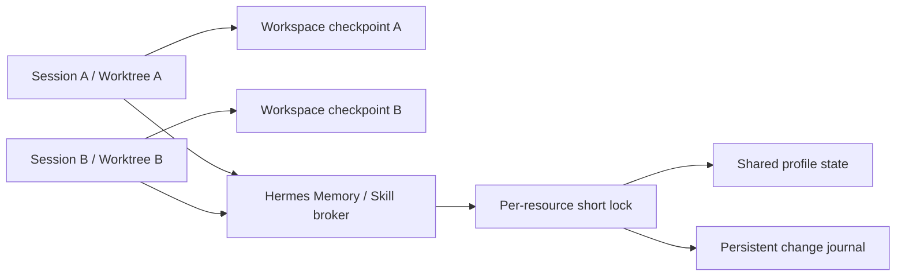
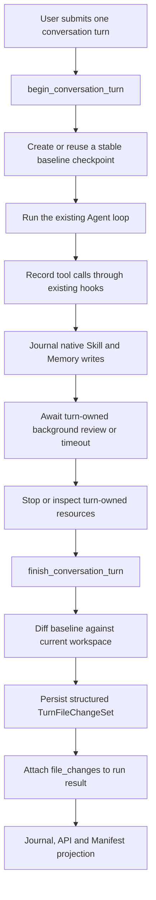

# 基于 Hermes Agent Checkpoint 与原生状态 Journal 的轮次变更捕获方案

> 状态：待实现。本方案是轻量首期方案，复用 Hermes Agent 现有 `CheckpointManager`、tool hooks、session 持久化和 `run_conversation()` 生命周期。

## 1. 目标与结论

目标是在每次用户 conversation turn 结算后，向 Hermes WebUI 提供两类结构化变更：

- 当前 session workspace 内的文件最终净变化；
- 由该轮直接工具调用或该轮派生的后台 review 导致的 Skill、Memory 等 Hermes 持久状态变化。

- `created`：新增文件；
- `modified`：内容发生变化；
- `deleted`：文件被删除；
- `type_changed`：文件、目录或符号链接类型变化；
- 可选 `renamed`：只在 Git 提供足够稳定的 rename 证据时输出，否则表示为 `deleted + created`。

首期不实现独立 Runner、每轮 shadow workspace、CAS 归档和事务回写。workspace 的权威证据来自 Hermes Agent 现有 shadow Git checkpoint；共享 Skill/Memory 的权威证据来自 Hermes 原生受控写入口追加的 durable journal，而不是工具参数、shell 命令解析、stdout 或 assistant 文本。

该方案的准确保证是：

> 捕获经 capture policy 纳入的本地 workspace，在一次用户 conversation turn 开始与结束之间的最终净变化。

对于共享 profile 状态，准确保证改为：

> 捕获经过 Hermes 原生受控写入口提交，并携带当前 `session_id + turn_id + stream_id` 因果上下文的持久状态变化。

该方案不能严格证明 workspace diff 中的每个变更必然由某一工具调用产生，因为 Agent 与用户编辑器仍直接操作同一真实 workspace，所以 workspace 必须表示为 `capture_mode=checkpoint`。推荐部署中，普通 Terminal、File Tool、Python 子进程和第三方工具不得直接写共享 `HERMES_HOME` 的受管状态目录；它们只能调用 Hermes Memory/Skill broker。只有满足该边界，持久状态才能表示为 `persistent_capture_mode=native_journal`、`persistent_write_boundary=brokered`。

### 1.1 推荐并发模型



推荐方案不对整个 conversation、profile 或 `HERMES_HOME` 加全局锁。不同 worktree、不同 Skill 以及不冲突的任务真正并行；只有两个写入提交到同一个 Memory 文件或同一个 Skill 时，才在“读旧值、原子替换、追加 journal”临界区短暂串行。

## 2. 复用的 Hermes Agent 能力

### 2.1 CheckpointManager

Hermes Agent 现有 `tools/checkpoint_manager.py` 已实现：

- 为工作目录创建 shadow Git repository；
- 将当前目录状态存为 checkpoint commit；
- 列出 checkpoint 历史；
- 将 checkpoint 与当前工作目录比较；
- 从 checkpoint 恢复文件；
- 不在用户项目中创建或修改 `.git` 状态。

shadow repository 位于：

```text
{HERMES_HOME}/checkpoints/<workspace-hash>/
```

这是本方案的主要复用点。

### 2.2 Tool hooks

Hermes Agent 在统一工具分发层已提供：

- `pre_tool_call`；
- `post_tool_call`；
- `tool_name`；
- `args`；
- `result`；
- `task_id`；
- `session_id`；
- `tool_call_id`。

本方案只用这些 hook 记录“本轮调用过哪些工具”，不从参数或结果推导权威文件列表。

### 2.3 run_conversation 生命周期

`AIAgent.run_conversation()` 已经是一次用户消息的轮次边界：

- 入口创建用户消息；
- 中间可包含多次模型 API iteration 和多个工具调用；
- 出口统一处理正常完成、取消、超限和部分错误；
- 最终持久化 session 并返回结构化 result。

因此 checkpoint 边界应放在 `run_conversation()` 的整个用户轮次上，而不是当前的每次 API iteration 上。

### 2.4 Session 持久化

Hermes Agent 已会将 user、assistant、tool call 和 tool result 写入 session JSON/SQLite。轮次文件变更应作为独立结构化记录与 session 关联，不应塞入 assistant 文本或依赖后续重新解析 transcript。

### 2.5 原生 Skill、Memory 写入机制

Hermes 已有适合复用的持久学习写入口：

- `tools/memory_tool.py` 通过 `MemoryStore`、文件锁和原子替换修改 `{HERMES_HOME}/memories/MEMORY.md` 与 `USER.md`；
- `tools/skill_manager_tool.py` 统一处理 Skill 的 create/edit/patch/delete/write_file/remove_file；
- `tools/write_approval.py` 会把待批准的 Memory/Skill 写入持久化到 `{HERMES_HOME}/pending/{memory,skills}`；
- `tools/skill_provenance.py` 已用 `ContextVar` 区分 foreground 与 `background_review` 来源；
- `agent/background_review.py` 在主回复完成后异步执行 Memory/Skill 自我改进。

因此 Skill/Memory 不应纳入 workspace checkpoint，也不应对整个共享 `HERMES_HOME` 做每轮前后 diff。应在这些原生写入口成功提交或成功暂存时追加结构化变更事件，并扩展现有 provenance 上下文。

## 3. 现有实现与目标实现的差距

CheckpointManager 已有核心能力，但现有行为不能直接满足轮次捕获：

| 现有行为 | 问题 | 目标行为 |
| --- | --- | --- |
| `new_turn()` 在每次模型 API iteration 前调用 | 一次用户轮次可出现多个 checkpoint 边界 | 增加独立 conversation-turn tracker |
| 只在 `write_file` / `patch` 前 checkpoint | 无法覆盖未知工具 | 用户轮次开始时无条件 baseline |
| Terminal 只有命中破坏性命令正则才 checkpoint | `python`、`cp`、`touch`、构建器等可漏掉 | 不依赖 terminal 命令分类 |
| `diff()` 返回文本 diff/stat | WebUI 难以稳定消费 | 返回 NUL-safe 结构化路径状态 |
| checkpoint 不与 `session_id/turn_id` 强关联 | 无法稳定投影到某轮 | 增加 durable turn change set |
| 不区分 capture 完整与部分失败 | UI 可能把漏项当成零变化 | 显式 `complete/partial/failed` |

## 4. 总体流程



核心原则：

1. baseline 在本轮任何工具调用前完成。
2. 不根据工具名判断是否需要捕获。
3. 文件列表来自 workspace 最终差分。
4. hook 只提供轮次级 tool provenance。
5. 捕获结果先 durable，再向 WebUI 发送轮次完成事件。
6. workspace 使用 checkpoint 证据；共享 Skill/Memory 使用原生写入事件证据，二者不能混为同一种保证。

## 5. Agent 侧设计

### 5.1 新增 TurnFileChangeTracker

在 Hermes Agent 中增加一个组合 `CheckpointManager` 的轻量协调器：

```text
tools/turn_file_changes.py
  TurnFileChangeTracker
  TurnCaptureContext
  TurnFileChangeSet
  FileChange
```

建议接口：

```python
class TurnFileChangeTracker:
    def begin_turn(
        self,
        *,
        session_id: str,
        turn_id: str,
        turn_key: str | None,
        stream_id: str,
        workspace: str,
        task_id: str,
    ) -> TurnCaptureContext:
        ...

    def note_tool_start(
        self,
        *,
        tool_call_id: str,
        tool_name: str,
        task_id: str,
        started_at: float,
    ) -> None:
        ...

    def note_tool_complete(
        self,
        *,
        tool_call_id: str,
        success: bool,
        completed_at: float,
    ) -> None:
        ...

    def finish_turn(self, *, outcome: str) -> TurnFileChangeSet:
        ...

    def fail_turn(self, *, stage: str, error_code: str) -> TurnFileChangeSet:
        ...
```

Tracker 每个 `stream_id` 一个 context，不使用全局当前轮次变量。同一进程内多 session 并发时，状态必须按 `stream_id/task_id` 隔离。

### 5.2 begin_turn

`begin_turn()` 必须在本轮第一个 tool call 之前：

1. 解析 workspace 真实路径；
2. 校验 workspace 为支持的本地目录；
3. 冻结 capture policy 和 `policy_hash`；
4. 调用 CheckpointManager 创建当前状态快照；
5. 取得稳定 `baseline_commit`；
6. 持久化 `capture_status=started`；
7. 返回不可变 TurnCaptureContext。

现有 `_take()` 在当前状态与 HEAD 相同时会跳过 commit，所以新接口不能只返回 `bool`，而应返回可比较的 HEAD：

```python
CheckpointRef(
    workspace="/resolved/workspace",
    commit_hash="...",
    created_new_commit=False,
)
```

如果是首次捕获且 workspace 为空，CheckpointManager 必须创建一个可表示空树的初始 commit，否则后续无法对新建文件做稳定 diff。

### 5.3 工具记录

`pre_tool_call` 和 `post_tool_call` 将事件传给 Tracker，但不得从 `args.path`、terminal command 或 result 提取权威文件变更。

持久化的 provenance 最小包含：

```json
{
  "tool_call_id": "call_123",
  "tool_name": "terminal",
  "task_id": "parent-task",
  "started_at": 1710000000.1,
  "completed_at": 1710000001.8,
  "success": true
}
```

因为 Hermes Agent 支持并行工具和子代理，首期只声称“这些工具参与了该轮”，不声称某个文件一定属于某一 `tool_call_id`。

### 5.4 finish_turn

`finish_turn()` 在 Agent 主循环结束后执行：

1. 先调用现有 task resource cleanup/process registry，尝试停止属于本轮的仍在执行的工具资源；
2. 检查是否存在已知未结束后台进程；
3. 将当前 workspace 完整加入 shadow Git index；
4. 相对 `baseline_commit` 运行 NUL-safe 状态差分；
5. 构造结构化 FileChange 列表；
6. 持久化 TurnFileChangeSet；
7. 清理 shadow index 中只用于比较的 staged 状态；
8. 将 ChangeSet 放入 `run_conversation()` 返回值。

建议的 Git 命令为：

```bash
git add -A
git diff --cached --name-status -z --find-renames <baseline_commit>
git diff --cached --raw -z <baseline_commit>
```

返回解析必须使用 NUL delimiter，不按换行或空格拆分，以支持包含空格、制表符和 Unicode 的文件名。

### 5.5 异常路径

Tracker 必须在 `finally` 类似的统一收口中完成，覆盖：

- 正常 assistant final response；
- 用户 cancel/interruption；
- Provider 错误；
- iteration budget 用尽；
- 工具错误；
- session 持久化前的其它可恢复异常。

如果 baseline 不存在、Git 命令失败、workspace 在遍历时消失，或已知后台 writer 仍在运行，必须写：

```json
{
  "capture_status": "failed",
  "complete": false,
  "error_code": "turn_file_capture_incomplete"
}
```

不得用空 `changes=[]` 表示捕获失败。

### 5.6 Skill、Memory 等共享状态捕获

新增轻量 `PersistentStateChangeJournal`，但不新增一套文件系统事务层。它只接收 Hermes 现有受控写入口在提交后的事实事件。

每轮建立并显式传播：

```python
TurnWriteContext(
    session_id=session_id,
    turn_id=turn_id,
    stream_id=stream_id,
    tool_call_id=tool_call_id,
    task_id=task_id,
    origin="foreground",  # 或 background_review
)
```

该上下文可扩展 `tools/skill_provenance.py` 的现有 `ContextVar`，不能使用进程级全局“当前 session”。创建后台线程、子代理或 executor task 时必须显式复制上下文；后台 review 还要记录 `parent_turn_id`。

在以下成功点追加 durable event：

| 现有入口 | 事件类型 | 资源 |
| --- | --- | --- |
| `MemoryStore.add/replace/remove` 原子替换成功后 | `memory_committed` | `MEMORY.md` 或 `USER.md` |
| `skill_manage` 成功返回前 | `skill_committed` | Skill 目录内相对路径 |
| `write_approval.stage_write` 原子替换成功后 | `persistent_write_staged` | pending record |
| pending approve/reject | `persistent_write_approved/rejected` | pending ID 与最终资源 |
| curator archive/restore 等已有受控入口 | `skill_archived/restored` | Skill 名称与归档位置 |

事件至少记录逻辑 action、资源类型、profile identity、相对逻辑路径、提交前后内容哈希、时间、origin 和完整 TurnWriteContext。Memory 内容以及可能包含秘密的文件内容不直接复制到事件表。

事件写入与实际状态提交必须满足：

1. 使用同一资源锁覆盖“读取旧状态、原子写入、生成事件”这一临界区；
2. 状态提交成功但 journal 失败时返回 `persistent_capture_status=partial` 并写错误日志，不能返回假的零变化；
3. 同一 `event_id` 幂等，工具重试不得生成重复业务事件；
4. 多会话共享同一 profile 时，Memory 文件锁和每个 Skill 的资源锁只串行化冲突写入，不阻塞不同 workspace 的 Agent 主流程。

`pending` 需要区分“提出”与“生效”：原轮次创建 pending record 时记录 `persistent_write_staged`；用户稍后批准造成的真实 Memory/Skill 落盘属于批准操作的新审计事件，并通过 `source_turn_id` 关联原轮次，不回写或篡改原轮次已经结算的 ChangeSet。

### 5.7 后台 review 与轮次结算

Hermes 的 Memory/Skill background review 在 assistant 主回复之后运行。WebUI 因此需要区分：

```text
assistant_done  -> 主回复已可展示
turn_settled    -> workspace diff 与该轮派生的后台 review 均已结算
```

`_spawn_background_review()` 注册一个带 `parent_turn_id` 的 turn-owned future/refcount。正常完成时 journal 最终事件并减少 refcount；达到配置的 settle timeout 时仍返回 ChangeSet，但标记：

```json
{
  "persistent_capture_status": "partial",
  "limitations": ["background_review_timeout"]
}
```

后台 review 超时后若最终完成，其事件仍按原 `parent_turn_id` 追加，并发布 `turn_file_changes_updated` 修订事件；修订必须递增 `revision`，不能静默覆盖客户端已经看到的结果。

### 5.8 共享状态必须经过 broker

推荐方案将 `{HERMES_HOME}/memories`、`skills`、`pending` 定义为受管状态目录，并执行以下写策略：

1. `memory`、`skill_manage`、approval 和 curator broker 在 Hermes 主进程中保留写权限；
2. local Terminal 及其子进程通过 OS sandbox/mount policy 将这些目录设为不可写；
3. 通用 File Tool 的 safe root 只能是当前精确 worktree，不允许解析到受管状态目录；
4. 子代理继承相同限制，但可正常调用带 TurnWriteContext 的 Memory/Skill broker；
5. broker 成功提交状态和 journal 后才向工具调用方返回成功。

对受管目录的 before/after diff 或 watcher 只作为完整性哨兵。若发现没有对应 journal event 的变化，记录 `observed_unattributed`，相关轮次或 profile health 标记为 `partial`/`integrity_violation` 并告警；不得按时间窗口把变化强行分配给某个 session。

无法提供上述 sandbox 的平台不能宣称 `persistent_write_boundary=brokered`，只能以兼容模式运行并明确返回 `persistent_write_boundary=cooperative`。该兼容模式不满足“多会话并行且每轮准确确认所有持久状态变化”的业务验收。

## 6. 轮次与 checkpoint 边界

### 6.1 两种“turn”必须分开

当前 CheckpointManager `new_turn()` 的语义更接近“一次模型 tool-loop iteration 内去重”，不能直接作为用户 conversation turn 身份。

建议保留原有 API 以兼容 rollback 行为，新增：

```python
checkpoint_mgr.begin_conversation_turn(...)
checkpoint_mgr.finish_conversation_turn(...)
```

或者将这两个方法完全放在 `TurnFileChangeTracker` 中，避免改变原有 `/rollback` 语义。

### 6.2 快照时间线

```text
T0  begin_turn: baseline=C0
T1  tool A
T2  model iteration
T3  tools B/C in parallel
T4  subagent tool calls
T5  cleanup known task resources
T6  finish_turn: diff C0 -> current workspace
T7  assistant_done; await turn-owned background review
T8  persist workspace + persistent-state ChangeSet
T9  emit turn_settled
```

在 T0 之前或 T6 之后的变更不属于该 ChangeSet。T0-T6 期间用户编辑器产生的变更也会被包含，这是 checkpoint 模式的已知边界。

## 7. Capture policy

### 7.1 范围

首期只支持：

- `terminal.backend=local`；
- 本地 workspace；
- 一个用户 conversation turn 对一个 workspace root；
- 由 Hermes Agent 进程可直接遍历的文件系统。

首期明确不支持：

- Docker、SSH、Modal、Daytona 等非本地文件环境；
- 远程 MCP 在外部服务中产生的文件；
- workspace 外的任意普通文件路径（通过受控入口写入的 profile Skill/Memory 状态除外）；
- 未注册为 turn-owned task、在 Agent 轮次结算后继续产生的后台变更。

不支持的 backend 必须返回 `capture_status=unsupported`，不能静默返回空文件列表。

### 7.2 多会话并发与 worktree 契约

WebUI 现有 worktree 模式会调用 Hermes Agent `_setup_worktree()`，生成类似以下目录：

```text
<repo>/.worktrees/hermes-a1b2c3/
<repo>/.worktrees/hermes-d4e5f6/
```

它们具有相同前缀，但是彼此独立的兄弟目录。`/api/session/new` 在 worktree 创建成功后会将 `session.workspace` 设为精确 `worktree_info.path`。只要后续捕获始终使用这个精确根，相同字符串前缀不会导致 ChangeSet 混合。

例如：

```text
session A root = /repo/.worktrees/hermes-a1b2c3
session B root = /repo/.worktrees/hermes-d4e5f6
```

对 A 的 baseline/final 遍历不会进入 B，对 B 也一样。CheckpointManager 按完整 canonical workspace path 计算 shadow repository hash，因此两个 worktree 使用两个独立 shadow Git repository，可以并行执行 Git index/diff 操作。

实现必须满足以下不变量：

1. Tracker 直接使用已验证的 `session.workspace` 精确根，不得调用会向上搜索 `.git`/`pyproject.toml` 的 `get_working_dir_for_path()`。
2. workspace identity 使用 canonical resolved path；在 POSIX 上同时记录 `st_dev + st_ino`，Windows 使用等价 volume/file identity，防止 symlink、路径别名或大小写差异将同一物理目录伪装为两个 workspace。
3. 同时运行的两个 workspace root 必须互不包含：A 不能是 B 的祖先，B 也不能是 A 的祖先。
4. 主仓库 workspace 与其 `.worktrees/**` 不得同时作为互相覆盖的 capture root。主仓库捕获 policy 必须排除 `.worktrees/**`。
5. 每个精确 workspace root 使用一把跨进程锁，仅防止同一 worktree 出现两个重叠轮次；不同兄弟 worktree 的锁不得互相阻塞。
6. shadow repository 打开时校验其持久化 `HERMES_WORKDIR` 与当前 canonical workspace identity 一致；哈希冲突或 identity 不一致时失败闭合。
7. worktree 在活动 stream、Terminal 或未结算 ChangeSet 存在时不得删除或复用其目录名。

还需要区分“WebUI 为 session 选择了独立 workspace”和“所有工具只能写该 workspace”。前者当前已有，后者不能仅靠 cwd 保证：

- File Tools 应将 `HERMES_WRITE_SAFE_ROOT` 固定到当前 session worktree；
- 子代理必须继承同一精确 worktree root；
- Browser/download/document 工具的默认输出目录必须在当前 worktree；
- local Terminal 仍可通过绝对路径或 `..` 写父目录、主仓库或兄弟 worktree；现有 checkpoint 只能捕获当前 root 内的最终变化，无法阻止或归属这种越界写入。

因此并发支持分为两个等级：

| 模式 | 能力 | 保证 |
| --- | --- | --- |
| `checkpoint-worktree` | 不同 session 使用不重叠兄弟 worktree，并行 baseline/diff | 正确捕获每个 worktree 根内的最终净变化；不防止 Terminal 越界写入 |
| `strict-worktree` | 在上述基础上用 OS sandbox 禁止写当前 worktree 外路径 | 可将本地文件变更限定在当前 session worktree 中 |

如业务的“正确捕获”包含“不能修改其它会话 worktree”，则需要 `strict-worktree` 的文件系统写隔离；不需要回到完整 CAS/事务回写方案，但不能只用 WebUI workspace 字段代替真实隔离。

Skill/Memory 是同一 profile 下的共享资源，不属于任何 worktree。它们的并发归属不使用路径前缀或目录 diff，而使用 5.6 节的 TurnWriteContext 和原生事件 journal。不同 worktree 可并行执行；只有写同一个 Memory 文件或同一个 Skill 的短临界区需要资源级串行。

### 7.3 include/exclude

应复用 CheckpointManager 现有 exclude 机制，但必须将它提升为可观测 policy，不能让用户以为被排除的文件也已捕获。

默认可保留：

- `.git/**`；
- `node_modules/**`；
- `dist/**`、`build/**`；
- virtualenv、cache、coverage 产物；
- 超过配置上限的大文件或大目录。

`.env*` 等敏感文件需要特别处理。现有 shadow Git checkpoint 会存储文件内容，因此不应为了“所有文件”而默认将凭据写入 checkpoint object database。首期继续排除敏感文件，并在 ChangeSet 中返回：

```json
{
  "excluded_patterns": [".env", ".env.*"],
  "capture_scope_complete": true
}
```

`capture_scope_complete=true` 只意味 policy 纳入范围已完整捕获，不意味 workspace 的每一个物理文件都在范围内。

### 7.4 限额

至少需要：

- `max_files`；
- `max_total_bytes`；
- `max_changed_files`；
- `max_diff_bytes`；
- `checkpoint_timeout_seconds`。

超出限额时应将捕获标记为 `failed` 或 `partial`，不得截断后仍标记 `complete=true`。

## 8. 数据模型

### 8.1 TurnFileChangeSet

```json
{
  "schema_version": 1,
  "change_set_id": "...",
  "session_id": "...",
  "turn_id": "...",
  "turn_key": "turn:42",
  "stream_id": "...",
  "workspace": "/resolved/workspace",
  "workspace_fingerprint": "...",
  "capture_mode": "checkpoint",
  "persistent_capture_mode": "native_journal",
  "workspace_isolation": "worktree",
  "write_boundary": "cooperative",
  "persistent_write_boundary": "brokered",
  "capture_status": "complete",
  "persistent_capture_status": "complete",
  "complete": true,
  "revision": 1,
  "baseline_commit": "...",
  "policy_hash": "...",
  "started_at": "...",
  "finished_at": "...",
  "outcome": "completed",
  "external_concurrency_possible": true,
  "excluded_patterns": [".git/**", ".env*", "node_modules/**"],
  "summary": {
    "created": 1,
    "modified": 2,
    "deleted": 0,
    "type_changed": 0,
    "renamed": 0
  },
  "changes": [
    {
      "path": "src/app.py",
      "change_type": "modified",
      "old_mode": "100644",
      "new_mode": "100644",
      "old_object_id": "...",
      "new_object_id": "..."
    }
  ],
  "persistent_changes": [
    {
      "event_id": "evt_456",
      "resource_type": "memory",
      "logical_path": "memories/MEMORY.md",
      "action": "add",
      "commit_state": "committed",
      "origin": "background_review",
      "tool_call_id": "call_456",
      "parent_turn_id": "turn_42",
      "before_hash": "...",
      "after_hash": "..."
    }
  ],
  "tools_used": [
    {
      "tool_call_id": "call_123",
      "tool_name": "terminal",
      "task_id": "parent-task",
      "success": true
    }
  ],
  "error_code": null
}
```

WebUI 对外 API 不应返回宿主绝对 workspace 路径；返回时将它投影为 workspace ID 和相对路径。

### 8.2 状态

```text
capture_status:
  started
  complete
  partial
  failed
  unsupported
```

含义：

- `complete`：policy 纳入范围的 baseline 和 final diff 完整。
- `partial`：已获得部分数据，但已知存在截断、未收敛 writer 或遍历问题。
- `failed`：无法形成可用 ChangeSet。
- `unsupported`：当前 backend/workspace 不在首期矩阵内。

UI 必须区分“完整且零变化”与“捕获失败”：

```text
complete + changes=[]  !=  failed
```

`capture_status` 描述 workspace checkpoint；`persistent_capture_status` 独立描述 Skill/Memory 原生事件捕获。`write_boundary` 描述 workspace 普通文件边界，`persistent_write_boundary` 描述共享 profile 状态边界，不能混用。总字段 `complete=true` 仅在两者都 complete 时成立。`observed_unattributed` 或 background review 超时会使 persistent 状态至少为 partial。

## 9. 持久化

### 9.1 Agent 侧权威记录

轮次变更应在 Hermes Agent 侧先持久化，再返回 WebUI。原因是 Agent 可能已完成 diff，但 WebUI 在接收结果前崩溃或断开。

建议在 Agent `state.db` 增加：

```text
turn_file_change_sets
  change_set_id
  session_id
  turn_id
  turn_key
  stream_id
  workspace_fingerprint
  capture_mode
  capture_status
  complete
  baseline_commit
  policy_hash
  outcome
  started_at
  finished_at
  summary_json
  tools_json
  error_code

turn_file_changes
  change_set_id
  path
  change_type
  old_mode
  new_mode
  old_object_id
  new_object_id

turn_persistent_change_events
  event_id
  session_id
  turn_id
  parent_turn_id
  stream_id
  tool_call_id
  task_id
  profile_fingerprint
  resource_type
  logical_path
  action
  commit_state
  origin
  before_hash
  after_hash
  created_at
```

唯一约束至少包含 `stream_id + path + change_type`。相同 `stream_id` 重放不得创建第二个 ChangeSet。

### 9.2 run_conversation 返回值

现有 result 增加：

```python
result["file_changes"] = turn_file_change_set.to_dict()
```

即使 `capture_status=failed|partial|unsupported`，也必须返回该字段，使 WebUI 能显示真实状态。

## 10. WebUI 接入

### 10.1 状态边界

- Agent ChangeSet 是文件变更权威来源。
- WebUI turn journal 保存轮次是否已收到/投影 ChangeSet，不保存 Git object 内容。
- Session Manifest 只保存适合 UI 展示的 artifact 投影，不是全量文件变更账本。
- transcript 不嵌入完整 ChangeSet，避免历史消息膨胀。

### 10.2 SSE

在轮次完成前发送：

```json
{
  "event": "turn_file_changes",
  "stream_id": "...",
  "turn_key": "turn:42",
  "capture_mode": "checkpoint",
  "persistent_capture_mode": "native_journal",
  "workspace_isolation": "worktree",
  "write_boundary": "cooperative",
  "persistent_write_boundary": "brokered",
  "capture_status": "complete",
  "persistent_capture_status": "complete",
  "complete": true,
  "revision": 1,
  "summary": {
    "created": 1,
    "modified": 2,
    "deleted": 0,
    "type_changed": 0
  },
  "changes": [
    {"path": "report.md", "change_type": "created"}
  ],
  "persistent_changes": [
    {"resource_type": "memory", "logical_path": "memories/MEMORY.md", "action": "add", "origin": "background_review"}
  ]
}
```

主回复先发送 `assistant_done`；完整结算发送 `turn_file_changes` 和 `turn_settled`。后台 review 超时后迟到的事件发送带更高 `revision` 的 `turn_file_changes_updated`。SSE 是乐观投影。页面刷新或断线重连后，WebUI 应通过 Agent 持久化记录或 WebUI 的已确认投影恢复，不只依赖之前浏览器是否收到 SSE。

### 10.3 Manifest 投影

ChangeSet 投影规则：

- `created` / `modified` / `renamed` 后仍存在且可预览的文件可进入 artifacts；
- `deleted` 仅进入详情，默认不生成可点击 artifact；
- 目录和类型变化仅进入详情；
- `capture_status=complete`、`persistent_capture_status=complete` 且两类变化均为空时，写入零变化 authority marker；
- `partial/failed/unsupported` 不得写成零变化 decision；
- ChangeSet 存在时，不再从 assistant prose、terminal stdout 或工具参数猜测该轮 artifacts。

### 10.4 API

建议增加：

```text
GET /api/session/turn-file-changes?session_id=<id>&turn_key=<key>
```

返回：

```json
{
  "session_id": "...",
  "turn_key": "turn:42",
  "capture_mode": "checkpoint",
  "persistent_capture_mode": "native_journal",
  "workspace_isolation": "worktree",
  "write_boundary": "cooperative",
  "persistent_write_boundary": "brokered",
  "capture_status": "complete",
  "persistent_capture_status": "complete",
  "complete": true,
  "revision": 1,
  "summary": {},
  "changes": [],
  "persistent_changes": [],
  "tools_used": [],
  "limitations": [
    "external_concurrency_possible",
    "terminal_workspace_escape_possible"
  ]
}
```

路由命名、认证、CSRF 和 OpenAPI 同步按本仓库 integration 规则实施。如果该 API 放在 Fork `integration/` 层，路径段使用 snake_case：

```text
GET /api/integration/turn_files/changes
```

## 11. 实施位置

### 11.1 Hermes Agent

| 位置 | 改动 |
| --- | --- |
| `tools/checkpoint_manager.py` | 新增返回稳定 commit ref 的 snapshot API，以及 NUL-safe 结构化 diff |
| `tools/turn_file_changes.py` | 新增轮次 tracker、数据模型和状态机 |
| `tools/persistent_change_journal.py` | 追加受控状态写事件、TurnWriteContext、幂等与查询 |
| `tools/memory_tool.py` | 在现有资源锁内于原子提交后记录 Memory 事件 |
| `tools/skill_manager_tool.py` | 在成功的 Skill mutation 后记录事件并增加每 Skill 资源锁 |
| `tools/write_approval.py` | pending stage/approve/reject 记录来源轮次和后续生效关联 |
| `tools/skill_provenance.py` | 扩展现有 origin ContextVar 为完整轮次写上下文 |
| `agent/background_review.py` | 继承 parent turn context，注册/完成 turn-owned future |
| `model_tools.py` | 在现有 hook 调用处向 tracker 记录 provenance，不解析文件路径 |
| `run_agent.py` | 在用户轮次入口 begin，统一退出处 finish，result 增加 `file_changes` |
| `hermes_state.py` | 新增 ChangeSet 和 FileChange 持久化表与查询方法 |
| `tools/process_registry.py` | 提供按 task/stream 检查已知活动 writer 的方法；无法证明时标记 partial |

### 11.2 Hermes WebUI

本仓库是 Fork，新逻辑优先放在：

```text
integration/turn_files/
  __init__.py
  models.py
  store.py
  projection.py
  api.py
```

薄接缝：

| 位置 | 改动 |
| --- | --- |
| `api/streaming.py` | 从 Agent result 接收 `file_changes`，调用 integration 持久化/投影 helper |
| `api/turn_journal.py` | 记录 ChangeSet 已接收或捕获失败的轮次事件 |
| `api/session_manifest.py` | 优先消费 ChangeSet authority decision |
| `api/routes.py` | 仅添加 integration route 分发 |
| `integration/swagger/openapi.json` | 同步查询 API |
| `integration/README.md` | 记录路由和 Agent 版本依赖 |

## 12. 版本与兼容性

WebUI 不得通过导入私有函数猜测 Agent 是否支持该能力。Hermes Agent 应暴露明确 capability：

```json
{
  "turn_file_changes": {
    "schema_version": 1,
    "capture_modes": ["checkpoint"],
    "persistent_capture_modes": ["native_journal"],
    "persistent_resources": ["memory", "skills", "pending"],
    "persistent_write_boundaries": ["brokered"],
    "backends": ["local"]
  }
}
```

WebUI 行为：

- capability 存在且 schema 受支持：启用轮次文件变更 UI；
- capability 不存在：不展示“零变更”，只表示当前 Agent 不支持该功能；
- schema 过新：保留原始状态并提示升级 WebUI，不猜测字段。

## 13. 已知限制

### 13.1 外部并发编辑

T0-T6 间用户 IDE、Git hook、其它 Agent 或后台程序对 workspace 的变更会进入同一 ChangeSet。

可通过以下辅助信息提示，但不能完全消除：

- tool call 时间线；
- Agent 现有 `file_state` writer 记录；
- watcher 事件；
- workspace Git/index 状态。

因此 API 固定返回 `external_concurrency_possible=true`。

对 WebUI 管理的兄弟 worktree，只要精确根和不重叠检查成立，不同 session 的正常相对路径写入不会进入对方 ChangeSet。`external_concurrency_possible` 仍保留，因为 IDE、宿主进程与 Terminal 越界写入不受 checkpoint 隔离。

### 13.2 后台进程

若 Terminal 启动脱离 Agent 生命周期的后台进程，它可在 finish diff 之后继续写文件。

首期处理：

- 已知且由 process registry 管理的后台进程：终止/等待后 diff；
- 已知但不允许终止的 persistent process：`capture_status=partial`；
- 未经 registry 登记的脱离进程：无法保证，在 limitations 中固定声明。

### 13.3 最终净变化

文件修改后又恢复为 baseline，或创建后又删除，不会出现在最终 ChangeSet。这符合“轮次交付了什么”的产品语义，但不是完整文件操作审计日志。

### 13.4 远程 backend

Docker/SSH/Modal/Daytona 要支持该方案，需要在对应 environment 内执行 begin/final snapshot，并将结构化 ChangeSet 返回 Agent。不得通过解析终端输出伪装支持。

### 13.5 共享 profile 状态

同一 profile 的 Memory、Skills 与 pending approval 是多会话共享状态。原生 journal 能准确记录受控入口的因果来源，但不能让冲突写入同时提交；冲突资源仍需短时加锁。普通工具若可直接写这些目录，则只能发现未归属变化，不能准确归因。

## 14. 安全与隐私

- WebUI 只接收 workspace-relative 路径，不向浏览器暴露宿主绝对路径。
- 不在 SSE、journal 或 Manifest 中保存文件内容。
- 不将 API key、OAuth token、Cookie 等敏感文件内容加入 shadow Git。
- 路径解析使用 canonical workspace root，拒绝 `..`、绝对路径注入和越界预览。
- ChangeSet API 按 session/profile/workspace 授权，不能只凭 `change_set_id` 访问。
- 浏览器只接收 profile-relative 逻辑路径与哈希；Memory 内容、pending payload、Skill 中的秘密文件不得进入事件流。
- 推荐模式下，普通 Terminal/脚本不能直接写 `memories/`、`skills/`、`pending/`，只允许受控 broker 写入。
- shadow checkpoint Git object 包含被纳入文件的历史内容，必须继续使用 Hermes state 权限、保留上限和清理规则。

## 15. 实施分期

### Phase 1：Agent 内部能力

- 扩展 CheckpointManager snapshot/diff API；
- 实现 TurnFileChangeTracker；
- 接入 `run_conversation()` 入口和统一退出；
- 接入 tool provenance；
- 新增 Agent SQLite 持久化；
- 仅支持 local workspace。
- 扩展 Skill provenance 为 TurnWriteContext；
- 接入 Memory、Skill、pending 原生变更 journal；
- 将 background review 纳入 turn-owned settle 生命周期。
- 对 local Terminal、File Tool 和子代理实施受管 profile 状态目录写隔离；
- 通过隔离验收后才声明 `persistent_write_boundary=brokered`。

该阶段可通过 Agent 单元测试和 CLI 人工验证，不改 WebUI UI。

### Phase 2：WebUI 持久化与 API

- 识别 Agent capability/schema；
- 接收 `result.file_changes`；
- 写 WebUI turn journal 确认记录；
- 新增查询 API；
- 完成页面刷新和重连恢复。

### Phase 3：Manifest 和 UI

- 用 ChangeSet authority decision 取代当轮文本/命令猜测；
- 聊天轮次展示 created/modified 文件 chips；
- Inspector 展示全量变更、捕获状态和限制；
- partial/failed/unsupported 使用非成功状态，不显示为零变更。

### Phase 4：远程 backend 与 workspace strict 模式

- 为每个远程 environment 增加原生 snapshot/diff adapter；
- 若产品后续必须证明变更一定属于该 Agent 轮次，再实施 [轮次级文件事务与归档方案](./轮次级文件事务与归档方案.md) 中的 Runner/shadow work 隔离；
- checkpoint 模式与 strict 模式使用同一 ChangeSet schema，仅 `capture_mode` 和保证等级不同。

## 16. 测试计划

### 16.1 CheckpointManager

- 首次空 workspace 能获得稳定 baseline；
- 非空 workspace 第一次 snapshot；
- 当前状态与 HEAD 相同时返回原 HEAD；
- 新建、修改、删除、类型变化和 rename；
- 带空格、换行和 Unicode 的文件名；
- exclude 规则和超限错误；
- diff 后 shadow index 清理；
- 两个 workspace 不串状态。

### 16.2 Agent 轮次

- 不调用工具且零变化；
- `write_file` / `patch` 变更；
- terminal `python script.py`、`cp`、`touch`、重定向；
- 未知新工具直接生成文件；
- 并行工具和子代理；
- 正常、cancel、Provider error 和 iteration limit；
- 后台 process 已收敛和未收敛两种结果；
- capture 失败不会被记成零变化；
- 相同 `stream_id` 重放幂等；
- 多 session 并发不串 tool provenance。
- 同一仓库下十个兄弟 worktree 并发捕获，各自 ChangeSet 只包含自身根内变更；
- symlink/大小写别名指向同一物理根时识别为同一 workspace；
- 祖先/子目录 capture root 重叠时在 begin 阶段拒绝；
- 主仓库 capture 不遍历 `.worktrees/**`；
- 不同兄弟 worktree 可并行，同一 worktree 两个重叠轮次被跨进程锁阻止；
- Terminal 尝试绝对路径/`..` 越界时，checkpoint 模式暴露 limitation，strict-worktree 模式必须拒绝写入。

### 16.3 Skill、Memory 持久状态

- foreground Memory add/replace/remove 事件包含正确 turn context 与前后哈希；
- Skill create/edit/patch/delete/write_file/remove_file 均生成幂等事件；
- pending stage 属于原轮次，后续 approve/reject 生成新事件并保留 `source_turn_id`；
- background review 在 assistant_done 后修改 Memory/Skill，最终归属原 `parent_turn_id`；
- background review 超时先产生 partial，迟到完成后递增 revision 并发送更新事件；
- 十个不同 worktree、同一 profile 并行写不同 Skill 时不互相阻塞且不串归属；
- 两个会话并发写同一 Memory/Skill 时资源锁保护提交，事件顺序与落盘哈希链一致；
- 推荐模式下 Terminal、Python 子进程、File Tool 和子代理直接修改共享状态目录均被拒绝，但调用 Memory/Skill broker 正常成功；
- 兼容模式发生直接写入时产生 `observed_unattributed`，且不能返回 `persistent_write_boundary=brokered`；
- journal 写入失败时 persistent capture 为 partial，不返回空成功。

### 16.4 WebUI

- Agent capability 有/无/过新；
- SSE 收到 ChangeSet 后的乐观投影；
- assistant_done 与 turn_settled 分离，迟到 revision 可幂等更新；
- 刷新后通过 durable 状态恢复；
- `complete + []` 显示零变化；
- `partial/failed/unsupported` 显示准确状态；
- Manifest authority marker 不被 transcript backfill 覆盖；
- 工具重放不产生第二份轮次成果；
- session/profile/workspace 授权和路径越界测试。

## 17. 验收标准

首期完成需同时满足：

1. baseline 在该用户轮次第一次工具调用前完成。
2. 任意本地工具在 policy 范围内产生的最终净变化都能由统一 diff 发现，无需新增工具路径解析器。
3. NUL-safe 路径解析支持特殊文件名。
4. 正常、取消和错误路径都产生明确 capture status。
5. 捕获失败、不完整和零变化三者在数据与 UI 中不可混淆。
6. ChangeSet 在 WebUI 完成事件前已持久化，页面刷新不丢失。
7. 旧 Hermes Agent 或不支持的 backend 显示 unsupported，不返回假的空列表。
8. API 和 UI 始终表示 `capture_mode=checkpoint` 以及外部并发/后台进程限制。
9. 现有 `/rollback` 和 checkpoint 历史行为不发生回归。
10. 不重叠的兄弟 worktree 可真正并行捕获，同一物理根或嵌套根不会被当作两个独立 workspace。
11. `write_boundary=cooperative` 不被描述为 workspace 越界写隔离；仅通过 workspace OS sandbox 验收后才可返回 `write_boundary=sandboxed`。
12. 所有受控 Memory、Skill、pending 写入均带 session/turn/tool/origin 因果上下文并先 durable 后发布。
13. background review 的变化归属触发它的原轮次；超时和迟到修订不会伪装成已完整结算。
14. 推荐部署阻止普通工具绕过 broker 写共享 profile 状态；只有通过隔离测试后才返回 `persistent_write_boundary=brokered`。
15. 兼容模式中的未归属变化不会被按时间窗口错误分配给某轮，并明确报告 `observed_unattributed` 与 partial。
16. Agent 和 WebUI 相关自动化测试全部通过。

## 18. 后续升级条件

仅在出现以下明确需求时，才需要升级到完整 Runner/shadow work 事务方案：

- 必须证明文件变更只来自某一 Agent 轮次；
- 必须隔离多个并发 Agent 对同一 workspace 的写入；
- 必须在用户确认前不修改真实 workspace；
- 必须归档 before/after 内容并支持逐路径回放；
- 必须对取消或失败轮次提供完整事务恢复；
- 必须将本地文件变更作为安全审计证据，而不只是用户交付索引。

在此之前，checkpoint 模式的复杂度、现有代码复用率和产品收益更匹配当前需求。
